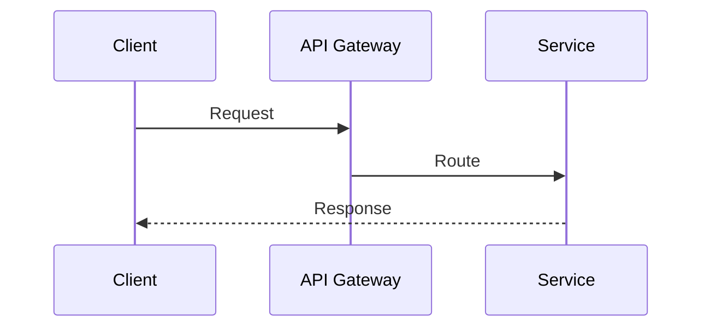

# Fumadocs Components — Dùng trong file .md

Tất cả component bên dưới đã được đăng ký global trong `src/app/[[...slug]]/page.tsx` — dùng trực tiếp trong file `.md` **không cần import**.

> Nếu repo mới chưa có: xem `page.tsx` chuẩn đầy đủ trong [`setup-deploy.md`](setup-deploy.md).

---

## Callout — Hộp highlight

```mdx
<Callout>Thông tin thông thường</Callout>

<Callout type="warn" title="Cảnh báo">Nội dung cảnh báo</Callout>

<Callout type="error">Lỗi nghiêm trọng</Callout>

<Callout type="success" title="Hoàn thành">Thao tác thành công</Callout>
```

**Types:** `info` (default) | `warn` | `error` | `success`

> Thay thế cho `> [!NOTE]` / `> [!IMPORTANT]` — dùng Callout khi cần màu sắc rõ hơn.

---

## Cards — Nhóm link dạng tile

```mdx
<Cards>
  <Card href="/basics/01-microservice-overview" title="Tổng quan">
    Khái niệm cơ bản về Microservice
  </Card>
  <Card href="/aws/api-gateway" title="API Gateway">
    Quản lý API trên AWS
  </Card>
</Cards>
```

Dùng cho: trang index, navigation section, "xem thêm" cuối bài.

---

## Steps — Hướng dẫn từng bước

```mdx
<Steps>
  <Step>
    ### Cài đặt dependencies
    Chạy `npm install` trong thư mục project.
  </Step>
  <Step>
    ### Cấu hình
    Chỉnh sửa file `config.ts`.
  </Step>
  <Step>
    ### Khởi động
    Chạy `npm run dev`.
  </Step>
</Steps>
```

Dùng cho: setup guide, deployment steps, tutorial.

---

## Tabs — Nội dung dạng tab

```mdx
<Tabs items={['Docker', 'Kubernetes', 'EC2']}>
  <Tab value="Docker">
    ```bash
    docker run my-app
    ```
  </Tab>
  <Tab value="Kubernetes">
    ```bash
    kubectl apply -f deployment.yaml
    ```
  </Tab>
  <Tab value="EC2">
    Chạy trực tiếp trên EC2 instance.
  </Tab>
</Tabs>
```

Dùng cho: so sánh cách cài đặt, multi-platform examples, code nhiều ngôn ngữ.

**Sync tabs cùng nhóm:**
```mdx
<Tabs items={['npm', 'pnpm']} groupId="pkg" persist>
  <Tab value="npm">npm install</Tab>
  <Tab value="pnpm">pnpm add</Tab>
</Tabs>
```

---

## Accordion — Thu gọn / Mở rộng

```mdx
<Accordions type="single">
  <Accordion title="Câu hỏi 1: X là gì?">
    Trả lời chi tiết...
  </Accordion>
  <Accordion title="Câu hỏi 2: Khi nào dùng?">
    Trả lời chi tiết...
  </Accordion>
</Accordions>
```

Dùng cho: FAQ, thông tin phụ không cần đọc ngay, collapse nội dung dài.

---

## TypeTable — Bảng mô tả config/props

```mdx
<TypeTable
  type={{
    timeout: {
      description: 'Thời gian chờ tối đa (ms)',
      type: 'number',
      default: 5000,
    },
    retries: {
      description: 'Số lần retry khi thất bại',
      type: 'number',
      default: 3,
    },
    onError: {
      description: 'Callback khi có lỗi',
      type: '(error: Error) => void',
      required: false,
    },
  }}
/>
```

Dùng cho: document API config, environment variables, service options.

---

## MermaidDiagram — Diagram tự động

````mdx

````

Dùng code block ` ```mermaid ` — tự render thành SVG, không cần component tag.

---

## Khi nào dùng gì

| Tình huống | Component |
|-----------|-----------|
| Cảnh báo, tip, lưu ý quan trọng | `Callout` |
| Navigation / link tới trang liên quan | `Cards` |
| Hướng dẫn cài đặt, setup, deploy | `Steps` |
| So sánh nhiều cách làm / platform | `Tabs` |
| FAQ, thông tin optional | `Accordion` |
| Mô tả config, API options | `TypeTable` |
| Flow diagram, sequence, architecture | Mermaid code block |
