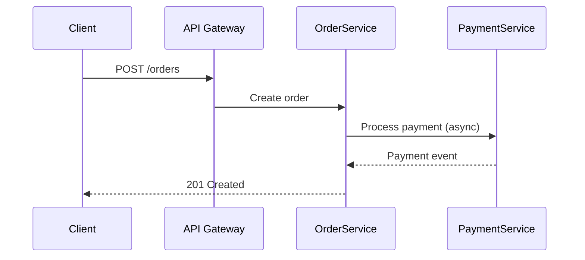

# Microservice-Style Doc — Sections & Conventions

Dùng cho các doc kiểu `microservice-learn`: architecture patterns, design decisions.

## Loại doc & Sections tương ứng

### Fundamentals Doc (01-05: concepts)

1. **Định nghĩa** — X là gì, tại sao cần
2. **So sánh với alternative** — Monolith vs Microservice (table)
3. **Architecture diagram** — ASCII hoặc Mermaid
4. **Ưu / Nhược điểm** — Table 2 cột
5. **Ví dụ thực tế** — Scenario cụ thể với số liệu (2 triệu users, 50k đơn/ngày)
6. **Anti-patterns** — Những lỗi thường gặp
7. **Đọc thêm** — Links tới docs liên quan

### Pattern Doc (06-17: patterns & techniques)

1. **Problem statement** — Vấn đề cụ thể cần giải quyết
2. **Solution** — Pattern giải quyết như thế nào
3. **Architecture diagram** — Luôn có
4. **Sequence diagram** — Mermaid cho flow request/response
5. **Implementation strategies** — 2-3 approaches với trade-offs
6. **Khi nào dùng / Không nên dùng** — Bullet list cụ thể
7. **Real-world example** — Code snippet hoặc pseudocode

### Case Study Doc (25-26: end-to-end scenarios)

Xem [`case-study-style.md`](case-study-style.md) — cấu trúc riêng.

## Sequence Diagram (bắt buộc cho Pattern docs)



## Problem-First Format

Luôn bắt đầu bằng vấn đề, không phải giải pháp:

```markdown
## 1. Tại sao cần Circuit Breaker?

Khi Service A gọi Service B liên tục mà B đang lỗi:
- Mỗi request timeout 30s
- 100 requests/s × 30s = 3000 concurrent connections
- → Service A cũng sập theo

Circuit Breaker ngăn điều này xảy ra bằng cách...
```

## Naming Convention

Files: `{NN}-{topic-name}.md` — numbered sequentially
Ví dụ: `01-microservice-overview.md`, `10-resilience-patterns.md`

Category folders: `basics/`, `communication/`, `data-management/`, `resilience/`, `deployment/`, `aws/`, `case-studies/`

Numbering spans across all folders (global sequence, không reset per folder).

## Trade-offs Table

```markdown
| Approach | Pros | Cons | Khi nào dùng |
|----------|------|------|--------------|
| Sync REST | Đơn giản, dễ debug | Coupling, timeout issues | CRUD operations |
| Async Events | Decoupled, resilient | Eventual consistency | Long workflows |
| gRPC | Performance, type-safe | Proto schema overhead | Internal high-throughput |
```
