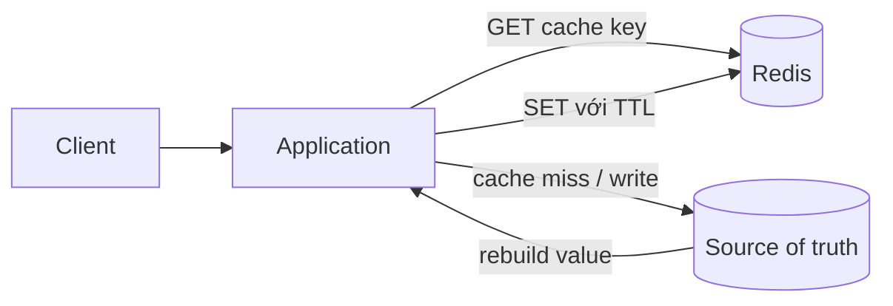
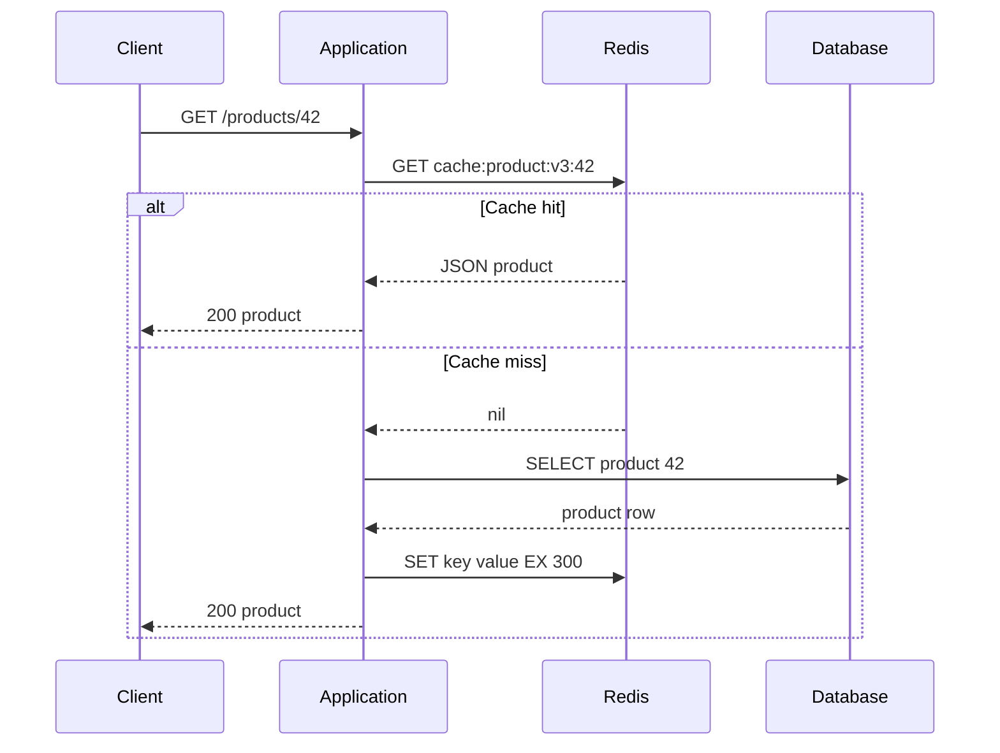
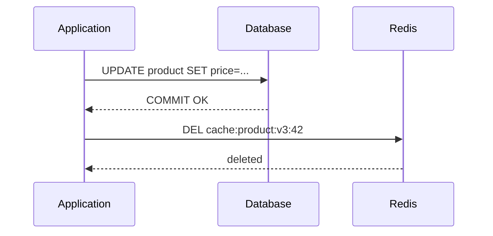
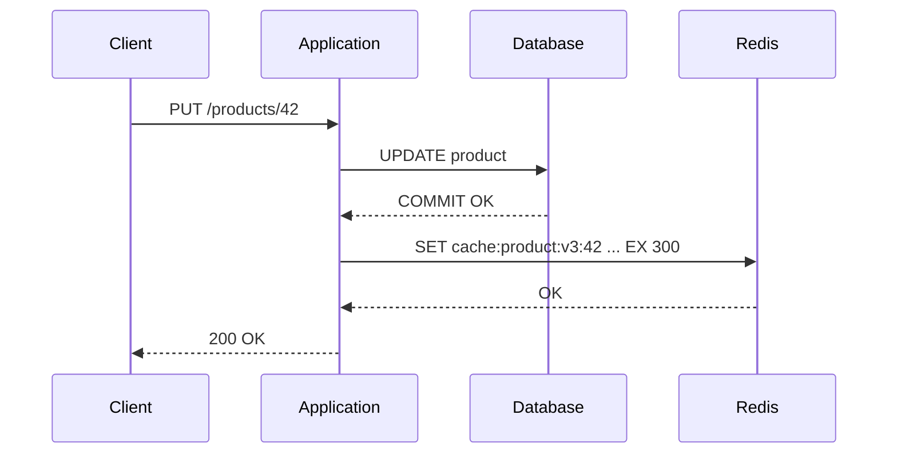
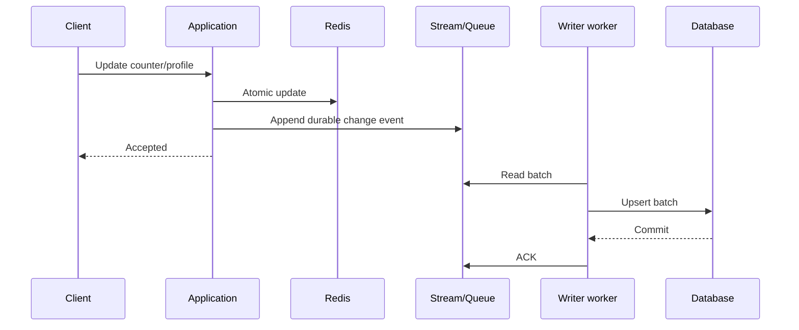
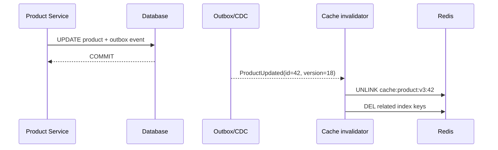
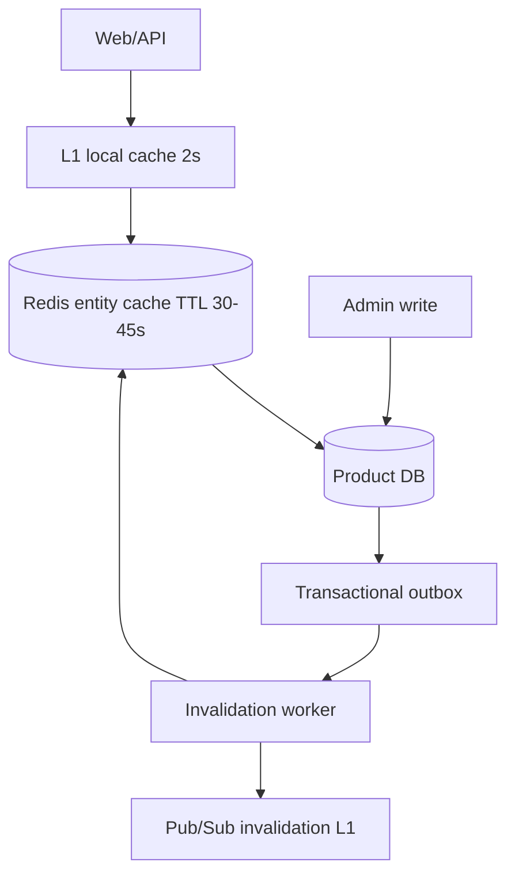

# Caching Patterns

## Mục lục

- [1. Vấn đề: database đúng nhưng không đủ nhanh](#1-vấn-đề-database-đúng-nhưng-không-đủ-nhanh)
- [2. Mental model: cache là bản sao có thể mất](#2-mental-model-cache-là-bản-sao-có-thể-mất)
- [3. Cache-aside: ứng dụng tự đọc và tự nạp cache](#3-cache-aside-ứng-dụng-tự-đọc-và-tự-nạp-cache)
- [4. Read-through: biến cache thành cổng đọc dữ liệu](#4-read-through-biến-cache-thành-cổng-đọc-dữ-liệu)
- [5. Write-through: ghi cache và database trên request path](#5-write-through-ghi-cache-và-database-trên-request-path)
- [6. Write-behind: ghi cache trước, đồng bộ database sau](#6-write-behind-ghi-cache-trước-đồng-bộ-database-sau)
- [7. TTL: freshness, jitter, sliding và stale data](#7-ttl-freshness-jitter-sliding-và-stale-data)
- [8. Cache stampede: một key hết hạn, nghìn request cùng xuống DB](#8-cache-stampede-một-key-hết-hạn-nghìn-request-cùng-xuống-db)
- [9. Cache penetration và negative caching](#9-cache-penetration-và-negative-caching)
- [10. Cache consistency và invalidation](#10-cache-consistency-và-invalidation)
- [11. Key design, payload và versioning](#11-key-design-payload-và-versioning)
- [12. Eviction, memory và hot key](#12-eviction-memory-và-hot-key)
- [13. Failure modes và degraded mode](#13-failure-modes-và-degraded-mode)
- [14. Implementation end-to-end](#14-implementation-end-to-end)
- [15. Capacity planning và observability](#15-capacity-planning-và-observability)
- [16. Case study: trang chi tiết sản phẩm](#16-case-study-trang-chi-tiết-sản-phẩm)
- [17. Anti-patterns và checklist production](#17-anti-patterns-và-checklist-production)
- [18. Tóm tắt chọn pattern](#18-tóm-tắt-chọn-pattern)
- [Tài liệu tham khảo](#tài-liệu-tham-khảo)

---

## 1. Vấn đề: database đúng nhưng không đủ nhanh

Giả sử API sản phẩm nhận 20.000 request/giây. Mỗi request đọc PostgreSQL mất 12 ms và thực hiện cùng một câu query cho vài trăm sản phẩm phổ biến. Database vẫn trả kết quả đúng, nhưng phần lớn CPU và I/O đang dùng để tính lại dữ liệu vừa được tính vài mili giây trước.

Cache đặt một bản sao gần application hơn:

```text
Không cache
Client ──20.000 req/s──> API ──20.000 query/s──> Database

Có cache, hit ratio 95%
Client ──20.000 req/s──> API ──19.000 GET/s──> Redis
                              └──1.000 query/s──> Database
```

Nếu Redis mất khoảng 0,5 ms còn database mất 12 ms, latency trung bình gần đúng là:

```text
0,95 × 0,5 ms + 0,05 × 12 ms = 1,075 ms
```

Nhưng cache tạo thêm ba bài toán khó:

1. **Freshness**: bản sao được phép cũ bao lâu?
2. **Consistency**: khi nguồn dữ liệu đổi, ai cập nhật hoặc xóa bản sao?
3. **Failure amplification**: Redis lỗi hay nhiều key hết hạn cùng lúc có làm database sập theo không?

> [!IMPORTANT]
> Cache không chỉ là `GET` trước, `SET` sau. Một thiết kế cache production phải mô tả rõ source of truth, TTL, invalidation, behavior khi miss, behavior khi Redis lỗi và giới hạn tải xuống database.

---

## 2. Mental model: cache là bản sao có thể mất

### 2.1. Source of truth và derived data

Trong hầu hết hệ thống, database là **source of truth**; Redis cache là **derived data** có thể tái tạo. Nếu xóa toàn bộ cache mà không làm mất nghiệp vụ, ranh giới này đang đúng.



Phân loại dữ liệu trước khi chọn pattern:

| Dữ liệu | Có thể cũ? | Có thể mất? | Pattern phù hợp |
|---------|------------|-------------|------------------|
| Product description | Vài phút | Có, đọc lại DB | Cache-aside |
| Inventory khả dụng | Rất ít | Cache được, nhưng DB vẫn quyết định khi checkout | Cache-aside + invalidation |
| Bank balance | Gần như không | Không | Không dùng cache làm nguồn quyết định |
| Search result | Vài chục giây | Có | Cache-aside, TTL ngắn |
| Feature flag | Vài giây | Có fallback | Local + Redis cache, push invalidation |
| Shopping cart chỉ nằm trong Redis | Không | Không nên mất | Đây là primary store, không còn là cache |

### 2.2. Hit, miss và hit ratio

- **Hit**: key tồn tại và dùng được.
- **Miss**: key không tồn tại, đã hết TTL, hoặc payload không hợp lệ.
- **Hit ratio** = `hits / (hits + misses)`.
- **Byte hit ratio** đo số byte được phục vụ từ cache; hữu ích khi object có kích thước rất khác nhau.

Hit ratio cao chưa chắc tốt. Cache 99% nhưng 1% miss tập trung vào query cực đắt vẫn có thể giết database. Cần theo dõi cả latency và tải origin khi miss.

### 2.3. Ba quyết định phải viết ra

```text
1. Key: cache đại diện cho đối tượng/query nào?
2. Freshness: TTL và invalidation là gì?
3. Miss path: ai được phép rebuild, với timeout và concurrency bao nhiêu?
```

---

## 3. Cache-aside: ứng dụng tự đọc và tự nạp cache

Cache-aside, còn gọi là lazy loading, là pattern phổ biến nhất. Application kiểm tra Redis; nếu miss thì đọc database, ghi cache rồi trả kết quả.

### 3.1. Read flow



Pseudo-code:

```typescript
async function getProduct(id: string): Promise<Product | null> {
  const key = `cache:product:v3:${id}`;

  try {
    const cached = await redis.get(key);
    if (cached !== null) return JSON.parse(cached);
  } catch (error) {
    metrics.increment('cache.read_error');
    // Redis là optimization: tiếp tục xuống DB.
  }

  const product = await db.product.findUnique({ where: { id } });
  if (!product) return null;

  try {
    const ttl = 300 + Math.floor(Math.random() * 60); // jitter
    await redis.set(key, JSON.stringify(product), { EX: ttl });
  } catch (error) {
    metrics.increment('cache.write_error');
  }

  return product;
}
```

### 3.2. Write flow: update DB rồi xóa cache

Với cache-aside, cách an toàn và đơn giản thường là:



Tại sao **xóa** thay vì update cache?

- Payload cache có thể được tổng hợp từ nhiều bảng.
- Update một phần dễ bỏ sót field hoặc các key query liên quan.
- Request đọc tiếp theo sẽ rebuild từ source of truth.
- `DEL` idempotent: xóa key không tồn tại vẫn an toàn.

Tại sao commit database trước rồi mới `DEL`? Nếu xóa trước, một reader có thể miss, đọc giá trị cũ trước khi transaction commit rồi ghi lại giá trị cũ vào cache.

### 3.3. Race condition đọc–ghi

Ngay cả “DB trước, DEL sau” vẫn có race hiếm:

```text
T1 Reader: cache miss
T2 Reader: SELECT lấy value cũ
T3 Writer: UPDATE + COMMIT value mới
T4 Writer: DEL cache
T5 Reader: SET value cũ vào cache  ← stale cho tới TTL
```

Các mức xử lý:

| Mức | Cách làm | Trade-off |
|-----|----------|-----------|
| Cơ bản | DB commit → `DEL`, TTL hữu hạn | Đơn giản; chấp nhận race hiếm |
| Double delete | `DEL`, update DB, rồi delay và `DEL` lần hai | Khó chọn delay, không chứng minh tuyệt đối |
| Version check | Value chứa version; chỉ cache nếu version còn hiện hành | Thêm metadata/logic |
| CDC invalidation | Outbox/CDC phát event sau commit, consumer xóa key | Eventual, vận hành phức tạp hơn |
| Strong consistency | Không cache đường đọc cần nhất quán mạnh | Latency/tải DB cao hơn |

> [!NOTE]
> Cache-aside không tự cung cấp strong consistency. Hãy định nghĩa “stale tối đa X giây” thay vì hứa “luôn đồng bộ” nếu thiết kế chỉ dựa vào TTL và `DEL`.

### 3.4. Khi nào dùng

Dùng khi read-heavy, dữ liệu có thể cũ trong một khoảng ngắn, application kiểm soát data access. Không lý tưởng nếu nhiều ứng dụng độc lập cùng truy cập nguồn dữ liệu nhưng không cùng tuân thủ invalidation.

---

## 4. Read-through: biến cache thành cổng đọc dữ liệu

Read-through có flow giống cache-aside nhưng logic load nằm sau một abstraction/library/cache service. Business code chỉ gọi `cache.get(productId)`; loader tự đọc DB khi miss.

```text
Business code ──get(42)──> Cache abstraction
                           ├─ hit  → return
                           └─ miss → loader → DB → cache → return
```

| Tiêu chí | Cache-aside | Read-through |
|----------|-------------|--------------|
| Ai xử lý miss? | Business/application code | Cache abstraction/provider |
| Kiểm soát query | Rõ tại call site | Ẩn trong loader |
| Tái sử dụng | Dễ bị lặp | Tốt nếu abstraction chuẩn |
| Redis thuần | Tự implement | Redis không tự query database |

Redis chỉ là data store; nó không biết cách `SELECT` database khi miss. “Read-through với Redis” thường là một library nội bộ hoặc service wrapper.

Một loader tốt cần:

- Single-flight/coalescing để một process chỉ load một lần cho cùng key.
- Timeout riêng cho Redis và database.
- Negative cache cho not-found.
- Metrics phân biệt hit, miss, load success, load failure.
- Không cache exception và response tạm lỗi.

---

## 5. Write-through: ghi cache và database trên request path

Write-through cập nhật source of truth và cache đồng bộ trước khi trả thành công.



Ưu điểm: request đọc sau có thể hit ngay, phù hợp dữ liệu vừa ghi sẽ được đọc nhiều. Nhược điểm: dual write không atomic giữa DB và Redis.

### 5.1. Partial failure

| DB | Redis | Kết quả nên làm |
|----|-------|-----------------|
| Thành công | Thành công | Trả success |
| Thất bại | Chưa ghi | Trả failure |
| Thành công | Thất bại | DB đã đúng; thường log + `DEL`/retry async, không rollback nghiệp vụ chỉ vì cache |
| Timeout không rõ | Không rõ | Đọc lại DB bằng idempotency key/version trước khi retry |

Không thể dùng Redis transaction để atomically commit cùng PostgreSQL. Nếu consistency quan trọng, dùng **transactional outbox**:

```text
DB transaction: UPDATE product + INSERT outbox event
                         │
                         ▼
CDC/outbox worker ──> DEL/SET cache ──> retry được
```

### 5.2. Khi không nên write-through

Nếu write-heavy nhưng object ít được đọc, mỗi write đang tạo payload cache vô ích, tiêu tốn CPU serialization, network và memory. Cache-aside chỉ nạp object thực sự được đọc nên thường hiệu quả hơn.

---

## 6. Write-behind: ghi cache trước, đồng bộ database sau

Write-behind, hay write-back, xác nhận write sau khi ghi Redis rồi đẩy thay đổi xuống database bất đồng bộ.



Pattern này giảm write latency và batch được nhiều update, nhưng lúc này Redis/queue nằm trên đường durability. Cần trả lời:

- Nếu Redis process chết trước khi persist/replicate thì có mất write không?
- Event có idempotency key không?
- Worker retry có ghi trùng không?
- Database chậm 30 phút thì backlog nằm ở đâu?
- Read trong lúc chưa flush lấy từ Redis hay DB?

> [!WARNING]
> `SET cache` rồi “fire-and-forget một background task” không phải write-behind an toàn. Nếu process chết giữa hai bước, write biến mất. Dùng Redis Streams hoặc durable broker, persistence phù hợp và idempotent consumer.

Các use case phù hợp: page-view counter, telemetry aggregation, game statistics có thể phục hồi/chấp nhận mất rất nhỏ. Không phù hợp mặc định cho payment, inventory reservation, ledger.

---

## 7. TTL: freshness, jitter, sliding và stale data

TTL vừa giới hạn độ cũ vừa thu hồi memory. Xem cơ chế expire chi tiết tại [Keys, Naming & TTL](./keys-and-ttl.md).

### 7.1. Chọn TTL từ business requirement

Đừng bắt đầu bằng “mọi key 5 phút”. Hãy bắt đầu bằng:

```text
TTL ≤ thời gian business chấp nhận dữ liệu cũ
```

| Dữ liệu | TTL gợi ý ban đầu | Invalidation |
|---------|-------------------|--------------|
| Country list | Giờ/ngày | Deploy/version key |
| Product detail | 1–10 phút | `DEL` sau update |
| Search result | 10–60 giây | TTL là chính |
| Inventory display | 1–5 giây | Event invalidation; checkout kiểm tra DB |
| Not-found | 5–30 giây | TTL ngắn |

Đây là điểm khởi đầu, phải đo workload thực tế.

### 7.2. TTL jitter chống synchronized expiry

Nếu 100.000 key cùng được warm lúc deploy và đều TTL 300 giây, năm phút sau chúng có thể cùng miss. Dùng random jitter:

```text
actual_ttl = base_ttl + random(0, jitter)
# hoặc base_ttl × random(0,8; 1,2)
```

```bash
SET cache:product:v3:42 '{...}' EX 347
```

Jitter phân tán expire theo thời gian; nó không giải quyết stampede của **một hot key**.

### 7.3. Absolute TTL và sliding TTL

- **Absolute TTL**: hết hạn sau X giây kể từ lúc nạp, dù được đọc nhiều.
- **Sliding TTL**: mỗi lần truy cập lại gia hạn.

Sliding TTL giữ hot data lâu nhưng có thể khiến dữ liệu cũ tồn tại vô hạn nếu không có invalidation. Đối với cache, absolute TTL thường dễ suy luận hơn; sliding TTL phù hợp hơn với [session](./session-store.md).

### 7.4. Soft TTL và hard TTL

Lưu hai mốc trong payload:

```json
{
  "data": { "id": 42, "price": 199000 },
  "refreshAfter": 1783400030,
  "expireAfter": 1783400330
}
```

- Trước `refreshAfter`: trả bình thường.
- Sau soft TTL: vẫn trả stale, một worker/request refresh nền.
- Sau hard TTL: không trả nữa, phải load đồng bộ.

Đây là **stale-while-revalidate**, hữu ích khi availability quan trọng hơn freshness tuyệt đối.

---

## 8. Cache stampede: một key hết hạn, nghìn request cùng xuống DB

Một hot key nhận 5.000 request/giây. Khi TTL hết, mọi request nhìn thấy miss trước khi query đầu tiên kịp nạp lại. Một miss logic biến thành hàng nghìn query đồng thời.

```text
                 key hết hạn
req 1 ─┐
req 2 ─┼── miss ──> cùng query DB ──> connection pool đầy
...    │
req N ─┘
```

### 8.1. Request coalescing / single-flight

Trong một process, giữ một Promise đang load theo key; các request sau chờ cùng Promise. Nó giảm stampede cục bộ nhưng 100 pod vẫn có 100 loader.

### 8.2. Distributed mutex cho rebuild

Request đầu giành lock ngắn bằng `SET NX PX`; request khác backoff rồi đọc lại cache. Cần token và safe unlock như [Distributed Lock](./distributed-lock.md).

```text
miss → SET lock:cache:product:42 token NX PX 3000
  ├─ OK: query DB → SET cache → safe DEL lock
  └─ nil: sleep 20–50 ms + jitter → GET cache → fallback có giới hạn
```

Không giữ lock lâu hơn query cần thiết. Nếu loader lỗi, lock TTL phải tự giải phóng. Không để mọi waiter busy-loop Redis.

### 8.3. Probabilistic early expiration

Request chủ động refresh trước TTL với xác suất tăng dần khi gần hết hạn. Cách này phân tán refresh mà không chờ key biến mất hoàn toàn. Ý tưởng:

```text
refresh nếu now >= expiry - beta × recomputeCost × randomFactor
```

Phù hợp hot key và hệ thống chấp nhận refresh thừa nhỏ; cần benchmark để chọn tham số.

### 8.4. Prewarming

Warm danh sách key nóng trước traffic spike/deploy. Không nên scan và warm toàn bộ catalog; ưu tiên top keys từ access log. Prewarm không thay thế TTL jitter hay load shedding.

### 8.5. Serve stale on error

Giữ stale copy với hard TTL dài hơn. Khi origin timeout, trả stale kèm metric/header thay vì dồn retry vào database. Không áp dụng mù quáng cho dữ liệu yêu cầu correctness như quyền truy cập hoặc số dư.

---

## 9. Cache penetration và negative caching

Cache penetration xảy ra khi request cho dữ liệu không tồn tại luôn miss rồi xuống database, ví dụ bot quét hàng triệu product ID ngẫu nhiên.

### 9.1. Negative cache

Cache marker “không tồn tại” với TTL ngắn:

```bash
SET cache:product:v3:missing:999999 '1' EX 15
```

Trong code nên dùng một envelope rõ ràng thay vì nhầm `null` với cache miss:

```json
{ "found": false }
```

TTL negative ngắn vì object có thể được tạo ngay sau đó. Khi create object, xóa cả negative key tương ứng.

### 9.2. Input validation và authorization trước cache

Không cho mọi chuỗi tùy ý biến thành Redis key. Validate định dạng/range ID, rate-limit caller và kiểm tra tenant. Nếu không, attacker có thể làm đầy cache bằng one-hit keys.

### 9.3. Bloom filter

Với tập ID tồn tại rất lớn, Bloom filter có thể trả lời “chắc chắn không tồn tại” hoặc “có thể tồn tại”. False positive vẫn xuống DB; false negative không được phép nếu filter được duy trì đúng. RedisBloom hữu ích nhưng thêm lifecycle rebuild/update. Xem [Redis Modules](./redis-modules.md).

---

## 10. Cache consistency và invalidation

Câu nói “There are only two hard things... cache invalidation” phản ánh việc một entity thường xuất hiện trong nhiều key:

```text
product:42
category:7:page:1
search:q=keyboard:page:1
recommend:user:9
```

Update product 42 không dễ biết mọi query cache chứa nó.

### 10.1. Các chiến lược

| Chiến lược | Freshness | Độ phức tạp | Phù hợp |
|------------|-----------|-------------|---------|
| TTL only | Stale tối đa TTL | Thấp | Query cache ngắn hạn |
| Direct delete | Nhanh nếu mọi write đi cùng service | Thấp–vừa | Entity cache |
| Event invalidation | Eventual, scale nhiều service | Vừa–cao | Nhiều writer/reader |
| Versioned namespace | Instant switch logic | Vừa | Schema/deploy/bulk refresh |
| Write-through | Cache warm sau write | Vừa | Read-after-write phổ biến |

### 10.2. Event-driven invalidation



Event phải retry được và idempotent. Pub/Sub thuần có thể mất invalidation khi consumer offline; dùng [Streams](./streams.md) hoặc durable broker nếu mất event dẫn tới stale kéo dài.

### 10.3. Versioned keys

```text
cache:product:v3:42
cache:product:v4:42
```

Khi schema serialization thay đổi, tăng version để code mới không đọc payload cũ. Key cũ tự hết TTL; không cần `SCAN` + xóa hàng loạt. Version cũng có thể nằm ở namespace config để bulk invalidate.

### 10.4. Read-your-own-write

Nếu user vừa update profile nhưng cache replica/invalidation chưa theo kịp, có thể:

- Trả object mới ngay từ write response.
- Bypass cache trong một khoảng ngắn cho user đó.
- Ghi/update cache đồng bộ sau DB commit.
- Gắn version và không chấp nhận cache version thấp hơn version client vừa thấy.

---

## 11. Key design, payload và versioning

### 11.1. Key có namespace rõ ràng

```text
cache:{tenant:acme}:product:v3:42
cache:{tenant:acme}:search:v2:sha256(query)
```

Bao gồm tenant nếu dữ liệu bị cô lập; không đưa PII/raw token vào key. Với Redis Cluster, hash tag `{...}` chỉ dùng khi thực sự cần các key cùng slot. Xem [Redis Cluster](./cluster.md).

### 11.2. Entity cache và query cache

| Loại | Ví dụ | Invalidation |
|------|-------|--------------|
| Entity | `product:42` | Xóa theo ID dễ |
| Query | `search:<hash>` | Khó biết query nào bị ảnh hưởng |
| Fragment | `product:42:price` | Nhiều round trip/key |
| Aggregate | `homepage:v8` | Rebuild toàn payload |

Ưu tiên entity cache nếu có thể ghép dữ liệu hiệu quả. Query cache nên TTL ngắn hoặc có dependency index cẩn thận.

### 11.3. String hay Hash?

- Một JSON String: một `GET`, snapshot nhất quán, serialize đơn giản.
- Hash: cập nhật/đọc field riêng, nhưng TTL ở cấp key chứ không tự có TTL cho từng field trong các phiên bản Redis phổ biến; nhiều field có thể làm schema phức tạp.

Đọc [Strings](./strings.md), [Hashes](./hashes.md) và kiểm tra feature của phiên bản Redis đang chạy.

### 11.4. Payload size

Payload 1 MB khiến một `GET` chiếm event loop, network và client decode lâu. Theo dõi `MEMORY USAGE`, p95/p99 payload, compression CPU. Thường nên:

- Chỉ cache field cần thiết.
- Không nhúng list không giới hạn.
- Chia object lớn theo access pattern, không chia tùy tiện.
- Đặt maximum payload và không cache nếu vượt ngưỡng.

---

## 12. Eviction, memory và hot key

TTL không đảm bảo key sẽ sống đủ TTL nếu Redis có `maxmemory` và policy eviction. `allkeys-lfu` có thể phù hợp cache thuần; `noeviction` phù hợp hơn khi Redis chứa state không được mất. Xem [Eviction Policies](./eviction-policies.md) và [Memory Management](./memory-management.md).

### 12.1. Không trộn cache và critical state tùy tiện

Nếu cùng instance chứa cache có thể evict và distributed lock/session critical, policy tối ưu cho cache có thể xóa state quan trọng. Tách workload/instance khi SLO và durability khác nhau.

### 12.2. Hot key

Một key homepage có thể nhận 100.000 GET/s và dồn vào một shard. Giải pháp tùy tình huống:

- L1 local cache TTL vài giây ở mỗi pod.
- Client-side caching/invalidation; xem [Client-Side Caching](./client-side-caching.md).
- Replicas cho read nếu chấp nhận replication lag.
- Nhân bản key thành N bản chỉ khi có chiến lược invalidate rõ.
- Không “thêm shard” và kỳ vọng một key tự chia; một key chỉ nằm trên một shard.

### 12.3. Big key và mass expiration

Dùng `UNLINK` thay `DEL` cho value rất lớn để giải phóng memory bất đồng bộ khi phù hợp. Tránh hàng triệu key có cùng TTL. Theo dõi expired/evicted keys và latency spike tại các mốc định kỳ.

---

## 13. Failure modes và degraded mode

### 13.1. Redis timeout

Nếu Redis chỉ là cache, application có thể bypass xuống DB. Nhưng bypass không giới hạn dễ biến Redis outage thành database outage.

```text
Redis lỗi
  ├─ circuit breaker mở
  ├─ giới hạn concurrent origin loads
  ├─ rate limit / load shedding
  ├─ local stale cache nếu an toàn
  └─ database timeout ngắn + connection pool hữu hạn
```

Không retry Redis nhiều lần trong cùng request với exponential latency. Một retry có jitter có thể hợp lý cho lỗi transient, nhưng tổng deadline phải được giữ.

### 13.2. Cache cold start

Sau flush/failover/deploy, hit ratio tụt đột ngột. Chuẩn bị:

- Capacity database chịu một phần miss surge.
- Warm top keys có kiểm soát.
- Ramp traffic/canary.
- Single-flight và semaphore cho loader.
- Alert trên miss rate, không chỉ CPU Redis.

### 13.3. Serialization lỗi

Payload cũ có thể không tương thích code mới. Dùng schema version, tolerant reader, metric decode error và xóa key lỗi. Không để một payload hỏng gây 500 cho tới hết TTL.

### 13.4. Replica lag

Nếu write/delete ở primary rồi đọc replica ngay, replica có thể còn stale. Với read-your-own-write, đọc primary hoặc bypass cache. `WAIT` có thể chờ replica acknowledge nhưng không biến replication thành strong consistency tuyệt đối qua failover.

---

## 14. Implementation end-to-end

### 14.1. Helper cache-aside có negative cache và single-flight

```typescript
type Envelope<T> =
  | { found: true; value: T; schema: 3 }
  | { found: false; schema: 3 };

const inFlight = new Map<string, Promise<Product | null>>();

async function loadProduct(id: string): Promise<Product | null> {
  const key = `cache:product:v3:${id}`;

  const raw = await redis.get(key).catch(() => null);
  if (raw !== null) {
    try {
      const parsed = JSON.parse(raw) as Envelope<Product>;
      return parsed.found ? parsed.value : null;
    } catch {
      await redis.unlink(key).catch(() => undefined);
    }
  }

  const existing = inFlight.get(key);
  if (existing) return existing;

  const promise = (async () => {
    const product = await db.product.findUnique({ where: { id } });
    const envelope: Envelope<Product> = product
      ? { found: true, value: product, schema: 3 }
      : { found: false, schema: 3 };

    const ttl = product
      ? 300 + Math.floor(Math.random() * 60)
      : 10 + Math.floor(Math.random() * 5);

    await redis.set(key, JSON.stringify(envelope), { EX: ttl }).catch(() => undefined);
    return product;
  })().finally(() => inFlight.delete(key));

  inFlight.set(key, promise);
  return promise;
}
```

Điểm còn thiếu trước production: request deadline, distributed coalescing nếu cần, tracing, payload limit, authorization và test race.

### 14.2. Invalidate sau update

```typescript
async function updateProduct(id: string, patch: ProductPatch) {
  const updated = await db.transaction(async (tx) => {
    const row = await tx.product.update({ where: { id }, data: patch });
    await tx.outbox.create({
      data: {
        type: 'ProductUpdated',
        aggregateId: id,
        payload: JSON.stringify({ id, version: row.version }),
      },
    });
    return row;
  });

  // Best effort để giảm stale ngay; outbox consumer là safety net.
  await redis.unlink(`cache:product:v3:${id}`).catch(() => undefined);
  return updated;
}
```

---

## 15. Capacity planning và observability

### 15.1. Ước lượng memory

```text
memory ≈ số key × (payload trung bình + key + Redis overhead)
```

Không chỉ nhân payload JSON. Đo bằng dữ liệu thật với `MEMORY USAGE`, `INFO memory`, fragmentation và replica/persistence overhead. Dành headroom cho traffic growth, fork/COW và failover.

Ví dụ 5 triệu object, trung bình tổng footprint đo được 1,2 KB:

```text
5.000.000 × 1,2 KB ≈ 6 GB
+ headroom 30–50% → node usable không nên chỉ đúng 6 GB
```

### 15.2. Metrics bắt buộc

| Nhóm | Metrics |
|------|---------|
| Application | hit/miss/error theo cache name, load latency, coalesced requests |
| Redis | ops/s, p95/p99 latency, memory, evictions, expirations, rejected connections |
| Origin | query rate do cache miss, DB pool saturation, timeout |
| Data quality | stale served, decode error, invalidation lag |
| Key health | hot keys, big keys, cardinality theo namespace |

Một dashboard chỉ có global `keyspace_hits` có thể che giấu cache A tốt và cache B hoàn toàn vô dụng. Instrument theo logical cache.

### 15.3. SLO gợi ý

- Cache GET p99 dưới ngưỡng đã định.
- Origin load error rate khi miss.
- Invalidation lag p99.
- Hit ratio theo endpoint, nhưng không dùng nó làm SLO duy nhất.
- Tỷ lệ stale response và tuổi stale tối đa.

---

## 16. Case study: trang chi tiết sản phẩm

### 16.1. Yêu cầu

- 30.000 read/s, 100 write/s.
- Giá được phép cũ tối đa 30 giây trên trang browse.
- Checkout phải kiểm tra lại giá và tồn kho ở source of truth.
- Hot product có thể đạt 5.000 read/s.

### 16.2. Thiết kế



Quyết định:

1. Entity key `cache:product:v3:{productId}`.
2. Absolute TTL 30–45 giây có jitter.
3. DB commit rồi best-effort `UNLINK`; outbox retry làm safety net.
4. Local L1 2 giây giảm hot-key load; invalidation Pub/Sub chỉ là optimization vì L1 TTL rất ngắn.
5. Single-flight trong pod; distributed mutex chỉ cho top hot keys nếu DB vẫn bị burst.
6. Negative cache 10–15 giây cho ID không tồn tại.
7. Checkout không tin cache browse.

### 16.3. Failure behavior

| Sự cố | Behavior |
|-------|----------|
| Redis timeout | L1 hit vẫn phục vụ; origin load có semaphore; overload trả 503 có kiểm soát |
| DB timeout | Có thể serve stale tối đa 2 phút cho browse; checkout fail closed |
| Invalidation worker lag | TTL giới hạn stale 45 giây; alert lag |
| Payload decode lỗi | `UNLINK` key và reload DB |
| Cold start | Warm top 1.000 products, ramp traffic |

Điểm quan trọng: cùng một object nhưng browse và checkout có correctness requirement khác nhau, nên không dùng chung quyết định “cache luôn đúng”.

---

## 17. Anti-patterns và checklist production

### 17.1. Anti-patterns

1. **Không TTL và không invalidation**: stale vô hạn.
2. **Cache mọi thứ**: memory đầy bởi one-hit keys, hit ratio giả tạo.
3. **Dùng `KEYS cache:*` trong request/job production**: block Redis; dùng namespace version hoặc `SCAN` ngoài hot path.
4. **Retry miss không giới hạn**: stampede chuyển thành retry storm.
5. **Tin cache cho correctness-critical decision** mà không revalidate.
6. **Update cache trước DB** trong cache-aside: cache có thể chứa write chưa commit.
7. **Một TTL chung** không dựa trên business freshness.
8. **Trộn cache evictable với lock/session critical** trên cùng policy.
9. **Không version payload**: deploy mới đọc schema cũ và lỗi hàng loạt.
10. **Chỉ theo dõi Redis CPU**: bỏ qua origin overload và invalidation lag.

### 17.2. Checklist

- [ ] Source of truth được ghi rõ.
- [ ] Stale tối đa và TTL được business chấp nhận.
- [ ] Key namespace, tenant isolation và schema version rõ ràng.
- [ ] Miss path có timeout, concurrency limit và stampede protection.
- [ ] Not-found có negative cache nếu cần.
- [ ] Write path mô tả thứ tự DB/cache và partial failure.
- [ ] Redis outage không tự động giết database.
- [ ] Payload size và key cardinality có giới hạn.
- [ ] Eviction policy phù hợp workload.
- [ ] Metrics hit/miss/load/error/invalidation lag theo cache.
- [ ] Đã load test cold cache, hot key và mass expiration.
- [ ] Đã test deploy thay đổi schema payload.

---

## 18. Tóm tắt chọn pattern

| Nhu cầu | Pattern mặc định | Bổ sung thường cần |
|---------|------------------|--------------------|
| Read-heavy, chấp nhận stale | Cache-aside | TTL + jitter + invalidate |
| Muốn chuẩn hóa loader | Read-through abstraction | Single-flight + metrics |
| Dữ liệu vừa ghi sẽ đọc ngay | Write-through | Xử lý dual-write failure |
| Write cực nhiều, chấp nhận async | Write-behind | Durable queue + idempotency |
| Hot key hết hạn gây burst | Cache-aside có coalescing | Lock/early refresh/serve stale |
| Nhiều request ID không tồn tại | Negative caching | Validation/Bloom filter |
| Nhiều service cùng update | Event invalidation | Outbox/CDC + TTL safety net |

Ba nguyên tắc cần nhớ:

1. **Cache là bản sao, không phải sự thật**, trừ khi bạn chủ động thiết kế Redis thành primary store.
2. **TTL giới hạn hậu quả**, nhưng không thay thế invalidation và overload protection.
3. **Thiết kế miss path trước hit path**: lúc cache lỗi hoặc cold mới là lúc kiến trúc bị kiểm tra.

---

## Tài liệu tham khảo

- [Redis: Client-side caching](https://redis.io/docs/latest/develop/reference/client-side-caching/)
- [Redis: Key eviction](https://redis.io/docs/latest/develop/reference/eviction/)
- [Redis command: SET](https://redis.io/docs/latest/commands/set/)
- [AWS: Caching challenges and strategies](https://docs.aws.amazon.com/whitepapers/latest/database-caching-strategies-using-redis/caching-challenges-and-strategies.html)
- [Keys, Naming & TTL](./keys-and-ttl.md)
- [Eviction Policies](./eviction-policies.md)
- [Memory Management](./memory-management.md)
- [Distributed Lock](./distributed-lock.md)
