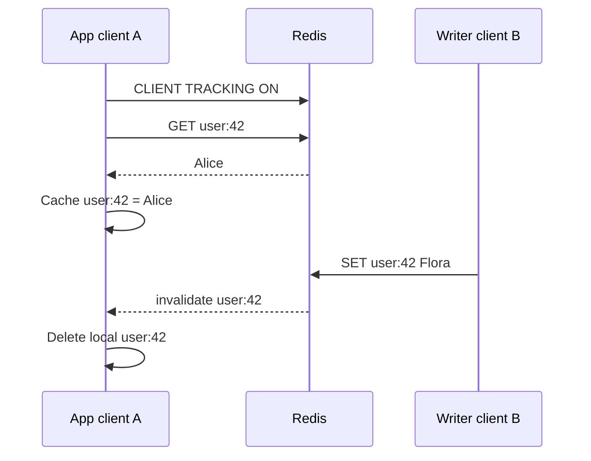
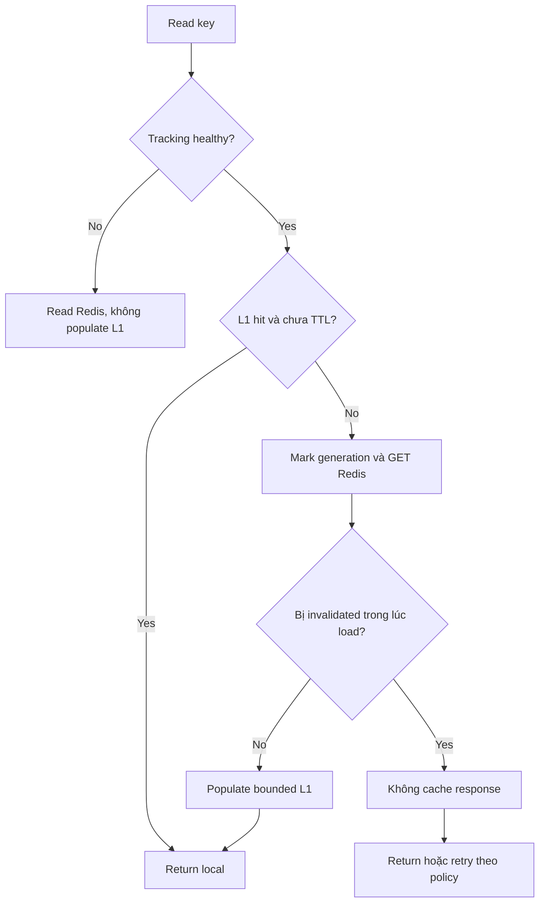

# Client-Side Caching

## Mục lục

- [1. Vấn đề: Redis đã nhanh nhưng network vẫn có giá](#1-vấn-đề-redis-đã-nhanh-nhưng-network-vẫn-có-giá)
- [2. Server-assisted caching và Tracking](#2-server-assisted-caching-và-tracking)
- [3. Default tracking mode: Redis nhớ client đã đọc key nào](#3-default-tracking-mode-redis-nhớ-client-đã-đọc-key-nào)
- [4. RESP3 single-connection mode](#4-resp3-single-connection-mode)
- [5. Two-connection mode và REDIRECT](#5-two-connection-mode-và-redirect)
- [6. OPTIN, OPTOUT và kiểm soát key được track](#6-optin-optout-và-kiểm-soát-key-được-track)
- [7. Broadcasting mode và PREFIX](#7-broadcasting-mode-và-prefix)
- [8. NOLOOP và write path](#8-noloop-và-write-path)
- [9. Race condition giữa GET response và invalidation](#9-race-condition-giữa-get-response-và-invalidation)
- [10. Disconnect, failover và flush local cache](#10-disconnect-failover-và-flush-local-cache)
- [11. TTL, eviction và negative caching](#11-ttl-eviction-và-negative-caching)
- [12. Connection pool và Redis Cluster](#12-connection-pool-và-redis-cluster)
- [13. Thiết kế local cache](#13-thiết-kế-local-cache)
- [14. Implementation end-to-end](#14-implementation-end-to-end)
- [15. Khi nào dùng và không nên dùng](#15-khi-nào-dùng-và-không-nên-dùng)
- [16. Performance, capacity và observability](#16-performance-capacity-và-observability)
- [17. Testing và runbook](#17-testing-và-runbook)
- [18. Anti-patterns và checklist production](#18-anti-patterns-và-checklist-production)
- [19. Tóm tắt decision table](#19-tóm-tắt-decision-table)
- [Tài liệu tham khảo](#tài-liệu-tham-khảo)

---

## 1. Vấn đề: Redis đã nhanh nhưng network vẫn có giá

Một `GET` Redis có thể dưới 1 ms, nhưng application gọi cùng hot key hàng trăm nghìn lần. Mỗi request vẫn tốn:

- Network round trip.
- Redis command parsing và event loop CPU.
- TLS encryption/decryption.
- Connection/pool scheduling.
- Serialization/client decode.

Lưu bản sao trong RAM application giảm latency xuống memory access và giảm tải Redis:

```text
Không local cache
10 app pods × 20.000 GET/s → Redis nhận 200.000 GET/s

Local hit ratio 90%
10 app pods × 2.000 miss/s → Redis nhận 20.000 GET/s
```

Vấn đề khó là invalidation: key `user:42` đổi trên Redis nhưng pod vẫn giữ value cũ. Redis 6+ cung cấp **server-assisted client-side caching**, gọi là **Client Tracking**, để Redis gửi invalidation chỉ đến clients có khả năng cache key đó hoặc clients theo dõi prefix.

> [!IMPORTANT]
> Client-side caching tạo L1 cache nằm trong từng process. Nó đổi network/Redis load lấy memory, invalidation complexity và nguy cơ stale khi connection mất.

---

## 2. Server-assisted caching và Tracking

Flow cơ bản:



Redis không gửi value mới; nó chỉ nói key không còn an toàn. Client phải xóa local entry. Read sau sẽ miss local và lấy lại Redis.

### 2.1. Hai mode lớn

| Mode | Redis nhớ gì | Invalidation gửi cho ai |
|------|--------------|-------------------------|
| Default tracking | Key → tập client IDs đã đọc | Chỉ clients có thể cache key |
| Broadcasting (`BCAST`) | Prefix → clients | Mọi client đăng ký prefix khi key match |

Default tiết kiệm network invalidation nhưng tốn server memory tracking. BCAST không lưu per-key read tracking, nhưng gửi nhiều invalidation thừa hơn.

### 2.2. Tracking không cache thay client

Redis chỉ cung cấp invalidation protocol. Client/application vẫn phải tự quyết định:

- Key/value nào cache.
- Maximum entries/bytes.
- Local TTL.
- Eviction policy LRU/LFU.
- Race handling.
- Disconnect behavior.
- Serialization và thread safety.

Nhiều Redis client library hỗ trợ sẵn một phần; phải đọc semantics version cụ thể, không chỉ bật `CLIENT TRACKING ON` rồi tự động có cache.

---

## 3. Default tracking mode: Redis nhớ client đã đọc key nào

Khi tracking bật, Redis ghi nhận keys xuất hiện trong các read-only command của connection vì chúng **có thể** được client cache.

```bash
CLIENT TRACKING ON
GET user:42
HGETALL product:7
MGET config:a config:b
```

Redis duy trì global **invalidation table** ánh xạ key/caching slot với client IDs có thể giữ bản sao. Khi key bị modify, expired hoặc evicted, Redis gửi invalidation đến clients tương ứng và dọn tracking entry.

### 3.1. Redis giả định “đã đọc là có thể cache”

Application có thể không cache response, nhưng Redis vẫn track nếu default mode. Hệ quả:

- Server memory tốn cho read keys không được local cache.
- Client nhận invalidation vô ích.
- Default mode phù hợp khi cache phần lớn reads.
- Nếu chỉ cache một nhóm nhỏ, dùng `OPTIN`.

### 3.2. Invalidation table bounded

Redis giới hạn số entries tracking theo configuration. Khi cần loại entry tracking cũ để giữ memory bounded, Redis giả như key đã thay đổi và gửi invalidation cho clients liên quan. Điều này gây extra local misses nhưng giữ correctness: client xóa sớm chứ không giữ stale.

Không capacity server tracking chỉ theo số local entries. Cost gần với số unique tracked keys và clients sharing them; đo `INFO tracking`/metrics phù hợp phiên bản.

### 3.3. Key namespace không phân biệt DB như kỳ vọng truyền thống

Theo Redis tracking reference, invalidation tracking dùng một key namespace không chia theo logical database để giảm complexity/memory. Cùng key name ở DB khác có thể gây invalidation thừa. Tránh multiple DB cho isolation; dùng key prefixes và Cluster DB 0.

### 3.4. Modification invalidates tracking

Sau key thay đổi, tracking relation bị loại. Client phải đọc lại key để được track lại. Invalidation không phải permanent subscription per key.

---

## 4. RESP3 single-connection mode

RESP3 hỗ trợ push messages multiplex trên cùng connection với normal command replies:

```text
Connection
  client → GET foo
  server → reply "bar"
  server → push invalidate [foo]
  client → GET baz
```

Bật protocol/tracking:

```bash
HELLO 3
CLIENT TRACKING ON
```

### 4.1. Ưu điểm

- Ordering giữa reply và invalidation trên cùng TCP stream rõ hơn.
- Không cần quản lý redirect connection ID.
- Tránh race hai connection ở section sau nếu client xử lý protocol đúng.

### 4.2. Yêu cầu client library

Client phải:

- Parse RESP3 push frames trong khi chờ command response.
- Dispatch invalidation không block reader loop.
- Đồng bộ local cache thread-safe.
- Flush cache khi connection mất.

Không phải mọi library/pool abstraction expose push messages dễ dàng. Kiểm tra support chính thức thay vì tự đọc raw socket bên cạnh library.

### 4.3. Head-of-line trong client

Dù protocol multiplex, handler invalidation chậm không nên block parser/command response. Dispatch event nhanh vào bounded mechanism hoặc xóa local entry O(1). Không gọi Redis/DB sync dài ngay trên socket reader callback.

---

## 5. Two-connection mode và REDIRECT

RESP2 không multiplex arbitrary push trên normal connection, và connection pool thường cần nhiều data connections. Redis cho redirect invalidations về một dedicated connection.

### 5.1. Setup

Connection I (invalidation):

```bash
CLIENT ID
# 1234

SUBSCRIBE __redis__:invalidate
```

Connection D (data):

```bash
CLIENT TRACKING ON REDIRECT 1234
GET foo
```

Khi `foo` đổi, only connection ID 1234 nhận invalidation frame. Dù RESP2 dùng hình thức Pub/Sub special channel, message được redirect cụ thể, không broadcast cho mọi subscriber thông thường.

### 5.2. Pool nhiều data connections

```text
Data connection D1 ─┐
Data connection D2 ─┼─ REDIRECT → invalidation connection I → process-local cache
Data connection D3 ─┘
```

Mỗi D connection phải bật tracking với đúng current ID của I. Nếu pool tạo connection mới, hook `onConnect` phải cấu hình tracking.

### 5.3. Invalidation connection reconnect

Connection ID đổi sau reconnect:

```text
I cũ ID=1234 chết
I mới ID=5678
D1/D2 vẫn REDIRECT 1234 → invalidations bị broken
```

Recovery an toàn:

1. Flush toàn local cache ngay khi I disconnect.
2. Tạo I mới, lấy ID mới, subscribe/ready.
3. Reconfigure/recreate mọi D connections với `REDIRECT newId`.
4. Chỉ bật cache serving sau khi tracking healthy.

`CLIENT TRACKINGINFO` và redirect-broken signals/metrics có thể giúp quan sát theo version.

### 5.4. Null invalidation

`FLUSHDB`/`FLUSHALL` có thể gửi invalidation null, nghĩa client phải clear toàn local cache, không phải xóa key `null`.

---

## 6. OPTIN, OPTOUT và kiểm soát key được track

### 6.1. OPTIN

```bash
CLIENT TRACKING ON OPTIN
CLIENT CACHING YES
GET product:42
```

`CLIENT CACHING YES` áp dụng cho command ngay sau nó. Chỉ reads được opt-in mới track. Phù hợp:

- Application chỉ cache vài namespace.
- Nhiều query one-off.
- Muốn giảm invalidation-table memory.

Pipeline phải giữ `CLIENT CACHING YES` ngay trước command tương ứng, không để command client khác xen trên shared connection. Với `MULTI`, semantics tracking có thể áp dụng cả transaction theo docs; integration test library.

### 6.2. OPTOUT

```bash
CLIENT TRACKING ON OPTOUT
```

Mặc định reads được track, chỉ loại các reads đặc biệt. Cơ chế opt-out command thay đổi/mở rộng theo Redis version (`CLIENT CACHING NO` cho command kế tiếp trong model truyền thống; Redis mới có thêm khả năng untracking key). Kiểm tra command docs/server version trước triển khai.

Phù hợp nếu cache hầu hết reads nhưng có một số hot-changing/large values không nên cache.

### 6.3. Default vs OPTIN vs OPTOUT

| Mode | Default read | Phù hợp |
|------|--------------|---------|
| Default | Track mọi read | Client cache gần như mọi response |
| OPTIN | Không track | Cache curated namespaces/commands |
| OPTOUT | Track | Cache đa số, loại vài trường hợp |

### 6.4. Transaction và Lua

Tracking có thể ghi nhận keys read bởi commands trong transaction/script theo mode/opt marker. Một script đọc 1.000 keys có thể làm tracking table tăng mạnh. Không dùng Lua scan lớn rồi client cache một aggregate duy nhất mà vô tình track mọi key; kiểm tra behavior và chọn BCAST/OPTIN/data model phù hợp.

---

## 7. Broadcasting mode và PREFIX

Bật:

```bash
CLIENT TRACKING ON BCAST PREFIX product: PREFIX config:
```

Redis không nhớ từng key client đã đọc. Nó nhớ client đăng ký prefixes; khi bất kỳ key match prefix bị modify, client nhận invalidation, dù chưa cache key đó.

### 7.1. Trade-off

| Khía cạnh | Default | BCAST |
|-----------|---------|-------|
| Server memory | Per tracked key/client | Không per-read key table |
| Network invalidation | Chỉ interested clients | Mọi prefix subscribers |
| Read tracking overhead | Có | Không |
| High-cardinality reads | Có thể đắt | Tốt nếu prefix ít |
| Write-heavy broad prefix | Ít invalidation thừa | Có thể flood |

### 7.2. Prefix design

Tốt:

```text
product:
feature-config:
country:
```

Xấu:

```text
PREFIX ""   → mọi key mutation
PREFIX user:42: cho hàng triệu user → prefix table/cardinality lớn
```

Redis không cho overlapping prefixes trong cùng tracking setup theo rules hiện tại, ví dụ `foo` và `foobar`, vì một key có thể match cả hai. Chọn minimal non-overlapping prefixes.

### 7.3. BCAST không phải keyspace notification

Cả hai gửi invalidation-like push, nhưng Client Tracking có protocol và connection association dành cho cache correctness. Keyspace notifications là general Pub/Sub event stream, phải bật config và không biết client đã đọc gì. Ưu tiên Tracking cho L1 cache.

---

## 8. NOLOOP và write path

Mặc định client sửa key có thể nhận invalidation cho chính nó. `NOLOOP` suppress invalidation do chính tracking connection gây ra:

```bash
CLIENT TRACKING ON NOLOOP
```

Hữu ích khi write-through local cache:

```text
client SET product:42 v2
client update local product:42 = v2
không muốn nhận invalidate ngay cho write của chính mình
```

### 8.1. Cạm bẫy

Sau write trong default tracking, key không còn được track cho connection; `NOLOOP` chỉ suppress notification self-loop. Client phải read/track lại để nhận future invalidation từ writers khác theo documented behavior.

### 8.2. Shared writer connections

Nếu nhiều logical request/process components dùng cùng connection, “self” là connection chứ không phải business owner. `NOLOOP` có thể suppress invalidation mà một local cache path khác cần. Chỉ dùng khi local write/cache update protocol được kiểm soát chặt.

### 8.3. Write failure và ambiguous timeout

Không update local cache trước khi Redis write chắc chắn thành công. Nếu response timeout không rõ write đã apply, safest là evict local key, không giữ guessed value. Read lại Redis sau connection recovery.

---

## 9. Race condition giữa GET response và invalidation

Two-connection race:

```text
[D] gửi GET foo
[I] nhận invalidate foo do writer đổi
[D] nhận response "old-bar" đến muộn
application cache old-bar → stale vô hạn nếu không có event tiếp
```

### 9.1. Placeholder/generation solution

Trước khi gửi GET, đặt local entry state `LOADING` với generation/token:

```text
1. local foo = LOADING(gen=17)
2. gửi GET foo
3. invalidation đến → delete/increment generation
4. GET response về
5. chỉ cache nếu LOADING(gen=17) vẫn tồn tại
6. nếu entry đã bị invalidation → trả response cho caller tùy policy nhưng không cache, hoặc retry
```

Pseudo-code:

```typescript
const generation = cache.beginLoad(key);
const value = await redis.get(key);
if (cache.isLoadStillValid(key, generation)) {
  cache.completeLoad(key, generation, value, localTtlMs);
}
return value;
```

Invalidation handler gọi `cache.invalidate(key)`, làm token cũ invalid.

### 9.2. Single-flight kết hợp generation

Nhiều local requests miss cùng key nên share một Promise, nhưng invalidation trong lúc load phải hủy khả năng populate. Single-flight chỉ chống duplicate load, không tự giải quyết stale race.

### 9.3. RESP3 same connection

Ordering trên một stream tránh race hai connection cụ thể vì reply/push có thứ tự, nhưng application dispatch concurrency vẫn có thể reorder nếu handler async. Local cache state machine vẫn nên đơn giản và thread-safe.

---

## 10. Disconnect, failover và flush local cache

Nếu mất invalidation connection, application không biết keys nào đổi trong gap. Rule an toàn:

```text
invalidation connection unhealthy → clear toàn local cache → bypass cache
reconnected + tracking configured → cho phép populate lại
```

### 10.1. Không giữ stale “để availability” mà không giới hạn

Có thể chọn serve stale trong outage cho dữ liệu không critical, nhưng phải có:

- Local hard TTL.
- Maximum stale duration.
- Endpoint/data classification.
- Metrics `stale_served`.
- Không áp dụng cho authorization, inventory quyết định, balance.

### 10.2. Heartbeat

TCP half-open có thể chưa báo disconnect. Ping invalidation connection định kỳ và đặt deadline. Nếu không nhận pong đúng hạn, đóng connection và flush local cache.

### 10.3. Redis failover

Sau failover:

- Connection reset.
- Tracking state/invalidation table trên node mới có thể không đại diện connection cũ.
- Client IDs đổi.
- Flush L1, reconnect, re-enable tracking, rewarm tự nhiên.

Không cố preserve local cache qua failover nếu không chứng minh tracking continuity.

### 10.4. App deploy

Mỗi process có cache riêng, cold start tự nhiên. Rolling deploy không cần chia sẻ L1 state. Payload schema version vẫn cần để tránh cache object trong process sống qua code hot reload hoặc heterogeneous app versions.

---

## 11. TTL, eviction và negative caching

### 11.1. Local TTL vẫn bắt buộc

Invalidation là primary freshness mechanism, local TTL là safety net cho bug/disconnect. Chọn:

```text
local TTL <= business max stale
local TTL có thể ngắn hơn hoặc bằng Redis TTL
```

Client tracking reference khuyên đặt max TTL ngay cả Redis key không có TTL.

### 11.2. Redis key expiration/eviction

Khi tracked key expire hoặc bị maxmemory eviction, Redis gửi invalidation. Nhưng timing/network vẫn có gap; local TTL bảo vệ. Nếu local cache giữ value lâu hơn Redis lifecycle, invalidation phải healthy.

### 11.3. Lấy TTL cùng value

`GET` và `PTTL` hai command có race nhỏ; Lua/transaction hoặc client API có thể lấy metadata phù hợp. Thực tế thường dùng local max TTL cố định ngắn, không cần mirror chính xác Redis TTL.

### 11.4. Negative caching

Key missing cũng có thể được local negative-cache để giảm repeated misses. Khi key được tạo, invalidation tracking phải bảo đảm client đã track read miss theo command semantics. Dùng local TTL rất ngắn và test “GET missing → SET from other client → invalidation”.

### 11.5. Memory eviction local

Local LRU/LFU eviction không cần báo Redis; Redis có thể vẫn nhớ client từng đọc key đến khi tracking entry invalidated/evicted, tạo notification thừa nhưng không correctness issue.

---

## 12. Connection pool và Redis Cluster

### 12.1. Pool

Mỗi physical data connection có tracking state riêng. Với process-wide cache:

- Một invalidation connection I.
- Mọi D connections redirect I.
- Mọi connection mới bật tracking.
- I reconnect → reconfigure all D.
- Pool health và cache health liên kết.

Không bật tracking trên một connection rồi nghĩ toàn pool được track.

### 12.2. Cluster

Mỗi key route đến primary node riêng; tracking/invalidation connection management là per node/topology. Client cluster-aware cần:

```text
Shard A data connections → invalidation connection IA
Shard B data connections → invalidation connection IB
Shard C data connections → invalidation connection IC
```

Hoặc RESP3 connections tự nhận push theo library support. Khi reshard/failover/node add, flush affected/all L1 và rebuild tracking.

### 12.3. Replica reads

Nếu đọc replicas, local value có thể đã stale do replication lag ngay lúc cache. Tracking invalidation source/routing qua primary/replica topology cần client support rõ. Với strong read-after-write, đọc primary hoặc bypass L1. Không tự kết hợp arbitrary replica pool với tracking mà chưa integration test.

### 12.4. Hash slots và BCAST prefix

BCAST prefix không làm key cùng slot. Cluster vẫn route key theo hash. Prefix subscribers cần được thiết lập trên relevant nodes; client library implementation quan trọng.

---

## 13. Thiết kế local cache

### 13.1. Entry state

```typescript
type CacheEntry<T> =
  | { state: 'ready'; value: T; expiresAt: number; bytes: number }
  | { state: 'missing'; expiresAt: number }
  | { state: 'loading'; generation: number; promise: Promise<T | null> };
```

### 13.2. Bounded memory

Giới hạn cả entries và bytes. 100.000 entries không có nghĩa memory cố định nếu payload từ 100 B đến 5 MB. Không cache value vượt max size.

### 13.3. Eviction policy

- LRU đơn giản cho recency.
- LFU/TinyLFU tốt hơn khi one-hit scans nhưng implementation phức tạp.
- TTL heap/timer per entry có overhead; lazy expiry + periodic bounded cleanup thường đủ.

### 13.4. Immutability/copy

Nếu trả object reference cache cho caller và caller mutate, local cache bị thay đổi mà Redis không biết. Freeze/copy object hoặc contract read-only.

### 13.5. Tenant và authorization

Cache key phải chứa mọi dimension ảnh hưởng result:

```text
L1 key = redis key + projection/schema + auth/tenant scope nếu value khác nhau
```

Tracking invalidates Redis key, nên local cache cần index từ Redis key đến mọi derived local entries để evict tất cả projections. Tốt nhất cache đúng raw Redis value per key, transform sau.

---

## 14. Implementation end-to-end

Pseudo-code tập trung vào lifecycle, không phụ thuộc client cụ thể:

```typescript
class TrackedCache<T> {
  private enabled = false;
  private generation = new Map<string, number>();
  private values = new LruCache<string, T>({ maxEntries: 50_000, maxBytes: 256e6 });

  onInvalidation(keys: string[] | null) {
    if (keys === null) {
      this.values.clear();
      this.generation.clear();
      return;
    }
    for (const key of keys) {
      this.values.delete(key);
      this.generation.set(key, (this.generation.get(key) ?? 0) + 1);
    }
  }

  onTrackingDisconnected() {
    this.enabled = false;
    this.onInvalidation(null);
  }

  onTrackingReady() {
    this.enabled = true;
  }

  async get(key: string): Promise<T | null> {
    if (this.enabled) {
      const hit = this.values.get(key);
      if (hit !== undefined) return hit;
    }

    const generation = this.generation.get(key) ?? 0;
    // Với OPTIN, command marker + GET phải gửi liền nhau trên connection.
    const raw = await trackedRedisGet(key);
    const value = raw === null ? null : decodeAndValidate<T>(raw);

    if (this.enabled && (this.generation.get(key) ?? 0) === generation) {
      if (value !== null && estimateBytes(value) <= MAX_VALUE_BYTES) {
        this.values.set(key, value, { ttlMs: LOCAL_MAX_TTL_MS });
      }
    }
    return value;
  }
}
```

Production cần single-flight, negative entries, error handling, metrics và proper race marker set **trước khi command được gửi**. API client cụ thể có thể cung cấp built-in cache tốt hơn; dùng built-in nếu semantics được document và test.

### 14.1. Read flow



---

## 15. Khi nào dùng và không nên dùng

### 15.1. Dùng khi

- Read-heavy, small hot working set.
- Values thay đổi ít hơn số lần đọc.
- Nhiều app CPU/network headroom.
- Microsecond-level L1 latency có giá trị.
- Stale bounded bởi invalidation + local TTL chấp nhận được.
- Redis đang chịu read fan-out lớn từ nhiều pods.

### 15.2. Không nên dùng khi

- Value thay đổi liên tục như global counter; invalidation nhiều hơn hit.
- Mỗi key chỉ đọc một lần.
- Payload lớn/working set vượt app memory.
- Correctness yêu cầu read latest tuyệt đối.
- Serverless process sống rất ngắn, hit ratio thấp.
- Client library không hỗ trợ tracking lifecycle/Cluster đúng.
- Operational team không quan sát reconnect/stale behavior.

### 15.3. L1 cache thủ công bằng Pub/Sub vs Tracking

| Tiêu chí | Manual Pub/Sub | Client Tracking |
|----------|----------------|-----------------|
| Writer phải publish | Có | Redis tự invalidates |
| Biết client cache key nào | App tự quản | Default tracking |
| Missed custom publish bug | Có | Giảm đáng kể |
| Disconnect gap | Có | Có, nhưng protocol chỉ rõ flush |
| Prefix broadcast | Tự thiết kế | BCAST |
| Value-specific business event | Có thể | Không, chỉ key invalidation |

Tracking phù hợp cache invalidation; business events vẫn dùng Stream/outbox.

---

## 16. Performance, capacity và observability

### 16.1. Lợi ích phải đo end-to-end

Metrics:

| Nhóm | Metrics |
|------|---------|
| L1 | hit/miss, entries, bytes, eviction, local latency |
| Tracking | invalidations, full flush, reconnect, redirect broken |
| Redis | ops/s giảm, tracking table memory/keys, network out |
| Quality | stale detected, generation-race prevented, decode error |
| Workload | invalidations per cached hit, key churn |

Một cache hit ratio 95% nhưng invalidation storm CPU cao có thể không đáng. Tính:

```text
benefit ≈ Redis reads avoided
cost ≈ app memory + invalidation traffic + complexity + stale risk
```

### 16.2. Server tracking memory

Theo dõi `INFO tracking` fields theo version như tracked clients, tracked keys/prefixes, invalidation table usage. Set maximum tracking keys hợp capacity hoặc chọn BCAST. Khi table tự evict tracking entries, local invalidations tăng và hit ratio giảm nhưng correctness vẫn giữ.

### 16.3. App memory

Local cache nhân theo số process:

```text
200 pods × 256 MB L1 = 51,2 GB aggregate application RAM
```

Có thể vẫn rẻ hơn scale Redis/network, nhưng phải tính thật. Autoscaling tăng aggregate cache và cold-start load Redis.

### 16.4. Hot key

L1 cực hiệu quả cho hot key: mỗi pod chỉ refresh khi invalidated/TTL. Nhưng một write sẽ invalidate mọi pod, sau đó simultaneous miss gây mini stampede. Single-flight trong pod + TTL jitter/refresh strategy giúp giảm. Xem [Caching Patterns](./caching-patterns.md).

---

## 17. Testing và runbook

### 17.1. Correctness tests

- Read/cache key → writer update → local entry bị evict.
- Key expire/evict → invalidation.
- Read missing → writer create.
- Invalidation đến trước GET response race.
- Null/full-cache invalidation.
- Same client write với/không `NOLOOP`.
- Local TTL expiry.
- Payload decode/schema error.

### 17.2. Connection tests

- Kill invalidation socket.
- Half-open/ping timeout.
- Reconnect ID đổi và REDIRECT reconfiguration.
- Redis restart/failover.
- Pool creates/recycles data connection.
- Cluster reshard/node add/primary promotion.
- RESP2 và RESP3 client modes.

Invariant: khi tracking health không chắc chắn, không được serve unbounded stale entries.

### 17.3. Runbook stale L1

1. Disable/bypass local cache feature flag.
2. Flush caches ở mọi pods hoặc restart/rpc clear.
3. Kiểm tra tracking connections, redirect IDs và reconnect timeline.
4. Kiểm tra writer có mutate đúng Redis instance/key.
5. Reproduce ordering race.
6. Giảm local TTL trong mitigation.
7. Re-enable canary sau fix.

### 17.4. Runbook invalidation storm

1. Xác định key prefixes/write rate.
2. Tắt cache cho high-churn namespace.
3. Chuyển BCAST rộng sang narrower prefix/default OPTIN nếu phù hợp.
4. Giảm tracked reads không cache.
5. Kiểm tra app queue/socket reader latency.

---

## 18. Anti-patterns và checklist production

### 18.1. Anti-patterns

1. Bật tracking nhưng không flush cache khi disconnect.
2. Two-connection mode không xử lý race GET/invalidation.
3. Invalidation connection reconnect nhưng data pool vẫn redirect ID cũ.
4. BCAST không prefix trên write-heavy database.
5. Default mode track mọi read dù chỉ cache 1%.
6. Không giới hạn L1 entries/bytes/TTL.
7. Cache object mutable rồi caller sửa.
8. Dùng `NOLOOP` mà không update/retrack đúng.
9. Coi local cache là source of truth.
10. Tin client library Cluster tracking mà không failover test.
11. Cache authorization/balance với stale policy không rõ.
12. Không instrument tracking health/stale incidents.

### 18.2. Checklist

- [ ] Client/server version hỗ trợ mode/options đã chọn.
- [ ] Default/OPTIN/OPTOUT/BCAST được chọn theo workload.
- [ ] RESP3 hoặc REDIRECT lifecycle được thiết kế.
- [ ] GET-invalidation race có generation/placeholder.
- [ ] Disconnect/failover clear L1 và bypass đến khi ready.
- [ ] Local max TTL, max entries và max bytes.
- [ ] Cluster/pool mọi physical connection được track.
- [ ] Negative cache/create invalidation đã test.
- [ ] NOLOOP semantics đã test nếu dùng.
- [ ] Metrics hit, invalidation, reconnect, flush, memory.
- [ ] Security/tenant dimensions trong cache key đúng.
- [ ] Có feature flag tắt L1 nhanh.

---

## 19. Tóm tắt decision table

| Workload | Mode gợi ý |
|----------|-------------|
| Cache hầu hết reads, moderate unique keys | Default tracking |
| Chỉ cache selected namespaces | OPTIN |
| Cache đa số, loại vài reads | OPTOUT |
| Rất nhiều unique reads, ít stable prefixes | BCAST với prefix hẹp |
| RESP3 client hỗ trợ push tốt | Single connection hoặc library-native |
| RESP2/pool lớn | Dedicated invalidation + REDIRECT |
| Write-churn cao, hit thấp | Không client cache namespace đó |

Ba nguyên tắc:

1. **Tracking chỉ gửi invalidation; local cache lifecycle vẫn là trách nhiệm client**.
2. **Mất invalidation connection đồng nghĩa cache không còn đáng tin**, phải flush/bypass.
3. **Race, pool và Cluster mới là phần khó**, không phải câu lệnh `CLIENT TRACKING ON`.

---

## Tài liệu tham khảo

- [Redis Client-Side Caching Reference](https://redis.io/docs/latest/develop/reference/client-side-caching/)
- [Client-Side Caching Introduction](https://redis.io/docs/latest/develop/clients/client-side-caching/)
- [CLIENT TRACKING](https://redis.io/docs/latest/commands/client-tracking/)
- [Caching Patterns](./caching-patterns.md)
- [Keyspace Notifications](./keyspace-notifications.md)
- [Pub/Sub](./pub-sub.md)
- [Redis Cluster](./cluster.md)
