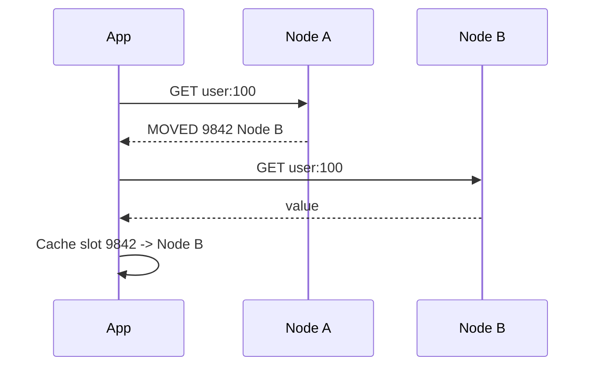
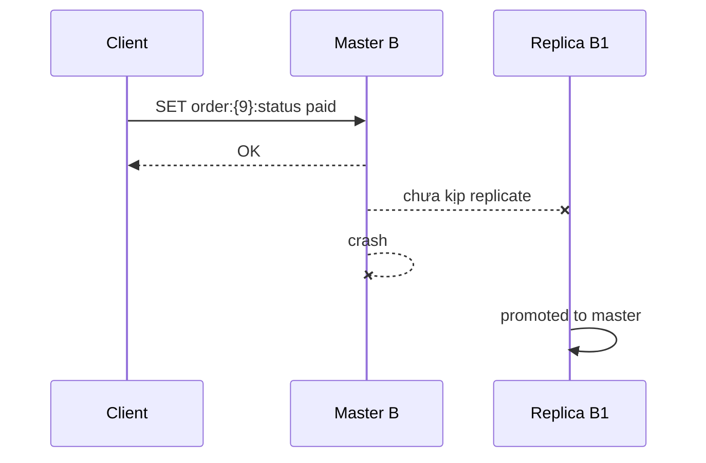

# Redis Cluster

## Mục lục

- [Tổng quan](#tổng-quan)
- [Redis Cluster giải quyết vấn đề gì?](#redis-cluster-giải-quyết-vấn-đề-gì)
- [Khi nào không nên dùng Redis Cluster?](#khi-nào-không-nên-dùng-redis-cluster)
- [Kiến trúc tổng quát](#kiến-trúc-tổng-quát)
- [Hash slots: cách Redis chia dữ liệu](#hash-slots-cách-redis-chia-dữ-liệu)
- [Hash tags và multi-key commands](#hash-tags-và-multi-key-commands)
- [Client routing, MOVED và ASK](#client-routing-moved-và-ask)
- [Cluster bus và gossip protocol](#cluster-bus-và-gossip-protocol)
- [Replication và failover trong Cluster](#replication-và-failover-trong-cluster)
- [Consistency và write safety](#consistency-và-write-safety)
- [Availability và network partition](#availability-và-network-partition)
- [Resharding: di chuyển slots không downtime](#resharding-di-chuyển-slots-không-downtime)
- [Adding và removing nodes](#adding-và-removing-nodes)
- [Replica migration](#replica-migration)
- [Cấu hình Redis Cluster](#cấu-hình-redis-cluster)
- [Tạo cluster local 6 nodes](#tạo-cluster-local-6-nodes)
- [Vận hành và quan sát Cluster](#vận-hành-và-quan-sát-cluster)
- [Data modeling cho Redis Cluster](#data-modeling-cho-redis-cluster)
- [Các lỗi thường gặp](#các-lỗi-thường-gặp)
- [Best practices](#best-practices)
- [Checklist production](#checklist-production)
- [So sánh Cluster, Sentinel và Replication](#so-sánh-cluster-sentinel-và-replication)
- [Tài liệu liên quan](#tài-liệu-liên-quan)

---

## Tổng quan

**Redis Cluster** là cơ chế chạy Redis theo mô hình distributed để:

1. **Sharding dữ liệu tự động** trên nhiều Redis master node.
2. **Tăng write/read capacity** bằng cách chia keyspace thành nhiều phần.
3. **High availability theo từng shard** bằng replica và automatic failover.

Nếu [Replication](./replication.md) trả lời câu hỏi “làm sao có bản sao?”, [Redis Sentinel](./sentinel.md) trả lời “làm sao tự failover một master?”, thì Redis Cluster trả lời câu hỏi lớn hơn:

```text
Làm sao chia một Redis dataset lớn ra nhiều node,
và vẫn tự failover khi một số node chết?
```

Một cluster tối thiểu production thường có 3 master và 3 replica:

```text
                         Redis Cluster

        ┌──────────────┐      ┌──────────────┐      ┌──────────────┐
        │ Master A     │      │ Master B     │      │ Master C     │
        │ slots 0-5460 │      │ 5461-10922   │      │10923-16383   │
        └──────┬───────┘      └──────┬───────┘      └──────┬───────┘
               │ replication         │ replication         │ replication
               ▼                     ▼                     ▼
        ┌──────────────┐      ┌──────────────┐      ┌──────────────┐
        │ Replica A1   │      │ Replica B1   │      │ Replica C1   │
        └──────────────┘      └──────────────┘      └──────────────┘
```

Redis Cluster chia toàn bộ keyspace thành **16384 hash slots**. Mỗi master chịu trách nhiệm một tập slots. Client cluster-aware biết key thuộc slot nào và gửi command tới node đang sở hữu slot đó.

> [!IMPORTANT]
> Redis Cluster không phải “Redis Sentinel phiên bản lớn hơn”. Cluster thay đổi cách client route key, cách data model hoạt động, và giới hạn multi-key commands. Dùng Cluster cần client library hỗ trợ Cluster.

---

## Redis Cluster giải quyết vấn đề gì?

| Vấn đề | Redis Cluster xử lý như thế nào? |
|--------|-----------------------------------|
| Dataset quá lớn cho một node | Chia keys qua nhiều master bằng hash slots |
| Write throughput một master không đủ | Write được phân tán qua nhiều master shards |
| Một shard master chết | Replica của shard đó được promote |
| Thêm capacity | Add node và move slots sang node mới |
| Remove node | Move slots khỏi node rồi quên node đó |
| Client cần biết node nào giữ key | Cluster trả `MOVED`/`ASK`; client cache slot map |

Ví dụ:

```text
user:1      ──hash──▶ slot 9842  ──▶ Master B
session:9   ──hash──▶ slot 231   ──▶ Master A
product:42  ──hash──▶ slot 15001 ──▶ Master C
```

Mỗi master chỉ giữ một phần dữ liệu, nên capacity tăng gần tuyến tính theo số master nếu workload phân bố đều.

---

## Khi nào không nên dùng Redis Cluster?

Cluster mạnh, nhưng không miễn phí. Không nên dùng nếu nhu cầu đơn giản hơn.

| Tình huống | Gợi ý |
|------------|-------|
| Dataset vừa một node, chỉ cần failover | Dùng Sentinel |
| App dùng nhiều multi-key command trên key không cùng slot | Cần redesign key hoặc không dùng Cluster |
| Muốn strong consistency/quorum writes | Redis Cluster không phải CP database |
| Client library không hỗ trợ Cluster tốt | Không nên production |
| Chỉ cần cache đơn giản và có managed Redis | Dùng managed Redis/Sentinel có thể đủ |
| Cần cross-region active-active merge conflict | Redis Cluster OSS không giải quyết conflict merge |

> [!TIP]
> Chỉ chọn Redis Cluster khi bạn thật sự cần sharding hoặc write capacity vượt một Redis master. Nếu chỉ cần HA cho một dataset, Sentinel đơn giản hơn nhiều.

---

## Kiến trúc tổng quát

Redis Cluster gồm nhiều Redis node chạy `cluster-enabled yes`. Mỗi node có:

- Redis client port, ví dụ `6379`.
- Cluster bus port, mặc định `client_port + 10000`, ví dụ `16379`.
- Node ID duy nhất.
- Cluster config file nội bộ, thường là `nodes.conf`.
- Thông tin slot ownership.
- Thông tin các node khác qua gossip.

```text
                 ┌─────────────────────┐
                 │ Cluster-aware Client │
                 └──────────┬──────────┘
                            │ command to correct node
                            ▼
┌────────────────┐   cluster bus   ┌────────────────┐
│ Node A Master  │◀───────────────▶│ Node B Master  │
│ slots 0-5460   │                 │ slots 5461...  │
└───────┬────────┘                 └───────┬────────┘
        │ replication                      │ replication
        ▼                                  ▼
┌────────────────┐                 ┌────────────────┐
│ Node A Replica │                 │ Node B Replica │
└────────────────┘                 └────────────────┘
```

### Master node

Master node chịu trách nhiệm một số hash slots. Nó nhận write/read cho keys thuộc các slots đó.

### Replica node

Replica replicate từ một master. Khi master chết và cluster đạt điều kiện failover, replica có thể được promote thành master và nhận slots của master cũ.

### Cluster-aware client

Client phải:

- Tính slot từ key.
- Cache map slot → node.
- Xử lý `MOVED` khi slot ownership đổi.
- Xử lý `ASK` khi slot đang migration.
- Duy trì connection tới nhiều node.

---

## Hash slots: cách Redis chia dữ liệu

Redis Cluster không dùng consistent hashing kiểu ring. Nó dùng **16384 hash slots** cố định.

Công thức cơ bản:

```text
HASH_SLOT = CRC16(key) mod 16384
```

Mỗi key thuộc đúng một slot. Mỗi slot thuộc đúng một master trong trạng thái ổn định.

```text
Toàn bộ keyspace: 0 ... 16383

Master A: slots 0-5460
Master B: slots 5461-10922
Master C: slots 10923-16383
```

Khi client chạy:

```bash
SET user:100 name
```

Client tính slot của `user:100`, biết slot đó thuộc Master B, rồi gửi command tới Master B.

### Vì sao dùng slots?

Hash slots giúp:

- Move một nhóm keys từ node này sang node khác dễ hơn.
- Add/remove node bằng cách chuyển slots, không cần rehash toàn bộ cluster.
- Client cache slot map đơn giản: 16384 entries hoặc range.
- Cluster biết khi nào toàn bộ keyspace được cover.

### Slot ownership

Trong trạng thái stable:

```text
slot 0       → Master A
slot 1       → Master A
...
slot 5461    → Master B
...
slot 16383   → Master C
```

Nếu một slot không có node nào serve và `cluster-require-full-coverage yes`, cluster có thể báo fail để tránh dữ liệu không đầy đủ.

---

## Hash tags và multi-key commands

Redis standalone cho phép nhiều command multi-key tự do:

```bash
MGET user:1:name user:2:name
SUNION followers:1 followers:2
```

Trong Cluster, multi-key command chỉ hoạt động nếu tất cả keys thuộc **cùng một hash slot**.

Nếu keys khác slot:

```bash
MGET user:1:name user:2:name
# (error) CROSSSLOT Keys in request don't hash to the same slot
```

### Hash tag là gì?

Hash tag là phần nằm trong `{...}` của key. Nếu key có hash tag hợp lệ, Redis chỉ hash phần bên trong `{}` để tính slot.

Ví dụ:

```text
user:{100}:profile
user:{100}:settings
cart:{100}
```

Cả ba key này đều hash theo `100`, nên cùng slot.

```bash
MGET user:{100}:profile user:{100}:settings cart:{100}
```

### Ví dụ data modeling đúng

Nếu bạn cần transaction/Lua/multi-key cho cùng user:

```text
user:{123}:profile
user:{123}:sessions
user:{123}:cart
user:{123}:limits
```

Tất cả cùng slot vì hash tag `{123}`.

### Cẩn thận hot slot

Hash tags có thể tạo hot slot nếu dùng quá rộng:

```text
{global}:leaderboard
{global}:counter:1
{global}:counter:2
{global}:sessions
```

Tất cả dồn vào một slot, làm mất lợi ích sharding.

> [!IMPORTANT]
> Hash tag nên đại diện cho aggregate cần atomic/multi-key, ví dụ user id, tenant id nhỏ, order id. Không dùng một hash tag chung cho toàn hệ thống trừ khi bạn cố tình muốn colocate dữ liệu.

### Những command bị ảnh hưởng

| Command/pattern | Trong Cluster |
|-----------------|---------------|
| `GET key` | OK, single key |
| `MGET k1 k2` | OK nếu cùng slot |
| `DEL k1 k2` | OK nếu cùng slot; hoặc client có thể split thành nhiều DEL |
| `MULTI/EXEC` | Chỉ với keys cùng slot |
| Lua script | Keys khai báo phải cùng slot |
| `SUNIONSTORE a b c` | Cần cùng slot |
| `SCAN` | Chạy trên từng node, không phải global single cursor |
| `SELECT 1` | Không hỗ trợ; Cluster chỉ DB 0 |

---

## Client routing, MOVED và ASK

Redis Cluster không proxy command giữa nodes. Nếu client gửi command sai node, node trả redirect.

### MOVED

`MOVED` nghĩa là slot đã thuộc node khác ổn định. Client nên update slot cache.

Ví dụ:

```bash
GET user:100
(error) MOVED 9842 10.0.0.12:6379
```

Ý nghĩa:

```text
Slot 9842 hiện ở 10.0.0.12:6379.
Hãy gửi request tới đó và cập nhật slot map.
```

Cluster-aware client sẽ tự xử lý.

### ASK

`ASK` xuất hiện khi slot đang được migrate từ source sang target.

```bash
(error) ASK 9842 10.0.0.13:6379
```

Client phải gửi `ASKING` tới target trước command tiếp theo:

```bash
ASKING
GET user:100
```

`ASK` là redirect tạm thời, không nên update slot map vĩnh viễn ngay như `MOVED`.

### Luồng routing bình thường



### Tại sao không dùng proxy nội bộ?

Redis Cluster chọn redirect thay vì proxy để:

- Giữ latency thấp sau khi client cache slot map.
- Tránh node trung gian thành bottleneck.
- Scale tuyến tính hơn.

Trade-off là client phức tạp hơn.

---

## Cluster bus và gossip protocol

Mỗi Redis Cluster node giao tiếp với node khác qua **cluster bus**.

Nếu Redis data port là `6379`, cluster bus port mặc định là:

```text
16379 = 6379 + 10000
```

Có thể override bằng config `cluster-port`.

Cluster bus dùng binary protocol để:

- Ping/pong giữa nodes.
- Gossip trạng thái node.
- Phát hiện node lỗi.
- Trao đổi config epoch.
- Authorize failover.
- Propagate cluster topology changes.

```text
Client port: 6379   ← app gửi Redis commands
Bus port:    16379  ← Redis nodes nói chuyện với nhau
```

> [!IMPORTANT]
> Firewall phải mở cả client port và cluster bus port giữa các cluster nodes. Nếu chỉ mở 6379, client có thể connect nhưng cluster failover/gossip sẽ lỗi.

### Node ID

Mỗi node có một Node ID 160-bit random, lưu trong `nodes.conf`. Node ID quan trọng hơn IP vì IP có thể đổi, nhưng identity node vẫn là Node ID.

Không xóa `nodes.conf` bừa bãi trong production, vì có thể làm node đổi identity.

---

## Replication và failover trong Cluster

Cluster dùng replication theo từng master shard:

```text
Master A owns slots 0-5460
Replica A1 follows Master A
Replica A2 follows Master A
```

Nếu Master A fail, một replica của A được promote và nhận các slots `0-5460`.

```text
Trước:
A(master slots 0-5460) ─▶ A1(replica)

Sau failover:
A1(master slots 0-5460)
A nếu quay lại ─▶ A1(replica)
```

### Failover điều kiện cơ bản

Failover thường cần:

- Master bị coi là failed bởi cluster nodes.
- Majority master nodes còn sống để authorize failover.
- Có replica hợp lệ cho master failed.
- Replica candidate không quá stale theo validity rules.

### Failure detection

Cluster nodes ping nhau. Nếu một node không phản hồi quá `cluster-node-timeout`, node khác có thể nghi ngờ nó fail.

Config:

```conf
cluster-node-timeout 5000
```

Nếu đủ thông tin từ cluster majority, node có thể bị đánh dấu failed.

### Replica election

Replica của master failed sẽ xin vote từ các master còn lại. Một replica thắng election rồi promote thành master.

Yếu tố ảnh hưởng:

- Replica có dữ liệu mới hơn được ưu tiên hơn.
- Replica bị disconnect khỏi master quá lâu có thể không hợp lệ.
- Cluster epoch đảm bảo config mới hơn thắng config cũ.

### Manual failover

Có thể chủ động failover một shard bằng command trên replica:

```bash
redis-cli -h <replica> CLUSTER FAILOVER
```

Thường dùng khi maintenance master, upgrade rolling, hoặc test HA.

---

## Consistency và write safety

Redis Cluster dùng asynchronous replication giống Redis Replication thường. Vì vậy **không đảm bảo strong consistency**.

### Write có thể mất khi master chết



Write đã được client nhận `OK` nhưng replica chưa nhận, nên mất sau failover.

### Minority partition có thể mất write

Giả sử cluster 3 master A/B/C và replicas A1/B1/C1.

```text
Majority partition: A, C, A1, B1, C1
Minority partition: B + Client Z
```

Client Z vẫn có thể ghi vào B trong một khoảng thời gian. Nếu partition kéo dài quá `cluster-node-timeout`, majority promote B1 thay B. Khi B quay lại, các write trên B trong minority side bị mất.

Cluster cố giảm rủi ro bằng cách master ở minority side sẽ ngừng accept write sau khi không liên lạc được với majority quá timeout.

### WAIT trong Cluster

Có thể dùng `WAIT` để giảm xác suất mất write:

```bash
SET order:{9}:status paid
WAIT 1 1000
```

Nhưng `WAIT` không biến Cluster thành CP database. Failover election vẫn có edge cases nếu replica không nhận write lại được chọn hoặc persistence mất dữ liệu.

### Last failover wins

Redis Cluster không merge conflict. Timeline của master được failover/promote mới sẽ thắng. Dữ liệu khác biệt ở master cũ có thể bị discard khi nó trở thành replica.

---

## Availability và network partition

Redis Cluster ưu tiên availability khi **majority của master nodes** còn hoạt động và mỗi failed master có replica có thể promote.

### Khi nào cluster vẫn available?

Ví dụ 3 masters, 3 replicas:

```text
A(master) + A1(replica)
B(master) + B1(replica)
C(master) + C1(replica)
```

Nếu B chết nhưng B1 còn sống, cluster có thể promote B1 và tiếp tục serve toàn bộ slots.

### Khi nào cluster unavailable?

| Tình huống | Vì sao unavailable |
|------------|--------------------|
| Master B và replica B1 cùng chết | Slots của B không còn node serve |
| Majority masters không liên lạc được | Không authorize failover an toàn |
| Một số slots uncovered và `cluster-require-full-coverage yes` | Cluster tránh serve dữ liệu không đầy đủ |
| Cluster bus bị firewall chặn | Nodes không gossip/failover được |

### `cluster-require-full-coverage`

```conf
cluster-require-full-coverage yes
```

Nếu `yes`, cluster ngừng serve khi không đủ coverage cho toàn bộ 16384 slots.

Nếu `no`, cluster có thể tiếp tục serve keys thuộc slots còn healthy, nhưng keys thuộc slots mất sẽ lỗi.

Trade-off:

| `yes` | `no` |
|-------|------|
| An toàn hơn, tránh partial availability gây nhầm | Availability cao hơn cho phần dữ liệu còn sống |
| Một shard lỗi có thể làm toàn cluster fail | App phải chịu lỗi theo từng key/slot |

### `cluster-allow-reads-when-down`

Mặc định khi cluster down, node không serve traffic để tránh read dữ liệu stale/inconsistent.

Có thể bật:

```conf
cluster-allow-reads-when-down yes
```

Chỉ nên dùng khi bạn hiểu rõ trade-off và app chấp nhận đọc dữ liệu có thể không nhất quán.

---

## Resharding: di chuyển slots không downtime

**Resharding** là quá trình di chuyển một số hash slots từ master này sang master khác.

Mục tiêu:

- Cân bằng lại dữ liệu.
- Thêm node mới.
- Remove node cũ.
- Điều chỉnh capacity.

### Resharding hoạt động như thế nào?

Giả sử chuyển slot 9842 từ Node A sang Node D.

```text
Before:
slot 9842 → Node A

During:
Node A: slot 9842 migrating to D
Node D: slot 9842 importing from A

After:
slot 9842 → Node D
```

Trong quá trình migrate:

- Keys trong slot được chuyển dần bằng `MIGRATE`.
- Client có thể nhận `ASK` redirect tạm thời.
- Sau khi slot chuyển xong, client nhận `MOVED` để update slot map.

### Tại sao resharding không cần downtime?

Vì Redis chuyển từng slot/key, và redirect client đúng nơi trong quá trình di chuyển. Tuy nhiên, workload vẫn có thể bị ảnh hưởng latency do migration consume CPU/network.

### Command reshard

Dùng `redis-cli`:

```bash
redis-cli --cluster reshard 10.0.0.10:6379
```

Redis CLI sẽ hỏi:

- Move bao nhiêu slots?
- Chuyển tới node ID nào?
- Lấy slots từ node nào?
- Confirm plan?

### Cẩn thận khi resharding

- Không reshard quá nhiều slots cùng lúc trong giờ cao điểm.
- Theo dõi latency, CPU, network.
- Đảm bảo client xử lý `ASK` tốt.
- Kiểm tra `CLUSTER INFO` sau khi xong.

---

## Adding và removing nodes

### Thêm master node mới

Bước tổng quát:

1. Start Redis node mới với `cluster-enabled yes`.
2. Add node vào cluster.
3. Move một số slots sang node mới.
4. Kiểm tra balance.

Command:

```bash
redis-cli --cluster add-node 10.0.0.14:6379 10.0.0.10:6379
```

Sau đó reshard:

```bash
redis-cli --cluster reshard 10.0.0.10:6379
```

### Thêm replica node

```bash
redis-cli --cluster add-node 10.0.0.15:6379 10.0.0.10:6379 \
  --cluster-slave \
  --cluster-master-id <master-node-id>
```

Nếu không chỉ định master, Redis CLI có thể chọn master phù hợp.

### Remove node

Chỉ remove master khi nó không còn slots.

1. Reshard/move toàn bộ slots khỏi node.
2. Xóa node khỏi cluster.

```bash
redis-cli --cluster del-node 10.0.0.10:6379 <node-id>
```

Replica không giữ slots nên remove đơn giản hơn, nhưng vẫn cần đảm bảo không làm giảm HA quá mức.

---

## Replica migration

Replica migration là cơ chế cluster có thể chuyển replica từ master có nhiều replica sang master không còn replica.

Ví dụ:

```text
Master A có 2 replicas: A1, A2
Master B có 0 replicas
```

Cluster có thể migrate A2 sang replicate B để B được bảo vệ.

Config:

```conf
cluster-migration-barrier 1
```

Ý nghĩa: một master cần còn ít nhất 1 replica thì replica dư mới được migrate đi.

Replica migration giúp cluster chống chịu tốt hơn sau nhiều failure liên tiếp.

---

## Cấu hình Redis Cluster

File `redis.conf` tối thiểu cho mỗi node:

```conf
port 7000
bind 0.0.0.0
protected-mode yes

cluster-enabled yes
cluster-config-file nodes.conf
cluster-node-timeout 5000

appendonly yes
appendfsync everysec
```

### Config quan trọng

| Config | Ý nghĩa | Gợi ý |
|--------|---------|-------|
| `cluster-enabled yes` | Bật Cluster mode | Bắt buộc |
| `cluster-config-file nodes.conf` | File state nội bộ của node | Không sửa tay, không dùng chung giữa nodes |
| `cluster-node-timeout 5000` | Timeout phát hiện node fail | Chọn theo network/SLA |
| `cluster-port` | Port bus tùy chỉnh | Dùng khi không muốn `port + 10000` |
| `cluster-require-full-coverage yes` | Require đủ 16384 slots | Mặc định an toàn |
| `cluster-allow-reads-when-down no` | Không read khi cluster fail | Mặc định an toàn |
| `cluster-migration-barrier 1` | Replica migration threshold | Giữ HA balance |
| `appendonly yes` | Persistence | Nên bật nếu dữ liệu quan trọng |

### Announce IP/port

Trong Docker/Kubernetes/NAT, node có thể cần announce địa chỉ route được:

```conf
cluster-announce-ip 10.0.0.10
cluster-announce-port 7000
cluster-announce-bus-port 17000
```

Nếu announce sai, client có thể nhận `MOVED` tới IP không connect được hoặc nodes không gossip đúng.

### Không dùng chung nodes.conf

Mỗi Redis node cần `cluster-config-file` riêng. Nếu chạy nhiều node trên cùng máy:

```conf
# node 7000
cluster-config-file nodes-7000.conf

# node 7001
cluster-config-file nodes-7001.conf
```

---

## Tạo cluster local 6 nodes

Ví dụ tạo cluster local để học/test.

### Tạo thư mục

```bash
mkdir -p cluster-test/{7000,7001,7002,7003,7004,7005}
```

### Tạo config cho mỗi node

Ví dụ `cluster-test/7000/redis.conf`:

```conf
port 7000
cluster-enabled yes
cluster-config-file nodes-7000.conf
cluster-node-timeout 5000
appendonly yes
dir ./cluster-test/7000
protected-mode no
```

Tạo tương tự cho `7001` đến `7005`, đổi port, `nodes-<port>.conf`, `dir`.

### Start nodes

```bash
redis-server cluster-test/7000/redis.conf
redis-server cluster-test/7001/redis.conf
redis-server cluster-test/7002/redis.conf
redis-server cluster-test/7003/redis.conf
redis-server cluster-test/7004/redis.conf
redis-server cluster-test/7005/redis.conf
```

### Create cluster

```bash
redis-cli --cluster create \
  127.0.0.1:7000 127.0.0.1:7001 127.0.0.1:7002 \
  127.0.0.1:7003 127.0.0.1:7004 127.0.0.1:7005 \
  --cluster-replicas 1
```

Redis CLI sẽ tạo 3 masters + 3 replicas.

### Test với cluster mode client

```bash
redis-cli -c -p 7000 SET user:1 hiep
redis-cli -c -p 7000 GET user:1
```

Option `-c` giúp `redis-cli` tự follow redirect.

Nếu không dùng `-c`, bạn có thể thấy `MOVED`.

### Kiểm tra cluster

```bash
redis-cli -p 7000 CLUSTER INFO
redis-cli -p 7000 CLUSTER NODES
redis-cli --cluster check 127.0.0.1:7000
```

---

## Vận hành và quan sát Cluster

### CLUSTER INFO

```bash
redis-cli -p 7000 CLUSTER INFO
```

Output đáng chú ý:

```text
cluster_state:ok
cluster_slots_assigned:16384
cluster_slots_ok:16384
cluster_slots_pfail:0
cluster_slots_fail:0
cluster_known_nodes:6
cluster_size:3
cluster_current_epoch:7
```

| Field | Ý nghĩa |
|-------|---------|
| `cluster_state` | `ok` hoặc `fail` |
| `cluster_slots_assigned` | Số slots đã assign |
| `cluster_slots_ok` | Slots healthy |
| `cluster_slots_pfail/fail` | Slots có node nghi fail/fail |
| `cluster_known_nodes` | Tổng node cluster biết |
| `cluster_size` | Số master có slots |

### CLUSTER NODES

```bash
redis-cli -p 7000 CLUSTER NODES
```

Dòng ví dụ:

```text
<node-id> 10.0.0.10:7000@17000 master - 0 0 1 connected 0-5460
```

Các phần quan trọng:

| Phần | Ý nghĩa |
|------|---------|
| Node ID | Identity node |
| Address | client port + bus port |
| Flags | master/replica/myself/fail/pfail |
| Master ID | Nếu là replica, ID master nó follow |
| Link state | connected/disconnected |
| Slots | Range slots node serve |

### CLUSTER SLOTS

```bash
redis-cli -p 7000 CLUSTER SLOTS
```

Dễ parse hơn cho client: trả mapping slot ranges tới master/replicas.

### redis-cli cluster utilities

```bash
redis-cli --cluster check <host>:<port>
redis-cli --cluster info <host>:<port>
redis-cli --cluster rebalance <host>:<port>
redis-cli --cluster reshard <host>:<port>
```

### Metrics cần alert

| Metric/tín hiệu | Alert khi |
|-----------------|-----------|
| `cluster_state` | `fail` |
| Slots assigned | < 16384 |
| Slots fail/pfail | > 0 |
| Known nodes | Không đúng expected |
| Node link state | disconnected |
| Replication lag per shard | Vượt threshold |
| Failover count | Tăng bất thường |
| MOVED/ASK rate | Spike bất thường ngoài reshard |
| CPU/network per master | Hot shard |
| Memory per master | Lệch quá nhiều |

---

## Data modeling cho Redis Cluster

Redis Cluster đòi hỏi bạn nghĩ về key design từ đầu.

### Nguyên tắc 1: Single-key operation là dễ nhất

Nếu workload chủ yếu là `GET/SET/HGET/ZADD/XADD` trên một key, Cluster rất phù hợp.

```text
cache:product:123
session:abc
rate:user:42:minute:202607081230
```

### Nguyên tắc 2: Multi-key cùng aggregate dùng hash tag

Nếu cần atomic operation trên nhiều key của cùng user/order/tenant:

```text
user:{42}:profile
user:{42}:cart
user:{42}:limits
```

### Nguyên tắc 3: Tránh global key hot

Các key như:

```text
global:counter
global:leaderboard
all:sessions
```

có thể tạo hot shard vì một key luôn nằm trên một slot/node.

Giải pháp:

- Shard counter theo bucket rồi aggregate.
- Dùng nhiều leaderboard theo segment nếu phù hợp.
- Chấp nhận một hot key nếu traffic nhỏ.

### Nguyên tắc 4: Tenant hash tag cần cẩn thận

Multi-tenant key:

```text
tenant:{tenantA}:user:1
tenant:{tenantA}:settings
tenant:{tenantA}:usage
```

Ưu điểm: data tenant colocated, multi-key trong tenant dễ.

Nhược điểm: tenant lớn có thể làm một slot/shard nóng. Với tenant cực lớn, nên hash theo user/order trong tenant thay vì tenant-level tag.

### Nguyên tắc 5: SCAN là per-node

Trong Cluster, `SCAN` trên một node chỉ scan key của node đó. Muốn scan toàn cluster, client phải scan từng master.

Không dùng `KEYS *` trong production. Xem [Slow Log & Latency](./slow-log-latency.md).

---

## Các lỗi thường gặp

### 1. CROSSSLOT

Lỗi:

```text
(error) CROSSSLOT Keys in request don't hash to the same slot
```

Nguyên nhân: multi-key command chứa keys khác slot.

Cách xử lý:

- Dùng hash tags: `user:{123}:a`, `user:{123}:b`.
- Split command ở application layer nếu không cần atomic.
- Redesign data model.

### 2. MOVED lộ ra tới app

Nếu app thấy lỗi `MOVED` thay vì client tự xử lý, client library có thể không ở cluster mode.

Cách xử lý:

- Bật cluster mode client.
- Không connect Redis Cluster bằng standalone client thường.
- Cấu hình seed nodes đúng.

### 3. ASK lỗi trong lúc reshard

Client không xử lý `ASK` đúng có thể lỗi trong migration.

Cách xử lý:

- Dùng client library cluster-aware chuẩn.
- Test resharding trước production.

### 4. Cluster fail vì bus port bị chặn

Triệu chứng:

- Nodes không thấy nhau.
- `CLUSTER NODES` có `disconnected`, `pfail`, `fail`.
- Failover không hoạt động.

Cách xử lý:

- Mở client port và cluster bus port giữa nodes.
- Nếu data port 7000-7005, bus port thường 17000-17005.

### 5. Docker/NAT trả MOVED tới IP sai

Triệu chứng:

```text
MOVED 9842 172.17.0.2:6379
```

Nhưng app không route được `172.17.0.2`.

Cách xử lý:

```conf
cluster-announce-ip <reachable-ip>
cluster-announce-port <client-port>
cluster-announce-bus-port <bus-port>
```

Hoặc dùng host networking trong môi trường phù hợp.

### 6. Hot shard

Dấu hiệu:

- Một master CPU/network cao hơn hẳn.
- Latency spike chỉ ở một node.
- Memory phân bố lệch.

Nguyên nhân:

- Hot key.
- Hash tag quá rộng.
- Slot distribution không đều.
- Một tenant/user quá lớn.

Cách xử lý:

- Tìm hot key.
- Redesign key/hash tag.
- Reshard slots.
- Split hot aggregate.

### 7. Full coverage lỗi

Nếu một master và replica của nó đều mất, slots của shard đó không available. Với `cluster-require-full-coverage yes`, cluster có thể fail toàn bộ.

Cách xử lý:

- Khôi phục node hoặc restore từ backup.
- Có đủ replicas per master.
- Phân tán master/replica trên failure domains khác nhau.

---

## Best practices

### 1. Dùng ít nhất 3 masters

Redis Cluster production nên có tối thiểu 3 master nodes. Nếu cần HA, thêm replica cho mỗi master.

Khuyến nghị cơ bản:

```text
3 masters + 3 replicas
```

### 2. Phân tán master và replica theo failure domain

Không đặt master và replica của cùng shard trên cùng host/AZ.

```text
AZ1: Master A, Replica B1
AZ2: Master B, Replica C1
AZ3: Master C, Replica A1
```

Nếu AZ1 chết, replica của A vẫn ở AZ3.

### 3. Thiết kế key trước khi migrate

Trước khi đưa app lên Cluster, audit:

- Multi-key commands.
- Lua scripts.
- Transactions.
- Key naming conventions.
- SCAN/KEYS/reporting jobs.
- Hot keys.

### 4. Dùng client library cluster-aware chất lượng

Client cần xử lý:

- Slot cache.
- MOVED.
- ASK.
- Retry policy.
- Connection pool nhiều nodes.
- Read from replica nếu có.
- Topology refresh.

### 5. Không reshard giờ cao điểm

Resharding online nhưng không miễn phí. Nó dùng CPU/network và có thể tăng latency.

Nên:

- Reshard từng phần.
- Theo dõi latency.
- Có rollback plan.
- Thông báo maintenance window nếu workload nhạy cảm.

### 6. Theo dõi per-shard, không chỉ cluster tổng

Cluster aggregate có thể “xanh” nhưng một shard đang đỏ.

Theo dõi từng master:

- CPU.
- Memory.
- Ops/sec.
- Network.
- Latency.
- Slowlog.
- Replication lag.
- Evictions.

### 7. Bật persistence nếu dữ liệu quan trọng

Mỗi node là một Redis instance. Persistence vẫn cần thiết.

```conf
appendonly yes
appendfsync everysec
```

Backup/restore trong Cluster phức tạp hơn standalone vì dữ liệu nằm trên nhiều masters.

### 8. Test failover và reshard thường xuyên

Không chỉ test node crash. Cần test:

- Kill master.
- Kill replica.
- Kill master + wrong replica placement.
- Network partition.
- Reshard while traffic running.
- Client reconnect/topology refresh.

---

## Checklist production

### Thiết kế topology

- [ ] Ít nhất 3 masters.
- [ ] Mỗi master có ít nhất 1 replica nếu cần HA.
- [ ] Master/replica cùng shard nằm khác host/AZ.
- [ ] Client và nodes route được tới announce IP/ports.
- [ ] Firewall mở client port và bus port.
- [ ] Có capacity plan per master.

### Data model

- [ ] Audit tất cả multi-key commands.
- [ ] Dùng hash tags cho aggregate cần cùng slot.
- [ ] Tránh hash tag quá rộng gây hot slot.
- [ ] Không dùng `SELECT` nhiều DB.
- [ ] SCAN jobs biết scan từng master.
- [ ] Lua scripts khai báo keys cùng slot.

### Config

- [ ] `cluster-enabled yes`.
- [ ] `cluster-config-file` riêng từng node, persistent.
- [ ] `cluster-node-timeout` phù hợp network.
- [ ] `appendonly yes` hoặc persistence strategy rõ ràng.
- [ ] `cluster-announce-*` nếu có NAT/container.
- [ ] Auth/ACL/TLS đầy đủ.
- [ ] `cluster-require-full-coverage` được chọn có chủ đích.

### Client

- [ ] Dùng cluster-aware client.
- [ ] Seed nodes nhiều hơn một node.
- [ ] Client xử lý `MOVED` và `ASK`.
- [ ] Retry policy an toàn/idempotent.
- [ ] Topology refresh sau failover.
- [ ] Read preference rõ ràng nếu đọc replica.

### Vận hành

- [ ] Alert `cluster_state:fail`.
- [ ] Alert slots uncovered/pfail/fail.
- [ ] Alert replication lag per shard.
- [ ] Alert hot shard/hot key.
- [ ] Test failover định kỳ.
- [ ] Test resharding định kỳ.
- [ ] Backup/restore strategy được test.

---

## So sánh Cluster, Sentinel và Replication

| Tiêu chí | Replication | Sentinel | Cluster |
|----------|-------------|----------|---------|
| Bản sao dữ liệu | Có | Dựa trên replication | Có theo từng shard |
| Tự động failover | Không | Có | Có |
| Sharding | Không | Không | Có, 16384 slots |
| Tăng write throughput | Không | Không | Có theo số master |
| Tăng read throughput | Có qua replica | Có qua replica | Có qua replica mỗi shard |
| Multi-key tự do | Có | Có | Chỉ cùng slot |
| Client yêu cầu đặc biệt | Ít | Sentinel-aware | Cluster-aware |
| Độ phức tạp vận hành | Thấp | Trung bình | Cao |
| Phù hợp | Read scaling/backup | HA cho một dataset | Dataset/capacity lớn |

---

## Tài liệu liên quan

- [Replication](./replication.md) - Nền tảng async replication, offset, backlog, `WAIT`.
- [Redis Sentinel](./sentinel.md) - HA cho Redis không sharding.
- [Persistence Strategies](./persistence-strategies.md) - Chọn RDB/AOF/hybrid.
- [AOF](./aof.md) - Append-only file và durability.
- [RDB Snapshots](./rdb.md) - Snapshot, fork, copy-on-write.
- [Monitoring](./monitoring.md) - Redis metrics và alerts.
- [Security](./security.md) - AUTH, ACL, TLS.
- [Slow Log & Latency](./slow-log-latency.md) - Debug latency và command chậm.
- [Redis official docs: Scale with Redis Cluster](https://redis.io/docs/latest/operate/oss_and_stack/management/scaling/)
- [Redis official docs: Cluster specification](https://redis.io/docs/latest/operate/oss_and_stack/reference/cluster-spec/)
