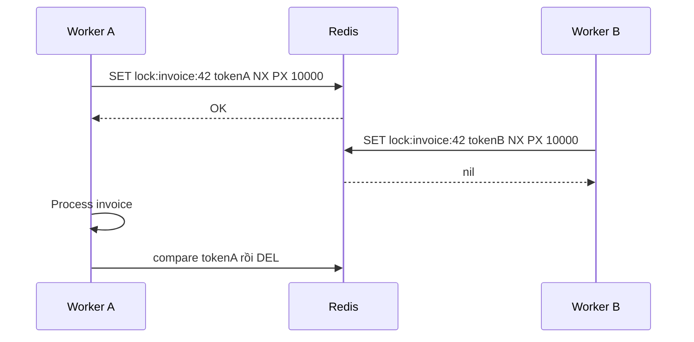
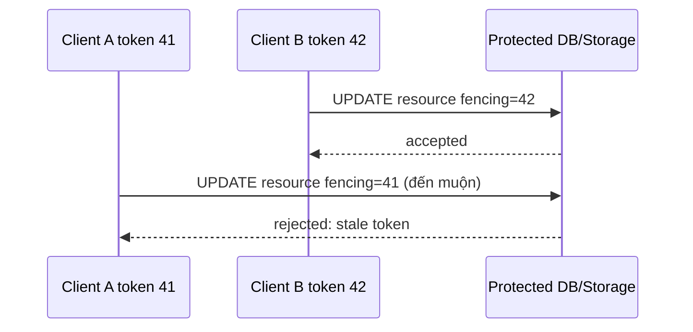

# Distributed Lock

## Mục lục

- [1. Vấn đề: nhiều process cùng vào critical section](#1-vấn-đề-nhiều-process-cùng-vào-critical-section)
- [2. Lock đúng cần những thuộc tính nào](#2-lock-đúng-cần-những-thuộc-tính-nào)
- [3. Primitive chuẩn: SET NX PX với token ngẫu nhiên](#3-primitive-chuẩn-set-nx-px-với-token-ngẫu-nhiên)
- [4. Safe release bằng compare-and-delete](#4-safe-release-bằng-compare-and-delete)
- [5. Lease expiry: process pause lâu hơn TTL](#5-lease-expiry-process-pause-lâu-hơn-ttl)
- [6. Renewal và watchdog](#6-renewal-và-watchdog)
- [7. Fencing token: bảo vệ tài nguyên phía sau](#7-fencing-token-bảo-vệ-tài-nguyên-phía-sau)
- [8. Retry, backoff, fairness và thundering herd](#8-retry-backoff-fairness-và-thundering-herd)
- [9. Failover và giới hạn của một Redis primary](#9-failover-và-giới-hạn-của-một-redis-primary)
- [10. Redlock: thuật toán, giả định và tranh luận](#10-redlock-thuật-toán-giả-định-và-tranh-luận)
- [11. Redis Cluster, Sentinel và managed Redis](#11-redis-cluster-sentinel-và-managed-redis)
- [12. Pattern thực tế](#12-pattern-thực-tế)
- [13. Khi lock không phải giải pháp tốt nhất](#13-khi-lock-không-phải-giải-pháp-tốt-nhất)
- [14. Implementation TypeScript end-to-end](#14-implementation-typescript-end-to-end)
- [15. Observability, testing và runbook](#15-observability-testing-và-runbook)
- [16. Anti-patterns và checklist production](#16-anti-patterns-và-checklist-production)
- [17. Tóm tắt decision table](#17-tóm-tắt-decision-table)
- [Tài liệu tham khảo](#tài-liệu-tham-khảo)

---

## 1. Vấn đề: nhiều process cùng vào critical section

Ba worker cùng nhận job “đóng invoice tháng 6” vì broker delivery lại. Nếu cả ba cùng chạy:

```text
Worker A ─┐
Worker B ─┼──> đọc trạng thái OPEN ──> tạo 3 invoice / gửi 3 email
Worker C ─┘
```

Distributed lock cố gắng đảm bảo tại một thời điểm chỉ một owner được vào critical section cho một resource.



Nhưng lock không tự biến side effect thành exactly-once. Process có thể gửi email xong rồi chết trước khi ghi “đã gửi”. Vì vậy lock thường phải đi cùng unique constraint, idempotency key hoặc state machine durable.

---

## 2. Lock đúng cần những thuộc tính nào

### 2.1. Safety, liveness và fault tolerance

| Thuộc tính | Câu hỏi |
|------------|---------|
| Mutual exclusion | Có bao giờ hai owner cùng nghĩ mình giữ lock? |
| Deadlock freedom | Owner chết thì lock có tự được giải phóng? |
| Ownership | Owner A có thể xóa lock của B không? |
| Bounded validity | Sau bao lâu owner phải coi lease hết hiệu lực? |
| Fault tolerance | Redis/process/network lỗi thì điều gì xảy ra? |
| Fencing | Resource có từ chối owner cũ đến muộn không? |

Không có lock distributed “miễn phí” trong mọi failure model. Trước khi chọn Redis, hãy phân loại hậu quả:

- **Efficiency lock**: duplicate chỉ tốn CPU/email có thể dedupe; occasional overlap chấp nhận được.
- **Correctness lock**: overlap gây mất tiền, ghi đè dữ liệu, vi phạm an toàn. Cần fencing/transaction/consensus mạnh hơn.

### 2.2. Lock là lease, không phải quyền sở hữu vĩnh viễn

Redis lock có TTL thực chất là **lease**: quyền tạm thời đến deadline. Client không thể chắc mình vẫn là owner chỉ vì chưa chạy unlock; nó có thể pause, mất network hoặc lock hết hạn và owner khác đã lấy.

---

## 3. Primitive chuẩn: SET NX PX với token ngẫu nhiên

```bash
SET lock:order:8812 7f3a... NX PX 10000
```

- `NX`: chỉ set khi key chưa tồn tại.
- `PX 10000`: lease 10 giây, tự cleanup nếu owner chết.
- Value là token unique cho **mỗi lần acquire**, không phải worker ID cố định.

Response:

- `OK`: acquire thành công.
- `nil`: lock đang được giữ.

### 3.1. Tại sao một command

Anti-pattern cũ:

```bash
SETNX lock:key token
EXPIRE lock:key 10
```

Nếu process chết sau `SETNX` trước `EXPIRE`, lock không có TTL và kẹt vĩnh viễn. `SET ... NX PX` gộp điều kiện + expiry atomically.

### 3.2. Token

Token nên có đủ entropy, ví dụ UUID v4/CSPRNG 128 bit. Nó phân biệt lease A với lease B của cùng process:

```text
Worker-1 acquire lần 1: token abc
lease abc hết hạn
Worker-2 acquire: token xyz
Worker-1 tỉnh lại không được xóa xyz
```

Không dùng value cố định `locked`, PID hay hostname làm ownership token.

### 3.3. Chọn TTL

```text
TTL > p99 critical-section time + network delay + pause margin
```

TTL quá ngắn gây overlap; quá dài làm recovery chậm khi owner chết. Nếu công việc không bounded, chia nhỏ thành bước idempotent hoặc renewal có deadline; không đặt TTL một giờ rồi hy vọng.

---

## 4. Safe release bằng compare-and-delete

Sai:

```bash
DEL lock:order:8812
```

Race:

```text
T0 A acquire tokenA, TTL 10s
T11 A bị pause; lock hết hạn
T12 B acquire tokenB
T13 A tỉnh và DEL → xóa lock của B
T14 C acquire → B và C cùng chạy
```

Đúng: chỉ xóa nếu value vẫn là token của mình.

```lua
-- KEYS[1] lock key, ARGV[1] owner token
if redis.call('GET', KEYS[1]) == ARGV[1] then
  return redis.call('DEL', KEYS[1])
end
return 0
```

Gọi bằng `EVALSHA`/Redis Function. `GET` rồi `DEL` ở client vẫn race vì key có thể đổi giữa hai command.

Release result `0` nghĩa là lock đã hết hạn, mất ownership hoặc key bị xóa. Không retry bằng `DEL` mù. Ghi metric `lost_ownership`.

> [!IMPORTANT]
> Safe release ngăn owner cũ xóa lock mới; nó **không ngăn owner cũ tiếp tục ghi vào database** sau khi lease hết hạn. Fencing token giải quyết lớp đó.

---

## 5. Lease expiry: process pause lâu hơn TTL

Timeline nguy hiểm dù acquire/release đúng:

```text
T0 A acquire lease tokenA TTL=10s
T1 A đọc dữ liệu
T2 A bị stop-the-world GC / VM pause 15s
T10 lease hết hạn
T11 B acquire và cập nhật resource
T17 A tỉnh, vẫn chạy code cũ và cập nhật resource
```

Trong khoảng sau T11, A và B đều thực thi logic. A có thể không biết lease đã mất vì không có network call trong lúc pause. Kiểm tra `GET token` trước write cũng có race giữa check và write nếu resource là database khác.

Do đó:

- TTL không chứng minh mutual exclusion tuyệt đối khi client pause.
- Renewal không giúp trong lúc process không được schedule.
- Correctness-critical resource cần **fencing token được resource kiểm tra**, hoặc transaction/constraint tại resource.

Các nguyên nhân pause:

- GC stop-the-world.
- Container CPU starvation.
- VM suspend/live migration.
- Event loop blocked.
- Network partition trong khi process vẫn thao tác resource khác.

---

## 6. Renewal và watchdog

Nếu critical section có thể lâu hơn initial TTL, owner định kỳ gia hạn **chỉ khi token còn khớp**:

```lua
if redis.call('GET', KEYS[1]) == ARGV[1] then
  return redis.call('PEXPIRE', KEYS[1], tonumber(ARGV[2]))
end
return 0
```

### 6.1. Chu kỳ

Với TTL 30 giây, renew mỗi 10 giây là ví dụ phổ biến. Cần margin cho p99 Redis latency/pause. Nếu renew trả 0 hoặc timeout đến mức không chắc lease còn hợp lệ:

1. Đánh dấu `lost=true`.
2. Ngừng bắt đầu side effect mới.
3. Hủy công việc nếu có thể.
4. Resource write vẫn phải dùng fencing/idempotency.

### 6.2. Watchdog không phải phép màu

Watchdog chạy cùng process có thể pause cùng process. Thread riêng giảm event-loop block nhưng không chống VM pause. Renewal vô hạn cũng có thể giữ lock mãi khi business task treo nhưng heartbeat thread vẫn sống. Đặt:

- Max total lease duration.
- Task deadline/cancellation.
- Progress watchdog.
- Alert lock held quá lâu.

### 6.3. Release trong `finally`

Luôn release best-effort trong `finally`, nhưng chỉ sau khi mọi side effect/child async thực sự kết thúc. Không “fire-and-forget” task rồi thoát scope và release sớm.

---

## 7. Fencing token: bảo vệ tài nguyên phía sau

Fencing token là số tăng đơn điệu cấp mỗi lần acquire: 41, 42, 43... Resource chỉ chấp nhận write có token lớn hơn token cuối đã thấy.



Database pattern:

```sql
UPDATE jobs
SET result = :result, fencing_token = :token
WHERE id = :id AND fencing_token < :token;
```

Kiểm tra affected rows; `0` nghĩa token stale. Hoặc transaction `SELECT ... FOR UPDATE` + compare.

### 7.1. Cấp token

Lua acquire có thể `INCR` counter khi lock thành công:

```lua
-- KEYS[1] lock, KEYS[2] fencing counter; ARGV token, ttl
if redis.call('EXISTS', KEYS[1]) == 1 then return {0, false} end
local fence = redis.call('INCR', KEYS[2])
redis.call('PSETEX', KEYS[1], tonumber(ARGV[2]), ARGV[1])
return {1, fence}
```

Trong Cluster hai key phải cùng slot. Counter phải có durability/monotonicity qua failover; nếu rollback counter từ 100 về 95, token mới có thể thấp hơn resource đã thấy và bị reject. Có thể để database cấp fencing sequence, hoặc dùng coordinator có monotonic guarantee phù hợp.

### 7.2. Fencing chỉ hiệu quả khi resource enforce

Gắn token vào log mà database/S3/external API không kiểm tra thì không bảo vệ. Với external API không hỗ trợ fencing, dùng idempotency key/state machine/unique constraint hoặc tránh Redis lock cho correctness-critical action.

---

## 8. Retry, backoff, fairness và thundering herd

Khi lock bận, không loop `SET NX` liên tục.

```typescript
sleep = random(0, min(cap, base * 2 ** attempt));
```

Dùng deadline và cancellation:

```text
tryAcquire(lock, waitTimeout=2s, lease=10s)
```

Nếu hết wait timeout, trả conflict/requeue thay vì giữ request vô hạn.

### 8.1. Không công bằng

Redis `SET NX` không đảm bảo FIFO. Client retry đúng lúc có thể thắng dù đến sau. Nếu fairness là requirement, cần queue/ticket:

- Redis List/Stream làm hàng đợi worker.
- Sorted Set ticket + notification, nhưng cleanup/cancel phức tạp.
- Database advisory/row lock với semantics phù hợp.

### 8.2. Pub/Sub notification

Có thể publish khi unlock để waiter thức sớm, nhưng Pub/Sub có thể mất message. Waiter vẫn phải timeout/backoff và retry `SET NX`; notification chỉ là optimization, không là correctness mechanism.

---

## 9. Failover và giới hạn của một Redis primary

Redis replication thường asynchronous:

```text
T1 Client A SET lock trên primary P
T2 P trả OK nhưng write chưa tới replica R
T3 P chết
T4 R promote, không có lock
T5 Client B SET lock trên R → OK
→ A và B đều nghĩ giữ lock
```

`WAIT` giảm xác suất bằng cách chờ replica acknowledge, nhưng không tạo linearizable consensus/commit tuyệt đối; acknowledge replication không nhất thiết đồng nghĩa durable, và failover policy vẫn quan trọng.

Một Redis primary lock thường phù hợp **efficiency lock** khi occasional duplicate có thể được idempotency/constraint xử lý. Với correctness nghiêm ngặt, dùng fencing và source transaction, hoặc coordinator consensus như ZooKeeper/etcd/Consul theo requirement.

---

## 10. Redlock: thuật toán, giả định và tranh luận

Redlock cố tránh single-primary failover race bằng N Redis master độc lập, thường N=5.

### 10.1. Acquire

1. Ghi cùng resource/token vào từng master bằng `SET NX PX`, timeout từng node ngắn.
2. Thành công nếu acquire được đa số, ví dụ 3/5, và tổng thời gian nhỏ hơn TTL.
3. Validity xấp xỉ `TTL - elapsed - clockDriftMargin`.
4. Nếu thất bại, compare-delete trên mọi node đã acquire.

Release gửi compare-delete đến tất cả master.

```text
Client ─┬─ Redis A ✓
        ├─ Redis B ✓     3/5 + trong validity → acquire
        ├─ Redis C ✓
        ├─ Redis D ✗
        └─ Redis E ✗
```

### 10.2. Redlock không tự giải quyết stale client

Dù quorum acquire tốt hơn single failover, client vẫn có thể pause quá validity rồi tiếp tục write. Fencing vẫn là lớp mạnh nhất khi resource hỗ trợ.

### 10.3. Tranh luận kỹ thuật

Redlock phụ thuộc giả định về bounded clock drift, timing, node independence và network. Các phân tích phê bình chỉ ra lease-based lock không đủ cho correctness trong asynchronous system nếu không có fencing/resource validation. Redis documentation mô tả algorithm và safety arguments; cộng đồng distributed systems khuyến nghị thận trọng cho correctness-critical use cases.

Cách quyết định thực dụng:

| Tình huống | Lựa chọn |
|------------|----------|
| Tránh hai worker rebuild cache | Single Redis lease đủ, task idempotent |
| Tránh duplicate cron có thể retry | Single lease + DB unique/idempotency |
| Ghi state quan trọng có resource support | Lease + fencing token |
| Mutual exclusion là điều kiện an toàn cứng | Consensus coordinator/DB transaction + fencing |
| Không vận hành được 5 master độc lập | Đừng giả Redlock bằng 5 replica của cùng cluster |

Năm node Redlock phải là failure domain độc lập; 5 replica chung primary/failover không tương đương 5 master độc lập.

---

## 11. Redis Cluster, Sentinel và managed Redis

- **Sentinel** tự động failover nhưng vẫn có async replication race nêu trên.
- **Cluster** shard key; một lock key nằm một slot/primary. Cluster không biến single-key lock thành quorum lock.
- Hash tag giúp lock và fencing counter cùng slot: `lock:{order:8812}`, `fence:{order:8812}`.
- Managed Redis có topology/failover semantics riêng; đọc SLA và persistence, không suy luận chỉ từ API tương thích.

Khi reshard, client library phải xử lý `MOVED`/`ASK`; Lua multi-key cần same slot. Không đọc lock từ replica.

---

## 12. Pattern thực tế

### 12.1. Chống duplicate cron

```text
acquire lock:cron:daily-report:2026-07-10
→ insert job row UNIQUE(job_type, business_date)
→ enqueue job idempotently
→ release
```

Unique constraint là correctness; Redis lock giảm tranh chấp/duplicate work.

### 12.2. Cache rebuild mutex

Miss hot key → một owner load DB, waiter backoff/read lại. Lease ngắn, serve stale khi loader lỗi. Đây là efficiency lock điển hình; xem [Caching Patterns](./caching-patterns.md).

### 12.3. Inventory reservation

Không chỉ `lock sku → GET stock → DECR`. Tốt hơn:

- Atomic SQL `UPDATE inventory SET qty=qty-1 WHERE sku=? AND qty>0`.
- Hoặc Redis Lua atomic nếu Redis là authoritative reservation store, kèm durable event/persistence.
- Idempotency theo order ID.

Lock quanh read-modify-write thường yếu hơn atomic operation tại chính data store.

### 12.4. Leader election

Redis lease có thể chọn một leader tạm thời, nhưng leader phải ngừng side effect khi mất lease và dùng fencing. Với control plane/critical orchestration, consensus system thường phù hợp hơn.

---

## 13. Khi lock không phải giải pháp tốt nhất

| Bài toán | Primitive tốt hơn |
|----------|-------------------|
| Không tạo duplicate order | DB unique constraint/idempotency key |
| Trừ stock nếu còn | Atomic conditional update/Lua |
| Chia job cho worker | Queue/Redis Streams consumer group |
| Serialize theo aggregate | Partitioned log theo aggregate key |
| Update concurrent ít conflict | Optimistic version/CAS |
| Chỉ một scheduler chạy | Platform leader election + idempotent job |
| Exactly-once side effect | Durable state machine + idempotent receiver |

Distributed lock thêm failure states: acquire timeout không rõ, lease expiry, renewal, stale owner, failover. Nếu atomic primitive của resource giải quyết trực tiếp, ưu tiên primitive đó.

---

## 14. Implementation TypeScript end-to-end

```typescript
import { randomUUID } from 'node:crypto';

const RELEASE = `
if redis.call('GET', KEYS[1]) == ARGV[1] then
  return redis.call('DEL', KEYS[1])
end
return 0`;

const EXTEND = `
if redis.call('GET', KEYS[1]) == ARGV[1] then
  return redis.call('PEXPIRE', KEYS[1], ARGV[2])
end
return 0`;

async function withRedisLease<T>(
  resource: string,
  leaseMs: number,
  fn: (ctx: { token: string; assertValid: () => void }) => Promise<T>,
): Promise<T> {
  const key = `lock:v2:${resource}`;
  const token = randomUUID();
  const acquired = await redis.set(key, token, { NX: true, PX: leaseMs });
  if (acquired !== 'OK') throw new Error('LOCK_BUSY');

  let lost = false;
  const interval = setInterval(async () => {
    try {
      const renewed = await redis.eval(EXTEND, {
        keys: [key],
        arguments: [token, String(leaseMs)],
      });
      if (renewed !== 1) lost = true;
    } catch {
      // Nếu không chứng minh được lease còn hiệu lực, coi như đã mất.
      lost = true;
    }
  }, Math.floor(leaseMs / 3));

  interval.unref?.();

  try {
    return await fn({
      token,
      assertValid: () => {
        if (lost) throw new Error('LOCK_LOST');
      },
    });
  } finally {
    clearInterval(interval);
    const released = await redis.eval(RELEASE, {
      keys: [key],
      arguments: [token],
    }).catch(() => 0);
    if (released !== 1) metrics.increment('lock.release_not_owner');
  }
}
```

Đây vẫn chưa đủ cho correctness-critical write vì `assertValid()` có race/pause. Truyền fencing token vào database condition mới đóng lỗ hổng stale owner. Production còn cần acquire retry deadline, cached scripts/Functions, tracing và cancellation.

---

## 15. Observability, testing và runbook

### 15.1. Metrics

| Metric | Ý nghĩa |
|--------|---------|
| acquire success/busy/error | Contention và availability |
| acquire wait time | User/job latency |
| hold duration | TTL sizing, task treo |
| renew success/failure | Lease health |
| release not owner | TTL quá ngắn, pause hoặc bug |
| fencing rejected | Stale owner thật sự xảy ra |
| concurrent critical sections | Assertion quan trọng trong test/canary |

Không log token đầy đủ; hash/redact. Key/resource ID có thể là PII/cardinality cao, sample cẩn thận.

### 15.2. Test

- 1.000 contenders, chỉ một vào section tại một thời điểm trong môi trường không fault.
- Owner crash: lock tự hết TTL.
- Pause owner lâu hơn TTL: owner mới thắng; stale write bị fencing reject.
- Redis response timeout sau `SET`: client không biết acquire thành công; không chạy critical section nếu không có bằng chứng.
- Unlock owner cũ không xóa owner mới.
- Renewal timeout/failure.
- Primary failover ngay sau acquire.
- Clock skew/pause với Redlock nếu dùng.

### 15.3. Runbook contention

1. Xem holder duration và business task latency.
2. Kiểm tra lock granularity có quá rộng không.
3. Không xóa lock thủ công trừ khi hiểu owner/fencing; xóa có thể tạo overlap.
4. Nếu task treo nhưng watchdog renew, cancel task/watchdog qua control plane.
5. Xác minh downstream unique/idempotency trước khi retry job.

---

## 16. Anti-patterns và checklist production

### 16.1. Anti-patterns

1. `SETNX` rồi `EXPIRE` hai command.
2. Value cố định `locked`.
3. Unlock bằng `DEL` không compare token.
4. TTL không dựa trên p99/pause.
5. Renewal vô hạn cho task treo.
6. Tin rằng safe unlock ngăn stale owner write.
7. Đọc lock từ replica.
8. Coi Sentinel/Cluster replication là consensus lock.
9. Gọi 5 replica cùng topology là Redlock.
10. Dùng lock thay unique constraint/atomic conditional update.
11. Không idempotency cho side effect.
12. Busy-loop khi lock bận.

### 16.2. Checklist

- [ ] Phân loại efficiency hay correctness lock.
- [ ] Acquire bằng `SET NX PX` một command.
- [ ] Token unique mỗi acquire.
- [ ] Release/renew compare token atomically.
- [ ] TTL và max task deadline có số liệu.
- [ ] Retry có backoff, jitter và wait deadline.
- [ ] Critical write có fencing/constraint/idempotency.
- [ ] Failover semantics được chấp nhận và test.
- [ ] Cluster keys cùng slot nếu script multi-key.
- [ ] Metrics lost ownership/fencing rejection.
- [ ] Chaos test crash, pause, partition, failover.
- [ ] Có phương án không dùng lock đã được cân nhắc.

---

## 17. Tóm tắt decision table

| Mức yêu cầu | Thiết kế gợi ý |
|-------------|----------------|
| Giảm duplicate work | Single Redis lease + idempotent task |
| Cache stampede | Lease ngắn + waiter backoff + stale fallback |
| Side effect quan trọng | Lease + fencing + durable idempotency |
| Atomic update một store | Dùng transaction/CAS/Lua của chính store |
| Coordination an toàn cứng | Consensus coordinator/DB primitive phù hợp |

Ba nguyên tắc:

1. **Redis lock là lease có hạn**, owner có thể mất quyền mà không biết ngay.
2. **Token bảo vệ unlock; fencing token bảo vệ resource khỏi owner cũ** — hai thứ khác nhau.
3. **Lock giảm concurrency, không tạo exactly-once**; correctness cuối cùng thường nằm ở unique constraint, idempotency và state machine.

---

## Tài liệu tham khảo

- [Redis: Distributed locks with Redis](https://redis.io/docs/latest/develop/clients/patterns/distributed-locks/)
- [Redis command: SET](https://redis.io/docs/latest/commands/set/)
- [Martin Kleppmann: How to do distributed locking](https://martin.kleppmann.com/2016/02/08/how-to-do-distributed-locking.html)
- [Lua Scripting](./lua-scripting.md)
- [Redis Sentinel](./sentinel.md)
- [Redis Cluster](./cluster.md)
