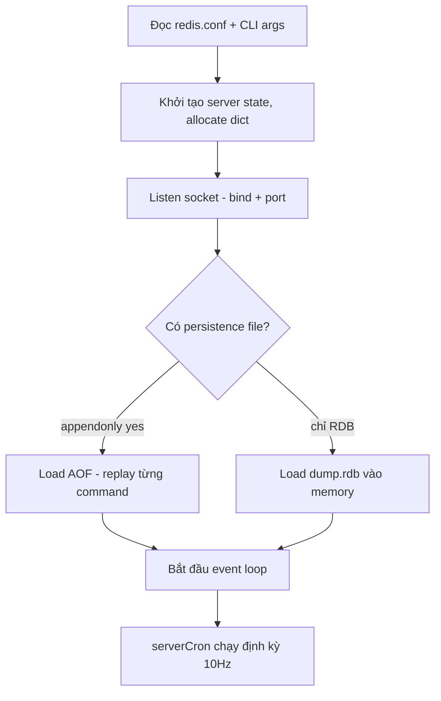

# Installation & Setup

## Mục lục

- [Tổng quan](#tổng-quan)
- [1. Cài đặt](#1-cài-đặt)
- [2. redis.conf — các config quan trọng](#2-redisconf--các-config-quan-trọng)
- [3. Redis khởi động như thế nào](#3-redis-khởi-động-như-thế-nào)
- [4. Kernel & OS tuning](#4-kernel--os-tuning)
- [5. Kết nối lần đầu & smoke test](#5-kết-nối-lần-đầu--smoke-test)
- [6. So sánh các cách cài đặt](#6-so-sánh-các-cách-cài-đặt)
- [Tài liệu tham khảo](#tài-liệu-tham-khảo)

---

## Tổng quan

Redis là một binary duy nhất (`redis-server`) đọc một file config (`redis.conf`). Không có external dependency, không cần JVM hay runtime — cài đặt rất nhẹ. Điều quan trọng không nằm ở bước cài, mà ở **hiểu các config ảnh hưởng đến hành vi runtime**: memory limit, persistence, network binding, và OS tuning.

```
redis-server ──đọc──▶ redis.conf
     │
     ├── bind/port         → lắng nghe ở đâu
     ├── maxmemory/policy  → hành vi khi đầy RAM
     ├── save/appendonly   → persistence
     └── requirepass/ACL   → security
```

---

## 1. Cài đặt

### 1.1 Docker (khuyến nghị cho dev)

```bash
# Chạy nhanh nhất
docker run -d --name redis -p 6379:6379 redis:7.4

# Với config riêng + persistence volume
docker run -d --name redis \
  -p 6379:6379 \
  -v $(pwd)/redis.conf:/usr/local/etc/redis/redis.conf \
  -v redis-data:/data \
  redis:7.4 redis-server /usr/local/etc/redis/redis.conf

# Redis Stack (kèm RedisJSON, RediSearch, RedisInsight UI ở port 8001)
docker run -d --name redis-stack -p 6379:6379 -p 8001:8001 redis/redis-stack:latest
```

docker-compose cho project:

```yaml
services:
  redis:
    image: redis:7.4
    ports:
      - "6379:6379"
    command: redis-server --maxmemory 256mb --maxmemory-policy allkeys-lru
    volumes:
      - redis-data:/data
    healthcheck:
      test: ["CMD", "redis-cli", "ping"]
      interval: 5s
volumes:
  redis-data:
```

### 1.2 apt (Ubuntu/Debian)

```bash
# Repo chính thức của Redis (bản mới hơn distro repo)
sudo apt-get install lsb-release curl gpg
curl -fsSL https://packages.redis.io/gpg | sudo gpg --dearmor -o /usr/share/keyrings/redis-archive-keyring.gpg
echo "deb [signed-by=/usr/share/keyrings/redis-archive-keyring.gpg] https://packages.redis.io/deb $(lsb_release -cs) main" \
  | sudo tee /etc/apt/sources.list.d/redis.list
sudo apt-get update && sudo apt-get install redis

sudo systemctl enable --now redis-server
```

### 1.3 Build từ source

```bash
wget https://download.redis.io/redis-stable.tar.gz
tar xzf redis-stable.tar.gz && cd redis-stable
make            # thêm BUILD_TLS=yes nếu cần TLS
make test       # optional
sudo make install   # copy binaries vào /usr/local/bin
```

Build từ source cho ra các binary: `redis-server`, `redis-cli`, `redis-benchmark`, `redis-sentinel` (symlink của redis-server), `redis-check-rdb`, `redis-check-aof`.

---

## 2. redis.conf — các config quan trọng

Config có thể đặt trong file, truyền qua command line (`redis-server --port 6380`), hoặc đổi runtime bằng `CONFIG SET` (đa số directive). `CONFIG REWRITE` ghi ngược thay đổi runtime vào file.

### 2.1 Network

```bash
bind 127.0.0.1 -::1     # CHỈ listen loopback (mặc định) — đổi khi cần remote access
port 6379
protected-mode yes      # từ chối remote connection khi không có password + bind mặc định
tcp-backlog 511         # queue TCP connection đang chờ accept
timeout 0               # 0 = không đóng idle client
tcp-keepalive 300       # gửi TCP keepalive mỗi 300s để phát hiện dead peer
```

> [!IMPORTANT]
> `protected-mode` là lớp bảo vệ cuối: nếu bind ra `0.0.0.0` mà không đặt password, Redis từ chối mọi connection từ bên ngoài. **Không bao giờ** tắt protected-mode + bind public IP mà không có AUTH — xem [Security](./security.md).

### 2.2 Memory

```bash
maxmemory 2gb                    # 0 = không giới hạn (nguy hiểm trên production)
maxmemory-policy allkeys-lru     # hành vi khi chạm maxmemory
maxmemory-samples 5              # số key lấy mẫu cho LRU/LFU approximation
```

Không đặt `maxmemory` → Redis ăn RAM đến khi OOM killer của Linux giết process. Chi tiết các policy: [Eviction Policies](./eviction-policies.md).

### 2.3 Persistence

```bash
# RDB: snapshot khi thỏa điều kiện "sau <giây> có ít nhất <số> thay đổi"
save 3600 1 300 100 60 10000
dir /var/lib/redis          # nơi lưu dump.rdb và appendonlydir/
dbfilename dump.rdb

# AOF
appendonly yes
appendfsync everysec        # always | everysec | no
```

Cơ chế chi tiết: [RDB Snapshots](./rdb.md), [AOF](./aof.md), chọn strategy: [Persistence Strategies](./persistence-strategies.md).

### 2.4 Security

```bash
requirepass "s3cr3t-long-password"   # password đơn giản (user default)
# Hoặc ACL đầy đủ (Redis 6+):
user app on >app-password ~app:* +@read +@write -@dangerous
rename-command FLUSHALL ""           # cách cũ để vô hiệu command nguy hiểm
```

### 2.5 Limits & misc

```bash
maxclients 10000
databases 16              # số logical DB (SELECT 0-15); Cluster chỉ có DB 0
loglevel notice
logfile /var/log/redis/redis.log
```

---

## 3. Redis khởi động như thế nào

Hiểu boot sequence giúp debug lỗi khởi động:



Điểm cần biết:

1. **AOF được ưu tiên hơn RDB** khi cả hai tồn tại (AOF thường mới hơn)
2. Load dữ liệu **block hoàn toàn** — dataset 20GB có thể mất vài phút, trong lúc đó Redis từ chối connection (`LOADING Redis is loading the dataset in memory`)
3. `serverCron` là "nhịp tim" của Redis: active expire, incremental rehash, trigger BGSAVE theo `save` rules, tính toán metrics

---

## 4. Kernel & OS tuning

Redis cảnh báo ngay trong log khởi động nếu OS chưa tune. Ba cảnh báo kinh điển:

### 4.1 `vm.overcommit_memory`

```bash
sudo sysctl vm.overcommit_memory=1
echo "vm.overcommit_memory = 1" | sudo tee -a /etc/sysctl.conf
```

**Vì sao:** khi `BGSAVE` fork, child process về lý thuyết cần bằng đúng lượng memory của parent. Với `overcommit_memory=0` (heuristic), kernel có thể từ chối fork dù thực tế copy-on-write chỉ cần một phần nhỏ → BGSAVE fail với "Cannot allocate memory".

### 4.2 Transparent Huge Pages (THP)

```bash
echo never | sudo tee /sys/kernel/mm/transparent_hugepage/enabled
```

**Vì sao:** THP dùng page 2MB thay vì 4KB. Khi fork + copy-on-write, một write nhỏ khiến kernel copy cả page 2MB → latency spike lớn và memory usage tăng vọt trong lúc BGSAVE.

### 4.3 `net.core.somaxconn`

```bash
sudo sysctl net.core.somaxconn=511
```

**Vì sao:** `tcp-backlog 511` trong redis.conf bị kernel cắt xuống `somaxconn` (mặc định cũ 128) → connection burst bị drop.

> [!TIP]
> Với Docker, các sysctl này set ở **host**, không phải trong container.

---

## 5. Kết nối lần đầu & smoke test

```bash
redis-cli ping                    # → PONG
redis-cli -h host -p 6379 -a password ping

# Smoke test cơ bản
redis-cli SET hello world         # → OK
redis-cli GET hello               # → "world"
redis-cli TTL hello               # → -1 (không có TTL)
redis-cli INFO server | head -5   # version, mode, os

# Kiểm tra config runtime
redis-cli CONFIG GET maxmemory
redis-cli CONFIG SET maxmemory 512mb   # đổi ngay không cần restart
```

Kiểm tra warnings trong log khởi động:

```bash
docker logs redis 2>&1 | grep -i warning
# hoặc
grep -i warning /var/log/redis/redis.log
```

Làm quen thêm các lệnh khảo sát: [Redis CLI](./redis-cli.md).

---

## 6. So sánh các cách cài đặt

| Tiêu chí | Docker | apt/yum | Source build | Managed (ElastiCache, Redis Cloud) |
|----------|--------|---------|--------------|-----------------------------------|
| Tốc độ setup | Nhanh nhất | Nhanh | Chậm | Trung bình |
| Version control | Chọn tag chính xác | Theo repo | Bất kỳ | Theo provider |
| Production phù hợp | Có (k8s, compose) | Có (systemd) | Khi cần custom build (TLS, modules) | Có — vận hành tối thiểu |
| OS tuning | Set ở host | Trực tiếp | Trực tiếp | Provider lo |
| Chi phí vận hành | Tự quản lý | Tự quản lý | Tự quản lý | Trả phí, ít việc |

**Khi nào dùng Docker:** dev/test, CI, k8s production.
**Khi nào dùng managed:** production không muốn tự vận hành failover/backup/patching.

---

## Tài liệu tham khảo

- [Redis installation docs](https://redis.io/docs/latest/operate/oss_and_stack/install/)
- [redis.conf mẫu đầy đủ (self-documented)](https://raw.githubusercontent.com/redis/redis/unstable/redis.conf)
- [Redis CLI](./redis-cli.md) — bước tiếp theo
- [Security](./security.md) — hardening trước khi mở ra network
