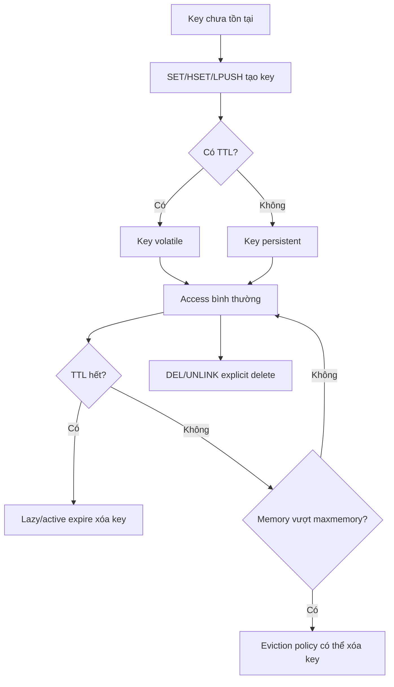

# Keys, Naming & TTL

## Mục lục

- [Tổng quan](#tổng-quan)
- [Key trong Redis là gì?](#key-trong-redis-là-gì)
- [Thiết kế key naming convention](#thiết-kế-key-naming-convention)
- [Namespace bằng dấu hai chấm](#namespace-bằng-dấu-hai-chấm)
- [Key length: dài bao nhiêu là hợp lý?](#key-length-dài-bao-nhiêu-là-hợp-lý)
- [TTL là gì?](#ttl-là-gì)
- [Các command TTL quan trọng](#các-command-ttl-quan-trọng)
- [TTL hoạt động bên trong Redis như thế nào?](#ttl-hoạt-động-bên-trong-redis-như-thế-nào)
- [TTL và write command: khi nào TTL bị mất?](#ttl-và-write-command-khi-nào-ttl-bị-mất)
- [TTL design cho cache](#ttl-design-cho-cache)
- [TTL jitter và cache stampede](#ttl-jitter-và-cache-stampede)
- [Key lifecycle: từ tạo đến xóa](#key-lifecycle-từ-tạo-đến-xóa)
- [Hot key](#hot-key)
- [Big key](#big-key)
- [SCAN thay vì KEYS](#scan-thay-vì-keys)
- [Key design trong Redis Cluster](#key-design-trong-redis-cluster)
- [Naming patterns theo use case](#naming-patterns-theo-use-case)
- [Monitoring và debug keyspace](#monitoring-và-debug-keyspace)
- [Best practices](#best-practices)
- [Checklist thiết kế key production](#checklist-thiết-kế-key-production)
- [Tài liệu liên quan](#tài-liệu-liên-quan)

---

## Tổng quan

Incident hay gặp: cache “phình” vì `SET product:1 ...` ghi đè làm **mất TTL**; hoặc một key session JSON phình + `KEYS user:*` lúc debug làm p99 nhảy. Trong Redis, **key design + TTL** là nền tảng của gần như mọi thứ — không chỉ “đặt tên cho đẹp”.

Ba pha của doc này:

| Pha | Nội dung |
|-----|----------|
| **A. Key design** | Key là gì, naming, length, namespace |
| **B. TTL engine & cache design** | Commands, lazy/active expire, `SET` mất TTL, jitter/stampede |
| **C. Operational hazards** | Hot key, big key, SCAN, Cluster hash tags |

Ảnh hưởng trực tiếp:

- Performance, memory, TTL correctness.
- Debuggability, Cluster sharding, operational safety.

Redis nhìn bên ngoài giống key-value store đơn giản:

```bash
SET user:123:name "Hiep"
GET user:123:name
```

Nhưng trong production, việc đặt key sai có thể gây hậu quả lớn:

- Key không TTL làm cache phình mãi.
- Key quá hot làm một Redis instance quá tải.
- Key quá lớn làm `DEL`, replication, AOF/RDB chậm.
- Naming không có namespace gây conflict.
- Hash tag sai trong Cluster làm hot slot.
- Dùng `KEYS *` để tìm key làm block Redis.

> [!IMPORTANT]
> Redis performance không chỉ phụ thuộc command. Nó phụ thuộc rất mạnh vào **key cardinality**, **key size**, **TTL strategy**, **data structure bên dưới key**, và **access pattern**.

---

## Key trong Redis là gì?

Key là định danh duy nhất trỏ tới một value trong Redis database.

```text
key → value
```

Value có thể là:

- String
- Hash
- List
- Set
- Sorted Set
- Stream
- Bitmap trên String
- HyperLogLog trên String-like structure
- Geospatial trên Sorted Set

Ví dụ:

```bash
SET session:abc "{user_id:123}"
HSET user:123 name "Hiep" plan "pro"
LPUSH queue:email job-1
SADD post:9:likes user:123
ZADD leaderboard 999 user:123
```

### Key là binary-safe

Redis key là binary-safe string. Về kỹ thuật key có thể chứa bytes bất kỳ. Nhưng trong thực tế nên dùng key text dễ đọc để vận hành:

```text
Tốt: user:123:profile
Xấu: \x00\x9f\x88... nếu không có lý do rất đặc biệt
```

### Key nằm trong database Redis

Redis standalone mặc định có nhiều logical databases (`0..15`), chọn bằng `SELECT`. Tuy nhiên:

- Redis Cluster chỉ hỗ trợ DB 0.
- Production hiện đại thường tránh dùng nhiều logical DB để giảm nhầm lẫn.
- Namespace trong key thường rõ ràng hơn `SELECT` DB.

---

## Thiết kế key naming convention

Một convention tốt nên đảm bảo:

1. Dễ đọc khi debug.
2. Có namespace rõ.
3. Có định danh ổn định.
4. Có thể scan theo prefix khi cần.
5. Không quá dài gây tốn memory.
6. Tương thích Redis Cluster nếu sau này migrate.

Pattern phổ biến:

```text
<domain>:<entity>:<id>:<attribute>
```

Ví dụ:

```text
user:123:profile
user:123:sessions
product:456:cache
order:789:status
rate:user:123:minute:202607081030
lock:order:789
```

### Nên dùng lowercase nhất quán

```text
Tốt:
user:123:profile

Không nhất quán:
User:123:Profile
USER:123:profile
```

Redis key case-sensitive. `User:1` và `user:1` là hai key khác nhau.

### Tránh ký tự gây khó vận hành

Nên tránh key chứa whitespace, newline hoặc ký tự control.

```text
Không nên:
"user 123 profile"
"user\n123"
```

### Có version khi schema có thể đổi

Nếu format value thay đổi lớn:

```text
user:123:profile:v1
user:123:profile:v2
```

Hoặc đặt version ở namespace:

```text
v2:user:123:profile
```

Điều này giúp rollout/rollback dễ hơn.

---

## Namespace bằng dấu hai chấm

Dấu `:` không có ý nghĩa đặc biệt với Redis server. Nó chỉ là convention. Nhưng tooling và con người rất dễ đọc.

```text
service:domain:entity:id:field
```

Ví dụ trong microservice:

```text
auth:session:abc
catalog:product:123
payment:idempotency:charge:xyz
rate:ip:1.2.3.4:minute:202607081030
```

### Namespace theo service

Nếu nhiều service dùng chung Redis, prefix service giúp tránh conflict:

```text
user-service:user:123:profile
order-service:order:789:cache
```

### Namespace theo environment

Không nên để dev/staging/prod dùng cùng Redis. Nhưng nếu bắt buộc:

```text
prod:user:123
staging:user:123
```

Tốt hơn vẫn là tách Redis instance/database theo environment.

### Namespace theo tenant

Multi-tenant:

```text
tenant:acme:user:123:profile
tenant:globex:user:123:profile
```

Nếu dùng Redis Cluster, cần cẩn thận hash tag. Không phải lúc nào cũng nên dùng `{tenant}` vì tenant lớn có thể tạo hot slot.

---

## Key length: dài bao nhiêu là hợp lý?

Redis cho phép key rất dài, nhưng key dài tốn memory và bandwidth.

So sánh:

```text
u:123:p
user:123:profile
user-service:production:tenant:acme:user:123:profile-cache-json-v2
```

Key quá ngắn khó debug. Key quá dài tốn memory.

### Trade-off

| Key style | Ưu điểm | Nhược điểm |
|----------|---------|------------|
| Rất ngắn `u:1:p` | Tiết kiệm memory | Khó đọc, dễ nhầm |
| Vừa phải `user:1:profile` | Dễ đọc, đủ gọn | Tốn hơn key ngắn chút |
| Rất dài | Rõ context | Tốn memory/bandwidth, noise khi debug |

### Memory overhead của key dài

Nếu có 100 triệu keys, thêm 20 bytes/key là khoảng:

```text
100,000,000 × 20 bytes = ~2 GB raw bytes
```

Chưa tính allocator/object overhead.

> [!TIP]
> Với số lượng key nhỏ/vừa, ưu tiên readability. Với hàng chục/hàng trăm triệu keys, key length trở thành chi phí thật.

---

## TTL là gì?

**TTL** là thời gian sống còn lại của key. Khi TTL hết, key được coi là expired và Redis sẽ xóa nó.

Ví dụ:

```bash
SET session:abc '{"user_id":123}' EX 1800
TTL session:abc
```

TTL rất quan trọng cho:

- Cache.
- Session.
- Token/OTP.
- Rate limiting window.
- Temporary locks.
- Idempotency keys.
- Deduplication keys.

Key không TTL sẽ tồn tại cho đến khi bị xóa, bị evict, hoặc Redis mất dữ liệu/restart tùy persistence.

### TTL theo giây và millisecond

Redis hỗ trợ TTL giây và millisecond:

```bash
EXPIRE key 60       # 60 giây
PEXPIRE key 60000   # 60000 ms
```

Trong `SET`:

```bash
SET key value EX 60
SET key value PX 60000
```

### TTL tuyệt đối

Redis cũng hỗ trợ expire tại timestamp:

```bash
EXPIREAT key 1783529999
PEXPIREAT key 1783529999123
```

---

## Các command TTL quan trọng

### Set key với TTL atomic

Nên dùng:

```bash
SET session:abc value EX 1800
```

Thay vì:

```bash
SET session:abc value
EXPIRE session:abc 1800
```

Vì nếu app crash giữa `SET` và `EXPIRE`, key sẽ không có TTL.

### Kiểm tra TTL

```bash
TTL key
PTTL key
```

Kết quả `TTL`:

| Kết quả | Ý nghĩa |
|---------|---------|
| `> 0` | Còn từng đó giây |
| `-1` | Key tồn tại nhưng không có TTL |
| `-2` | Key không tồn tại |

### Xóa TTL

```bash
PERSIST key
```

Key vẫn tồn tại nhưng trở thành persistent key.

### Đặt TTL có điều kiện

Redis hỗ trợ option cho `EXPIRE`:

```bash
EXPIRE key 60 NX   # chỉ set TTL nếu key chưa có TTL
EXPIRE key 60 XX   # chỉ set TTL nếu key đã có TTL
EXPIRE key 60 GT   # chỉ set nếu TTL mới lớn hơn TTL hiện tại
EXPIRE key 60 LT   # chỉ set nếu TTL mới nhỏ hơn TTL hiện tại
```

Rất hữu ích để tránh vô tình kéo dài hoặc rút ngắn TTL sai.

### GETEX

`GETEX` đọc value và đồng thời set TTL mới:

```bash
GETEX session:abc EX 1800
```

Phù hợp sliding session expiration.

### SET với NX/XX và TTL

```bash
SET lock:order:123 token NX PX 30000
```

Ý nghĩa:

- Chỉ set nếu key chưa tồn tại.
- TTL 30 giây.
- Atomic trong một command.

Dùng cho lock/idempotency/rate limit tùy pattern.

---

## TTL hoạt động bên trong Redis như thế nào?

Redis không có một timer riêng cho từng key. Nếu có 100 triệu key TTL, tạo 100 triệu timer sẽ rất tốn.

Hai cấu trúc liên quan (process model đầy đủ hơn ở [Redis Architecture](./redis-architecture.md)):

```text
keyspace dict ──▶ key → value (redisObject)
expires dict  ──▶ key → expire_at (ms absolute)
```

Hai cơ chế dọn:

1. **Lazy expiration** — check khi đụng key.
2. **Active expiration** — `serverCron` ~**10Hz** lấy mẫu trong time budget.

### Lazy expiration

```text
GET session:abc
→ lookup key trong keyspace dict
→ lookup expire_at trong expires dict
→ nếu expired: xóa cả hai entry, trả nil
→ nếu chưa: trả value
```

Ưu điểm: rẻ, không timer per-key. Nhược: key hết hạn nhưng không ai đọc có thể còn chiếm RAM.

### Active expiration

```text
serverCron (~ mỗi 100ms)
→ sample ngẫu nhiên keys trong expires dict
→ xóa key đã hết hạn
→ nếu % expired cao → sample thêm, vẫn trong time limit mỗi chu kỳ
```

Active expire dọn key “mồ côi” không ai truy cập. Chu kỳ ~10Hz + time budget → **không** xóa hết mọi key expired trong một nhịp; memory có thể giảm trễ vài ms đến vài giây tùy volume.

### Hệ quả thực tế

```text
T0:          TTL logic hết hạn (GET đã trả nil nếu lazy hit)
T0 + Δ:      active expire mới xóa key idle → used_memory mới giảm
```

Với workload nhiều key TTL ngắn, active expire tốn CPU trên main thread. Monitor `expired_keys`, latency, và xem [Slow Log & Latency](./slow-log-latency.md).

> [!TIP]
> String-specific pitfalls (`SET` mất TTL, `KEEPTTL`) nằm ngay section sau. Deep-dive encoding/SDS không thuộc Keys — xem [Strings](./strings.md).

---

## TTL và write command: khi nào TTL bị mất?

Đây là lỗi rất phổ biến.

### SET làm mất TTL cũ

Nếu key đang có TTL:

```bash
SET cache:user:1 old EX 300
TTL cache:user:1
# 300
```

Sau đó:

```bash
SET cache:user:1 new
TTL cache:user:1
# -1
```

`SET` mặc định thay value và xóa TTL cũ.

Nếu muốn giữ TTL, dùng `KEEPTTL`:

```bash
SET cache:user:1 new KEEPTTL
```

Hoặc set TTL mới rõ ràng:

```bash
SET cache:user:1 new EX 300
```

### Mutate data structure thường giữ TTL

Các command sửa value bên trong data structure thường không xóa TTL của key.

Ví dụ:

```bash
HSET user:1 name Hiep
EXPIRE user:1 300
HSET user:1 age 28
TTL user:1
# TTL vẫn còn
```

Tương tự `LPUSH`, `SADD`, `ZADD` thường giữ TTL key.

### RENAME giữ TTL

`RENAME` chuyển key và TTL sang tên mới.

### RESTORE/SET có thể thay TTL tùy option

Khi import/migrate key, cần đọc kỹ option TTL/REPLACE/ABSTTL.

> [!IMPORTANT]
> Với cache, luôn set value và TTL trong cùng command nếu có thể: `SET key value EX seconds`. Tránh `SET` rồi `EXPIRE` riêng nếu không có transaction/Lua.

---

## TTL design cho cache

TTL cache không chỉ là “đặt 5 phút”. TTL là quyết định product + performance + consistency.

### TTL ngắn

| Ưu điểm | Nhược điểm |
|---------|------------|
| Dữ liệu ít stale | Cache miss nhiều hơn |
| Ít giữ dữ liệu cũ | Tăng tải DB/backend |
| Giảm memory | Dễ stampede nếu nhiều key hết hạn cùng lúc |

### TTL dài

| Ưu điểm | Nhược điểm |
|---------|------------|
| Hit rate cao | Dữ liệu stale lâu hơn |
| Giảm tải backend | Cần invalidation tốt hơn |
| Ổn định hơn | Memory giữ lâu hơn |

### Chọn TTL theo loại dữ liệu

| Dữ liệu | TTL gợi ý | Lý do |
|---------|-----------|-------|
| Feature flags | 30s - 5m | Cần cập nhật tương đối nhanh |
| Product catalog | 5m - 1h | Ít thay đổi, stale thường chấp nhận được |
| User profile | 1m - 15m | Tùy yêu cầu consistency |
| Session | 15m - vài giờ | Theo policy login |
| OTP | 1m - 10m | Security requirement |
| Rate limit window | Theo window | 1 phút/1 giờ/ngày |
| Idempotency key | Vài giờ - vài ngày | Theo retry window |
| Lock | Rất ngắn, ms/s | Phòng deadlock |

### TTL theo business freshness

Đừng chọn TTL chỉ theo cảm tính. Hỏi:

```text
Dữ liệu stale tối đa bao lâu vẫn chấp nhận được?
Backend chịu được miss rate bao nhiêu?
Nếu cache key biến mất cùng lúc, hệ thống có chịu được không?
```

---

## TTL jitter và cache stampede

### Cache stampede là gì?

Nếu rất nhiều clients cùng request một key hot vừa expire, tất cả miss cache và cùng query DB.

```text
T0: product:123 expire
T1: 10,000 requests GET product:123
T2: 10,000 cache misses
T3: 10,000 DB queries
```

### TTL jitter

Thêm random vào TTL để tránh nhiều key expire cùng lúc.

Thay vì:

```text
TTL = 300s cho mọi product
```

Dùng:

```text
TTL = 300s + random(0..60s)
```

Ví dụ pseudo-code:

```js
const ttl = 300 + Math.floor(Math.random() * 60);
await redis.set(key, value, 'EX', ttl);
```

### Soft TTL + hard TTL

Pattern nâng cao:

```text
Value lưu kèm:
- data
- soft_expire_at
Redis TTL là hard TTL dài hơn
```

Khi soft TTL hết:

- Một request lấy lock refresh cache.
- Request khác vẫn dùng stale data ngắn hạn.

Giúp tránh stampede với key rất hot.

### Lock khi rebuild cache

```bash
SET lock:rebuild:product:123 token NX PX 10000
```

Chỉ client lấy được lock mới rebuild cache. Client khác chờ hoặc dùng stale value.

Đọc thêm [Caching Patterns](./caching-patterns.md), [Distributed Lock](./distributed-lock.md).

---

## Key lifecycle: từ tạo đến xóa

Một key có thể đi qua lifecycle:



### Các cách key biến mất

| Cách | Ví dụ |
|------|-------|
| Explicit delete | `DEL`, `UNLINK` |
| Expire | TTL hết |
| Eviction | `maxmemory-policy` xóa key |
| Overwrite | `SET` thay value, TTL có thể mất |
| Flush | `FLUSHDB`, `FLUSHALL` |
| Resync/failover edge cases | Replica full sync, data loss nếu persistence sai |

### Expire vs eviction

| Khái niệm | Khi nào xảy ra | Mục tiêu |
|----------|----------------|----------|
| Expire | Key TTL hết | Xóa theo thời gian sống |
| Eviction | Redis vượt `maxmemory` | Giải phóng memory |

Một key có TTL có thể bị evict trước khi TTL hết nếu memory đầy và policy cho phép.

---

## Hot key

**Hot key** là key nhận lượng request quá lớn so với key khác.

Ví dụ:

```text
product:iphone-latest
feature:global-config
leaderboard:global
rate:global
```

### Vì sao hot key nguy hiểm?

Redis execute command trên main thread. Nếu một key nhận quá nhiều QPS:

- Một Redis instance/shard có thể quá tải.
- Network output tăng mạnh nếu value lớn.
- Trong Cluster, slot chứa hot key thành hot slot.
- Replica đọc cũng có thể quá tải nếu route read về replica.

### Dấu hiệu hot key

- CPU một Redis node cao bất thường.
- Latency spike nhưng memory không đầy.
- Một cluster shard nóng hơn các shard khác.
- Key xuất hiện nhiều trong monitor/sampling/tracing.

### Cách xử lý hot key

| Cách | Khi dùng |
|------|----------|
| Local in-process cache | Dữ liệu nhỏ, read rất nhiều, stale ngắn chấp nhận được |
| Client-side caching | Muốn Redis gửi invalidation |
| Replicas for reads | Read-heavy, stale acceptable |
| Split key | Counter/list/set có thể partition |
| CDN/cache tầng trước | Public/static-ish data |
| Redesign data model | Hot aggregate quá lớn |

Ví dụ split counter:

```text
counter:video:123:shard:0
counter:video:123:shard:1
...
counter:video:123:shard:63
```

Write chọn random shard, read sum các shard.

---

## Big key

**Big key** là key có value quá lớn. “Lớn” tùy context, nhưng thường đáng nghi nếu:

- String vài MB trở lên.
- Hash/List/Set/ZSet có hàng trăm nghìn hoặc triệu phần tử.
- Stream quá dài không trim.

### Vì sao big key nguy hiểm?

| Vấn đề | Giải thích |
|--------|------------|
| Command chậm | `HGETALL`, `SMEMBERS`, `LRANGE 0 -1` trả cực nhiều data |
| Block main thread | Serialize response lớn mất thời gian |
| Network spike | Response nhiều MB |
| Delete chậm | `DEL` phải free nhiều memory |
| Replication nặng | Mutation lớn truyền sang replica |
| AOF/RDB lớn | Persistence và rewrite nặng hơn |
| Cluster imbalance | Một slot/node giữ object quá lớn |

### Cách phát hiện big key

```bash
redis-cli --bigkeys
redis-cli --memkeys
redis-cli MEMORY USAGE key
```

Cẩn thận khi dùng trên production lớn; chạy từ replica hoặc giờ thấp tải nếu có thể.

### Cách xử lý

- Chia key lớn thành nhiều key nhỏ.
- Dùng pagination/range.
- Trim streams/lists.
- Dùng `UNLINK` thay `DEL` khi xóa.
- Đặt size limit ở application.

Ví dụ chia Hash lớn:

```text
user-events:{user_id}:2026-07-08
user-events:{user_id}:2026-07-09
```

Thay vì một key chứa toàn bộ lịch sử.

---

## SCAN thay vì KEYS

`KEYS pattern` duyệt toàn bộ keyspace trong một command. Trên production lớn, nó có thể block Redis.

Không nên:

```bash
KEYS user:*
```

Nên dùng:

```bash
SCAN 0 MATCH user:* COUNT 1000
```

`SCAN` trả cursor để duyệt dần:

```text
SCAN cursor MATCH pattern COUNT n
→ next_cursor + keys
```

Ví dụ shell đơn giản:

```bash
cursor=0
while true; do
  result=$(redis-cli SCAN $cursor MATCH 'user:*' COUNT 1000)
  cursor=$(echo "$result" | head -n1)
  echo "$result" | tail -n +2
  [ "$cursor" = "0" ] && break
done
```

### Lưu ý về SCAN

- Không đảm bảo trả mỗi key đúng một lần trong lúc keyspace thay đổi.
- Có thể trả duplicate, app cần handle nếu quan trọng.
- `COUNT` là hint, không phải số key chắc chắn.
- Trong Cluster, cần scan từng master node.

---

## Key design trong Redis Cluster

Redis Cluster chia key theo hash slot:

```text
slot = CRC16(key) mod 16384
```

Mỗi key thuộc một slot. Multi-key command chỉ hoạt động nếu tất cả keys cùng slot.

### Hash tags

Nếu key có `{...}`, Redis chỉ hash phần bên trong.

```text
user:{123}:profile
user:{123}:cart
user:{123}:settings
```

Tất cả cùng slot vì hash tag là `123`.

### Khi nào dùng hash tag?

Dùng khi cần multi-key atomic cùng một aggregate:

```bash
MGET user:{123}:profile user:{123}:settings
```

Hoặc Lua/transaction trên nhiều keys cùng user/order.

### Khi nào không nên dùng hash tag?

Không dùng hash tag quá rộng:

```text
{global}:user:1
{global}:user:2
{global}:order:1
```

Toàn bộ keys dồn một slot, mất sharding.

### Tenant hash tag trade-off

```text
tenant:{acme}:user:1
tenant:{acme}:order:1
```

Ưu điểm: multi-key trong tenant dễ.

Nhược điểm: tenant lớn làm hot slot. Với tenant lớn, cân nhắc hash theo user/order thay vì tenant.

Đọc thêm [Redis Cluster](./cluster.md).

---

## Naming patterns theo use case

### Cache object

```text
cache:product:123
cache:user:123:profile
cache:search:v1:q:<hash>
```

Command:

```bash
SET cache:product:123 '<json>' EX 300
```

### Session

```text
session:<session-id>
```

Command:

```bash
SET session:abc '<json>' EX 1800
GETEX session:abc EX 1800
```

### Rate limiting

Fixed window:

```text
rate:user:123:minute:202607081030
rate:ip:1.2.3.4:hour:2026070810
```

Sliding log/window có thể dùng Sorted Set:

```text
rate:{user:123}:sliding
```

### Idempotency

```text
idempotency:payment:<request-id>
idempotency:order:<client-token>
```

```bash
SET idempotency:payment:abc processing NX EX 86400
```

### Distributed lock

```text
lock:order:123
lock:user:123:billing
```

```bash
SET lock:order:123 <random-token> NX PX 30000
```

### Leaderboard

```text
leaderboard:game:daily:20260708
leaderboard:game:weekly:2026W28
```

### Queue

```text
queue:email
queue:thumbnail
queue:payment-retry
```

### Stream

```text
stream:orders
stream:user-events
stream:audit:v1
```

### Feature flag/config

```text
config:feature-flags
config:service:checkout:v1
```

---

## Monitoring và debug keyspace

### Key count per DB

```bash
redis-cli INFO keyspace
```

Output:

```text
# Keyspace
db0:keys=100000,expires=80000,avg_ttl=123456
```

### TTL check

```bash
TTL key
PTTL key
```

Tìm key không TTL trong cache namespace cần scan và check TTL cẩn thận.

### Memory per key

```bash
MEMORY USAGE key
```

### Encoding

```bash
OBJECT ENCODING key
```

### Idle time/frequency

```bash
OBJECT IDLETIME key
OBJECT FREQ key
```

Tùy eviction policy/LFU config.

### Big keys

```bash
redis-cli --bigkeys
redis-cli --memkeys
```

### Hot keys

Nếu Redis bật LFU policy, có thể dùng:

```bash
redis-cli --hotkeys
```

Ngoài ra nên dùng metrics/tracing ở application để biết key nào được gọi nhiều.

---

## Best practices

### 1. Luôn có naming convention

Document convention trong repo/service:

```text
<service>:<domain>:<entity>:<id>:<attribute>
```

Hoặc convention ngắn hơn nhưng phải nhất quán.

### 2. Cache key nên có TTL

Nếu key là cache, mặc định nên có TTL.

```bash
SET cache:product:123 value EX 300
```

Không TTL chỉ khi bạn có invalidation rõ ràng và monitor memory tốt.

### 3. Set value + TTL atomic

Ưu tiên:

```bash
SET key value EX 60
```

Tránh:

```bash
SET key value
EXPIRE key 60
```

### 4. Dùng TTL jitter cho key nhiều/đồng loạt

```text
TTL = base + random(0..jitter)
```

Giảm stampede và expire storm.

### 5. Tránh big key từ đầu

Đặt giới hạn:

- Max list length.
- Max stream length hoặc `XTRIM`.
- Max set/hash/zset cardinality.
- Max string size.

### 6. Không dùng KEYS trong production

Dùng `SCAN`, hoặc tốt hơn là duy trì index/key registry nếu cần liệt kê.

### 7. Dùng UNLINK cho key lớn

```bash
UNLINK big:key
```

### 8. Thiết kế sẵn cho Cluster nếu có khả năng scale

Ngay cả khi hiện tại standalone, key naming nên không cản trở Cluster sau này.

- Tránh multi-key tùy tiện trên keys khác aggregate.
- Dùng hash tag có chủ đích.

### 9. Theo dõi keyspace và TTL coverage

Với cache namespace, nên biết:

- Tổng số keys.
- Tỷ lệ keys có TTL.
- Avg TTL.
- Evicted/expired rate.
- Hit/miss rate.

---

## Checklist thiết kế key production

### Naming

- [ ] Có prefix namespace rõ ràng.
- [ ] Dùng lowercase nhất quán.
- [ ] Không chứa whitespace/control chars.
- [ ] Không quá dài nếu cardinality lớn.
- [ ] Có version nếu value schema dễ thay đổi.

### TTL

- [ ] Cache keys có TTL.
- [ ] TTL được set atomic cùng value.
- [ ] TTL phù hợp freshness requirement.
- [ ] Có jitter cho key expire hàng loạt.
- [ ] Biết command nào làm mất TTL (`SET` không `KEEPTTL`).

### Size/access pattern

- [ ] Có giới hạn size cho List/Set/ZSet/Hash/Stream.
- [ ] Không có big key ngoài ý muốn.
- [ ] Hot key đã được đánh giá.
- [ ] Không dùng `KEYS` trong code production.
- [ ] Delete key lớn dùng `UNLINK`.

### Cluster readiness

- [ ] Multi-key operations dùng keys cùng slot hoặc được split.
- [ ] Hash tags không quá rộng.
- [ ] Tenant/user/order key design tránh hot slot.

### Operations

- [ ] Có metrics `INFO keyspace`.
- [ ] Có cách tìm big keys an toàn.
- [ ] Có alert memory/eviction/expired rate.
- [ ] Có runbook xóa namespace/key lớn an toàn.

---

## Tài liệu liên quan

- [Redis Overview](./redis-overview.md) - Tổng quan Redis và mental model.
- [Redis Architecture](./redis-architecture.md) - Keyspace dict, expires dict, event loop.
- [Caching Patterns](./caching-patterns.md) - Cache-aside, stampede, TTL strategies.
- [Eviction Policies](./eviction-policies.md) - `maxmemory` và eviction.
- [Memory Management](./memory-management.md) - Memory usage, encoding, fragmentation.
- [Rate Limiting](./rate-limiting.md) - Counter/window key patterns.
- [Session Store](./session-store.md) - Session TTL và sliding expiration.
- [Distributed Lock](./distributed-lock.md) - Lock key, TTL, fencing tokens.
- [Redis Cluster](./cluster.md) - Hash slots và hash tags.
- [Slow Log & Latency](./slow-log-latency.md) - Big key, hot key, command chậm.
