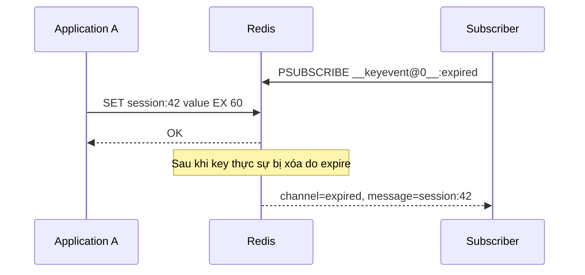
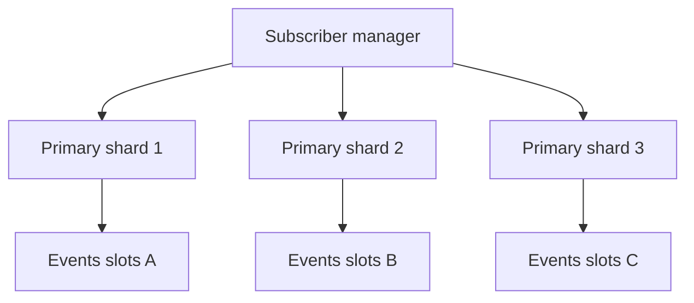
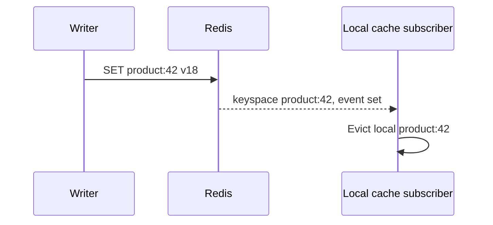

# Keyspace Notifications

## Mục lục

- [1. Vấn đề: biết key nào vừa thay đổi mà không polling](#1-vấn-đề-biết-key-nào-vừa-thay-đổi-mà-không-polling)
- [2. Mental model: Redis phát Pub/Sub signal sau mutation](#2-mental-model-redis-phát-pubsub-signal-sau-mutation)
- [3. Keyspace channel và keyevent channel](#3-keyspace-channel-và-keyevent-channel)
- [4. Cấu hình notify-keyspace-events](#4-cấu-hình-notify-keyspace-events)
- [5. Command tạo event như thế nào](#5-command-tạo-event-như-thế-nào)
- [6. Expired event không phải scheduler chính xác](#6-expired-event-không-phải-scheduler-chính-xác)
- [7. Evicted, expired, deleted và overwritten khác nhau](#7-evicted-expired-deleted-và-overwritten-khác-nhau)
- [8. Delivery semantics và reconnect gap](#8-delivery-semantics-và-reconnect-gap)
- [9. Redis Cluster, replica và nhiều database](#9-redis-cluster-replica-và-nhiều-database)
- [10. Pattern thực tế](#10-pattern-thực-tế)
- [11. Khi cần durable workflow](#11-khi-cần-durable-workflow)
- [12. Implementation subscriber production](#12-implementation-subscriber-production)
- [13. Security, ACL và dữ liệu nhạy cảm](#13-security-acl-và-dữ-liệu-nhạy-cảm)
- [14. Performance, capacity và observability](#14-performance-capacity-và-observability)
- [15. Testing và runbook](#15-testing-và-runbook)
- [16. Anti-patterns và checklist production](#16-anti-patterns-và-checklist-production)
- [17. Tóm tắt decision table](#17-tóm-tắt-decision-table)
- [Tài liệu tham khảo](#tài-liệu-tham-khảo)

---

## 1. Vấn đề: biết key nào vừa thay đổi mà không polling

Một service muốn biết session nào hết hạn, local cache nào cần xóa hoặc key nào bị eviction. Polling bằng `SCAN` vừa chậm vừa tạo tải:

```text
Mỗi 1 giây:
SCAN toàn keyspace → kiểm tra TTL/value → lặp lại
```

Keyspace Notifications cho Redis publish signal khi dataset thay đổi:



Các signal hữu ích cho observability, cache invalidation best-effort và automation có thể tự reconcile. Nhưng cơ chế dùng Redis Pub/Sub, nên subscriber offline sẽ mất event và không có replay.

> [!IMPORTANT]
> Keyspace notification là **ephemeral notification**, không phải Change Data Capture log, queue hay scheduler durable.

---

## 2. Mental model: Redis phát Pub/Sub signal sau mutation

Khi một command thực sự thay đổi key, Redis có thể phát một hoặc hai message tùy cấu hình:

```text
DEL mykey trên database 0

__keyspace@0__:mykey  → message "del"
__keyevent@0__:del    → message "mykey"
```

Signal chỉ cho biết **event type** và **key name**. Nó không tự chứa:

- Value trước khi thay đổi.
- Value sau khi thay đổi.
- User/client gây thay đổi.
- Transaction/business event ID.
- Durable offset.
- Guarantee consumer đã xử lý.

Nếu subscriber cần value mới, nó phải `GET` lại. Trong khoảng từ event đến `GET`, key có thể đổi lần nữa hoặc bị xóa; đây là state observation hiện tại, không phải snapshot tại thời điểm event.

### 2.1. Event chỉ phát khi data thực sự đổi

Ví dụ `SREM set member-khong-ton-tai` không sửa Set nên không tạo notification. Application không nên giả định “mỗi command gửi lên đều có event”.

### 2.2. Một command có thể tạo nhiều event

`HDEL` xóa field cuối có thể tạo `hdel` rồi thêm `del` vì Hash rỗng bị xóa. `XADD ... MAXLEN` có thể tạo `xadd` và `xtrim`. Consumer phải idempotent và hiểu event sequence theo command.

---

## 3. Keyspace channel và keyevent channel

### 3.1. Keyspace notification: theo key

```text
Channel: __keyspace@0__:product:42
Message: set
```

Dùng khi muốn theo dõi mọi operation trên một key/prefix:

```bash
PSUBSCRIBE '__keyspace@0__:product:*'
```

Subscriber nhận event type (`set`, `del`, `expire`, `hset`...).

### 3.2. Keyevent notification: theo event type

```text
Channel: __keyevent@0__:expired
Message: session:42
```

Dùng khi muốn theo dõi tất cả keys có cùng event:

```bash
PSUBSCRIBE '__keyevent@0__:expired'
PSUBSCRIBE '__keyevent@0__:evicted'
```

Subscriber nhận key name.

### 3.3. So sánh

| Nhu cầu | Loại |
|---------|------|
| Mọi operation trên `product:*` | Keyspace (`K`) |
| Mọi key hết hạn | Keyevent (`E` + `x`) |
| Mọi List push | Keyevent (`E` + `l`) |
| Debug một key cụ thể | Keyspace |
| Consumer xử lý theo event class | Keyevent |

Bật cả `K` và `E` tạo hai notifications cho một mutation, tăng traffic. Chỉ bật loại consumer thực sự cần.

### 3.4. Pattern channel syntax

Tên channel chứa database number và key. Pattern phải quote trong shell để `*` không bị shell expand:

```bash
redis-cli --csv PSUBSCRIBE '__keyevent@0__:expired'
redis-cli --csv PSUBSCRIBE '__keyspace@0__:cache:*'
```

---

## 4. Cấu hình notify-keyspace-events

Mặc định notifications tắt vì có CPU/network overhead.

```bash
CONFIG GET notify-keyspace-events
CONFIG SET notify-keyspace-events Ex
```

`Ex` nghĩa:

- `E`: bật keyevent channels.
- `x`: expired events.

### 4.1. Các flag quan trọng

| Flag | Nhóm event |
|------|------------|
| `K` | Keyspace channel |
| `E` | Keyevent channel |
| `g` | Generic: `DEL`, `EXPIRE`, `RENAME`... |
| `$` | String commands |
| `l` | List |
| `s` | Set |
| `h` | Hash |
| `z` | Sorted Set |
| `t` | Stream |
| `d` | Module/integrated data type events |
| `x` | Key expired |
| `e` | Key evicted bởi maxmemory |
| `m` | Key miss |
| `n` | New key |
| `o` | Overwritten |
| `c` | Type changed |
| `A` | Alias cho phần lớn class phổ biến, không gồm `m/n/o/c` |

Flag set có thể mở rộng theo phiên bản Redis. Luôn kiểm tra tài liệu version đang vận hành.

### 4.2. Ví dụ cấu hình

```text
Ex   → keyevent expired
Ege  → keyevent generic + evicted
KEA  → cả keyspace và keyevent cho nhóm A
K$l  → keyspace String + List
```

Ít nhất phải có `K` hoặc `E`; chỉ đặt `x` không phát gì.

### 4.3. CONFIG SET và persistence cấu hình

`CONFIG SET` thay đổi runtime. Việc có sống qua restart hay không phụ thuộc config management/`CONFIG REWRITE`/managed service. Production nên khai báo trong infrastructure configuration và verify sau restart/failover, không chỉ chạy tay một lần.

Managed Redis có thể cấm `CONFIG SET`; cấu hình qua parameter group/control plane.

### 4.4. Không bật `KEA` mặc định nếu chỉ cần expired

Bật mọi event tăng CPU, Pub/Sub traffic và nguy cơ lộ key names. Principle of least events: `Ex` cho expired, `Ee` cho evicted, thêm đúng class cần dùng.

---

## 5. Command tạo event như thế nào

### 5.1. Generic lifecycle

| Command/condition | Event điển hình |
|-------------------|-----------------|
| `SET` | `set`, có thể thêm `new`/`overwritten` theo config |
| `DEL` | `del` nếu key tồn tại |
| `EXPIRE` với future TTL | `expire` ngay lúc TTL được gắn/thay đổi |
| Key thực sự hết TTL | `expired` sau này |
| `PERSIST` thành công | `persist` |
| `RENAME` | `rename_from`, `rename_to` |
| Maxmemory loại key | `evicted` |

Đừng nhầm `expire` với `expired`:

```text
EXPIRE key 60
→ event "expire" lúc đặt TTL
... sau ít nhất khoảng 60 giây, khi Redis xóa key ...
→ event "expired"
```

Nếu `EXPIRE key -1` hoặc timestamp đã qua, Redis xóa ngay và tạo `del`, không phải `expired` theo semantics command.

### 5.2. Data structure events

| Cấu trúc | Ví dụ event |
|----------|-------------|
| String | `set`, `append`, `incrby`, `setrange` |
| Hash | `hset`, `hdel`, `hincrby`, `hexpired` trên version hỗ trợ field TTL |
| List | `lpush`, `rpush`, `lpop`, `ltrim` |
| Set | `sadd`, `srem`, `spop` |
| Sorted Set | `zadd`, `zincr`, `zrem`, `zrembyscore` |
| Stream | `xadd`, `xdel`, `xtrim`, consumer-group events |

Variadic command thường phát một event cho command, không một event cho mỗi member/field. Ví dụ `SADD key a b c` tạo một `sadd` event.

### 5.3. Collection trở thành rỗng

Nhiều operations xóa key khi phần tử cuối bị loại:

```text
LPOP list có 1 item
→ lpop
→ del
```

Consumer “xóa local cache khi del” phải chấp nhận event trước đó. Không giả một command = một notification.

### 5.4. Transaction và Lua

Commands trong `EXEC` hoặc Lua phát notifications theo effects của từng command. Subscriber chỉ nhận sau/qua Pub/Sub scheduling, không dùng notifications để quan sát trạng thái giữa atomic operation. Một batch có thể tạo burst nhiều events.

---

## 6. Expired event không phải scheduler chính xác

Redis xóa expired key bằng hai cơ chế:

1. **Passive/lazy expiration**: command truy cập key, Redis thấy TTL đã qua và xóa.
2. **Active expiration**: background cycle sampling keys có TTL và xóa dần.

`expired` event phát lúc Redis **thực sự xóa key**, không phải chính xác lúc TTL clock về 0.

```text
TTL deadline: 10:00:00.000
Redis phát expired: 10:00:00.120 hoặc muộn hơn
```

Độ trễ tùy load, số key TTL, active expiration và việc key có được truy cập. Không có SLA “đúng millisecond”.

### 6.1. Không dùng cho payment deadline chính xác

Anti-pattern:

```text
SET payment-timeout:order42 1 EX 900
subscriber expired → hủy order
```

Nếu subscriber offline, event mất; nếu expiration trễ, order hủy trễ; nếu state đã đổi sang PAID, event cũ có thể gây side effect sai nếu không recheck.

Thiết kế tốt hơn:

- Durable delayed queue/Sorted Set + worker claim.
- Redis Stream/broker scheduled message.
- Database deadline column + indexed poller.
- Khi wake-up, luôn compare current state/version atomically trước transition.

### 6.2. Dùng expired event như optimization

Có thể dùng để wake cleanup nhanh, nhưng thêm reconciliation sweep:

```text
notification → attempt cleanup idempotent
periodic scanner → tìm records quá deadline chưa cleanup
```

Correctness nằm ở source state + idempotent conditional transition, không nằm ở việc event chắc chắn đến.

---

## 7. Evicted, expired, deleted và overwritten khác nhau

| Event | Nguyên nhân | Ý nghĩa vận hành |
|-------|-------------|------------------|
| `expired` | TTL đã qua và Redis xóa | Lifecycle bình thường |
| `evicted` | maxmemory policy cần giải phóng RAM | Memory pressure, có thể là incident |
| `del` | Command chủ động hoặc immediate expiry semantics | Explicit lifecycle |
| `overwritten` | Value cũ bị thay bằng value mới | Data update |
| `type_changed` | Type key đổi | Có thể schema bug hoặc intentional replace |

### 7.1. Eviction không phải expiration

Nếu session key bị evict trước TTL, chỉ nghe `expired` sẽ không biết. Nhưng dùng notification để cứu state critical đã evict là quá muộn; session/lock không nên ở instance eviction-prone. Xem [Eviction Policies](./eviction-policies.md).

### 7.2. New/overwrite/type-change events

Các class `n/o/c` không nằm trong alias `A` theo tài liệu hiện tại. Phải bật explicit nếu cần. Chúng hữu ích observability/schema guard nhưng có thể tạo event volume rất lớn.

### 7.3. Key miss

Flag `m` có thể phát event khi truy cập key không tồn tại. Trên cache miss-heavy workload, event flood nhanh. Dùng application metrics/keyspace stats thường rẻ và giàu context hơn.

---

## 8. Delivery semantics và reconnect gap

Keyspace notifications dùng [Pub/Sub](./pub-sub.md), tức at-most-once/fire-and-forget:

```text
subscriber connected → nhận e1
network disconnect
Redis phát e2, e3 → mất
subscriber reconnect → chỉ nhận e4 trở đi
```

Không có:

- ACK.
- Pending list.
- Consumer group.
- Replay ID.
- Durable retention.
- Backpressure đến writer.

### 8.1. Slow subscriber

Nếu handler chậm, Redis client output buffer tăng và có thể disconnect subscriber. Event trong gap mất. Handler nên nhẹ, queue nội bộ bounded, metrics drop/reconnect và reconciliation.

### 8.2. Duplicate và idempotency

Semantics at-most-once từ Redis không có nghĩa application tuyệt đối không bao giờ thấy duplicate: reconnect logic, nhiều node subscriptions, topology overlap hoặc tự bridge có thể duplicate. Handler vẫn nên idempotent.

### 8.3. Đọc value sau event có race

```text
SET key v1 → event set
SET key v2 → event set
subscriber xử lý event đầu rồi GET → thấy v2
```

Notification là “key đã thay đổi”, không phải event sourcing delta. Pattern tốt là invalidate/reload latest state, không cố reconstruct mọi intermediate value.

---

## 9. Redis Cluster, replica và nhiều database

### 9.1. Cluster: node-specific

Mỗi Cluster node chỉ phát keyspace events cho subset keyspace của chính nó. Events không broadcast toàn cluster như global Pub/Sub. Muốn coverage toàn cluster, subscriber phải connect/subscribe **mọi relevant primary node**.



Topology thay đổi:

- Failover: primary mới cần subscription.
- Reshard: key chuyển node, event source chuyển.
- Scale out/in: refresh node list.
- Có thể có gap/overlap trong reconnection; reconciliation bắt buộc nếu quan trọng.

### 9.2. Replica

Notifications được tạo cục bộ theo operations node xử lý/apply và configuration. Đừng subscribe cả primary lẫn replicas rồi giả mỗi mutation đúng một event; có thể duplicate/semantics khác topology. Thông thường subscribe primaries cho mutation coverage và handle failover.

### 9.3. Database number

Channel chứa DB number:

```text
__keyevent@0__:expired
__keyevent@5__:expired
```

Standalone/Sentinel có multiple logical DB; Cluster chỉ hỗ trợ DB 0 trong thực tế Redis Cluster. Client phải subscribe đúng DB channel. Keyspace notifications khác client-side tracking, nơi tracking namespace behavior có nuance riêng.

### 9.4. Managed service

Kiểm tra:

- Có cho bật `notify-keyspace-events` không.
- Failover/subscription endpoint behavior.
- Cluster topology API.
- Config persistence qua maintenance.
- Pub/Sub/output buffer limits.

---

## 10. Pattern thực tế

### 10.1. Local cache invalidation best-effort



Safety net:

- Local max TTL.
- Clear cache on subscriber disconnect/reconnect.
- Versioned value.
- Client-side caching tracking thường efficient/chính xác hơn manual keyspace notifications nếu đúng use case; xem [Client-Side Caching](./client-side-caching.md).

### 10.2. Session cleanup

Expired event có thể xóa secondary index `user-sessions`, nhưng index cleanup phải idempotent và periodic reconcile vì event có thể mất. Không dùng event để quyết định security revoke duy nhất.

### 10.3. Monitoring eviction

Subscribe `__keyevent@0__:evicted` để sample key namespace bị eviction, nhưng production alert chính vẫn từ `INFO stats evicted_keys`, memory và policy. Event per-key có volume lớn khi eviction storm.

### 10.4. Search/index synchronization

Dùng keyspace notification để cập nhật external search index là yếu: loss làm index lệch, event không chứa old/new value. Tốt hơn transactional outbox/CDC/durable Stream. Notification chỉ có thể trigger best-effort reindex + periodic full reconcile.

### 10.5. Testing automation

Trong integration test, notification có thể xác minh Redis event behavior, nhưng test phải timeout và không giả deterministic exact expiration time.

---

## 11. Khi cần durable workflow

| Requirement | Keyspace notification | Alternative |
|-------------|-----------------------|-------------|
| Biết local cache nên bỏ key | Phù hợp với TTL safety net | Client-side caching tracking |
| Cleanup best-effort | Phù hợp + reconciliation | Periodic scanner |
| Mỗi order event phải xử lý | Không phù hợp | Streams/Kafka/outbox |
| Retry và dead-letter | Không có | Streams/broker |
| Replay sau downtime | Không có | Durable log |
| Audit old/new value | Không có | CDC/audit event |
| Deadline chính xác | Không đảm bảo | Delayed queue/DB scheduler |

### 11.1. Dual-write anti-pattern

```text
SET business state
mong notification tự biến thành durable event
```

Nếu consumer offline, event mất. Nếu cần state + event atomic trong Redis standalone/same slot, có thể Lua/transaction `SET` + `XADD`; nhưng durability vẫn theo Redis persistence. Nếu source là SQL, dùng transactional outbox.

### 11.2. Hybrid wake-up + durable state

Notification đánh thức worker nhanh; worker query durable table/Stream by cursor. Nếu signal mất, periodic poll vẫn bắt kịp. Đây là cách dùng Pub/Sub như optimization thay vì correctness foundation.

---

## 12. Implementation subscriber production

Node.js minh họa:

```typescript
import { createClient } from 'redis';

const subscriber = createClient({ url: process.env.REDIS_URL });
subscriber.on('error', (error) => {
  logger.error({ error }, 'keyevent subscriber error');
});

subscriber.on('reconnecting', () => {
  readiness.set('keyevents', false);
  localCache.clear(); // Có thể đã mất invalidations.
  metrics.increment('keyevents.reconnect');
});

await subscriber.connect();
await subscriber.pSubscribe('__keyevent@0__:expired', async (key, channel) => {
  try {
    if (!key.startsWith('session:v2:')) return;
    await cleanupSessionIndexIdempotently(key);
    metrics.increment('keyevents.processed', { event: 'expired' });
  } catch (error) {
    // Pub/Sub không retry. Ghi metric và để reconciliation sửa.
    logger.warn({ error, key, channel }, 'expired handler failed');
    metrics.increment('keyevents.handler_error');
  }
});
readiness.set('keyevents', true);
```

### 12.1. Handler design

- Filter prefix sớm.
- Không tin key name; validate length/format/tenant.
- Không thực hiện side effect non-idempotent trực tiếp.
- Bounded concurrency và queue.
- Error không crash subscription loop.
- Periodic reconciliation độc lập.
- Graceful shutdown unsubscribe/close.

### 12.2. Cluster subscriber manager

Cần discovery loop:

```text
refresh primaries
→ connect node mới + subscribe
→ mark ready khi mọi node covered
→ remove stale connection sau overlap ngắn
→ on disconnect, mark coverage degraded + reconcile
```

Client library có thể không tự subscribe keyevents trên mọi shard chỉ vì dùng cluster endpoint; integration test topology thật.

---

## 13. Security, ACL và dữ liệu nhạy cảm

Channel/message có key name. Nếu key chứa email, token, tenant ID hoặc PII, subscriber và logs có thể lộ dữ liệu.

- Không đưa secret/raw session token vào key naming từ đầu.
- Redis TLS/private network.
- ACL giới hạn Pub/Sub channel patterns (`&pattern` trong ACL model hiện đại) và commands.
- App subscriber không cần quyền `CONFIG SET`.
- Tách operator identity cấu hình và runtime subscriber identity.
- Redact/hash key trong logs/metrics.
- Không cho tenant subscribe wildcard `__key*__:*`.

Keyspace notification không chứa value, nhưng key name tự nó có thể sensitive. Xem [Security](./security.md).

---

## 14. Performance, capacity và observability

### 14.1. Cost model

Mỗi mutation có thể tạo 0, 1 hoặc 2+ notifications tùy config/event. Cost gồm:

- Detect/classify event.
- Pattern matching Pub/Sub subscriptions.
- Allocate/serialize message.
- Network fan-out tới subscribers.
- Client output buffer nếu chậm.

High-write Redis hàng trăm nghìn ops/s với `KEA` và nhiều subscribers có overhead đáng kể. Benchmark workload thật.

### 14.2. Metrics

| Metric | Nguồn/ý nghĩa |
|--------|---------------|
| `expired_keys` | INFO stats, số key expired |
| `evicted_keys` | Memory pressure |
| Pub/Sub clients/network out | Fan-out cost |
| Subscriber reconnect/gap | Reliability |
| Handler latency/error/drop | Consumer health |
| Reconciliation mismatch | Events bị mất/bug |
| Config value per node | Coverage/config drift |
| Cluster node coverage | Có shard chưa subscribe |

Không thể đo trực tiếp “bao nhiêu event đã mất khi offline” vì Pub/Sub không có offset. Dùng reconnect duration + reconciliation mismatch làm proxy.

### 14.3. Alert

- Evictions > 0 nếu workload không chấp nhận eviction.
- Subscriber disconnected/reconnecting kéo dài.
- Cluster coverage < 100%.
- Internal queue near capacity/drop.
- Handler/reconcile mismatch tăng.
- `notify-keyspace-events` drift sau failover/restart.

---

## 15. Testing và runbook

### 15.1. Test behavior

```bash
CONFIG SET notify-keyspace-events Ex
PSUBSCRIBE '__keyevent@0__:expired'
```

Terminal khác:

```bash
SET test:ttl value PX 100
```

Đợi event với timeout rộng; không assert đúng 100 ms.

Test thêm:

- `DEL` key tồn tại và không tồn tại.
- Collection xóa item cuối tạo event phụ.
- `EXPIRE` future vs past.
- Eviction trên isolated test instance.
- Subscriber disconnect trong lúc events phát.
- Handler duplicate/idempotency.
- Cluster failover/reshard/node add.
- Config restart persistence.

### 15.2. Runbook mất notifications

1. Xác minh config trên đúng node, gồm `K/E` + class.
2. Kiểm tra pattern/DB number.
3. Kiểm tra subscriber connection, ACL và output buffer disconnect.
4. Với Cluster, xác minh mọi primary covered.
5. Trigger full reconciliation/clear local cache.
6. Không cố replay từ Pub/Sub; nếu cần replay, migrate flow sang durable log.

### 15.3. Runbook event storm

1. Xác định event class/key prefix gây volume.
2. Giảm config từ `KEA` về flags tối thiểu.
3. Tắt/shed noncritical subscriber nếu output/network nguy hiểm.
4. Điều tra write/expire/eviction storm gốc.
5. Chuyển high-volume analytics sang metrics/Stream phù hợp.

---

## 16. Anti-patterns và checklist production

### 16.1. Anti-patterns

1. Dùng expired event làm scheduler chính xác/durable.
2. Dùng notification làm order/payment event bus.
3. Bật `KEA` không đo overhead.
4. Nhầm `expire` với `expired`.
5. Mong event chứa old/new value.
6. Subscriber reconnect không resync.
7. Chỉ subscribe một Cluster endpoint/node rồi nghĩ phủ toàn cluster.
8. Handler side effect không idempotent.
9. Đọc key sau event và coi value là snapshot lúc event.
10. Log raw sensitive key names.
11. Dựa vào event để phát hiện eviction thay vì monitor memory.
12. Không verify config sau restart/failover.

### 16.2. Checklist

- [ ] Use case chấp nhận at-most-once và không replay.
- [ ] Flags tối thiểu đã chọn.
- [ ] Phân biệt keyspace/keyevent và DB number.
- [ ] Expiration delay được chấp nhận.
- [ ] Reconnect luôn trigger resync/reconcile.
- [ ] Handler bounded, idempotent và có error metrics.
- [ ] Cluster coverage mọi primary.
- [ ] Key names không lộ secret/PII.
- [ ] ACL/TLS/private network.
- [ ] Overhead đã load test.
- [ ] Durable requirement dùng Stream/outbox/broker.
- [ ] Runbook event loss/storm/config drift tồn tại.

---

## 17. Tóm tắt decision table

| Nhu cầu | Cách dùng |
|---------|-----------|
| Theo dõi một key/prefix | Keyspace notifications (`K`) |
| Theo dõi mọi expired key | Keyevent `Ex` |
| Theo dõi eviction | Keyevent `Ee` + INFO metrics |
| Invalidate local cache | Notification + local TTL/resync, hoặc client tracking |
| Trigger cleanup best-effort | Notification + reconciliation |
| Durable business event | Stream/outbox/broker, không notification |
| Exact deadline | Scheduler/delayed queue + conditional state check |

Ba nguyên tắc:

1. **Notification phát khi Redis thực sự thay đổi/xóa key**, không nhất thiết đúng theoretical TTL deadline.
2. **Delivery kế thừa Pub/Sub: offline là mất**, nên state quan trọng phải reconcile.
3. **Trong Cluster, events là node-local**, subscriber phải quản lý toàn bộ topology.

---

## Tài liệu tham khảo

- [Redis Keyspace Notifications](https://redis.io/docs/latest/develop/pubsub/keyspace-notifications/)
- [Redis Pub/Sub](https://redis.io/docs/latest/develop/pubsub/)
- [EXPIRE](https://redis.io/docs/latest/commands/expire/)
- [Pub/Sub](./pub-sub.md)
- [Client-Side Caching](./client-side-caching.md)
- [Eviction Policies](./eviction-policies.md)
- [Streams](./streams.md)
