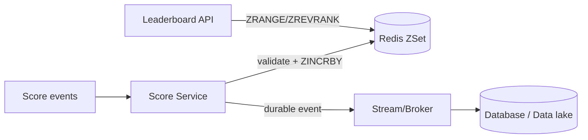
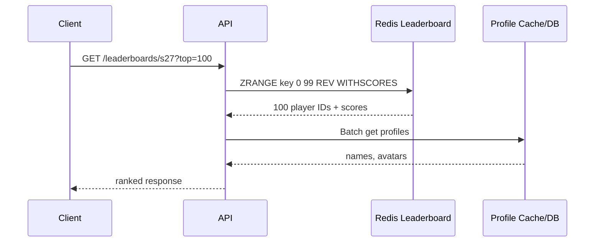
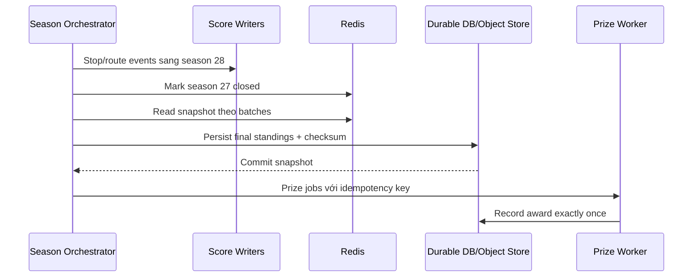
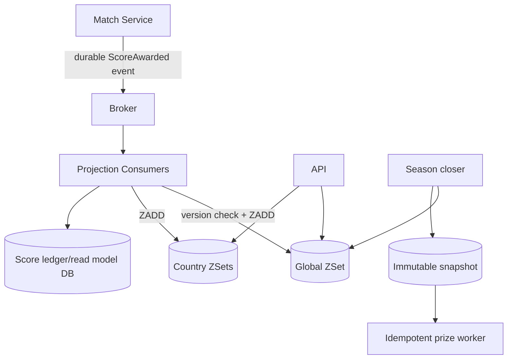

# Leaderboard & Counting

## Mục lục

- [1. Từ điểm số đến thứ hạng real-time](#1-từ-điểm-số-đến-thứ-hạng-real-time)
- [2. Data model leaderboard bằng Sorted Set](#2-data-model-leaderboard-bằng-sorted-set)
- [3. Ghi điểm: set, increment, maximum và idempotency](#3-ghi-điểm-set-increment-maximum-và-idempotency)
- [4. Đọc top N, rank và vùng xung quanh người chơi](#4-đọc-top-n-rank-và-vùng-xung-quanh-người-chơi)
- [5. Tie-breaking và giới hạn precision của score](#5-tie-breaking-và-giới-hạn-precision-của-score)
- [6. Leaderboard theo mùa, ngày, region và friend](#6-leaderboard-theo-mùa-ngày-region-và-friend)
- [7. Reset season, snapshot và phát thưởng](#7-reset-season-snapshot-và-phát-thưởng)
- [8. Leaderboard rất lớn và sharding](#8-leaderboard-rất-lớn-và-sharding)
- [9. Counting bằng String và Hash](#9-counting-bằng-string-và-hash)
- [10. Unique counting: Set, Bitmap và HyperLogLog](#10-unique-counting-set-bitmap-và-hyperloglog)
- [11. Time-bucket counter và rolling aggregation](#11-time-bucket-counter-và-rolling-aggregation)
- [12. Atomic multi-counter và event deduplication](#12-atomic-multi-counter-và-event-deduplication)
- [13. Consistency, persistence và rebuild](#13-consistency-persistence-và-rebuild)
- [14. Capacity, performance và observability](#14-capacity-performance-và-observability)
- [15. Case study: game leaderboard theo mùa](#15-case-study-game-leaderboard-theo-mùa)
- [16. Anti-patterns và checklist](#16-anti-patterns-và-checklist)
- [17. Tóm tắt và cheat sheet](#17-tóm-tắt-và-cheat-sheet)
- [Tài liệu tham khảo](#tài-liệu-tham-khảo)

---

## 1. Từ điểm số đến thứ hạng real-time

Một game có 10 triệu player. Mỗi trận cập nhật điểm và UI cần trả lời trong vài mili giây:

- Top 100 là ai?
- Player hiện tại đứng hạng bao nhiêu?
- 5 người ngay trên và dưới player?
- Top theo season, country và friend?

SQL có thể làm được, nhưng query rank liên tục trên bảng write-heavy thường đắt. Redis Sorted Set duy trì thứ tự ngay khi ghi:

```bash
ZINCRBY lb:season:27 35 player:88420
ZREVRANK lb:season:27 player:88420
ZRANGE lb:season:27 0 99 REV WITHSCORES
```

`ZINCRBY` và rank là O(log N); top N là O(log N + M) với M kết quả. Internals dict + skiplist được giải thích tại [Sorted Sets](./sorted-sets.md).



> [!IMPORTANT]
> Leaderboard là một **materialized view có thứ tự**. Nếu điểm là tài sản/nghiệp vụ quan trọng, phải có durable source để audit và rebuild; không mặc nhiên coi một ZSet là ledger duy nhất.

---

## 2. Data model leaderboard bằng Sorted Set

```text
key:    lb:{game42}:season:27:global
member: player:88420
score:  987654
```

Member unique; `ZADD` cùng member cập nhật score thay vì tạo bản ghi mới.

```bash
ZADD lb:{game42}:s27:global 987654 player:88420
ZSCORE lb:{game42}:s27:global player:88420
ZCARD lb:{game42}:s27:global
```

### 2.1. Chỉ lưu ID trong ZSet

Không nhét JSON profile làm member:

```text
Tốt: member = player:88420
Xấu: member = {"id":88420,"name":"Alice","avatar":"..."}
```

Profile thay đổi sẽ biến thành member mới và tạo duplicate logic; member dài cũng tốn memory. Lấy top IDs rồi batch `MGET`/pipeline Hash/profile cache.



### 2.2. Key dimensions

Mỗi dimension tạo thêm ZSet và write amplification:

```text
lb:{game42}:s27:global
lb:{game42}:s27:country:vn
lb:{game42}:s27:mode:solo
```

Không tạo key cho mọi combination động nếu không có query thực. Cardinality = seasons × regions × modes × cohorts; capacity trước khi fan-out mỗi score event.

---

## 3. Ghi điểm: set, increment, maximum và idempotency

### 3.1. Ba semantics khác nhau

| Nghiệp vụ | Command | Ý nghĩa |
|-----------|---------|---------|
| Điểm tổng mới là authoritative | `ZADD key score member` | Replace |
| Mỗi event cộng delta | `ZINCRBY key delta member` | Accumulate |
| Chỉ giữ best score | `ZADD key GT score member` | Update nếu score mới lớn hơn |
| Chỉ giữ best time thấp nhất | `ZADD key LT time member` | Update nếu nhỏ hơn |
| Chỉ tạo lần đầu | `ZADD key NX score member` | Không overwrite |

Đừng dùng `ZINCRBY` nếu event có thể delivery lại mà không dedupe; duplicate event cộng điểm hai lần.

### 3.2. Idempotent score event

Event:

```json
{
  "eventId": "match_991:player_88420",
  "playerId": "88420",
  "season": 27,
  "delta": 35
}
```

Lua dedupe + increment:

```lua
-- KEYS[1] leaderboard, KEYS[2] dedupe key cùng hash slot
-- ARGV[1] eventId, ARGV[2] delta, ARGV[3] member, ARGV[4] dedupeTtl
if redis.call('SISMEMBER', KEYS[2], ARGV[1]) == 1 then
  return {0, redis.call('ZSCORE', KEYS[1], ARGV[3])}
end
local score = redis.call('ZINCRBY', KEYS[1], ARGV[2], ARGV[3])
redis.call('SADD', KEYS[2], ARGV[1])
redis.call('EXPIRE', KEYS[2], ARGV[4])
return {1, score}
```

Một Set dedupe cho cả season có thể rất lớn. Các lựa chọn:

- Dedupe theo match/bucket với TTL.
- Database unique constraint cho event ledger.
- Producer gửi authoritative total + `ZADD`, tự nhiên idempotent nếu version không lùi.
- Lưu `lastEventVersion` per player và Lua chỉ áp dụng version mới hơn.

### 3.3. Không cho score lùi vì event out-of-order

Với authoritative score có version:

```text
player state Hash: score=900, version=18
incoming: score=950, version=19 → apply
incoming late: score=920, version=17 → ignore
```

Atomic Lua cập nhật Hash version và ZSet. Trong Cluster, keys phải cùng slot. Hoặc source DB xử lý ordering rồi phát projection update.

---

## 4. Đọc top N, rank và vùng xung quanh người chơi

### 4.1. Top và bottom

```bash
# Top 100, score cao đứng trước
ZRANGE lb:{game42}:s27:global 0 99 REV WITHSCORES

# Bottom 100
ZRANGE lb:{game42}:s27:global 0 99 WITHSCORES
```

Rank trả 0-based:

```bash
ZREVRANK lb:{game42}:s27:global player:88420
# 0 nghĩa hạng hiển thị 1
```

Một số phiên bản Redis mới hỗ trợ `WITHSCORE` trên rank command; để tương thích rộng, pipeline `ZREVRANK` + `ZSCORE`.

### 4.2. Around me

```typescript
async function aroundMe(key: string, player: string, radius = 5) {
  const rank = await redis.zRevRank(key, player);
  if (rank === null) return null;

  const start = Math.max(0, rank - radius);
  const stop = rank + radius;
  const rows = await redis.zRangeWithScores(key, start, stop, { REV: true });

  return rows.map((row, index) => ({
    rank: start + index + 1,
    playerId: row.value,
    score: row.score,
  }));
}
```

Race: score có thể thay đổi giữa `ZREVRANK` và `ZRANGE`, nên player có thể dịch vị trí. Nếu cần snapshot atomic, Lua chạy hai lệnh liền nhau; nhưng top/rank UI thường chấp nhận eventual movement. Pagination rank-based cũng có thể duplicate/skip khi score đổi.

### 4.3. Cursor và pagination

Offset lớn vẫn phải trả M entries nhưng Redis có thể đi theo rank hiệu quả nhờ skiplist. Tuy nhiên leaderboard thay đổi liên tục nên page 2 không phải snapshot của page 1. Các lựa chọn:

- Chấp nhận live pagination.
- Snapshot leaderboard vào key/version riêng tại mốc.
- Cursor theo `(score, member)` và xử lý tie cẩn thận.
- Chỉ cung cấp top + around-me thay vì duyệt toàn bộ.

---

## 5. Tie-breaking và giới hạn precision của score

### 5.1. Redis tie-break mặc định

Nếu hai member cùng score, Redis sắp xếp member theo thứ tự lexicographic byte. Điều này deterministic nhưng không nhất thiết đúng business rule “ai đạt điểm trước đứng trên”.

```bash
ZADD lb 100 alice 100 bob
# score bằng nhau: member quyết định thứ tự
```

### 5.2. Composite score

Có thể encode primary score và tie-break vào một số:

```text
composite = primaryScore × factor + tieComponent
```

Nhưng Redis score là IEEE-754 double, integer chỉ chính xác hoàn toàn đến `2^53` (9.007.199.254.740.992). Nếu composite vượt ngưỡng, hai giá trị có thể bị làm tròn thành cùng score.

Ví dụ muốn điểm cao hơn tốt hơn, timestamp sớm hơn tốt hơn:

```text
composite = points × 1_000_000 + (999_999 - sequenceWithinRange)
```

Chỉ an toàn nếu chứng minh max points × factor < 2^53 và tie range đủ. Không dùng epoch nanoseconds làm score rồi cộng dữ liệu khác.

### 5.3. Các lựa chọn tie-break

| Cách | Ưu | Nhược |
|------|----|-------|
| Member lexicographic | Miễn phí, deterministic | Không theo business |
| Composite score | Query top đơn giản | Precision/range phức tạp |
| Zero-pad tie data trong member | Lex order điều khiển được | Lookup/removal cần mapping member |
| Secondary DB sort | Chính xác tùy ý | Chậm/không hoàn toàn Redis |
| Đồng hạng | Đơn giản về fairness | Rank hiển thị cần group score |

Hãy định nghĩa rank kiểu **ordinal** (1,2,3), **competition** (1,2,2,4) hay **dense** (1,2,2,3). `ZREVRANK` cho ordinal position theo total order; đồng hạng business phải tính thêm.

---

## 6. Leaderboard theo mùa, ngày, region và friend

### 6.1. Time-scoped keys

```text
lb:{game42}:daily:2026-07-10
lb:{game42}:weekly:2026-W28
lb:{game42}:season:27
lb:{game42}:alltime
```

Mỗi event có thể cập nhật nhiều key bằng pipeline; pipeline không atomic giữa keys. Nếu một key lỗi, projection lệch. Với analytics có thể reconcile; với prize cần durable event/rebuild.

Set TTL sau khi period đóng cộng retention:

```bash
EXPIRE lb:{game42}:daily:2026-07-10 7776000  # giữ 90 ngày, ví dụ
```

Không đặt sliding TTL mỗi update nếu muốn key chắc chắn biến mất theo retention; tính `EXPIREAT` theo ngày đóng + retention.

### 6.2. Regional leaderboard

Country/region phải lấy từ authoritative profile/rules tại thời điểm nào? Nếu player đổi country giữa season:

- Giữ region lúc season bắt đầu.
- Move score từ old ZSet sang new ZSet atomically nếu cùng slot.
- Chỉ tính region khi query từ global (đắt nếu filter nhiều).

Business rule phải có trước data model.

### 6.3. Friend leaderboard

Không tạo một ZSet riêng cho mỗi user chứa toàn friend score; write fan-out theo số follower có thể bùng nổ. Thường:

1. Lấy danh sách friend IDs.
2. Pipeline `ZMSCORE global friend1 friend2 ...`.
3. Sort tập nhỏ ở application.

```bash
ZMSCORE lb:{game42}:s27:global player:1 player:2 player:3
```

Nếu user có hàng chục nghìn friend, paginate/cap hoặc precompute cho active cohorts.

### 6.4. Kết hợp leaderboard

`ZUNIONSTORE`/`ZINTERSTORE` tạo aggregate weighted. Không chạy union khổng lồ trên hot request; precompute async và đặt TTL/version. Trong Cluster, input/output phải cùng slot.

---

## 7. Reset season, snapshot và phát thưởng

### 7.1. Không `DEL` rồi tái dùng cùng key

Đổi season bằng namespace:

```text
current pointer: game:42:current-season = 28
old: lb:{game42}:season:27
new: lb:{game42}:season:28
```

Writer xác định season từ config/event, không chỉ pointer cache có thể stale. Key cũ immutable sau close để audit.

### 7.2. Close season flow



Không phát thưởng trực tiếp khi scan live ZSet mà vẫn có writer. Freeze bằng state machine/cutoff, drain event backlog rồi snapshot. Prize worker phải idempotent; “đã trao prize” nằm trong durable database với unique constraint.

### 7.3. Export lớn

Không gọi `ZRANGE 0 -1` cho 10 triệu member trong một response. Batch theo rank hoặc `ZSCAN` nếu không cần order. Batch rank trên frozen key dễ hơn; theo dõi mutation nếu key chưa frozen.

---

## 8. Leaderboard rất lớn và sharding

Một ZSet là một key, nằm trên **một Redis Cluster slot/node**. Cluster không tự chia nội dung một ZSet. Giới hạn đến từ memory và throughput của một shard/hot key.

### 8.1. Shard leaderboard

Chia player theo hash thành N ZSet:

```text
lb:s27:shard:0 ... lb:s27:shard:63
```

Update scale tốt. Nhưng global top K cần lấy top K từ mỗi shard rồi merge:

```text
64 shards × top 100 → merge 6.400 rows → global top 100
```

Điều này đúng cho top K vì phần tử không nằm trong top K của shard mình không thể vào global top K. Tuy nhiên **global rank của một player** khó hơn: phải đếm trên mọi shard số member có score cao hơn, xử lý tie, tổng hợp 64 query.

### 8.2. Hai tầng

- Sharded full leaderboard cho writes/member score.
- Một global top-K materialized ZSet nhỏ cập nhật async.
- Rank chính xác tính on-demand/batch; UI có thể hiển thị percentile xấp xỉ.

### 8.3. Khi nào chưa cần shard

Đừng shard sớm. Một ZSet hàng triệu member có thể hoạt động tốt nếu memory/throughput phù hợp. Benchmark payload thật, update rate, top/rank p99 và fork/failover. Sharding làm rank, atomicity và operations phức tạp đáng kể.

---

## 9. Counting bằng String và Hash

### 9.1. Exact global counter

```bash
INCR pageviews:total
INCRBY video:42:views 10
GET video:42:views
```

`INCRBY` atomic. Không cần distributed lock. Counter signed 64-bit; validate overflow/negative semantics theo nghiệp vụ.

### 9.2. Nhiều counter bằng Hash

```bash
HINCRBY metrics:2026-07-10 api_ok 1
HINCRBY metrics:2026-07-10 api_error 1
EXPIREAT metrics:2026-07-10 <retention_timestamp>
```

Hash giảm overhead key cho nhiều field nhỏ, nhưng một hash khổng lồ trở thành big key/hot key. Shard theo metric/time/tenant.

### 9.3. Counter striping cho hot key

Một global counter quá hot có thể chia N stripes:

```text
views:video42:0 ... views:video42:63
stripe = hash(requestId) mod 64
```

Write vào một stripe; read sum 64 values hoặc aggregate định kỳ. Đổi exact instant read lấy write scalability. Nếu chỉ cần dashboard, local aggregation + batch flush còn hiệu quả hơn.

### 9.4. Counter không phải ledger

`INCR revenue 100` không lưu ai, vì sao, idempotency hay audit. Với tiền/quota nghiệp vụ, lưu durable event/transaction trước; Redis counter là projection có thể rebuild.

---

## 10. Unique counting: Set, Bitmap và HyperLogLog

Câu hỏi “có bao nhiêu lượt xem?” khác “có bao nhiêu user duy nhất?”.

| Cấu trúc | Exact? | Memory | Điều kiện |
|----------|--------|--------|-----------|
| Set | Có | O(unique members) | Cần biết member cụ thể |
| Bitmap | Có | O(max numeric ID) | ID dense/non-negative |
| HyperLogLog | Xấp xỉ, sai số chuẩn khoảng 0,81% | ~12 KB/key dense representation | Chỉ cần cardinality |

### 10.1. Set

```bash
SADD dau:2026-07-10 user:42
SCARD dau:2026-07-10
```

Exact và kiểm tra membership được, nhưng hàng triệu UUID tốn RAM.

### 10.2. Bitmap

```bash
SETBIT dau:2026-07-10 42 1
BITCOUNT dau:2026-07-10
```

User ID 42 dùng bit offset 42. Nếu ID lớn 10^12 dù chỉ một user, bitmap có thể allocate vùng rất lớn; cần dense surrogate ID.

### 10.3. HyperLogLog

```bash
PFADD hll:dau:2026-07-10 user:42
PFCOUNT hll:dau:2026-07-10
PFMERGE hll:mau:2026-07 hll:dau:2026-07-01 hll:dau:2026-07-02
```

Không liệt kê user và không kiểm tra chắc chắn một user đã có; dùng cho analytics unique count, không dùng enforce “mỗi user nhận coupon một lần”. Chi tiết tại [Bitmaps & HyperLogLog](./bitmaps-hyperloglog.md).

---

## 11. Time-bucket counter và rolling aggregation

### 11.1. Bucket theo thời gian

```text
count:api:search:202607101430  # mỗi phút
count:orders:20260710         # mỗi ngày
```

Writer `INCR` bucket hiện tại và đặt `EXPIREAT` theo retention. Query 60 phút gần nhất pipeline 60 `GET` rồi sum. Ưu điểm bounded keys và dễ expire; nhược điểm query nhiều key.

### 11.2. Hash bucket

```bash
HINCRBY count:api:search:20260710 1430 1
```

Một key/ngày, 1.440 field phút. Tiết kiệm key overhead nhưng retention chỉ ở cấp ngày và một ngày có thể hot.

### 11.3. Rolling window

Không cập nhật một key “last_24h” bằng cộng/trừ timer dễ drift. Giữ bucket nguồn rồi sum, hoặc job materialize aggregate và reconcile. Với sliding rate limit, xem [Rate Limiting](./rate-limiting.md).

### 11.4. Timezone và DST

Business day phải định nghĩa timezone. UTC bucket đơn giản nhất; UI quy đổi. Nếu billing theo local timezone, DST có ngày 23/25 giờ. Key period cần library calendar chuẩn, không giả định ngày luôn 86.400 giây.

---

## 12. Atomic multi-counter và event deduplication

Một order thành công cần tăng nhiều projection:

```text
orders:total +1
orders:merchant:9 +1
revenue:merchant:9 +250000
```

Pipeline nhanh nhưng partial update có thể xảy ra khi client mất kết nối giữa commands. Lua atomic nếu keys cùng slot:

```lua
-- KEYS: orders counter, merchant hash; ARGV: amount
redis.call('INCR', KEYS[1])
redis.call('HINCRBY', KEYS[2], 'orders', 1)
redis.call('HINCRBY', KEYS[2], 'revenue', tonumber(ARGV[1]))
return 1
```

Trong Cluster, dùng hash tag nếu cùng aggregate:

```text
count:{merchant9}:orders
count:{merchant9}:stats
```

Global counter khác slot không thể cùng atomic script; chấp nhận eventual projection từ durable event. Đây thường là kiến trúc tốt hơn việc dồn mọi key vào một slot.

### 12.1. Dedupe

At-least-once consumer phải chống duplicate:

- Database unique `event_id` + transactional projection.
- Redis `SET dedupe:<eventId> 1 NX EX retention`, nhưng command dedupe và increment phải cùng atomic scope.
- Version/sequence per aggregate.
- Authoritative total overwrite thay delta increment.

TTL dedupe phải dài hơn maximum replay window; nếu event có thể replay sau 30 ngày mà dedupe giữ 1 ngày, duplicate vẫn xảy ra.

---

## 13. Consistency, persistence và rebuild

### 13.1. Chọn source of truth

| Mô hình | Redis mất dữ liệu | Dùng khi |
|---------|-------------------|----------|
| Redis là projection | Replay event/DB để rebuild | Khuyến nghị cho điểm quan trọng |
| Redis là primary + AOF/replica | Có risk window theo durability | Game casual/counter chấp nhận risk |
| Dual write DB + Redis | Có thể lệch partial failure | Cần outbox/reconcile |

AOF/replication giảm rủi ro nhưng không thay audit ledger/idempotency. Đọc [Persistence Strategies](./persistence-strategies.md).

### 13.2. Rebuild không downtime

```text
1. Replay vào key version mới lb:s27:rebuild:v2
2. Validate ZCARD, sample score, checksum/top K
3. Atomically switch pointer/config sang v2
4. Giữ key cũ để rollback
5. Expire/delete cũ sau observation window
```

Không rebuild đè trực tiếp key đang phục vụ nếu reader có thể thấy trạng thái nửa vời.

### 13.3. Reconciliation

Định kỳ so sample/tổng với durable source:

- Count participants (`ZCARD`).
- Score sample ngẫu nhiên.
- Top K checksum.
- Event consumer lag.
- Negative/invalid score.

Mismatch phải có runbook rebuild, không chỉ alert.

---

## 14. Capacity, performance và observability

### 14.1. Complexity

| Operation | Complexity điển hình |
|-----------|----------------------|
| `ZADD`, `ZINCRBY`, `ZRANK` | O(log N) |
| `ZSCORE` | O(1) |
| `ZRANGE` | O(log N + M) |
| `INCR`, `HINCRBY` | O(1) |
| `PFADD`, `PFCOUNT` single key | Gần O(1), xem docs command |

`ZRANGE 0 -1` vẫn O(N) và network lớn. Command complexity không phản ánh serialization/client decode; response top 100.000 có thể gây latency dù lookup nhanh.

### 14.2. Memory

ZSet lớn dùng dict + skiplist, overhead mỗi member đáng kể. Đo bằng `MEMORY USAGE` với member length thật. Small ZSet có thể dùng listpack rồi chuyển encoding khi vượt ngưỡng; capacity không nên extrapolate từ dataset nhỏ.

### 14.3. Metrics

- Score updates/s, update error và duplicate ignored.
- Top/rank latency p99, response size.
- ZSet cardinality theo season/dimension.
- Memory/hot key/slot skew.
- Event lag và reconciliation mismatch.
- Prize snapshot status/checksum.
- Counter flush lag, lost/retried batches.

---

## 15. Case study: game leaderboard theo mùa

### 15.1. Yêu cầu

- 8 triệu player/season, peak 80.000 score events/s.
- Global top 100 và around-me.
- Country top 100 cho 30 country.
- Điểm event at-least-once.
- Phát thưởng phải đúng và audit được.

### 15.2. Thiết kế



Quyết định:

1. Match service phát authoritative cumulative score + per-player version, không phát delta mù.
2. Consumer Lua chỉ apply version mới hơn, nên duplicate/out-of-order không cộng sai.
3. Global/country có thể lệch ngắn nếu partial projection; event replay/reconcile sửa được.
4. Profile riêng, top API batch load.
5. Season close stop routing event cũ, drain lag, snapshot theo batch.
6. Prize dựa vào immutable DB/object snapshot, không dựa live ZSet.
7. Old season giữ 90 ngày rồi archive/delete.

### 15.3. Around-me consistency

API pipeline rank + range; chấp nhận player di chuyển giữa hai command. Nếu tournament final cần exact snapshot, query frozen snapshot key, không cố biến live board thành transaction snapshot.

---

## 16. Anti-patterns và checklist

### 16.1. Anti-patterns

1. JSON profile làm ZSet member.
2. `ZINCRBY` trên event at-least-once không dedupe.
3. Composite score vượt precision 2^53.
4. Không định nghĩa tie/rank semantics.
5. Một ZSet được kỳ vọng tự shard trong Redis Cluster.
6. `ZRANGE 0 -1` trên hot path/export lớn.
7. Tạo friend leaderboard riêng cho mọi user.
8. Reset season bằng `DEL` key đang live.
9. Phát thưởng từ leaderboard vẫn đang nhận write.
10. Dùng HyperLogLog cho nghiệp vụ cần exact membership.
11. Counter doanh thu là ledger duy nhất.
12. Multi-key pipeline bị coi là atomic.

### 16.2. Checklist

- [ ] Replace/increment/max semantics được xác định.
- [ ] Event duplicate/out-of-order có strategy.
- [ ] Tie-breaking và rank display được định nghĩa.
- [ ] Member chỉ là stable compact ID.
- [ ] Dimension fan-out và memory đã capacity.
- [ ] Cluster hot key/single-slot limit đã benchmark.
- [ ] Season close/snapshot/prize là state machine idempotent.
- [ ] Có durable source và rebuild versioned key.
- [ ] Export theo batch.
- [ ] Unique counting chọn Set/Bitmap/HLL đúng correctness.
- [ ] Metrics event lag, mismatch, p99 và memory.
- [ ] Test 2^53 boundary, ties, concurrent update, failover.

---

## 17. Tóm tắt và cheat sheet

```bash
# Score
ZADD lb:s27 100 player:1
ZINCRBY lb:s27 5 player:1
ZADD lb:s27 GT 120 player:1

# Read
ZRANGE lb:s27 0 99 REV WITHSCORES
ZREVRANK lb:s27 player:1
ZSCORE lb:s27 player:1
ZMSCORE lb:s27 player:1 player:2

# Exact counters
INCR views:total
HINCRBY metrics:day api_ok 1

# Unique
SADD dau:day user:1       # exact, enumerable
SETBIT dau:day 1 1        # exact, dense integer ID
PFADD hll:dau:day user:1  # approximate cardinality
```

Ba nguyên tắc:

1. **Sorted Set duy trì thứ tự lúc ghi**, lý tưởng cho top/rank nhưng một key vẫn chỉ ở một shard.
2. **Idempotency quan trọng hơn tốc độ command** khi score/counter đến từ event retry.
3. **Leaderboard là projection; prize, money và audit cần durable source + immutable snapshot**.

---

## Tài liệu tham khảo

- [Redis Sorted Sets](https://redis.io/docs/latest/develop/data-types/sorted-sets/)
- [Redis command: ZADD](https://redis.io/docs/latest/commands/zadd/)
- [Redis command: ZRANGE](https://redis.io/docs/latest/commands/zrange/)
- [Redis HyperLogLog](https://redis.io/docs/latest/develop/data-types/probabilistic/hyperloglogs/)
- [Sorted Sets](./sorted-sets.md)
- [Bitmaps & HyperLogLog](./bitmaps-hyperloglog.md)
- [Streams](./streams.md)
