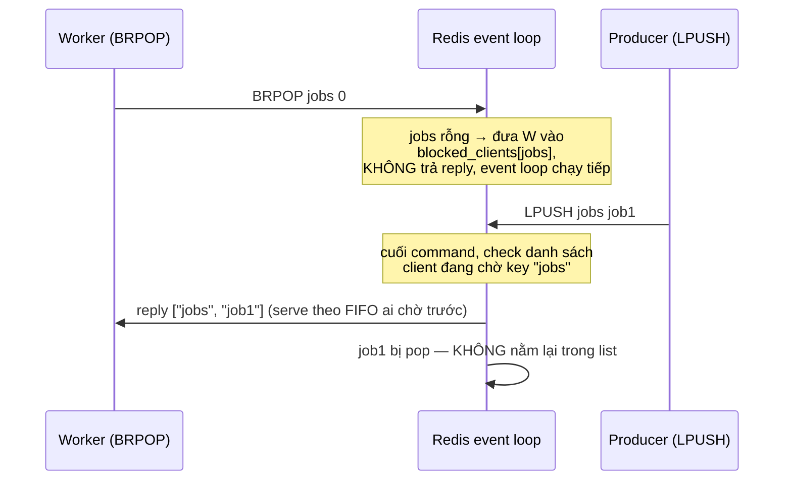

# Lists

## Mục lục

- [Tổng quan](#tổng-quan)
- [Use Cases phổ biến](#use-cases-phổ-biến)
- [1. Bên trong: listpack và quicklist](#1-bên-trong-listpack-và-quicklist)
- [2. Command chính & độ phức tạp](#2-command-chính--độ-phức-tạp)
- [3. Blocking operations — BLPOP hoạt động thế nào](#3-blocking-operations--blpop-hoạt-động-thế-nào)
- [4. Queue patterns](#4-queue-patterns)
- [5. Capped list — giữ N phần tử mới nhất](#5-capped-list--giữ-n-phần-tử-mới-nhất)
- [6. So sánh: List vs Stream vs Pub/Sub](#6-so-sánh-list-vs-stream-vs-pubsub)
- [7. Case study thực tế](#7-case-study-thực-tế)
- [8. Best Practices](#8-best-practices)
- [Tài liệu tham khảo](#tài-liệu-tham-khảo)

---

## Tổng quan

List là **doubly linked list của các string**, tối ưu cho thao tác ở **hai đầu** (head/tail — O(1)). Đây là công cụ tự nhiên cho queue, stack, timeline "N item mới nhất".

```
LPUSH ──▶ ┌────┬────┬────┬────┐ ◀── RPUSH
          │ e4 │ e3 │ e2 │ e1 │
LPOP  ◀── └────┴────┴────┴────┘ ──▶ RPOP
          head (index 0)      tail (index -1)
```

Quy ước nhớ nhanh: **L = Left = head**, **R = Right = tail**. Index âm đếm từ tail (`-1` là phần tử cuối).

---

## Use Cases phổ biến

| Use Case | Cách dùng |
|----------|-----------|
| **Job queue** | Producer `LPUSH`, worker `BRPOP` (FIFO) |
| **Stack** | `LPUSH` + `LPOP` (LIFO) |
| **Timeline / feed** | `LPUSH` + `LTRIM` giữ N item mới nhất |
| **Recent history** (đơn hàng gần đây, log gần nhất) | Capped list — mục 5 |
| **Reliable queue** | `LMOVE` sang processing list — mục 4.2 |
| **Round-robin giữa workers** | `BLPOP` nhiều worker cùng chờ 1 key |

---

## 1. Bên trong: listpack và quicklist

### 1.1 Vấn đề của linked list thuần

Linked list "sách giáo khoa" có nhược điểm lớn về memory: mỗi node cần 2 con trỏ (prev/next = 16 bytes trên 64-bit) + overhead malloc, trong khi phần tử có thể chỉ là vài byte. Cache locality cũng tệ (node rải rác trong heap).

### 1.2 listpack — encoding khi list nhỏ

List nhỏ được lưu bằng **listpack**: một **khối memory liên tục duy nhất** chứa các entry nối tiếp nhau:

```
┌────────┬───────┬─────────┬─────────┬─────┬─────┐
│ total  │ num   │ entry1  │ entry2  │ ... │ END │
│ bytes  │ elems │         │         │     │     │
└────────┴───────┴─────────┴─────────┴─────┴─────┘
   mỗi entry: [encoding+data][backlen]  ← backlen cho phép duyệt ngược
```

- Không con trỏ → tiết kiệm memory tối đa, cache-friendly
- Nhược: chèn/xóa giữa chừng phải `memmove` phần còn lại → chỉ phù hợp khi nhỏ
- (Trước Redis 7 vai trò này là **ziplist**; listpack thay thế, sửa lỗi cascade update)

### 1.3 quicklist — khi list lớn lên

Khi vượt ngưỡng, list chuyển thành **quicklist = doubly linked list mà mỗi node là một listpack**:

```
quicklist:
┌──────────────┐    ┌──────────────┐    ┌──────────────┐
│ listpack #1  │◀──▶│ listpack #2  │◀──▶│ listpack #3  │
│ (≤128 entry) │    │ (có thể nén  │    │              │
│  head        │    │   LZF)       │    │  tail        │
└──────────────┘    └──────────────┘    └──────────────┘
```

Đây là thỏa hiệp giữa hai thế giới: pointer overhead chia đều cho cả trăm entry, còn memmove chỉ giới hạn trong một node nhỏ.

Config điều khiển:

```bash
list-max-listpack-size 128   # số entry tối đa mỗi node (âm = giới hạn theo KB: -2 = 4KB)
list-compress-depth 0        # nén LZF các node ở GIỮA, chừa N node mỗi đầu
                             # 1 = chừa 1 node mỗi đầu, nén phần còn lại
```

`list-compress-depth` tận dụng đặc tính truy cập của list: hầu hết thao tác ở hai đầu → node giữa hiếm khi đọc, nén lại tiết kiệm memory cho list rất dài.

```
127.0.0.1:6379> RPUSH small a b c
127.0.0.1:6379> OBJECT ENCODING small      → "listpack"
# ... đẩy thêm > 128 phần tử ...
127.0.0.1:6379> OBJECT ENCODING small      → "quicklist"
```

---

## 2. Command chính & độ phức tạp

| Command | Complexity | Ghi chú |
|---------|-----------|---------|
| `LPUSH` / `RPUSH` / `LPOP` / `RPOP` | O(1) | có biến thể `LPOP key 3` pop nhiều |
| `LPUSHX` / `RPUSHX` | O(1) | chỉ push nếu key tồn tại |
| `LLEN` | O(1) | length lưu sẵn |
| `LRANGE key start stop` | O(S+N) | S = offset từ đầu gần nhất; `LRANGE key 0 -1` = cả list |
| `LINDEX key i` | O(N) | phải duyệt tới i — tránh trên list dài |
| `LSET key i val` | O(N) | tương tự |
| `LINSERT key BEFORE pivot val` | O(N) | tìm pivot tuyến tính |
| `LREM key count val` | O(N+M) | xóa theo value |
| `LTRIM key start stop` | O(N) | N = số phần tử bị cắt — rẻ khi cắt ít (mục 5) |
| `LMOVE src dst LEFT RIGHT` | O(1) | pop 1 đầu, push đầu kia — atomic |
| `BLPOP` / `BRPOP` / `BLMOVE` | O(1) | blocking — mục 3 |

> [!IMPORTANT]
> List là double-ended queue, **không phải array**. `LINDEX`/`LSET`/`LINSERT` là O(N) — nếu cần random access theo index/score, dùng [Sorted Set](./sorted-sets.md) hoặc [Hash](./hashes.md).

---

## 3. Blocking operations — BLPOP hoạt động thế nào

`BLPOP key [key ...] timeout` — pop từ key đầu tiên có dữ liệu; nếu tất cả rỗng thì **block** đến khi có dữ liệu hoặc hết timeout (0 = chờ vô hạn).

Câu hỏi hay gặp: *Redis single-threaded, sao client block mà server không đứng?*

**Blocking ở đây là blocking phía client, không phải phía server.** Cơ chế:



Chi tiết đáng nhớ:

1. Server chỉ **ghi nhớ** "client này đang chờ key kia" trong một dict `blocked_keys`, rồi tiếp tục phục vụ client khác — không tốn CPU chờ
2. Khi có LPUSH vào key đang được chờ, việc trao dữ liệu xảy ra **ngay sau command đó**, dữ liệu đi thẳng đến client bị block (không "chạm đất" vào list)
3. Nhiều client cùng chờ một key → phục vụ theo thứ tự **FIFO** (ai block trước nhận trước)
4. Client bị block vẫn giữ connection; timeout do server theo dõi

`BLPOP` nhiều key còn cho phép **priority queue thô**: `BRPOP high normal low 0` — luôn ưu tiên key đứng trước có dữ liệu.

---

## 4. Queue patterns

### 4.1 Simple work queue

```bash
# Producer
LPUSH jobs '{"type":"email","to":"a@b.c"}'

# Worker (loop)
BRPOP jobs 5        # FIFO: vào từ trái, ra từ phải
```

Nhược điểm: worker crash **sau khi** pop nhưng **trước khi** xử lý xong → job mất vĩnh viễn.

### 4.2 Reliable queue với LMOVE

```bash
# Worker: lấy job đồng thời ghi vào processing list — MỘT lệnh atomic
BLMOVE jobs processing:worker1 RIGHT LEFT 5

# Xử lý xong → xóa khỏi processing
LREM processing:worker1 1 "$job"

# Recovery job mồ côi (worker chết): janitor định kỳ
LRANGE processing:worker1 0 -1     # job nằm đây quá lâu → LMOVE trả về jobs
```

Đây là pattern "at-least-once": job không bao giờ mất, nhưng có thể xử lý trùng → worker cần **idempotent**.

### 4.3 Khi nào List không đủ

- Cần **nhiều consumer cùng đọc một message** (fan-out) → List pop là destructive, mỗi job chỉ một worker nhận
- Cần **ack/retry/pending tracking** có sẵn → tự chế bằng List khá thủ công
- Cần **replay** message cũ

→ Đó là lúc dùng [Streams](./streams.md) (consumer groups, XACK, XPENDING).

---

## 5. Capped list — giữ N phần tử mới nhất

Pattern timeline/feed/recent-history:

```bash
LPUSH user:42:feed "post:9911"
LTRIM user:42:feed 0 99          # giữ đúng 100 item mới nhất
```

Vì sao cặp này hiệu quả: `LTRIM 0 99` sau mỗi LPUSH thường chỉ cắt **1 phần tử ở tail** → O(1) thực tế. List không bao giờ phình quá 100 → memory bounded, `LRANGE 0 -1` luôn rẻ.

> [!TIP]
> Chạy `LPUSH` + `LTRIM` trong pipeline (hoặc MULTI) để tiết kiệm round-trip — xem [Pipelining & Batching](./pipelining-batching.md).

---

## 6. So sánh: List vs Stream vs Pub/Sub

| Tiêu chí | List (BRPOP) | [Stream](./streams.md) | [Pub/Sub](./pub-sub.md) |
|----------|--------------|------------------------|--------------------------|
| Persistence message | Có (nằm trong list) | Có (log, có ID) | Không — miss là mất |
| Nhiều consumer nhận cùng message | Không (pop là mất) | Có (mỗi group một bản) | Có (broadcast) |
| Ack / retry | Tự chế (LMOVE) | Built-in (XACK, XPENDING, XCLAIM) | Không |
| Replay lịch sử | Không | Có (XRANGE theo ID) | Không |
| Độ phức tạp sử dụng | Thấp nhất | Trung bình | Thấp |
| Phù hợp | Job queue đơn giản | Event pipeline, cần độ tin cậy | Realtime notify, invalidation |

**Khi nào dùng List:** một job → một worker, cần đơn giản, khối lượng vừa phải.
**Khi nào chuyển Stream:** cần consumer group, ack, replay, hoặc audit lại message.

---

## 7. Case study thực tế

### 7.1 Hàng đợi gửi email/notification — SaaS điển hình

Bài toán: API không được chờ SMTP (300ms–2s); gửi lỗi phải retry; thứ tự không quan trọng lắm.

```bash
# API (producer) — trả response ngay sau 1 lệnh ~0.1ms:
LPUSH q:email '{"to":"a@b.c","tpl":"welcome","uid":42}'

# 5–50 worker (tùy backlog):
while true:
    job = BLMOVE q:email q:email:processing:$WORKER_ID RIGHT LEFT 5
    if job: send(job); LREM q:email:processing:$WORKER_ID 1 job

# Janitor mỗi phút: job nằm trong processing > 5 phút → đẩy lại q:email
# Metric cần theo dõi: LLEN q:email (backlog) — tăng đều = thiếu worker
```

Quyết định thiết kế đáng chú ý:
- **Mỗi loại job một queue** (`q:email`, `q:sms`, `q:webhook`) thay vì 1 queue + field type — scale worker độc lập, backlog nhìn riêng được
- **Retry có đếm**: nhúng `attempts` vào payload; janitor thấy attempts ≥ 3 thì LPUSH sang `q:email:dead` thay vì retry vô hạn
- Đây chính là mô hình lõi của Sidekiq (Ruby), RQ (Python), Bull (Node) — các thư viện này đều chạy trên Redis List (Bull dùng thêm ZSet cho delayed job)

### 7.2 Timeline "hoạt động gần đây" — trang profile

Bài toán: profile hiển thị 20 hành động gần nhất; ghi 5K event/s toàn hệ thống; DB query `ORDER BY created_at DESC LIMIT 20` đang chiếm 40% load.

```bash
# Mỗi hành động — pipeline 3 lệnh:
LPUSH act:user:42 '{"t":"comment","post":991,"at":1783400000}'
LTRIM act:user:42 0 19            # giữ đúng 20
EXPIRE act:user:42 2592000        # user 30 ngày không hoạt động → tự dọn

# Render profile — 1 lệnh, không chạm DB:
LRANGE act:user:42 0 19
```

Memory dự toán được: 20 entry × ~100 bytes × 10 triệu user active ≈ 20GB? Không — nhờ TTL chỉ user active 30 ngày còn key, và list 20 entry ngắn nằm gọn trong **listpack** (~1 khối malloc) → thực tế ~2–3KB/user gồm overhead → kiểm soát bằng cách đo `MEMORY USAGE` trên key mẫu.

Lưu ý: đây là **cache** của timeline, nguồn sự thật vẫn ở DB — mất Redis chỉ mất tốc độ, không mất dữ liệu. Feed phức tạp hơn (fan-out, ranking) → xem [Sorted Set](./sorted-sets.md) case study.

### 7.3 Batch processor — gom log ghi DB theo lô

Bài toán: 20K event log/s, ghi từng dòng vào DB quá chậm; cần gom lô 500–1000 dòng/INSERT.

```bash
# Producer rải rác khắp nơi:
LPUSH buf:events '{...}'

# Một consumer duy nhất, mỗi 200ms:
LPOP buf:events 1000              # LPOP count (6.2+) — lấy cả lô 1 lệnh
# → INSERT INTO events VALUES (...), (...) × 1000
```

`LPOP key count` atomic nên nhiều consumer cũng không lấy trùng; ngược với từng-message, mất lô khi consumer crash ở đây chấp nhận được (log) — nếu không, quay lại pattern reliable queue mục 4.2 hoặc [Streams](./streams.md).

---

## 8. Best Practices

- **Nhất quán chiều**: chọn `LPUSH` + `BRPOP` (hoặc ngược lại) cho FIFO; trộn lung tung dễ thành LIFO ngoài ý muốn
- **Luôn cap list vô hạn** bằng `LTRIM` — list chỉ ghi không đọc là memory leak kinh điển
- **Tránh `LRANGE 0 -1` trên list lớn** — O(N), trả về hàng trăm nghìn phần tử block event loop; phân trang bằng `LRANGE start stop`
- **Worker phải idempotent** khi dùng reliable queue (at-least-once)
- **Không polling** (`LPOP` + sleep) — dùng `BRPOP` để nhận ngay và không đốt CPU/network
- **Job payload nhỏ**: đẩy id/reference vào queue, body lớn lưu ở key riêng hoặc DB

---

## Tài liệu tham khảo

- [Redis Lists](https://redis.io/docs/latest/develop/data-types/lists/)
- [Redis Streams intro](https://redis.io/docs/latest/develop/data-types/streams/)
- [Sets](./sets.md) — data structure tiếp theo
- [Streams](./streams.md) — khi queue cần consumer groups
