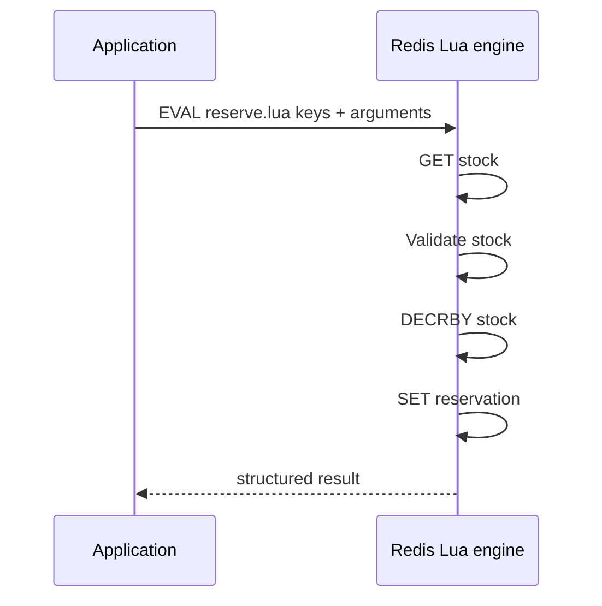

# Lua Scripting

## Mục lục

- [1. Vấn đề: logic atomic cần nhiều round trip](#1-vấn-đề-logic-atomic-cần-nhiều-round-trip)
- [2. Execution model: chạy ngay trên Redis event loop](#2-execution-model-chạy-ngay-trên-redis-event-loop)
- [3. EVAL, KEYS và ARGV](#3-eval-keys-và-argv)
- [4. redis.call và redis.pcall](#4-rediscall-và-redispcall)
- [5. Atomicity không có nghĩa rollback](#5-atomicity-không-có-nghĩa-rollback)
- [6. Data type conversion giữa Lua và RESP](#6-data-type-conversion-giữa-lua-và-resp)
- [7. EVALSHA và script cache](#7-evalsha-và-script-cache)
- [8. Redis Functions: code thuộc về server](#8-redis-functions-code-thuộc-về-server)
- [9. Script flags và read-only execution](#9-script-flags-và-read-only-execution)
- [10. Redis Cluster và key locality](#10-redis-cluster-và-key-locality)
- [11. Replication, AOF và determinism](#11-replication-aof-và-determinism)
- [12. Long-running script và BUSY state](#12-long-running-script-và-busy-state)
- [13. Pattern thực tế](#13-pattern-thực-tế)
- [14. Thiết kế API script dễ bảo trì](#14-thiết-kế-api-script-dễ-bảo-trì)
- [15. Testing, debugging và deployment](#15-testing-debugging-và-deployment)
- [16. Security, ACL và resource limits](#16-security-acl-và-resource-limits)
- [17. Performance và observability](#17-performance-và-observability)
- [18. Anti-patterns và checklist production](#18-anti-patterns-và-checklist-production)
- [19. Tóm tắt decision table](#19-tóm-tắt-decision-table)
- [Tài liệu tham khảo](#tài-liệu-tham-khảo)

---

## 1. Vấn đề: logic atomic cần nhiều round trip

Bài toán reserve stock:

```text
GET stock:sku7
nếu stock >= quantity:
    DECRBY stock:sku7 quantity
    SET reservation:order8812 ...
```

Nếu logic chạy ở application, client khác có thể thay đổi stock giữa `GET` và `DECRBY`. `WATCH` giải quyết bằng optimistic retry nhưng cần nhiều round trip. Lua đưa logic đến nơi data đang nằm và thực thi như một đoạn atomic:



Lợi ích:

- Một round trip thay vì nhiều.
- Không command client khác chen giữa script.
- Có `if`, loop và composition nhiều Redis command/data type.
- Giảm network bytes khi logic lọc/aggregate gần data.

Cái giá: script chạy trên Redis event loop, nên code chậm có thể block toàn shard; deployment/versioning và Cluster key locality cần kỷ luật.

---

## 2. Execution model: chạy ngay trên Redis event loop

Redis nhúng Lua 5.1. Khi script chạy, Redis không thực thi command khác xen vào script. Trạng thái bên ngoài chỉ thấy trước toàn bộ effects hoặc sau toàn bộ effects, không thấy giữa chừng.

```text
Client A command ──> [ Lua: GET → check → DECR → SET ] ──> Client B command
                      không có interleaving ở giữa
```

### 2.1. Atomicity đến từ blocking

Redis không tạo MVCC snapshot hay lock từng key; nó đơn giản giữ event loop trong script. Vì vậy:

- Script 200 microsecond thường rất hữu ích.
- Script 200 ms làm mọi client trên shard chờ.
- Loop qua 1 triệu members là sự cố latency, dù kết quả đúng.
- Script không được network I/O, filesystem I/O hoặc gọi database ngoài.

### 2.2. Không chạy business logic tùy ý trong Redis

Dùng Lua cho đoạn data logic nhỏ và bounded: compare-update, rate limit, safe release, pop nhiều cấu trúc. Không dùng làm application server, xử lý JSON lớn, regex nặng hoặc scan không giới hạn.

### 2.3. Script và transaction

Lua có isolation execution tương tự `MULTI/EXEC`, nhưng cho phép dùng kết quả read để branch ngay trong cùng atomic scope. Xem [Transactions](./transactions.md).

---

## 3. EVAL, KEYS và ARGV

Syntax:

```bash
EVAL <script> <numkeys> <key1> ... <keyN> <arg1> ...
```

Ví dụ:

```bash
EVAL "return redis.call('SET', KEYS[1], ARGV[1], 'EX', ARGV[2])" 1 cache:item:42 '{"id":42}' 60
```

- `numkeys=1` nghĩa argument đầu sau nó là key.
- `KEYS[1] = cache:item:42`.
- `ARGV[1] = {"id":42}`.
- `ARGV[2] = 60`.
- Lua array bắt đầu từ 1, không phải 0.

### 3.1. Mọi key phải khai báo trong KEYS

Đúng:

```lua
local source = KEYS[1]
local destination = KEYS[2]
local count = tonumber(ARGV[1])
```

Sai:

```lua
local destination = 'result:' .. ARGV[1]
redis.call('SET', destination, 'x')
```

Redis Cluster cần biết trước keys để route và kiểm tra slot. Script chỉ nên truy cập keys truyền qua `KEYS`, không sinh key từ data đọc trong Redis hoặc `ARGV`.

### 3.2. Parameterize, không generate source code

Sai:

```typescript
const script = `return redis.call('GET', '${userInput}')`;
```

Mỗi source string khác tạo SHA khác, làm script cache tăng liên tục và có injection risk. Đúng:

```lua
return redis.call('GET', KEYS[1])
```

truyền key qua parameter.

### 3.3. Validate arguments

Lua 5.1 type conversion không tự bảo vệ:

```lua
local amount = tonumber(ARGV[1])
if not amount or amount <= 0 then
  return redis.error_reply('INVALID_AMOUNT')
end
```

Validate số lượng keys, numeric range, enum và maximum batch trước write.

---

## 4. redis.call và redis.pcall

### 4.1. redis.call

```lua
local value = redis.call('GET', KEYS[1])
```

Nếu command lỗi runtime, script dừng và error trả client.

### 4.2. redis.pcall

```lua
local result = redis.pcall('GET', KEYS[1])
if result.err then
  return redis.error_reply('READ_FAILED: ' .. result.err)
end
return result
```

`pcall` bắt error thành Lua value để script xử lý tiếp. Không dùng `pcall` để nuốt mọi lỗi và tiếp tục tạo state khó hiểu.

### 4.3. Structured replies

```lua
return {
  1,
  redis.status_reply('RESERVED'),
  remaining
}
```

Error business có thể là structured normal result thay vì Redis error:

```lua
return {0, 'OUT_OF_STOCK', available}
```

Điều này giúp client phân biệt expected denial với infrastructure/script bug.

### 4.4. Command name và argument

Command gọi bằng string, thường uppercase cho dễ đọc. Không concatenate untrusted command name. ACL vẫn áp dụng: user chạy script cần permission phù hợp cho script command và commands bên trong theo Redis version/policy.

---

## 5. Atomicity không có nghĩa rollback

Script không bị interleave, nhưng nếu đã write rồi gặp lỗi, Redis không phải rollback engine.

```lua
redis.call('SET', KEYS[1], 'changed')
redis.call('LPOP', KEYS[2]) -- WRONGTYPE có thể xảy ra
return 1
```

`SET` đầu có thể đã có effect dù script trả error. Vì vậy pattern an toàn:

```lua
-- Phase 1: validate toàn bộ precondition/type/input
local t1 = redis.call('TYPE', KEYS[1]).ok
local t2 = redis.call('TYPE', KEYS[2]).ok
if t1 ~= 'none' and t1 ~= 'string' then
  return redis.error_reply('BAD_TYPE_KEY_1')
end
if t2 ~= 'none' and t2 ~= 'list' then
  return redis.error_reply('BAD_TYPE_KEY_2')
end

-- Phase 2: chỉ mutate sau khi chắc chắn
redis.call('SET', KEYS[1], 'changed')
redis.call('LPUSH', KEYS[2], 'item')
return 1
```

Vẫn cần giới hạn OOM và unexpected server error. Thiết kế key schema giúp tránh phải `TYPE` mọi invocation, nhưng script critical nên validation đủ mức.

> [!IMPORTANT]
> “Atomic” ở đây là không ai quan sát trạng thái giữa các bước. Nó không hứa undo mọi write khi code Lua lỗi ở bước sau.

---

## 6. Data type conversion giữa Lua và RESP

Client không nhận Lua object trực tiếp. Redis chuyển Lua values sang RESP rồi client library chuyển sang native type.

### 6.1. Các conversion dễ gây bất ngờ

Với RESP2 semantics phổ biến:

| Lua | Client thường nhận |
|-----|--------------------|
| String | Bulk string |
| Number | Integer, phần thập phân có thể bị truncate theo conversion rules |
| `true` | Integer 1 |
| `false`/`nil` | Null |
| Table array | RESP array |
| Table có `err` | Error reply |
| Table có `ok` | Status reply |

Không return floating-point rồi kỳ vọng client luôn nhận decimal chính xác. Có thể return string:

```lua
return tostring(tokens)
```

### 6.2. Lua table array dừng tại nil

```lua
return {'a', nil, 'c'}
```

Array có thể bị truncate tại phần tử nil. Dùng sentinel/string/structured fixed positions, hoặc RESP3 map nếu client/server contract rõ.

### 6.3. RESP3

Redis Lua API có hỗ trợ chọn protocol reply (`redis.setresp`) và RESP3 thêm map, set, double, boolean. Nhưng client compatibility khác nhau. Nếu library đa ngôn ngữ, contract array + strings/integers thường dễ portable hơn.

### 6.4. cjson và precision

Lua có `cjson`, nhưng decode payload lớn block event loop. JSON numbers có thể gặp precision giới hạn double. Không dùng JSON encode/decode trong hot script nếu Hash/arguments đủ. Không nhận payload unbounded.

---

## 7. EVALSHA và script cache

`EVAL` gửi toàn source mỗi lần. Redis cache script theo SHA1. Production thường load một lần rồi chạy SHA:

```bash
SCRIPT LOAD "return redis.call('GET', KEYS[1])"
# e1f...sha

EVALSHA e1f...sha 1 user:42
```

### 7.1. Cache là volatile

Script cache không phải dataset và không persist. Nó có thể mất khi:

- Redis restart.
- Failover sang replica không có cache tương ứng.
- Operator chạy `SCRIPT FLUSH`.
- Node mới xuất hiện trong Cluster.

Application phải xử lý `NOSCRIPT`:

```text
EVALSHA
  ├─ success → done
  └─ NOSCRIPT → SCRIPT LOAD/EVAL source → retry an toàn
```

Nhiều client có `defineCommand`/script abstraction tự làm việc này.

### 7.2. Cluster cache theo node

Mỗi primary có script cache riêng. Load trên node A không đảm bảo node B có. Client cluster-aware có thể lazy-load theo target node hoặc preload mọi primary và xử lý topology change.

### 7.3. EVALSHA trong pipeline

Nếu pipeline trả `NOSCRIPT`, client không thể chen `SCRIPT LOAD` vào giữa pipeline đã gửi. Các lựa chọn:

- Preload script trước pipeline.
- Dùng `EVAL` source parameterized trong pipeline.
- Client library có strategy rõ.

### 7.4. Không generate script động

Mỗi source variant tăng `number_of_cached_scripts` và `used_memory_scripts_eval`. Parameterize bằng `ARGV`; alert nếu script cache tăng không bounded.

---

## 8. Redis Functions: code thuộc về server

Redis Functions (từ Redis 7) là alternative cho ad-hoc Eval scripts. Function library được load vào Redis, có tên, persist/replicate cùng data management và gọi bằng `FCALL`/`FCALL_RO`.

### 8.1. Library minh họa

```lua
#!lua name=inventory_v1

redis.register_function('reserve', function(keys, args)
  local quantity = tonumber(args[1])
  local stock = tonumber(redis.call('GET', keys[1]) or '0')
  if not quantity or quantity <= 0 then
    return redis.error_reply('INVALID_QUANTITY')
  end
  if stock < quantity then
    return {0, stock}
  end
  local remaining = redis.call('DECRBY', keys[1], quantity)
  return {1, remaining}
end)
```

```bash
FUNCTION LOAD REPLACE "<library source>"
FCALL reserve 1 stock:{sku7} 2
```

### 8.2. Eval vs Functions

| Tiêu chí | Eval script | Redis Function |
|----------|-------------|----------------|
| Ownership | Application/client | Server library |
| Naming | SHA1 | Library/function name |
| Persistence | Cache volatile | Persisted/replicated theo Redis Functions |
| Deployment | Lazy load mỗi node | Explicit library deployment |
| Versioning | Source/SHA trong app | Library naming/replace strategy |
| Gọi | `EVALSHA` | `FCALL` |

### 8.3. Deployment strategy

Không `FUNCTION LOAD REPLACE` tùy tiện giữa traffic nếu signature/semantics đổi. Có thể version tên:

```text
inventory_v1.reserve_v1
inventory_v2.reserve_v2
```

Deploy library mới → canary clients → switch → giữ old trong rollback window → xóa old. Kiểm tra backup/restore/failover và Cluster load trên mọi primary.

### 8.4. Khi chọn Functions

Chọn khi logic server-side là platform capability dùng lâu dài, cần lifecycle rõ và Redis 7+. Chọn Eval khi script thuộc một application, nhỏ, muốn deploy cùng app và tương thích version cũ hơn.

---

## 9. Script flags và read-only execution

Redis 7+ hỗ trợ shebang flags:

```lua
#!lua flags=no-writes,allow-stale
return redis.call('GET', KEYS[1])
```

Flags mô tả behavior như read-only, cho phép chạy trên stale replica hoặc trong điều kiện cụ thể. Exact flags/defaults cần đối chiếu phiên bản.

### 9.1. Read-only variants

- `EVAL_RO`/`EVALSHA_RO`: script không được write, có thể route read phù hợp.
- `FCALL_RO`: function read-only.

Đừng gọi read-only variant cho script có write; Redis reject.

### 9.2. Tại sao flags quan trọng

- ACL/routing hiểu intent tốt hơn.
- Cluster/replica có thể cho phép execution đúng mode.
- Tránh script “tưởng read-only” vô tình mutate.

### 9.3. Shebang thay đổi defaults

Một script có `#!` được xử lý theo flag model mới; default có thể khác legacy script không shebang, đặc biệt với cross-slot behavior. Test trên version target, không thêm shebang chỉ để comment.

---

## 10. Redis Cluster và key locality

Script multi-key trên Cluster phải truy cập keys cùng slot theo execution rules:

```text
stock:{sku7}
reservation:{sku7}:order8812
```

Hash tag `{sku7}` co-locate.

```bash
EVALSHA <sha> 2 stock:{sku7} reservation:{sku7}:order8812 2
```

### 10.1. Không dùng script để né sharding

Script không thể atomically update arbitrary keys trên nhiều primaries. Nếu business transaction trải nhiều aggregate/shard:

- Chọn aggregate key/hash tag phù hợp.
- Durable workflow/Saga.
- Database transaction ở system of record.
- Không dùng một tag global làm mọi traffic dồn một shard.

### 10.2. Hot slot

Co-locate tất cả data của tenant lớn có thể tạo hot shard. Chỉ đặt cùng slot những keys thật sự cần atomic. Analytics/global counters có thể eventual update riêng.

### 10.3. Dynamic key access

Script đọc Set chứa danh sách key rồi loop `GET` các key đó là anti-pattern Cluster: router không biết keys trước và chúng có thể khác slot. Truyền explicit `KEYS`, hoặc redesign data model thành một Hash/ZSet key.

---

## 11. Replication, AOF và determinism

Redis hiện đại dùng **effects replication**: các write command do script tạo được propagate tới replicas/AOF, thay vì replica chạy lại toàn script. Từ Redis 7, verbatim script replication đã bị loại bỏ.

```text
Primary chạy Lua
  ├─ GET/check chỉ chạy ở primary
  ├─ DECRBY effect
  └─ SET effect
       → replication/AOF nhận effects được bọc phù hợp
```

### 11.1. Ý nghĩa

- Replica không tốn CPU chạy lại business loop.
- Non-deterministic reads như `TIME` có thể được sử dụng trong model effects hiện đại vì replicated writes đã cụ thể.
- Tài liệu cũ về `redis.replicate_commands()` chủ yếu historical; từ Redis 7 lời gọi này deprecated/luôn thành công.

### 11.2. Vẫn nên truyền thời gian từ caller khi cần testability

```lua
local now_ms = tonumber(ARGV[1])
```

Dễ deterministic test và kiểm soát business clock. Nếu client clocks không tin cậy, dùng Redis `TIME` nhưng test clock behavior/failover.

### 11.3. Durability

Script atomic không có nghĩa fsync ngay hoặc replica sync. AOF policy và replication lag vẫn áp dụng. Script effects có thể mất khi primary failover trước replication. Xem [Persistence Strategies](./persistence-strategies.md).

---

## 12. Long-running script và BUSY state

Khi script vượt ngưỡng slow/busy configured, Redis có thể trả `BUSY` cho command khác; event loop không thể phục vụ data command bình thường cho đến khi script kết thúc.

### 12.1. SCRIPT KILL

`SCRIPT KILL` chỉ có thể dừng script **chưa thực hiện write**, vì dừng sau write sẽ vi phạm atomic visibility và để effects nửa chừng. Nếu script đã write và treo, lựa chọn cực đoan có thể là shutdown without save/failover theo runbook, với rủi ro dữ liệu.

Functions có command kill tương ứng (`FUNCTION KILL`) theo version.

### 12.2. Ngăn trước thay vì cứu sau

- Không `KEYS`/`SCAN` toàn DB trong script.
- Loop có max count từ server-side constant và validate ARGV.
- Range luôn `LIMIT`/`COUNT` bounded.
- Không decode JSON/bulk string khổng lồ.
- Benchmark p99 với big key thật.
- ACL không cho arbitrary `EVAL` với app không cần.

### 12.3. Runbook BUSY

1. Xác định script/function và duration từ logs/SLOWLOG/command stats.
2. Nếu read-only/chưa write, cân nhắc kill.
3. Nếu đã write, không kill được an toàn; đánh giá shutdown/failover và durability.
4. Chặn caller tiếp tục gửi script.
5. Sau phục hồi, verify invariant và fix boundedness.

---

## 13. Pattern thực tế

### 13.1. Safe distributed lock release

```lua
if redis.call('GET', KEYS[1]) == ARGV[1] then
  return redis.call('DEL', KEYS[1])
end
return 0
```

Token compare và delete cùng atomic scope. Xem giới hạn lease/fencing tại [Distributed Lock](./distributed-lock.md).

### 13.2. Fixed-window rate limit

```lua
local count = redis.call('INCR', KEYS[1])
if count == 1 then
  redis.call('PEXPIRE', KEYS[1], tonumber(ARGV[1]))
end
return {count <= tonumber(ARGV[2]) and 1 or 0, count}
```

Không có race “INCR thành công nhưng process chết trước EXPIRE”. Xem [Rate Limiting](./rate-limiting.md).

### 13.3. Inventory reserve có idempotency

```lua
-- KEYS: stock, reservation result
-- ARGV: quantity, result TTL
local existing = redis.call('GET', KEYS[2])
if existing then
  return {2, existing}
end

local quantity = tonumber(ARGV[1])
if not quantity or quantity <= 0 then
  return redis.error_reply('INVALID_QUANTITY')
end

local stock = tonumber(redis.call('GET', KEYS[1]) or '0')
if stock < quantity then
  local result = 'OUT_OF_STOCK:' .. stock
  redis.call('SET', KEYS[2], result, 'PX', ARGV[2])
  return {0, stock}
end

local remaining = redis.call('DECRBY', KEYS[1], quantity)
local result = 'RESERVED:' .. remaining
redis.call('SET', KEYS[2], result, 'PX', ARGV[2])
return {1, remaining}
```

Keys phải cùng slot. Dedupe TTL phải dài hơn retry window. Nếu stock là financial/critical source, persistence và durable ledger vẫn cần.

### 13.4. Conditional cache refresh

Chỉ overwrite cache nếu version mới không thấp hơn current; payload/version lưu Hash hoặc encoded contract. Lua ngăn out-of-order loader ghi stale value.

### 13.5. Pop due jobs

Lua có thể `ZRANGEBYSCORE ... LIMIT`, `ZREM` selected members rồi trả jobs atomically. Nhưng nếu worker chết sau pop, job mất khỏi queue; reliable design chuyển sang processing structure hoặc dùng Streams/ack.

---

## 14. Thiết kế API script dễ bảo trì

### 14.1. Contract

Mỗi script cần document:

```text
Name/version: inventory_reserve_v3
KEYS[1]: stock key, String integer
KEYS[2]: idempotency result key, String
ARGV[1]: quantity positive integer
ARGV[2]: result TTL milliseconds
Return: [statusCode, value]
Errors: INVALID_QUANTITY, BAD_TYPE
Complexity: O(1)
Cluster: both keys same slot
```

### 14.2. Stable status codes

```text
0 = denied
1 = applied
2 = duplicate/replayed
```

Client không parse human error message để branch. Version return schema nếu thay đổi.

### 14.3. Tách generic khỏi business logic

Script nhỏ một nhiệm vụ. Không tạo “mega script” nhận 30 mode flags và thao tác mọi data type; khó test, ACL rộng và block lâu.

### 14.4. Source control

Lưu `.lua` như source file, lint/review/test cùng app. Trong repo docs này code chỉ minh họa; production không copy string rải rác nhiều service.

---

## 15. Testing, debugging và deployment

### 15.1. Unit + integration

Unit test helper/contract nhưng atomic behavior phải test Redis thật:

- Key missing/existing/wrong type.
- Boundary numeric/TTL.
- Concurrent 1.000 invocations.
- Duplicate idempotency ID.
- Cluster same-slot/CROSSSLOT.
- `SCRIPT FLUSH`/restart/failover `NOSCRIPT`.
- OOM/maxmemory behavior nếu relevant.
- RESP2/RESP3 response conversion.

### 15.2. redis-cli debugger

Redis có Lua debugger qua `redis-cli --ldb --eval` cho development. Không debug trên production hot node vì script execution và data side effects.

```bash
redis-cli --ldb --eval reserve.lua stock:{sku7} reservation:{sku7}:o1 , 2 60000
```

Dấu phẩy phân tách keys và ARGV trong `redis-cli --eval`.

### 15.3. Deployment Eval

1. App artifact chứa exact source + expected SHA.
2. Startup/lazy register client script.
3. `EVALSHA`; handle `NOSCRIPT` trên target node.
4. Canary metrics/errors.
5. Không `SCRIPT FLUSH` trong deploy bình thường.

### 15.4. Deployment Functions

Load library version mới trên mọi primary, verify `FUNCTION LIST`, canary `FCALL`, switch clients, giữ rollback version. Backup/restore và replica promotion phải được test.

---

## 16. Security, ACL và resource limits

Lua là code execution bên trong data store, dù sandbox không cho arbitrary OS I/O. Rủi ro chính là data access và denial-of-service.

- Không cho untrusted user gửi arbitrary `EVAL`.
- ACL app chỉ command/key patterns cần thiết.
- Script vẫn có thể đọc nhiều keys nếu permission/key declaration cho phép.
- Không đưa secret vào logs/error replies.
- Giới hạn argument/payload/batch.
- Review dynamic command/key generation.
- Tách administrative function deployment identity khỏi application identity.

Redis 8 ACL categories đã bao phủ nhiều data type tích hợp hơn; kiểm tra ACL sau upgrade. Xem [Security](./security.md).

---

## 17. Performance và observability

### 17.1. Khi Lua nhanh

- Thay 3–10 network round trips bằng một.
- Tránh WATCH retries.
- Filter result server-side nhỏ.
- Logic O(1)/O(log N), payload nhỏ.

### 17.2. Khi Lua chậm

- Loop O(N) trên big key.
- JSON encode/decode lớn.
- Nhiều writes tạo replication/AOF burst.
- Return array lớn tốn network/client decode.
- Hot script trên một Cluster slot.

### 17.3. Metrics

| Metric | Theo dõi |
|--------|----------|
| Script/function latency p50/p99/max | Blocking risk |
| Calls/error/business denial | Correctness và load |
| `NOSCRIPT`/reload | Restart/failover/topology |
| SLOWLOG entries | Slow invocation |
| `number_of_cached_scripts`/memory | Dynamic script leak |
| BUSY/KILL events | Incident severity |
| Replication/AOF bytes | Write amplification |

Đặt application span theo logical script name/version, không chỉ SHA khó đọc.

---

## 18. Anti-patterns và checklist production

### 18.1. Anti-patterns

1. Generate source script theo user input.
2. Giấu key names trong ARGV hoặc sinh key động.
3. Loop không giới hạn/scan toàn DB.
4. Write trước rồi mới validate type/input.
5. Tin script runtime error sẽ rollback.
6. Return float/table nil mà không test protocol conversion.
7. Không handle `NOSCRIPT` sau failover.
8. Load script chỉ trên một Cluster node.
9. Dùng `EVAL` cho untrusted tenant.
10. Mega-script xử lý mọi use case.
11. Dùng Lua thay durable workflow/ledger.
12. Script pop job nhưng không recovery/ack.
13. Giữ logic version mới dưới cùng function name mà không rollout plan.

### 18.2. Checklist

- [ ] Complexity bounded và benchmark với big key.
- [ ] Tất cả keys khai báo qua `KEYS`.
- [ ] Inputs/types được validate trước write.
- [ ] Return contract stable và test RESP/client.
- [ ] Same-slot design cho Cluster.
- [ ] `NOSCRIPT`/topology/failover được xử lý.
- [ ] Script source nằm trong version control.
- [ ] Metrics latency/error/version tồn tại.
- [ ] ACL không cho arbitrary script.
- [ ] Idempotency cho ambiguous timeout nếu mutation non-idempotent.
- [ ] Persistence/replication đáp ứng business durability.
- [ ] Đã cân nhắc atomic built-in command hoặc Function.

---

## 19. Tóm tắt decision table

| Nhu cầu | Chọn |
|---------|------|
| Một operation đã có command atomic | Command built-in |
| Batch writes không branch | `MULTI/EXEC` |
| Read-modify-write conflict thấp, logic nặng ở client | `WATCH` |
| Conditional logic nhỏ, latency thấp | Lua Eval script |
| Server-side capability có lifecycle dài, Redis 7+ | Redis Functions |
| Cross-shard/cross-service transaction | Redesign/Saga/outbox |

Ba nguyên tắc:

1. **Lua atomic vì nó block event loop**, nên script phải ngắn và bounded.
2. **Khai báo keys, parameterize arguments, validate trước mutations**.
3. **Eval cache là volatile; Functions có lifecycle server-side** — chọn và deploy đúng mô hình.

---

## Tài liệu tham khảo

- [Scripting with Lua](https://redis.io/docs/latest/develop/programmability/eval-intro/)
- [Redis Lua API](https://redis.io/docs/latest/develop/programmability/lua-api/)
- [Redis Functions](https://redis.io/docs/latest/develop/programmability/functions-intro/)
- [EVAL](https://redis.io/docs/latest/commands/eval/)
- [Transactions](./transactions.md)
- [Distributed Lock](./distributed-lock.md)
- [Rate Limiting](./rate-limiting.md)
