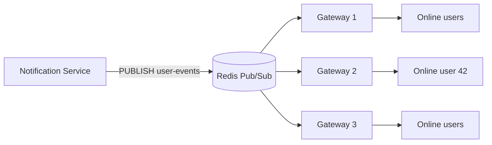
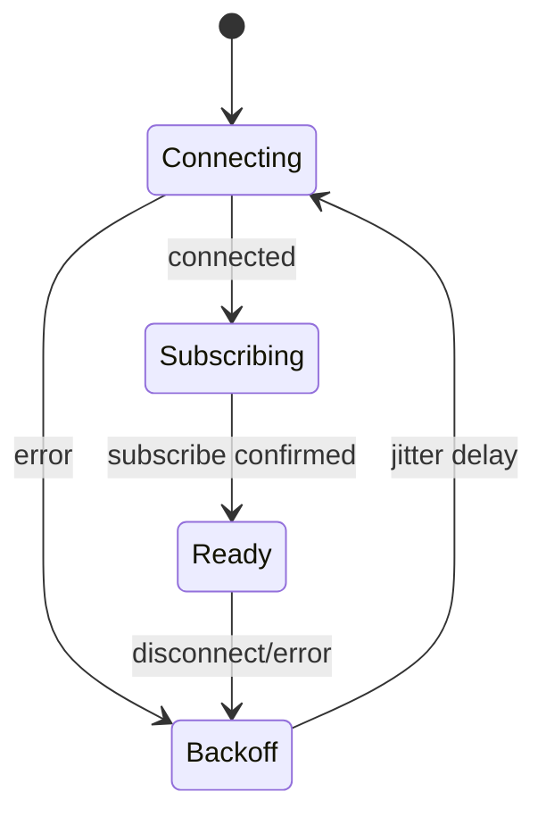
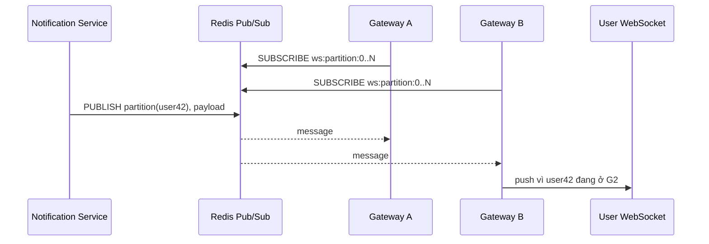
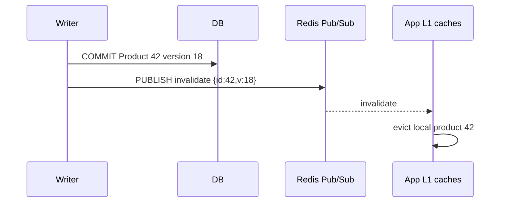

# Pub/Sub

## Mục lục

- [1. Vấn đề: phát một message cho nhiều listener đang online](#1-vấn-đề-phát-một-message-cho-nhiều-listener-đang-online)
- [2. Delivery semantics: at-most-once và không có history](#2-delivery-semantics-at-most-once-và-không-có-history)
- [3. Channel, subscriber và fan-out](#3-channel-subscriber-và-fan-out)
- [4. Command cơ bản](#4-command-cơ-bản)
- [5. Pattern subscription](#5-pattern-subscription)
- [6. Sharded Pub/Sub trong Redis Cluster](#6-sharded-pubsub-trong-redis-cluster)
- [7. Connection lifecycle, reconnect và backpressure](#7-connection-lifecycle-reconnect-và-backpressure)
- [8. Message contract, versioning và security](#8-message-contract-versioning-và-security)
- [9. Pub/Sub vs Streams, Lists và Kafka](#9-pubsub-vs-streams-lists-và-kafka)
- [10. Pattern thực tế: WebSocket fan-out](#10-pattern-thực-tế-websocket-fan-out)
- [11. Pattern thực tế: cache invalidation và configuration](#11-pattern-thực-tế-cache-invalidation-và-configuration)
- [12. Implementation Node.js end-to-end](#12-implementation-nodejs-end-to-end)
- [13. Redis Cluster, Sentinel và multi-region](#13-redis-cluster-sentinel-và-multi-region)
- [14. Capacity, observability và load test](#14-capacity-observability-và-load-test)
- [15. Failure modes và runbook](#15-failure-modes-và-runbook)
- [16. Anti-patterns và checklist production](#16-anti-patterns-và-checklist-production)
- [17. Tóm tắt decision table](#17-tóm-tắt-decision-table)
- [Tài liệu tham khảo](#tài-liệu-tham-khảo)

---

## 1. Vấn đề: phát một message cho nhiều listener đang online

Giả sử 20 WebSocket gateway đang giữ connection của user. Khi user 42 nhận notification, application không biết gateway nào đang giữ socket. Nó publish lên một channel; mọi gateway đang subscribe nhận message và gateway có connection phù hợp sẽ push xuống client.



Redis Pub/Sub tối ưu cho **low-latency ephemeral fan-out**: publisher không cần biết subscriber, channel không phải key và message không được lưu lại.

Use case phù hợp:

- WebSocket/SSE notification mà client có cơ chế resync.
- Cache invalidation best-effort với TTL safety net.
- Presence/typing indicator.
- Live metrics không cần replay.
- Signal “hãy reload config từ source of truth”.

Không phù hợp cho payment event, order workflow, job queue hoặc audit log cần ack/retry/replay.

---

## 2. Delivery semantics: at-most-once và không có history

Redis Pub/Sub có semantics **at-most-once** ở tầng server delivery: message được đẩy một lần tới subscriber đang kết nối; nếu subscriber lỗi/mất kết nối/không xử lý kịp thì message mất, Redis không redeliver.

```text
T1 subscriber online
T2 PUBLISH m1 → nhận m1
T3 subscriber disconnect
T4 PUBLISH m2 → m2 biến mất đối với subscriber này
T5 reconnect
T6 subscriber không có lệnh để đọc lại m2
```

### 2.1. Không có backlog, ack hay consumer group

Pub/Sub không có:

- Message ID/persisted log.
- `ACK` và pending entries.
- Retry/dead-letter queue.
- Replay từ offset.
- Load balancing một message cho đúng một worker; mọi subscriber phù hợp đều nhận.

`PUBLISH` trả số subscriber client mà message được gửi tới tại thời điểm đó; con số này **không chứng minh business processing thành công**.

```bash
PUBLISH notifications '{"type":"ping"}'
# (integer) 3  ← 3 subscription matches/clients nhận ở Redis, không phải 3 xử lý xong
```

### 2.2. Pub/Sub và persistence

RDB/AOF không lưu message Pub/Sub để replay. Replica/persistence không biến channel thành queue. Nếu cần durable delivery, dùng [Streams](./streams.md) hoặc broker chuyên dụng.

> [!IMPORTANT]
> Hãy thiết kế subscriber reconnect như thể nó đã bỏ lỡ số message không xác định. Sau reconnect, subscriber phải resync từ source of truth nếu state cần chính xác.

---

## 3. Channel, subscriber và fan-out

Channel là tên logic, không phải Redis key:

```text
ws:tenant:9
events:product-updated
config:reload
presence:room:42
```

`PUBLISH channel payload` fan-out đến:

- Client subscribe chính xác channel bằng `SUBSCRIBE`.
- Client có pattern match channel bằng `PSUBSCRIBE`.
- Sharded subscribers chỉ qua cặp `SPUBLISH`/`SSUBSCRIBE`, không trộn với global Pub/Sub.

### 3.1. Channel không thuộc logical database

Redis Pub/Sub truyền trên toàn server/cluster namespace, không scope theo database number 0/1. Subscriber ở DB 10 vẫn nghe publisher DB 0 nếu cùng channel. Vì vậy channel name phải có environment/app/tenant namespace; đừng dựa vào `SELECT` để cô lập.

```text
prod:billing:v2:invoice-updated
staging:billing:v2:invoice-updated
```

### 3.2. Fan-out cost

Một message 10 KB đến 10.000 subscriber tạo lượng outbound rất lớn. Chi phí gần với số subscriber nhận × payload, cộng pattern matching. Redis single-threaded command path và network/output buffers có thể thành bottleneck.

```text
1.000 msg/s × 2 KB × 5.000 subscriber ≈ 10 GB/s payload fan-out
```

Đây là rough calculation chưa gồm protocol/TLS. Pub/Sub “command rất nhanh” không có nghĩa fan-out vô hạn.

---

## 4. Command cơ bản

### 4.1. Subscribe và publish

Terminal A:

```bash
SUBSCRIBE orders.status users.presence
```

Terminal B:

```bash
PUBLISH orders.status '{"orderId":"8812","status":"SHIPPED"}'
```

Subscriber nhận frame gồm loại message, channel và payload. Dạng cụ thể phụ thuộc RESP/client library.

### 4.2. Unsubscribe

```bash
UNSUBSCRIBE orders.status
UNSUBSCRIBE
```

Không argument thường unsubscribe tất cả channel tương ứng. Pattern dùng `PUNSUBSCRIBE`; sharded dùng `SUNSUBSCRIBE`.

### 4.3. Introspection

```bash
PUBSUB CHANNELS 'orders.*'
PUBSUB NUMSUB orders.status users.presence
PUBSUB NUMPAT
```

Các số này là snapshot vận hành, có thể đổi ngay sau lệnh. Không dùng để đảm bảo “chỉ publish khi có subscriber” cho correctness vì race.

### 4.4. RESP2 và RESP3 subscribed mode

Ở RESP2, connection đã subscribe bị giới hạn command có thể gửi; thực tế client library dùng dedicated subscriber connection. RESP3 cho phép linh hoạt hơn theo server/client support, nhưng tách connection vẫn là best practice để tránh message stream và command thông thường tranh chấp/head-of-line.

---

## 5. Pattern subscription

```bash
PSUBSCRIBE 'events:product:*' 'tenant:*:invalidate'
PUBLISH events:product:updated '{"id":42}'
```

Pattern dùng glob-style matching như `*`, `?`, character classes theo Redis rules. Nó tiện cho dynamic channels nhưng có trade-off:

- Redis phải kiểm tra pattern khi publish; nhiều pattern làm tăng CPU.
- Subscriber có thể nhận channel ngoài ý muốn nếu pattern quá rộng.
- Khó enforce tenant isolation chỉ bằng pattern.
- Một client subscribe cả exact channel và matching pattern có thể nhận message qua cả hai subscription; application phải hiểu/dedupe nếu cần.

Không tạo hàng triệu pattern subscription tùy user. Với WebSocket, thường subscribe một số channel partition/tenant rồi route trong process, hoặc dùng sharded channel strategy.

---

## 6. Sharded Pub/Sub trong Redis Cluster

Global Pub/Sub truyền message trên cluster theo cơ chế broadcast/propagation, nên cluster bus có thể chịu tải lớn. Redis 7 giới thiệu **sharded Pub/Sub** để channel được gắn với hash slot và message chỉ lan trong shard liên quan.

```bash
SSUBSCRIBE realtime:{tenant42}
SPUBLISH realtime:{tenant42} '{"type":"update"}'
```

### 6.1. Global vs sharded

| Tiêu chí | `PUBLISH/SUBSCRIBE` | `SPUBLISH/SSUBSCRIBE` |
|----------|---------------------|-----------------------|
| Phạm vi | Global Pub/Sub | Hash-slot/shard |
| Cluster propagation | Rộng hơn | Giới hạn shard |
| Pattern subscription | `PSUBSCRIBE` có | Không tương đương pattern sharded phổ biến |
| Use case | Broadcast nhỏ/toàn cluster | High-throughput partitioned fan-out |

Hash tag `{tenant42}` kiểm soát slot giống key. Publisher/client phải route đến node phù hợp; dùng client library hỗ trợ sharded Pub/Sub và topology changes.

### 6.2. Sharded không làm message durable

Nó cải thiện scalability/topology, không thêm history, ack hay replay. Subscriber offline vẫn mất message.

---

## 7. Connection lifecycle, reconnect và backpressure

### 7.1. Dedicated long-lived connection

Subscriber giữ connection mở lâu dài. Mỗi app instance thường cần:

- Command pool riêng cho GET/SET.
- Một hoặc vài subscriber connections riêng.
- Reconnect loop có exponential backoff + jitter.
- Resubscribe sau reconnect theo behavior client library.
- Readiness chỉ báo ready khi subscription cần thiết đã xác nhận.



### 7.2. Reconnect gap

Trong thời gian disconnect + reconnect + resubscribe, message mất. Subscriber phải:

- Reload snapshot/config từ database/Redis key.
- Reconcile WebSocket client state qua sequence/version API.
- Hoặc nếu không được mất, chuyển transport sang Stream/broker.

### 7.3. Slow subscriber và output buffer

Redis đẩy message vào client output buffer. Subscriber xử lý chậm/network chậm làm buffer tăng; server có giới hạn `client-output-buffer-limit pubsub`. Vượt giới hạn, Redis disconnect client để bảo vệ memory.

Hậu quả: disconnect → mất message trong gap → reconnect storm nếu nhiều client cùng chậm.

Subscriber handler không nên làm CPU/blocking I/O lâu trên receive loop. Đưa xử lý nhẹ vào bounded in-process queue, nhưng queue đầy phải có policy drop/coalesce/disconnect; queue vô hạn chỉ chuyển OOM từ Redis sang app.

### 7.4. Backpressure không có end-to-end

Publisher không chờ subscriber xử lý. Nếu publisher 100k msg/s, subscriber xử lý 10k msg/s, backlog chỉ nằm tạm trong buffers rồi disconnect/OOM; Pub/Sub không tự làm chậm publisher. Cần coalesce state updates, sample, shard, hoặc dùng durable queue có consumer lag.

---

## 8. Message contract, versioning và security

### 8.1. Envelope

```json
{
  "type": "ProductPriceChanged",
  "version": 2,
  "messageId": "01J...",
  "occurredAt": "2026-07-10T10:15:30Z",
  "tenantId": "t_9",
  "aggregateId": "p_42",
  "aggregateVersion": 18,
  "data": { "price": 199000 }
}
```

Pub/Sub không cần message ID để ack nhưng ID/version giúp tracing, dedupe best-effort và resync. Payload nên nhỏ; message lớn được copy tới nhiều clients.

### 8.2. Event hay signal

Một design bền hơn cho Pub/Sub là publish **signal**:

```json
{ "type": "ProductChanged", "id": "42", "version": 18 }
```

Subscriber nhận signal rồi đọc state authoritative. Nếu bỏ lỡ signal, periodic/reconnect resync vẫn lấy state mới nhất. Với event delta `increment +1`, bỏ lỡ một message làm state sai vĩnh viễn; delta cần durable log.

### 8.3. Compatibility

- Thêm field optional, reader bỏ qua field chưa biết.
- Không đổi nghĩa field cũ.
- Version envelope/event.
- Rolling deploy: producer mới và subscriber cũ cùng tồn tại.
- Dead-letter không có sẵn; malformed message phải metric/log sample và bỏ qua, không crash receive loop.

### 8.4. Security

Redis ACL có thể giới hạn Pub/Sub channel patterns riêng với key patterns trên Redis hiện đại. Thiết kế ACL theo phiên bản đang chạy. Ngoài ra:

- TLS/private network.
- Không publish password/token/PII không cần thiết.
- Tenant isolation phải enforce ở publisher/subscriber, không tin channel string do client nhập.
- WebSocket client không được trực tiếp chọn arbitrary Redis channel.
- Payload validation và size limit.

Xem [Security](./security.md).

---

## 9. Pub/Sub vs Streams, Lists và Kafka

| Tiêu chí | Pub/Sub | Redis Streams | Redis List queue | Kafka |
|----------|---------|---------------|------------------|-------|
| Message lưu lại | Không | Có đến khi trim | Có đến khi pop | Có theo retention |
| Offline consumer | Mất message | Đọc lại | Job chờ trong list | Đọc lại theo offset |
| Fan-out nhiều group | Tất cả online subscriber | Nhiều consumer group độc lập | Cần nhiều queue/copy | Consumer groups |
| Ack/pending | Không | Có PEL/XACK | Tự thiết kế với reliable queue | Offset/commit |
| Replay | Không | Theo ID | Không tự nhiên sau pop | Có |
| Latency/đơn giản | Rất thấp/đơn giản | Thấp, state nhiều hơn | Đơn giản cho work queue | Vận hành lớn hơn |
| Scale/durability | Ephemeral | Trong Redis limits | Queue đơn giản | Log phân tán lớn |

Decision:

```text
Có được phép mất message khi consumer offline?
├─ Có → cần broadcast tới mọi listener online?
│       ├─ Có → Pub/Sub
│       └─ Không, một worker nhận job → List/queue
└─ Không → cần ack/retry/replay?
        ├─ Redis scale đủ → Streams
        └─ Retention/partition/ecosystem lớn → Kafka/broker chuyên dụng
```

Đọc [Streams](./streams.md) và [Lists](./lists.md).

---

## 10. Pattern thực tế: WebSocket fan-out

### 10.1. Kiến trúc



Nếu mọi gateway subscribe mọi message, fan-out nội bộ = gateways × messages dù chỉ một gateway có user. Tối ưu:

- Partition user thành N channels; gateway subscribe partition có local users, nhưng subscription churn phức tạp.
- Presence map user → gateway, publish channel per gateway.
- Sharded Pub/Sub theo tenant/partition.
- Gateway local index route O(1).

### 10.2. Recovery

Notification quan trọng phải lưu vào database/inbox trước publish:

```text
transaction lưu notification unread
→ publish signal notification_available(userId)
→ WebSocket hiển thị
→ nếu signal mất, client reconnect GET /notifications?after=cursor
```

Pub/Sub làm realtime hint; durable inbox đảm bảo không mất business notification.

### 10.3. Ordering

Redis giữ order message theo connection/channel trong điều kiện bình thường, nhưng reconnect, nhiều publisher/channel và client async processing có thể làm business order không đáng tin. Gắn aggregate version/sequence; client bỏ version cũ và resync khi thấy gap.

---

## 11. Pattern thực tế: cache invalidation và configuration

### 11.1. Cache invalidation



Nếu app offline bỏ lỡ invalidation, local cache có thể stale. Safety net:

- L1 TTL ngắn.
- Version check.
- Reconnect clear toàn cache hoặc reload generation.
- Durable invalidation Stream nếu stale không chấp nhận được.

Không publish trước DB commit; subscriber có thể reload value cũ rồi cache lại.

### 11.2. Config reload

Publish “config version 57 available”, không publish secret/full config. Subscriber đọc source of truth, validate rồi atomically swap local config. Sau reconnect luôn compare current version. Pub/Sub là wake-up signal, config store mới là authoritative.

### 11.3. Presence/typing

Ephemeral nature rất phù hợp: nếu mất “user đang gõ”, không cần replay sau 30 giây. Dùng TTL cho presence state riêng nếu cần snapshot; Pub/Sub chỉ push thay đổi realtime.

---

## 12. Implementation Node.js end-to-end

Ví dụ với API kiểu `node-redis`:

```typescript
import { createClient } from 'redis';

const command = createClient({ url: process.env.REDIS_URL });
command.on('error', (err) => logger.error({ err }, 'redis command error'));
await command.connect();

// duplicate tạo connection riêng cho subscriber
const subscriber = command.duplicate();
subscriber.on('error', (err) => logger.error({ err }, 'redis subscriber error'));
await subscriber.connect();

await subscriber.subscribe('prod:ws:v2:user-events', async (raw, channel) => {
  try {
    if (Buffer.byteLength(raw, 'utf8') > 64 * 1024) {
      metrics.increment('pubsub.message_too_large');
      return;
    }

    const event = parseAndValidateEnvelope(raw);
    if (event.version !== 2) {
      metrics.increment('pubsub.unsupported_version');
      return;
    }

    // Handler nên nhanh; nếu async queue thì phải bounded.
    websocketHub.deliver(event.aggregateId, event);
    metrics.increment('pubsub.processed', { type: event.type });
  } catch (error) {
    metrics.increment('pubsub.invalid_message');
    logger.warn({ error, channel }, 'drop invalid pubsub message');
  }
});
```

Publish:

```typescript
async function signalUser(userId: string, notificationId: string) {
  const payload = JSON.stringify({
    type: 'NotificationAvailable',
    version: 2,
    messageId: crypto.randomUUID(),
    aggregateId: userId,
    data: { notificationId },
  });

  const receivers = await command.publish('prod:ws:v2:user-events', payload);
  metrics.histogram('pubsub.receivers').observe(receivers);
  // receivers=0 không rollback durable notification.
}
```

Shutdown:

```typescript
await subscriber.unsubscribe('prod:ws:v2:user-events');
await subscriber.quit();
await command.quit();
```

Client library reconnect/resubscribe semantics thay đổi theo library/version; integration test bằng cách kill connection/server. Không giả định từ pseudo-code.

---

## 13. Redis Cluster, Sentinel và multi-region

### 13.1. Cluster topology

Global Pub/Sub có thể tạo cluster-bus traffic. Sharded Pub/Sub giảm propagation bằng slot locality. Client cần theo dõi topology và resubscribe khi node failover/reshard; chọn library có hỗ trợ rõ.

`PUBSUB NUMSUB` trong cluster có thể phản ánh scope/node khác nhau tùy command/mode; dùng để debug, không làm business guarantee.

### 13.2. Sentinel/failover

Khi primary failover:

1. Existing connection disconnect.
2. Client discover primary mới.
3. Reconnect.
4. Resubscribe.
5. Message trong gap mất.

Persistence không lấp gap. Application recovery phải resync.

### 13.3. Multi-region

Pub/Sub local region cho latency thấp. Bridge xuyên region tự viết dễ tạo loop/duplicate và không có replay. Nếu event cần global reliable distribution, dùng broker/log multi-region. Nếu chỉ realtime hint, publish region-local và client fetch authoritative state qua API.

---

## 14. Capacity, observability và load test

### 14.1. Capacity model

Ước lượng tối thiểu:

```text
inbound bytes/s  = publish rate × payload size
outbound bytes/s = Σ(message size × matching subscribers)
handler load     = delivered messages/s trên mỗi subscriber process
```

Pattern subscription tăng matching CPU. TLS tăng CPU. Slow clients tăng output-buffer memory.

### 14.2. Metrics

| Lớp | Metrics |
|-----|---------|
| Publisher | publish rate/error/latency, receiver count distribution, payload size |
| Redis | connected pubsub clients, network in/out, CPU, output buffer, disconnected clients |
| Subscriber | reconnect count, subscription ready time, messages/s, handler latency/error/drop |
| Business | WebSocket delivery, resync count, sequence gap, stale-cache incidents |

`PUBLISH receivers=0` không luôn là lỗi: có thể không user online. Alert theo expected topology/channel, không global rule.

### 14.3. Load test

Test topology thật:

- Số publisher/subscriber như production.
- Payload p50/p99.
- Exact + pattern subscriptions.
- Một subscriber cố tình chậm.
- Network disconnect/failover/reconnect storm.
- Cluster global vs sharded mode.
- Đo Redis CPU/network/output buffers và app queue.

Benchmark một publisher + một subscriber không dự đoán fan-out 1.000 subscribers.

---

## 15. Failure modes và runbook

| Triệu chứng | Nguyên nhân | Xử lý |
|-------------|-------------|-------|
| Subscriber không nhận | Chưa subscribe, sai namespace, reconnect gap, ACL | Check subscribe confirmation, channel, ACL, connection |
| Nhận duplicate | Exact + pattern cùng match, bridge/reconnect logic | Inspect subscription set; dedupe bằng message/version nếu cần |
| Redis disconnect subscriber | Output buffer vượt limit, network, failover | Kiểm tra slow handler/buffer, bounded queue, resync |
| CPU Redis cao khi publish | Fan-out/pattern quá lớn | Giảm patterns, partition/sharded Pub/Sub, payload/rate |
| Cache stale sau deploy | Bỏ lỡ invalidation | Clear/resync on reconnect, TTL safety net |
| WebSocket gap | Gateway offline/reconnect | Client cursor fetch durable inbox/snapshot |

Runbook:

1. Xác minh publisher có publish đúng environment/channel.
2. Kiểm tra subscriber connection và subscribe acknowledgement.
3. Xem reconnect/failover timeline; chấp nhận rằng message gap không thể truy xuất từ Pub/Sub.
4. Trigger resync từ source of truth.
5. Kiểm tra output buffers, handler latency và app queue.
6. Nếu loss không được phép, lập kế hoạch migrate flow sang Stream/broker thay vì thêm retry quanh Pub/Sub.

---

## 16. Anti-patterns và checklist production

### 16.1. Anti-patterns

1. Dùng Pub/Sub làm payment/order queue.
2. Tin `PUBLISH` return count là xử lý thành công.
3. Mong AOF/RDB lưu channel messages.
4. Subscriber reconnect nhưng không resync.
5. Handler blocking làm output buffer tăng.
6. In-process queue vô hạn.
7. Mọi gateway subscribe mọi user event dù chỉ một gateway cần.
8. Hàng triệu pattern subscription.
9. Payload lớn/full object/secret trên channel.
10. Dựa vào Redis database number để isolate channel.
11. Publish invalidation trước DB commit.
12. Không version message qua rolling deploy.
13. Dùng global Pub/Sub trên Cluster cho traffic partitionable rất lớn.

### 16.2. Checklist

- [ ] Business chấp nhận loss khi subscriber offline.
- [ ] Source of truth/resync path tồn tại.
- [ ] Dedicated subscriber connection.
- [ ] Reconnect + resubscribe + readiness đã test.
- [ ] Handler nhanh hoặc queue bounded có drop policy.
- [ ] Channel namespace gồm environment/app/version.
- [ ] Payload schema/version/size limit.
- [ ] TLS, ACL channel và tenant isolation.
- [ ] Global vs sharded Pub/Sub được chọn có chủ đích.
- [ ] Metrics reconnect, drop, output buffer, payload/fan-out.
- [ ] Load test slow subscriber và failover.
- [ ] Durable event dùng Stream/broker, không Pub/Sub.

---

## 17. Tóm tắt decision table

| Nhu cầu | Chọn |
|---------|------|
| Broadcast realtime, listener offline không cần replay | Pub/Sub |
| Cache invalidation có TTL/resync | Pub/Sub signal |
| WebSocket notification có durable inbox | DB/inbox + Pub/Sub wake-up |
| Job phải một worker xử lý | List/Stream queue |
| Event cần ack/retry/replay | Redis Streams |
| Log lớn, retention dài, nhiều partition/group | Kafka/broker chuyên dụng |
| Cluster fan-out partitionable lớn | Sharded Pub/Sub |

Ba nguyên tắc:

1. **Pub/Sub là transient signal bus, không phải message store**.
2. **Reconnect luôn tạo một khoảng có thể mất message**, nên state quan trọng phải resync.
3. **Fan-out và slow subscriber quyết định capacity**, không chỉ số lệnh `PUBLISH` mỗi giây.

---

## Tài liệu tham khảo

- [Redis Pub/Sub](https://redis.io/docs/latest/develop/pubsub/)
- [Redis command: PUBLISH](https://redis.io/docs/latest/commands/publish/)
- [Redis command: SSUBSCRIBE](https://redis.io/docs/latest/commands/ssubscribe/)
- [Redis client output buffer limits](https://redis.io/docs/latest/develop/reference/clients/)
- [Streams](./streams.md)
- [Lists](./lists.md)
- [Redis Cluster](./cluster.md)
