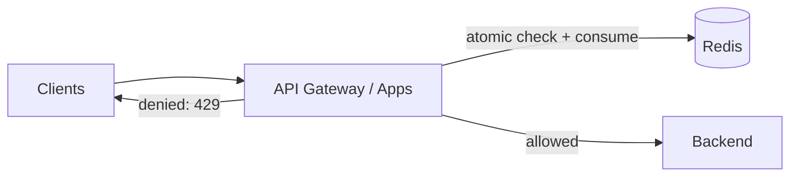
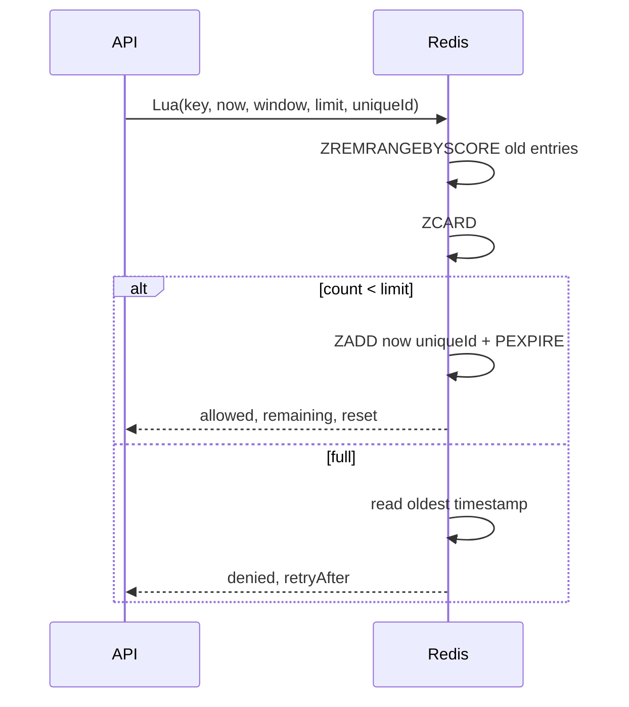
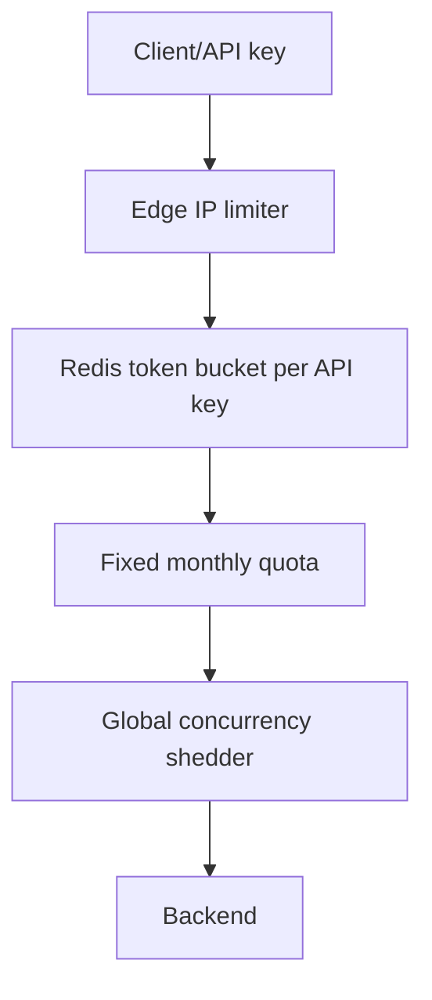

# Rate Limiting

## Mục lục

- [1. Vấn đề: giới hạn tải mà vẫn công bằng](#1-vấn-đề-giới-hạn-tải-mà-vẫn-công-bằng)
- [2. Xác định policy trước khi chọn thuật toán](#2-xác-định-policy-trước-khi-chọn-thuật-toán)
- [3. Tại sao Redis phù hợp](#3-tại-sao-redis-phù-hợp)
- [4. Fixed window counter](#4-fixed-window-counter)
- [5. Sliding window log](#5-sliding-window-log)
- [6. Sliding window counter](#6-sliding-window-counter)
- [7. Token bucket](#7-token-bucket)
- [8. Leaky bucket và GCRA](#8-leaky-bucket-và-gcra)
- [9. Atomicity: Lua, Functions và transaction](#9-atomicity-lua-functions-và-transaction)
- [10. Response headers và client behavior](#10-response-headers-và-client-behavior)
- [11. Identity, key design và nhiều tầng limit](#11-identity-key-design-và-nhiều-tầng-limit)
- [12. Redis Cluster, replica và multi-region](#12-redis-cluster-replica-và-multi-region)
- [13. Failure policy và chống limiter trở thành bottleneck](#13-failure-policy-và-chống-limiter-trở-thành-bottleneck)
- [14. Capacity planning và observability](#14-capacity-planning-và-observability)
- [15. Test correctness và load](#15-test-correctness-và-load)
- [16. Case study: public API nhiều gói dịch vụ](#16-case-study-public-api-nhiều-gói-dịch-vụ)
- [17. Anti-patterns và checklist](#17-anti-patterns-và-checklist)
- [18. Decision table và cheat sheet](#18-decision-table-và-cheat-sheet)
- [Tài liệu tham khảo](#tài-liệu-tham-khảo)

---

## 1. Vấn đề: giới hạn tải mà vẫn công bằng

Rate limiting trả lời: **một identity được thực hiện bao nhiêu hành động trong một khoảng thời gian**. Mục tiêu không chỉ chống DDoS; nó còn bảo vệ database, giữ công bằng giữa tenant, enforce quota và giới hạn chi phí API bên thứ ba.

```text
Không rate limit
Client lỗi retry 50.000 req/s → API → DB pool đầy → mọi user lỗi

Có rate limit
Client lỗi → limiter chỉ cho 100 req/s → phần dư nhận 429
                                    → hệ thống còn phục vụ user khác
```

Rate limiter không thay thế authentication, WAF, concurrency limit hay backpressure. Rate đo “bao nhiêu trong thời gian”; concurrency limit đo “bao nhiêu đang chạy cùng lúc”. Endpoint 1 request tốn 30 giây có thể cần cả hai.

---

## 2. Xác định policy trước khi chọn thuật toán

Một policy đầy đủ gồm:

```text
subject + action + rate + burst + scope + response + failure mode
```

Ví dụ:

```text
Mỗi API key được 100 request/60 giây cho POST /search,
burst tối đa 20, tính toàn cầu, vượt limit trả 429,
limiter lỗi thì fail-open tối đa 30 giây nhưng có local emergency limit.
```

### 2.1. Các câu hỏi bắt buộc

| Câu hỏi | Ví dụ |
|---------|-------|
| Giới hạn ai? | IP, user ID, API key, tenant, device |
| Giới hạn cái gì? | Toàn API, endpoint, write, OTP, compute units |
| Cửa sổ nào? | 10/s, 1.000/h, 1 triệu/tháng |
| Có cho burst? | 20 ngay lập tức rồi refill 10/s |
| Toàn cầu hay mỗi region? | Global billing quota vs regional protection |
| Vượt limit làm gì? | 429, queue, degrade, CAPTCHA |
| Redis lỗi? | Fail-open hay fail-closed |

Đừng dùng IP làm identity duy nhất cho authenticated API: NAT có thể khiến hàng nghìn user chung IP; attacker có thể xoay IP. Ngược lại, trước login chưa có user ID nên IP/device fingerprint vẫn hữu ích.

---

## 3. Tại sao Redis phù hợp

Redis có counter atomic, TTL, Sorted Set và server-side Lua/Functions. Tất cả application instance nhìn cùng state:



Yêu cầu quan trọng là **check và consume phải atomic**. Nếu code `GET count`, so sánh, rồi `INCR`, 100 request song song đều có thể nhìn thấy 99 và cùng được phép.

Latency limiter nằm trên mọi request, nên cần timeout ngắn, connection pooling, script cache và metrics riêng.

---

## 4. Fixed window counter

Chia thời gian thành bucket cố định, ví dụ mỗi phút:

```text
key = rl:user:42:search:29723333   # floor(epochSeconds / 60)
INCR key
EXPIRE key 120
```

### 4.1. Atomic implementation

Lua:

```lua
-- KEYS[1] window key
-- ARGV[1] limit, ARGV[2] key TTL milliseconds
local count = redis.call('INCR', KEYS[1])
if count == 1 then
  redis.call('PEXPIRE', KEYS[1], tonumber(ARGV[2]))
end
local allowed = count <= tonumber(ARGV[1])
local ttl = redis.call('PTTL', KEYS[1])
return {allowed and 1 or 0, count, ttl}
```

Application tính bucket từ clock nhất quán hoặc script dùng Redis `TIME`. TTL nên dài hơn window để cleanup; correctness đến từ bucket ID, không phụ thuộc TTL đúng từng mili giây.

### 4.2. Boundary burst

Limit 100/phút vẫn có thể cho 200 request trong khoảng 2 giây:

```text
12:00:59.000–12:00:59.999: 100 request của window A
12:01:00.000–12:01:00.999: 100 request của window B
```

Đây không phải bug implementation mà là property thuật toán.

### 4.3. Khi dùng

- Quota billing/report theo minute/day/month.
- Endpoint không nhạy với burst tại boundary.
- Cần memory O(1) mỗi subject-window và implementation đơn giản.

---

## 5. Sliding window log

Lưu timestamp của từng request trong Sorted Set. Mỗi check:

1. Xóa entry cũ hơn `now - window`.
2. Đếm phần còn lại.
3. Nếu dưới limit, thêm request hiện tại.
4. Đặt TTL cleanup.



Lua minh họa:

```lua
-- KEYS[1] limiter key
-- ARGV: nowMs, windowMs, limit, member
local now = tonumber(ARGV[1])
local window = tonumber(ARGV[2])
local limit = tonumber(ARGV[3])
local cutoff = now - window

redis.call('ZREMRANGEBYSCORE', KEYS[1], '-inf', cutoff)
local count = redis.call('ZCARD', KEYS[1])

if count < limit then
  redis.call('ZADD', KEYS[1], now, ARGV[4])
  redis.call('PEXPIRE', KEYS[1], window + 1000)
  return {1, limit - count - 1, 0}
end

local oldest = redis.call('ZRANGE', KEYS[1], 0, 0, 'WITHSCORES')
local retry = window
if oldest[2] then retry = math.max(0, tonumber(oldest[2]) + window - now) end
return {0, 0, retry}
```

Member phải unique. Chỉ dùng timestamp làm member khiến nhiều request cùng millisecond overwrite nhau và undercount. Dùng `<timestamp>:<requestId>` hoặc sequence.

### 5.1. Complexity và memory

- Memory O(limit × active subjects), vì lưu từng request được giữ trong window.
- `ZADD`/range cleanup O(log N + M).
- Limit 10 triệu/ngày cho từng tenant không phù hợp sliding log nguyên bản.

Sliding log chính xác và không có boundary burst lớn, phù hợp OTP/login hoặc limit nhỏ cần audit timestamp.

---

## 6. Sliding window counter

Xấp xỉ sliding window bằng hai fixed buckets. Nếu hiện tại đã đi `p` phần của window:

```text
estimated = current_count + previous_count × (1 - p)
```

Ví dụ window 60 giây, đang ở giây 15 (`p=0,25`), bucket trước có 80, bucket hiện tại có 20:

```text
estimated = 20 + 80 × 0,75 = 80
```

Ưu điểm: memory O(1), mượt hơn fixed window. Nhược điểm: xấp xỉ vì giả định request bucket trước phân bố đều.

```text
previous window          current window
[80 requests]            [20 requests ....]
        phần overlap ────────┘
```

Dùng Lua để đọc/increment các bucket atomically. Trong Cluster, hai key phải cùng slot hoặc gói hai counter vào một Hash key:

```text
HSET rl:{user42}:search previous 80 current 20 currentBucket 29723333
```

---

## 7. Token bucket

Bucket có:

- Capacity `C`: số token tối đa, quyết định burst.
- Refill rate `r`: token/giây, quyết định sustained rate.
- Mỗi request tốn `cost` token.

```text
tokens mới = min(C, tokens_cũ + elapsed × r)
allowed nếu tokens mới >= cost
nếu allowed: tokens mới -= cost
```

Ví dụ `C=20`, `r=10/s`: client im lặng sẽ tích tối đa 20 token, có thể burst 20 request rồi tiếp tục trung bình 10/s.

### 7.1. Lua token bucket

Lưu `tokens` và `lastRefillMs` trong Hash:

```lua
-- KEYS[1] bucket
-- ARGV: nowMs, capacity, refillPerMs, cost, ttlMs
local now = tonumber(ARGV[1])
local capacity = tonumber(ARGV[2])
local rate = tonumber(ARGV[3])
local cost = tonumber(ARGV[4])

local data = redis.call('HMGET', KEYS[1], 'tokens', 'ts')
local tokens = tonumber(data[1]) or capacity
local ts = tonumber(data[2]) or now
local elapsed = math.max(0, now - ts)
tokens = math.min(capacity, tokens + elapsed * rate)

local allowed = 0
local retry = 0
if tokens >= cost then
  tokens = tokens - cost
  allowed = 1
else
  retry = math.ceil((cost - tokens) / rate)
end

redis.call('HSET', KEYS[1], 'tokens', tokens, 'ts', now)
redis.call('PEXPIRE', KEYS[1], tonumber(ARGV[5]))
return {allowed, math.floor(tokens), retry}
```

Lưu ý:

- Floating-point và return type qua Lua/client cần test; có thể lưu microtokens integer để tránh sai số.
- `rate=0` phải validate ngoài script để tránh chia 0.
- Client clock có thể lùi/nhảy; dùng Redis `TIME` trong script nếu cần authoritative clock, đổi lại khó test hơn và có giới hạn khi chạy deterministic replication ở các phiên bản/cấu hình cũ.
- TTL nên đủ để bucket đầy rồi state có thể biến mất mà khởi tạo lại thành full.

### 7.2. Weighted cost

Token bucket hỗ trợ request cost khác nhau:

```text
GET /profile cost=1
POST /search cost=5
POST /export cost=100
```

Điều này bảo vệ compute tốt hơn “mọi request bằng nhau”, nhưng cost phải phản ánh tài nguyên và không bị client tự chọn.

---

## 8. Leaky bucket và GCRA

### 8.1. Leaky bucket

Hình dung request vào một bucket và rò ra với tốc độ cố định. Có hai cách dùng khái niệm:

- **Meter**: quyết định accept/reject để output mượt.
- **Queue**: enqueue rồi worker xử lý đều; lúc này cần queue durability/backpressure, không chỉ limiter.

Leaky bucket phù hợp khi muốn traffic ra đều hơn token bucket. Token bucket cho burst rõ ràng hơn.

### 8.2. GCRA

Generic Cell Rate Algorithm lưu một mốc **theoretical arrival time (TAT)** thay vì danh sách timestamp. Với interval `T = 1/rate` và burst tolerance, request được phép nếu không đến quá sớm; sau đó đẩy TAT tiến lên.

Ưu điểm:

- O(1) state mỗi key.
- Chính xác hơn fixed/sliding approximation cho rate đều.
- Tính được retry-after.

Nhược điểm: công thức và boundary khó giải thích/debug; cần test bằng timeline. Nếu team không thể review correctness, token bucket thường dễ vận hành hơn.

---

## 9. Atomicity: Lua, Functions và transaction

### 9.1. Vì sao pipeline không đủ

Pipeline giảm round trip nhưng không ngăn command của client khác xen giữa. `INCR` tự atomic, nhưng chuỗi “cleanup → count → add → expire” phải là một atomic unit.

### 9.2. Lua

`EVALSHA` script chạy atomically trên Redis event loop. Không có command khác xen giữa, nhưng script dài sẽ block mọi client trên shard. Script limiter phải bounded, không scan collection lớn.

- Load script lúc startup, dùng `EVALSHA`, fallback `SCRIPT LOAD` khi `NOSCRIPT`.
- Truyền mọi key qua `KEYS`, dữ liệu qua `ARGV`.
- Trong Cluster, mọi key script truy cập phải cùng hash slot.
- Version script và test response contract.

Xem [Lua Scripting](./lua-scripting.md).

### 9.3. Redis Functions

Redis Functions lưu logic server-side và được quản lý như library trên Redis hiện đại. Ưu điểm là deployment/persistence tốt hơn ad-hoc script; vẫn có cùng yêu cầu atomic, bounded execution và same-slot. Chọn theo phiên bản/server management của tổ chức.

### 9.4. MULTI/EXEC

Transaction phù hợp fixed counter đơn giản, nhưng conditional logic cần `WATCH` + retry hoặc Lua. Retry conflict cao trên hot limiter key làm tăng latency.

---

## 10. Response headers và client behavior

Khi deny, trả `429 Too Many Requests`. Headers thường dùng:

```http
HTTP/1.1 429 Too Many Requests
Retry-After: 17
RateLimit-Limit: 100
RateLimit-Remaining: 0
RateLimit-Reset: 17
Content-Type: application/problem+json
```

Tên/semantics `RateLimit-*` cần theo chuẩn và gateway đang dùng; đừng trộn reset epoch với delta seconds mà không document. `Retry-After` có thể là số giây hoặc HTTP date.

Body:

```json
{
  "type": "https://api.example.com/problems/rate-limit",
  "title": "Rate limit exceeded",
  "status": 429,
  "retryAfterSeconds": 17,
  "policy": "search-per-user"
}
```

Client nên exponential backoff + jitter, tôn trọng `Retry-After`, không retry đồng loạt đúng một timestamp. Server không nên trả chi tiết giúp attacker suy ra security threshold nhạy cảm cho OTP/login.

---

## 11. Identity, key design và nhiều tầng limit

### 11.1. Key

```text
rl:v3:{tenant_9}:search:user_42
rl:v3:ip:203.0.113.0/24:login
```

Không nhét raw API key/email vào Redis key hoặc logs; dùng stable hash/HMAC. Canonicalize IPv6/IP trước khi tạo key để tránh bypass bằng nhiều biểu diễn.

### 11.2. Hierarchical limits

Một request có thể phải qua nhiều policy:

1. Per-IP chống abuse.
2. Per-user công bằng.
3. Per-tenant enforce plan.
4. Global endpoint bảo vệ backend.

```text
request → IP limit → user limit → tenant quota → global shedder → backend
```

Nếu consume tuần tự rồi policy cuối deny, các bucket trước đã mất token. Có thể chấp nhận (attempt cũng tiêu tài nguyên), hoặc dùng một Lua script multi-policy cùng slot. Đừng ép mọi global và per-user key cùng slot chỉ để atomic nếu tạo hot shard. Thường các tầng độc lập và “deny có thể vẫn consume” là policy hợp lệ nếu document.

### 11.3. Cardinality attack

Attacker gửi hàng triệu identity ngẫu nhiên khiến tạo hàng triệu limiter key. Phòng vệ:

- Validate/auth trước policy per-user khi có thể.
- TTL mọi key.
- Aggregate anonymous IP theo subnet/risk tier.
- Giới hạn key creation tại edge/local layer.
- Theo dõi key cardinality và memory theo prefix.

---

## 12. Redis Cluster, replica và multi-region

### 12.1. Cluster

Một limiter key nằm một slot nên single-key Lua hoạt động tốt. Hash tag dùng để gom các field/policy thật sự cần atomic:

```text
rl:{tenant9:user42}:read
rl:{tenant9:user42}:write
```

Một celebrity tenant có thể thành hot slot. Sharding state của **cùng một exact global limit** làm correctness khó vì phải tổng hợp; local shard allowance chỉ là xấp xỉ.

### 12.2. Không đọc limiter từ replica

Replication asynchronous; replica có counter cũ và cho phép vượt limit. Check/consume phải chạy trên primary. Failover có thể mất một số state gần nhất, gây temporary over-admission hoặc under-admission tùy restore.

### 12.3. Multi-region

Global exact limit cần coordination xuyên region, làm tăng latency và giảm availability. Các lựa chọn:

| Approach | Ưu | Nhược |
|----------|----|-------|
| Central global Redis | Chính xác hơn | Cross-region latency, single dependency |
| Chia quota theo region | Nhanh, độc lập | Traffic lệch làm region hết quota sớm |
| Local limits + async global billing | Available | Có thể vượt global ngắn hạn |
| Home-region per subject | Consistent theo user | Routing phức tạp |

Ví dụ quota 1.000/s có thể cấp region A 600, B 300, reserve 100 để rebalance. Đây là distributed quota allocation, không còn chỉ là Lua.

---

## 13. Failure policy và chống limiter trở thành bottleneck

### 13.1. Fail-open vs fail-closed

| Use case | Policy thường hợp lý |
|----------|----------------------|
| Public read API | Fail-open ngắn + local emergency limiter |
| Login/OTP/password reset | Fail-closed hoặc limit bảo thủ local |
| Billing quota cứng | Fail-closed/manual override |
| Internal protection | Tùy backend capacity; thường fail-open có shedder |

Fail-open không có nghĩa bỏ mọi bảo vệ. Dùng local token bucket per pod với quota bảo thủ trong lúc Redis lỗi. Vì mỗi pod có bucket riêng, tổng allowance tăng theo số pod; tính đến điều đó.

### 13.2. Timeout và retry

Limiter deadline phải nhỏ hơn request deadline nhiều lần. Nếu Redis timeout 100 ms và app retry 3 lần, limiter tự thêm 300 ms trước backend. Dùng:

- Timeout ngắn.
- Không hoặc tối đa một retry có jitter cho lỗi kết nối trước khi command chắc chắn gửi.
- Circuit breaker.
- Pool bounded.
- Không retry mù khi kết quả command không rõ: token có thể đã consume.

### 13.3. Load shedding

Rate limit theo identity không ngăn tổng tải từ hàng triệu identity hợp lệ. Thêm global concurrency/queue-depth/CPU-based load shedding ở gateway/backend.

---

## 14. Capacity planning và observability

### 14.1. Ước lượng state

Fixed/token bucket: khoảng một key/hash nhỏ mỗi active subject. Sliding log:

```text
members ≈ active_subjects × min(requests_in_window, limit)
```

100.000 user active × 100 request giữ trong log = 10 triệu ZSet members; overhead lớn hơn timestamp 8 byte rất nhiều. Đo `MEMORY USAGE` trên payload thật.

### 14.2. Metrics

| Metric | Ý nghĩa |
|--------|---------|
| allowed/denied theo policy | Tỷ lệ throttle và abuse |
| limiter latency p50/p99 | Dependency trên hot path |
| Redis error/timeout | Quyết định fail mode đang kích hoạt |
| remaining distribution | Policy quá chặt/rộng |
| key cardinality/memory | Cardinality attack/leak |
| hot keys/slot skew | Tenant lớn hoặc global key |
| backend saturation | Limiter có thực sự bảo vệ origin |

Không gắn raw user/API key vào metric label vì cardinality và PII. Log sample với hashed subject khi điều tra.

---

## 15. Test correctness và load

### 15.1. Deterministic timeline tests

Inject `now` vào algorithm test:

```text
Token bucket C=3, refill=1/s
T=0: 3 requests allowed, request 4 denied
T=500ms: vẫn denied nếu cost=1
T=1000ms: 1 request allowed
T=10000ms: bucket chỉ đầy 3, không tích vô hạn
```

Test boundary fixed/sliding, clock lùi, duplicate request ID, TTL expiry, capacity/cost invalid.

### 15.2. Concurrency test

Bắn 1.000 request đồng thời vào limit 100 và xác minh đúng policy (không phải “xấp xỉ” ngoài dự kiến). Test trên Redis thật vì mock không mô phỏng atomicity/Cluster.

### 15.3. Chaos/failure

- Kill connection trước/sau script response.
- Redis failover giữa burst.
- `NOSCRIPT` sau restart.
- Hot key 100k ops/s.
- Cardinality hàng triệu key.
- Clock skew giữa app pods.
- Cluster reshard/failover.

---

## 16. Case study: public API nhiều gói dịch vụ

### 16.1. Yêu cầu

| Plan | Sustained | Burst | Monthly quota |
|------|-----------|-------|---------------|
| Free | 2 req/s | 10 | 100.000 |
| Pro | 50 req/s | 200 | 10 triệu |
| Enterprise | 500 req/s | 2.000 | Theo hợp đồng |

### 16.2. Thiết kế



- Edge local/IP limiter chống flood trước Redis.
- Token bucket per API key enforce sustained + burst.
- Monthly fixed counter theo billing period; durable usage event song song cho invoice/audit, không coi Redis là ledger duy nhất.
- Request search cost 5, read profile cost 1.
- Deny trả 429 + `Retry-After`.
- Redis lỗi: Free fail-closed cho write đắt; read fail-open 15 giây với local bucket. Enterprise có regional reserve.

### 16.3. Idempotency

Nếu client retry cùng idempotency key, có tính lại token không? Hai policy hợp lệ:

- Mọi attempt consume vì đều dùng gateway/backend resource.
- Chỉ operation unique consume quota billing; cần dedupe key và atomic check phức tạp hơn.

Phải phân biệt **traffic protection** với **business quota**. Một limiter không nhất thiết giải quyết cả hai.

---

## 17. Anti-patterns và checklist

### 17.1. Anti-patterns

1. `GET` → compare → `INCR` không atomic.
2. `INCR` rồi chỉ `EXPIRE` ở code path dễ bị crash, tạo key vĩnh viễn.
3. Sliding log dùng timestamp làm member không unique.
4. Tin replica cho limiter state.
5. Dùng IP duy nhất cho mọi authenticated user.
6. Không TTL, bị cardinality leak.
7. Lua scan/xóa collection không bounded, block Redis.
8. Một global key cho mọi traffic, tạo hot shard.
9. Chỉ rate limit mà không giới hạn concurrency.
10. Fail-open/fail-closed không được quyết định trước sự cố.
11. Retry command consume khi response timeout mà không xét double-consume.
12. Metric label theo raw user ID gây cardinality explosion.

### 17.2. Checklist

- [ ] Policy định nghĩa identity, action, rate, burst, scope.
- [ ] Chọn algorithm theo semantics, không chỉ vì dễ code.
- [ ] Check + consume atomic.
- [ ] Mọi state có TTL và key version.
- [ ] Unique member cho sliding log.
- [ ] Cluster keys/script cùng slot khi cần.
- [ ] Không đọc replica.
- [ ] Failure mode và local fallback đã test.
- [ ] Trả 429/headers nhất quán.
- [ ] Theo dõi deny rate, latency, memory, hot keys.
- [ ] Test concurrency, boundary, clock skew, failover.
- [ ] Có global load shedding ngoài per-user rate.

---

## 18. Decision table và cheat sheet

| Thuật toán | State | Burst behavior | Độ chính xác | Dùng khi |
|------------|-------|----------------|--------------|----------|
| Fixed window | O(1) | Burst 2× tại boundary | Theo bucket | Quota đơn giản |
| Sliding log | O(requests) | Kiểm soát chính xác trong rolling window | Cao | Login/OTP, limit nhỏ |
| Sliding counter | O(1) | Mượt hơn fixed | Xấp xỉ | API phổ thông, memory thấp |
| Token bucket | O(1) | Burst cấu hình rõ | Cao theo refill model | API sustained + burst |
| Leaky bucket/GCRA | O(1) | Làm đều traffic | Cao | Cần pacing chặt |

Ba nguyên tắc:

1. **Policy trước algorithm**: “100/phút” chưa đủ để mô tả burst và scope.
2. **Atomicity là correctness**: pipeline nhanh nhưng không thay Lua/transaction.
3. **Limiter cũng có thể lỗi**: thiết kế timeout, fail mode, local fallback và load shedding trước production.

---

## Tài liệu tham khảo

- [Redis: Rate limiting patterns](https://redis.io/learn/howtos/ratelimiting/)
- [Redis command: INCR](https://redis.io/docs/latest/commands/incr/)
- [Redis command: EVAL](https://redis.io/docs/latest/commands/eval/)
- [RFC 9333: RateLimit Fields for HTTP](https://www.rfc-editor.org/rfc/rfc9333.html)
- [Sorted Sets](./sorted-sets.md)
- [Lua Scripting](./lua-scripting.md)
- [Redis Cluster](./cluster.md)
