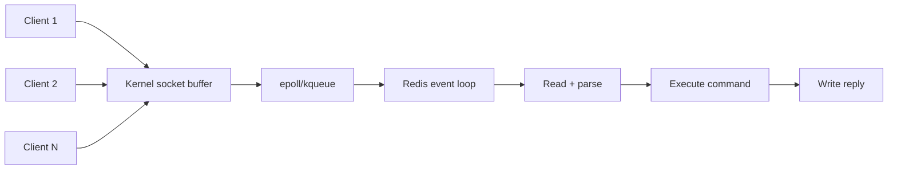
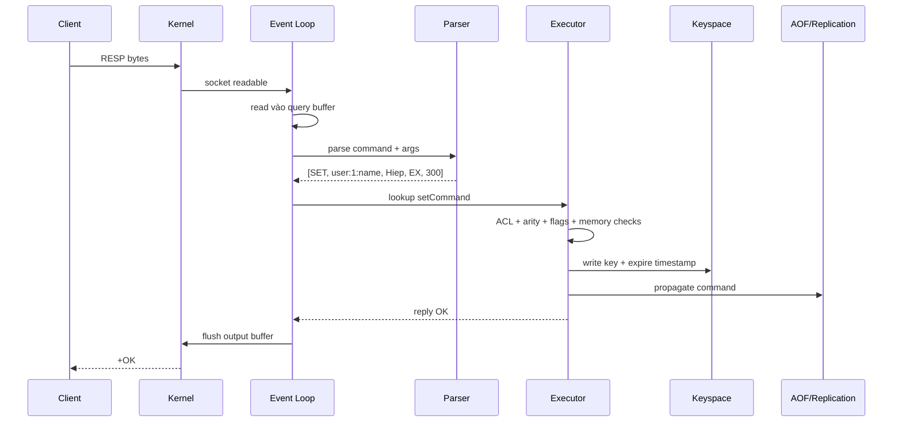
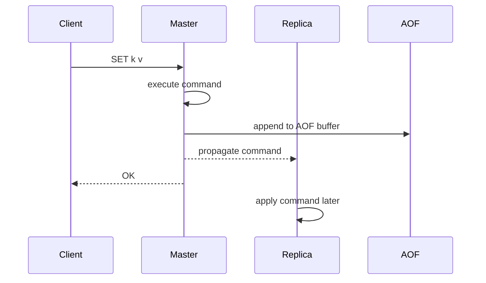

# Redis Architecture

## Mục lục

- [Tổng quan](#tổng-quan)
- [Bức tranh tổng thể](#bức-tranh-tổng-thể)
- [Process model của Redis](#process-model-của-redis)
- [Event loop và I/O multiplexing](#event-loop-và-io-multiplexing)
- [Single-threaded command execution](#single-threaded-command-execution)
- [Vòng đời một command](#vòng-đời-một-command)
- [Atomicity: vì sao command Redis atomic?](#atomicity-vì-sao-command-redis-atomic)
- [Keyspace bên trong Redis](#keyspace-bên-trong-redis)
- [redisObject, type và encoding](#redisobject-type-và-encoding)
- [Memory model và allocator](#memory-model-và-allocator)
- [TTL và expire engine](#ttl-và-expire-engine)
- [Persistence path: RDB, AOF và fork](#persistence-path-rdb-aof-và-fork)
- [Replication path: command propagation](#replication-path-command-propagation)
- [I/O threads trong Redis 6+](#io-threads-trong-redis-6)
- [Background threads và lazy freeing](#background-threads-và-lazy-freeing)
- [Blocking commands ảnh hưởng kiến trúc thế nào?](#blocking-commands-ảnh-hưởng-kiến-trúc-thế-nào)
- [Latency: những điểm dễ gây spike](#latency-những-điểm-dễ-gây-spike)
- [Quan sát kiến trúc Redis bằng command](#quan-sát-kiến-trúc-redis-bằng-command)
- [Best practices từ góc nhìn architecture](#best-practices-từ-góc-nhìn-architecture)
- [Cheat sheet kiến trúc](#cheat-sheet-kiến-trúc)
- [Tài liệu liên quan](#tài-liệu-liên-quan)

---

## Tổng quan

Redis nhanh không chỉ vì “nằm trong RAM”. Redis nhanh vì thiết kế kiến trúc rất nhất quán:

```text
Một main event loop xử lý command tuần tự trên keyspace trong RAM.
Các việc nặng hoặc I/O chậm được đẩy ra background thread/process khi có thể.
```

Điểm cốt lõi:

- Dữ liệu chính nằm trong RAM.
- Client giao tiếp qua TCP bằng RESP protocol.
- Redis dùng event loop để quản lý nhiều connections.
- Command được execute tuần tự trên main thread.
- Vì không có nhiều thread cùng sửa keyspace, Redis tránh lock phức tạp.
- Persistence/replication được tích hợp vào command path nhưng tối ưu để ít block nhất có thể.

```text
                   ┌───────────────────────────────┐
Client sockets ───▶│ Event loop / main thread      │
                   │                               │
                   │ read → parse → execute → reply│
                   └──────────────┬────────────────┘
                                  │
                                  ▼
                   ┌───────────────────────────────┐
                   │ Keyspace in memory            │
                   │ dict: key → redisObject       │
                   │ expires: key → timestamp      │
                   └──────────────┬────────────────┘
                                  │
                    ┌─────────────┼─────────────┐
                    ▼             ▼             ▼
                AOF buffer   Replication    Background jobs
                             backlog        fsync/lazy free/fork
```

> [!IMPORTANT]
> Redis command execution chủ yếu là single-threaded. Điều này làm từng command atomic và đơn giản hóa concurrency, nhưng cũng có nghĩa là **một command chậm có thể block tất cả client khác**.

---

## Bức tranh tổng thể

Một Redis server gồm nhiều phần phối hợp:

| Thành phần | Vai trò |
|------------|--------|
| TCP server | Nhận connection từ clients |
| Event loop | Theo dõi socket readable/writable, timer, file events |
| Query buffer | Buffer dữ liệu client gửi vào |
| RESP parser | Parse bytes thành command + arguments |
| Command table | Map command name sang function xử lý |
| Keyspace dict | Hash table chứa dữ liệu chính |
| Expires dict | Hash table chứa expire timestamp của key có TTL |
| AOF buffer | Ghi command thay đổi dữ liệu để persist |
| Replication backlog | Giữ replication stream gần nhất cho replicas |
| Client output buffer | Buffer response chờ gửi về client |
| Background I/O | fsync, lazy free, close file descriptor |
| Child process | BGSAVE, AOF rewrite bằng fork + copy-on-write |

Luồng request rất ngắn nếu command đơn giản:

```text
socket readable → read bytes → parse command → execute on dict → write response
```

Redis tối ưu mạnh cho trường hợp phổ biến: command nhỏ, truy cập key trực tiếp, thao tác trong memory, response nhỏ.

---

## Process model của Redis

Redis là một process server. Bên trong có:

```text
Redis process
├── Main thread
│   ├── Event loop
│   ├── Command execution
│   ├── Keyspace mutation
│   └── Reply generation
├── I/O threads tùy config
│   └── Socket read/write hỗ trợ main thread
├── Background I/O threads
│   ├── fsync AOF everysec
│   ├── lazy free memory
│   └── close file descriptors
└── Child processes theo thời điểm
    ├── BGSAVE
    └── AOF rewrite
```

### Main thread

Main thread là trái tim của Redis. Nó xử lý:

- File events: socket client readable/writable.
- Time events: `serverCron`, expire cycle, maintenance.
- Command execution.
- Propagation sang AOF/replicas.

### Background threads

Redis không đẩy command execution sang nhiều worker threads. Background threads chỉ xử lý một số việc có thể tách khỏi logic chính.

Ví dụ `UNLINK key` khác `DEL key`:

- `DEL` xóa và free memory đồng bộ trên main thread.
- `UNLINK` detach key khỏi keyspace nhanh, rồi free memory ở background thread.

### Child process

Redis dùng `fork()` cho snapshot/rewrite:

- Parent tiếp tục phục vụ clients.
- Child đọc memory snapshot tại thời điểm fork nhờ copy-on-write.
- Nếu parent ghi nhiều trong lúc child chạy, memory tạm thời tăng.

Đây là lý do RDB/AOF rewrite có thể gây memory spike hoặc latency spike.

---

## Event loop và I/O multiplexing

Redis dùng event loop kết hợp I/O multiplexing như `epoll` trên Linux hoặc `kqueue` trên BSD/macOS.

Thay vì tạo một thread cho mỗi connection, Redis có thể quản lý hàng nghìn sockets bằng một event loop.



### File event

File event là sự kiện từ socket/file descriptor:

- Client socket readable: có request mới.
- Client socket writable: có thể flush response.
- Listening socket readable: có connection mới.

### Time event

Time event là việc định kỳ:

- Active expire cycle.
- Cron maintenance.
- Replication heartbeat.
- Sentinel/Cluster internal tasks nếu mode tương ứng.
- Stats update.

### Vì sao event loop phù hợp Redis?

Redis command thường rất ngắn và CPU-light. Tạo thread cho mỗi client sẽ gây overhead lớn hơn lợi ích:

- Context switch.
- Lock keyspace.
- Race conditions.
- Cache line contention.

Event loop giúp Redis giữ request path cực ngắn.

---

## Single-threaded command execution

Redis thường được mô tả là single-threaded. Câu chính xác hơn:

```text
Redis execute command trên keyspace bằng một main thread.
Một số I/O/background work có thể dùng thread/process khác.
```

### Lợi ích

| Lợi ích | Giải thích |
|---------|------------|
| Không lock keyspace | Không cần mutex quanh dict/data structures |
| Atomic command tự nhiên | Command chạy xong mới command tiếp theo chạy |
| Dễ predict latency | Không có scheduling phức tạp giữa worker threads |
| Ít overhead concurrency | Ít context switch và contention |
| Implementation đơn giản hơn | Data structure có thể tối ưu cho single writer |

### Chi phí

| Chi phí | Hệ quả |
|---------|-------|
| Một command chậm block toàn server | `KEYS *`, `SMEMBERS` huge set gây latency spike |
| Một key hot có thể làm nghẽn một instance | Tất cả request tới hot key vẫn vào cùng event loop |
| Không dùng hết nhiều CPU cores cho một instance | Scale bằng nhiều instances/Cluster |

### Ví dụ command chậm block command nhanh

```text
T0: Client A chạy SMEMBERS huge:set 10 triệu members
T1: Client B chạy GET session:abc
T2: Client C chạy INCR counter

Redis phải execute xong SMEMBERS trước,
GET và INCR bị chờ dù bản thân rất nhanh.
```

> [!TIP]
> Redis performance tốt nhất khi command nhỏ, predictable và O(1)/O(log N). Với command O(N), N phải được kiểm soát.

---

## Vòng đời một command

Ví dụ client gửi:

```bash
SET user:1:name "Hiep" EX 300
```

Luồng chi tiết:



### Bước 1: Read vào query buffer

Redis đọc bytes từ socket vào buffer của client connection. Nếu client gửi dữ liệu quá nhanh hoặc command quá lớn, query buffer có thể tăng.

### Bước 2: Parse RESP

RESP biểu diễn command thành array bulk strings. Ví dụ:

```text
*5
$3
SET
$11
user:1:name
$4
Hiep
$2
EX
$3
300

```

### Bước 3: Lookup command table

Redis map `SET` sang function xử lý tương ứng. Redis cũng biết metadata:

- Command arity.
- Command flags: read/write/admin/pubsub/blocking.
- ACL categories.
- Key positions.

### Bước 4: Pre-checks

Redis kiểm tra:

- Command có hợp lệ không.
- Client có quyền ACL không.
- Server đang loading/shutdown/readonly không.
- Replica có cho write không.
- Cluster slot có đúng node không.
- `maxmemory` có cần eviction không.

### Bước 5: Execute

Command thao tác trực tiếp lên data structures trong memory.

Với `SET EX`, Redis cập nhật:

```text
db->dict["user:1:name"] = String("Hiep")
db->expires["user:1:name"] = now + 300s
```

### Bước 6: Propagate

Nếu command thay đổi dữ liệu, Redis propagate sang:

- AOF buffer nếu bật AOF.
- Replication stream nếu có replicas.
- Keyspace notification nếu bật.

### Bước 7: Reply

Response được ghi vào output buffer của client. Nếu socket writable, Redis flush ngay; nếu không, event loop flush sau.

---

## Atomicity: vì sao command Redis atomic?

Redis execute command tuần tự trên main thread. Trong lúc một command đang chạy, command khác không chen vào giữa để sửa cùng keyspace.

Ví dụ:

```bash
INCR counter
```

Về logic gồm đọc value, tăng, ghi lại. Nhưng vì chạy trong một command server-side, nó atomic.

```text
Client A INCR counter
Client B INCR counter

Không thể xảy ra:
A read 0
B read 0
A write 1
B write 1

Redis execute tuần tự:
A: 0 → 1
B: 1 → 2
```

### Atomic không có nghĩa là transaction database đầy đủ

Redis atomic command không tương đương ACID transaction phức tạp:

| Redis atomic command | Database transaction |
|----------------------|----------------------|
| Một command chạy không interleave | Nhiều statement có isolation level |
| Rất nhanh, đơn giản | Có lock/MVCC/rollback phức tạp |
| Không rollback command đã execute trong `MULTI` nếu command sau lỗi runtime | DB thường rollback transaction |
| Phù hợp counter/lock/queue operations | Phù hợp business invariants phức tạp |

Redis có `MULTI/EXEC`, `WATCH` và Lua để xử lý atomic multi-command, nhưng cần hiểu giới hạn. Xem [Transactions](./transactions.md), [Lua Scripting](./lua-scripting.md).

---

## Keyspace bên trong Redis

Mỗi Redis database có hai dictionary quan trọng:

```text
redisDb
├── dict     : key → value object
└── expires  : key → expire timestamp
```

### `dict`: dữ liệu chính

`dict` là hash table lưu key-value.

```text
"user:1"       → Hash object
"session:abc"  → String object
"queue:email"  → List object
```

Lookup key trung bình O(1).

### `expires`: TTL metadata

Chỉ key có TTL mới có entry trong `expires`.

```text
"session:abc" → 1783529999123 ms timestamp
"otp:999"     → 1783529012345 ms timestamp
```

Nếu key không có TTL, nó không nằm trong `expires`.

### Incremental rehashing

Hash table cần resize khi số key tăng/giảm. Nếu rehash toàn bộ hàng triệu key một lần, Redis sẽ block lâu.

Redis dùng incremental rehashing:

```text
Old table ht[0] ──┐
                  ├─ Redis di chuyển dần bucket sang ht[1]
New table ht[1] ──┘
```

Mỗi operation trên dict giúp chuyển một phần nhỏ. Nhờ vậy latency ổn định hơn.

---

## redisObject, type và encoding

Redis value được bọc trong `redisObject`.

Concept đơn giản:

```text
key → redisObject
        ├── type: API-level data type
        ├── encoding: representation bên trong
        ├── lru/lfu metadata
        ├── refcount
        └── ptr → dữ liệu thật
```

### Type là gì?

Type là loại Redis expose cho user:

```bash
TYPE user:1
# hash
```

Các type chính:

- string
- list
- set
- zset
- hash
- stream

### Encoding là gì?

Encoding là cách Redis lưu type đó trong memory.

```bash
OBJECT ENCODING user:1
```

Ví dụ Hash nhỏ có thể lưu bằng `listpack`, Hash lớn chuyển sang `hashtable`.

| Type | Encoding nhỏ | Encoding lớn / phổ biến |
|------|--------------|--------------------------|
| String | `int`, `embstr` | `raw` |
| Hash | `listpack` | `hashtable` |
| List | `quicklist` | `quicklist` |
| Set | `intset`, `listpack` | `hashtable` |
| Sorted Set | `listpack` | `skiplist` + `dict` |
| Stream | radix tree/listpack | radix tree/listpack |

### Vì sao encoding quan trọng?

Encoding quyết định:

- Memory usage.
- Time complexity thực tế.
- Khi nào object chuyển representation.
- Vì sao object nhỏ rất tiết kiệm memory.

Ví dụ nhiều Hash nhỏ có thể tiết kiệm memory hơn lưu nhiều String keys riêng lẻ, vì giảm overhead key/object.

Đọc thêm [Memory Management](./memory-management.md), [Hashes](./hashes.md).

---

## Memory model và allocator

Redis là in-memory store, nên memory là tài nguyên quan trọng nhất.

### Dataset phải vừa RAM

Redis không tự spill dataset xuống disk trong request path. Persistence dùng disk để recover, không phải để query dữ liệu lạnh như database disk-based.

```text
RAM chứa dataset chính
Disk chứa RDB/AOF để restart/recover
```

### used_memory vs RSS

`INFO memory` có nhiều chỉ số:

| Metric | Ý nghĩa |
|--------|---------|
| `used_memory` | Memory Redis allocator đang dùng cho data/overhead |
| `used_memory_rss` | Memory OS thấy process đang giữ |
| `mem_fragmentation_ratio` | RSS / used_memory gần đúng |
| `mem_not_counted_for_evict` | Buffer AOF/replication không tính vào eviction |

### Fragmentation

Fragmentation xảy ra khi allocator/OS giữ nhiều memory hơn dataset thực dùng.

Nguyên nhân:

- Tạo/xóa key kích thước khác nhau liên tục.
- Big key được free nhưng memory chưa trả về OS.
- Fork copy-on-write.
- Allocator behavior.

### maxmemory và eviction

Nếu cấu hình:

```conf
maxmemory 4gb
maxmemory-policy allkeys-lru
```

Redis kiểm tra memory trước command ghi. Nếu vượt ngưỡng, Redis evict key theo policy.

Lưu ý:

- Eviction cũng chạy trên main thread.
- Evict nhiều key có thể tăng latency.
- Buffer replication/AOF có phần không tính vào eviction, nên cần chừa RAM.

Đọc thêm [Eviction Policies](./eviction-policies.md).

---

## TTL và expire engine

TTL trong Redis không phải một thread riêng xóa đúng từng key ngay tại thời điểm hết hạn. Redis dùng kết hợp lazy expiration và active expiration.

### Lazy expiration

Khi client truy cập key, Redis check TTL:

```text
GET session:abc
→ check expires[session:abc]
→ nếu now > expire_time: xóa key và trả nil
→ nếu chưa hết hạn: trả value
```

Ưu điểm: không tốn công xóa key không ai động tới.

Nhược điểm: key expired nhưng không được truy cập có thể vẫn chiếm memory một thời gian.

### Active expiration

Redis định kỳ lấy mẫu key có TTL và xóa key đã hết hạn.

Concept:

```text
Mỗi vòng cron:
- lấy một số key ngẫu nhiên trong expires dict
- xóa key hết hạn
- nếu tỷ lệ expired cao, tiếp tục quét thêm trong giới hạn thời gian
```

> [!NOTE]
> Process model expire nằm ở đây; command TTL, `SET` làm mất TTL, stampede, hot/big key → deep-dive ở [Keys, Naming & TTL](./keys-and-ttl.md).

### TTL ảnh hưởng replication thế nào?

Trong replication, master là nơi quyết định expire/evict key và gửi lệnh xóa sang replica. Replica không tự quyết định expire độc lập như master trong điều kiện bình thường, để tránh lệch dữ liệu do clock khác nhau.

Đọc thêm [Replication](./replication.md) và [Keys, Naming & TTL](./keys-and-ttl.md).

---

## Persistence path: RDB, AOF và fork

Redis có hai cơ chế persistence chính:

- RDB snapshot.
- AOF append-only log.

### RDB snapshot

`BGSAVE` tạo child process bằng `fork()`:

```text
Parent Redis process: tiếp tục phục vụ clients
Child process: ghi snapshot ra disk
```

Nhờ copy-on-write, child thấy memory tại thời điểm fork. Nếu parent ghi dữ liệu sau fork, OS copy page bị sửa.

Hệ quả:

- Fork có thể gây latency spike nếu memory lớn.
- Write-heavy trong lúc BGSAVE làm tăng memory tạm thời.
- Disk chậm làm child chạy lâu hơn, kéo dài copy-on-write window.

### AOF

Với AOF, Redis append command thay đổi dữ liệu vào AOF buffer rồi flush/fsync theo policy:

```conf
appendonly yes
appendfsync everysec
```

`everysec` thường là trade-off phổ biến: mất tối đa khoảng 1 giây dữ liệu trong crash OS/power-loss, đổi lại latency tốt hơn `always`.

### AOF rewrite

AOF rewrite cũng dùng child process để tạo AOF compact. Trong lúc rewrite, parent vẫn nhận writes và giữ phần diff để append sau.

Đọc thêm [RDB Snapshots](./rdb.md), [AOF](./aof.md), [Persistence Strategies](./persistence-strategies.md).

---

## Replication path: command propagation

Khi master nhận write command:

```text
Client → Master: SET k v
Master execute trên keyspace
Master append command vào replication stream
Replica nhận stream và apply command
```

Replication cũng gắn vào command lifecycle.



Redis replication mặc định async: master không chờ replica apply xong mới trả OK. Điều này giữ latency thấp nhưng có cửa sổ mất write khi failover.

Đọc thêm [Replication](./replication.md), [Redis Sentinel](./sentinel.md), [Redis Cluster](./cluster.md).

---

## I/O threads trong Redis 6+

Redis 6 giới thiệu I/O threads để hỗ trợ đọc/ghi socket, đặc biệt khi network I/O/serialization là bottleneck.

Config ví dụ:

```conf
io-threads 4
io-threads-do-reads yes
```

Điểm cực quan trọng:

```text
I/O threads không làm command execution đa luồng.
Keyspace mutation vẫn do main thread execute.
```

### Khi nào I/O threads hữu ích?

- Rất nhiều clients/connections.
- Response lớn khiến socket write tốn CPU.
- Network throughput cao.
- CPU main thread tốn nhiều ở protocol read/write hơn command logic.

### Khi nào không giúp nhiều?

- Workload bottleneck do command O(N).
- Big key operations block main execution.
- Lua script chạy lâu.
- Fork/persistence latency.
- Single hot key/slot.

---

## Background threads và lazy freeing

Một số operation free memory rất tốn thời gian. Ví dụ xóa Hash hàng triệu fields.

### DEL vs UNLINK

```bash
DEL big:hash
```

`DEL` xóa key và free memory đồng bộ, có thể block main thread lâu.

```bash
UNLINK big:hash
```

`UNLINK` gỡ key khỏi keyspace nhanh, sau đó free memory ở background thread.

### FLUSHALL ASYNC

```bash
FLUSHALL ASYNC
```

Xóa toàn bộ database theo cách async, giảm block so với `FLUSHALL` đồng bộ.

### lazyfree config

Một số config liên quan:

```conf
lazyfree-lazy-eviction yes
lazyfree-lazy-expire yes
lazyfree-lazy-server-del yes
replica-lazy-flush yes
```

Không phải lúc nào cũng bật bừa, nhưng với dataset có big objects, lazy free giúp giảm latency spike.

---

## Blocking commands ảnh hưởng kiến trúc thế nào?

Redis có các blocking commands như:

- `BLPOP`, `BRPOP`
- `XREAD BLOCK`
- `BZPOPMIN`, `BZPOPMAX`

“Blocking” ở đây không có nghĩa là block toàn Redis server. Redis đưa client vào trạng thái chờ và event loop tiếp tục xử lý client khác.

```text
Client A: BLPOP queue 0
→ Redis mark client A blocked
→ Event loop xử lý client B/C bình thường
→ Khi queue có item, Redis wake client A
```

Tuy nhiên cần cẩn thận:

- Blocking client giữ connection.
- Nên dùng connection riêng cho blocking operations.
- Connection pool nhỏ có thể bị cạn nếu nhiều request block.
- Pub/Sub cũng nên dùng connection riêng.

---

## Latency: những điểm dễ gây spike

Redis latency spike thường đến từ vài nhóm nguyên nhân.

### Command O(N) hoặc big key

Ví dụ nguy hiểm:

```bash
KEYS *
SMEMBERS huge:set
HGETALL huge:hash
LRANGE huge:list 0 -1
DEL huge:key
```

Giải pháp:

- Dùng `SCAN` thay `KEYS`.
- Phân trang/range có giới hạn.
- Tránh big key.
- Dùng `UNLINK` thay `DEL` cho object lớn.

### Fork và copy-on-write

`BGSAVE`/AOF rewrite có thể gây:

- Fork latency.
- Memory spike.
- Disk I/O contention.

### Eviction storm

Khi memory sát `maxmemory`, command ghi có thể phải evict nhiều keys.

### Slow clients

Client đọc response chậm làm output buffer tăng, tốn memory và có thể bị disconnect theo config.

### Network và DNS

Redis nhanh nhưng network không miễn phí. Pipelining/batching giúp giảm RTT.

Đọc thêm [Slow Log & Latency](./slow-log-latency.md), [Pipelining & Batching](./pipelining-batching.md).

---

## Quan sát kiến trúc Redis bằng command

### INFO

```bash
redis-cli INFO
redis-cli INFO memory
redis-cli INFO stats
redis-cli INFO persistence
redis-cli INFO replication
```

### COMMAND INFO

Xem metadata command:

```bash
redis-cli COMMAND INFO SET
redis-cli COMMAND INFO ZRANGE
```

### OBJECT ENCODING

```bash
redis-cli OBJECT ENCODING mykey
```

Giúp hiểu Redis đang dùng representation nào.

### SLOWLOG

```bash
redis-cli SLOWLOG GET 20
```

Xem command chạy lâu trên server.

### LATENCY

```bash
redis-cli LATENCY LATEST
redis-cli LATENCY DOCTOR
```

Xem latency events Redis ghi nhận.

### MEMORY USAGE

```bash
redis-cli MEMORY USAGE user:123
redis-cli MEMORY STATS
```

Hữu ích để debug memory overhead và big key.

---

## Best practices từ góc nhìn architecture

### 1. Giữ command nhỏ và bounded

Tránh command có N không kiểm soát. Nếu phải dùng range, đặt limit rõ ràng.

```bash
# Nên: range có biên
ZRANGE leaderboard 0 99 REV WITHSCORES
```

```bash
# Không nên: dump gần như cả set
ZRANGE leaderboard 0 999999 REV
```

### 2. Tránh big key

Big key làm nhiều thứ xấu:

- Command trên key đó chậm.
- Replication stream lớn.
- AOF/RDB lớn.
- Delete/free memory chậm.
- Cluster slot bị hot.

### 3. Dùng UNLINK cho object lớn

```bash
UNLINK cache:huge-result
```

### 4. Monitor memory margin

Không để Redis sát RAM vật lý. Cần chừa chỗ cho:

- Fragmentation.
- Replication buffers.
- AOF buffers.
- Fork copy-on-write.
- Client output buffers.

### 5. Hiểu TTL không xóa đúng từng millisecond

Key expired có thể còn chiếm memory một thời gian. Đừng thiết kế logic phụ thuộc vào việc memory giảm ngay lập tức sau expire.

### 6. Test persistence dưới load

BGSAVE/AOF rewrite trong staging với dataset gần production để biết fork latency và memory spike.

### 7. Scale bằng sharding khi một main thread không đủ

Nếu một Redis instance hết CPU do command execution thật sự, tăng core không giúp tuyến tính cho một instance. Cân nhắc nhiều instances hoặc [Redis Cluster](./cluster.md).

---

## Tài liệu liên quan

- [Redis Overview](./redis-overview.md) - Tổng quan Redis và use cases.
- [Keys, Naming & TTL](./keys-and-ttl.md) - Thiết kế key, TTL và expire behavior.
- [Memory Management](./memory-management.md) - Memory analysis, encoding, fragmentation.
- [Eviction Policies](./eviction-policies.md) - `maxmemory` và policy chọn key để evict.
- [RDB Snapshots](./rdb.md) - Fork, copy-on-write, snapshot.
- [AOF](./aof.md) - Append-only file, fsync, rewrite.
- [Replication](./replication.md) - Command propagation, backlog, offset.
- [Slow Log & Latency](./slow-log-latency.md) - Debug latency spike.
- [Pipelining & Batching](./pipelining-batching.md) - Giảm round-trip time.
