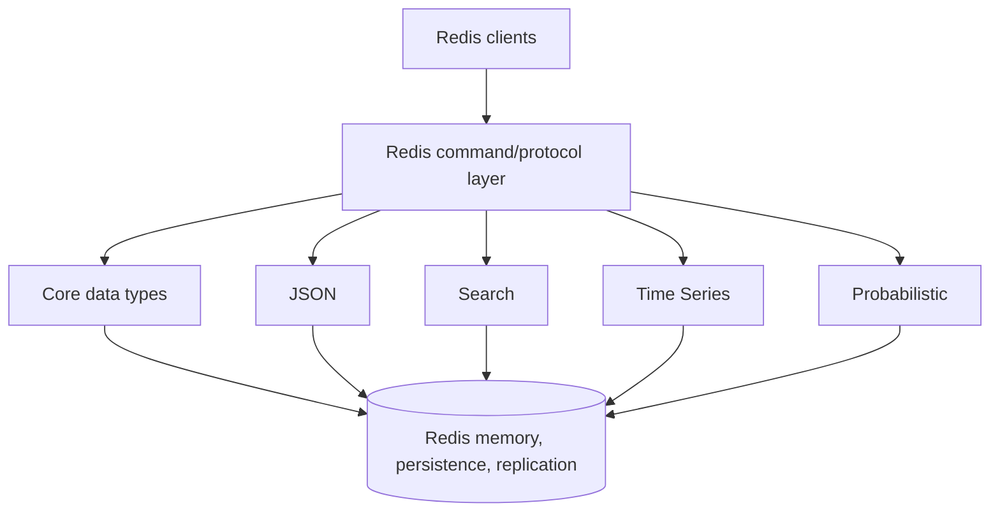
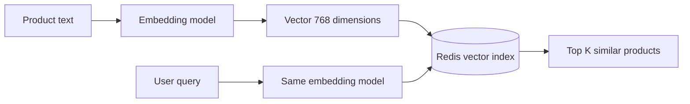
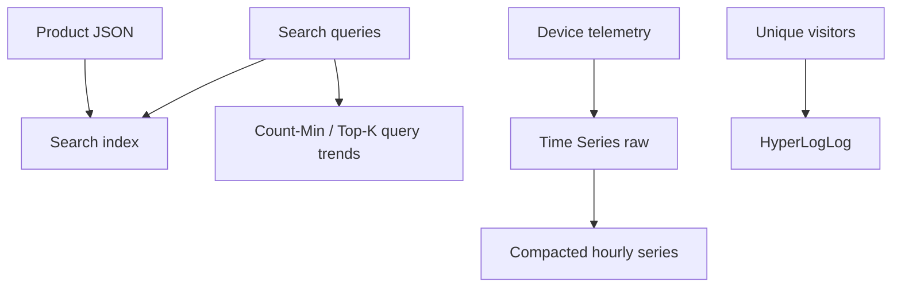

# Redis Modules

## Mục lục

- [1. Từ key-value server đến data platform mở rộng](#1-từ-key-value-server-đến-data-platform-mở-rộng)
- [2. Redis 8 và sự chuyển đổi từ modules sang unified distribution](#2-redis-8-và-sự-chuyển-đổi-từ-modules-sang-unified-distribution)
- [3. Module architecture hoạt động như thế nào](#3-module-architecture-hoạt-động-như-thế-nào)
- [4. Kiểm tra capability và version](#4-kiểm-tra-capability-và-version)
- [5. Redis JSON: document có typed atomic operations](#5-redis-json-document-có-typed-atomic-operations)
- [6. Redis Search: secondary index, full-text và aggregation](#6-redis-search-secondary-index-full-text-và-aggregation)
- [7. Vector search và Vector Set](#7-vector-search-và-vector-set)
- [8. Probabilistic data structures](#8-probabilistic-data-structures)
- [9. Redis Time Series](#9-redis-time-series)
- [10. Kết hợp JSON, Search, probabilistic và time series](#10-kết-hợp-json-search-probabilistic-và-time-series)
- [11. Data modeling và atomicity](#11-data-modeling-và-atomicity)
- [12. Redis Cluster và distributed query](#12-redis-cluster-và-distributed-query)
- [13. Persistence, replication, backup và upgrade](#13-persistence-replication-backup-và-upgrade)
- [14. Memory, performance và capacity planning](#14-memory-performance-và-capacity-planning)
- [15. Security, ACL và supply-chain risk](#15-security-acl-và-supply-chain-risk)
- [16. Viết custom Redis module](#16-viết-custom-redis-module)
- [17. Deployment và migration](#17-deployment-và-migration)
- [18. Observability, testing và runbook](#18-observability-testing-và-runbook)
- [19. Anti-patterns và checklist production](#19-anti-patterns-và-checklist-production)
- [20. Tóm tắt decision table](#20-tóm-tắt-decision-table)
- [Tài liệu tham khảo](#tài-liệu-tham-khảo)

---

## 1. Từ key-value server đến data platform mở rộng

Redis core ban đầu cung cấp Strings, Hashes, Lists, Sets, Sorted Sets, Streams và các primitive. Nhiều use case cần data type/command chuyên biệt:

- Lưu và update một JSON document theo path.
- Full-text, faceted, geospatial và vector search.
- Bloom/Cuckoo filters, frequency sketch, Top-K.
- Time-series retention, downsampling và label query.

Redis Modules API cho native extension đăng ký:

- Command mới như `JSON.SET`, `FT.SEARCH`, `TS.ADD`, `BF.ADD`.
- Data type mới với encoding/persistence riêng.
- Hooks vào keyspace, replication, ACL, events và timers.
- Background/threaded work theo API cho phép.



> [!IMPORTANT]
> Extension chạy trong cùng Redis process/address space. Nó có performance rất tốt, nhưng bug, OOM hoặc blocking work trong extension có thể ảnh hưởng toàn Redis node.

---

## 2. Redis 8 và sự chuyển đổi từ modules sang unified distribution

### 2.1. Trước Redis 8

Ecosystem thường phân biệt:

- Redis Community Edition/core.
- Redis Stack bundle.
- Modules riêng như RedisJSON, RediSearch, RedisTimeSeries, RedisBloom.
- Compatibility matrix giữa Redis core và module versions.

Ops phải cài `.so`, cấu hình `loadmodule`, đồng bộ binary trên nodes và kiểm tra RDB/AOF compatibility.

### 2.2. Redis 8: “One Redis”

Redis 8 hợp nhất các capability trước đây thuộc Redis Stack vào Redis Open Source distribution. JSON, Search, Time Series và probabilistic structures được cung cấp như feature tích hợp của unified package; người dùng không còn phải tự ghép nhiều module package cho distribution chuẩn.

```text
Redis 7.x era                 Redis 8+
Redis core                    Redis unified distribution
 + RedisJSON                  + JSON
 + RediSearch       →         + Search/vector
 + RedisTimeSeries            + Time Series
 + RedisBloom                 + Probabilistic
```

Tên command vẫn giữ prefix lịch sử (`JSON.*`, `FT.*`, `TS.*`, `BF.*`), nên tài liệu và code vẫn thường gọi chúng là “modules”.

### 2.3. Đừng giả mọi Redis endpoint có mọi capability

- Server Redis cũ/core-only có thể không có commands.
- Cloud provider có edition/version/feature set riêng.
- Redis-compatible products không đảm bảo module API tương thích.
- Client package có thể cần optional command bindings.
- License của source/component và service offering cần legal review theo use case phân phối/hosting.

Luôn capability-check trên môi trường target, không chỉ xem logo “Redis”.

### 2.4. Vector Set và feature maturity

Redis 8.0 giới thiệu Vector Set ở trạng thái beta. API/maturity có thể thay đổi ở release sau; với production 2026, kiểm tra release notes của **minor version cụ thể** thay vì dựa vào status lúc 8.0 ra mắt. Redis Search vector index là capability khác, đã có model index/query riêng.

---

## 3. Module architecture hoạt động như thế nào

### 3.1. Command dispatch

Client gửi RESP command; Redis command table route tới core handler hoặc extension handler. Từ góc nhìn client:

```bash
SET foo bar
JSON.SET product:42 '$' '{"name":"Keyboard"}'
FT.SEARCH idx:products '@name:keyboard'
```

đều là Redis commands, cùng authentication/connection/protocol.

### 3.2. Native data type

Module/integrated type có thể lưu internal binary representation tối ưu, không chỉ serialize vào String. Ví dụ Redis JSON lưu document dạng tree để truy cập sub-elements; Time Series dùng chunks/compression và metadata.

Hệ quả:

- `TYPE` có thể trả type riêng như `ReJSON-RL`/`TSDB-TYPE` tùy version.
- Core command `GET` không đọc JSON key; dùng `JSON.GET`.
- `MEMORY USAGE` và module-specific debug/info cần cùng xem.
- RDB loader phải biết type/module encoding.

### 3.3. Secondary data

Search index là derived structure được cập nhật khi source Hash/JSON đổi. Memory gồm:

```text
source documents + index terms/postings + sortable fields
+ vector graph + metadata + fragmentation
```

Không capacity chỉ theo JSON bytes.

### 3.4. Event loop và background work

Command nhẹ vẫn chạy theo Redis execution model. Extensions có thể dùng worker threads cho query/index work theo implementation, nhưng coordination/result vẫn ảnh hưởng node resources. Query nặng, index build hoặc vector search có thể cạnh tranh CPU/memory/network với cache traffic.

### 3.5. Module lifecycle lịch sử

Custom module có thể được load startup/runtime tùy command/config/version. Unload thường bị hạn chế nếu module có active types/keys/dependencies. Unified Redis 8 built-in capabilities không nên được quản lý như arbitrary `.so` unload.

---

## 4. Kiểm tra capability và version

### 4.1. Server và commands

```bash
INFO server
COMMAND INFO JSON.GET FT.SEARCH TS.ADD BF.ADD
```

Nếu command unknown/không có metadata, feature chưa available hoặc ACL che command tùy context.

### 4.2. MODULE LIST

Trên deployment module-based cũ/custom:

```bash
MODULE LIST
```

Trả name/version/API info của loaded modules. Redis 8 unified features có thể có presentation khác theo build; đừng dùng `MODULE LIST` làm capability check duy nhất. Command feature detection và release metadata đáng tin hơn cho application startup.

### 4.3. Startup preflight

Application nên kiểm tra:

```text
Redis major/minor trong supported range
required commands tồn tại
ACL cho command/key/index
index schema/version expected
cluster topology/feature support
client codec response tương thích
```

Fail fast với message rõ thay vì traffic đầu tiên mới gặp `ERR unknown command`.

### 4.4. Client libraries

Node.js có package bindings cho JSON/Search/Time Series/Bloom trong ecosystem `node-redis`; Java thường dùng Jedis/Lettuce/Redis OM hoặc command APIs; Python `redis-py` có namespaces. API name/options thay đổi theo client version. CLI examples là contract server, code client phải đối chiếu SDK.

---

## 5. Redis JSON: document có typed atomic operations

Redis JSON cho lưu, đọc và sửa JSON theo JSONPath mà không cần fetch/serialize toàn document ở application.

### 5.1. CRUD cơ bản

```bash
JSON.SET product:42 '$' '{
  "name":"Mechanical Keyboard",
  "price":1990000,
  "stock":25,
  "tags":["keyboard","wireless"],
  "specs":{"layout":"75%","color":"black"}
}'

JSON.GET product:42 '$.name' '$.price'
JSON.TYPE product:42 '$.stock'
```

Root path dùng `$` trong JSONPath syntax hiện đại. Một số command/legacy examples dùng `.`; hiểu response shape khác khi path match nhiều values.

### 5.2. Atomic path update

```bash
JSON.NUMINCRBY product:42 '$.stock' -1
JSON.SET product:42 '$.price' 1890000
JSON.ARRAPPEND product:42 '$.tags' '"sale"'
JSON.DEL product:42 '$.specs.color'
```

Typed command tránh lost update kiểu `JSON.GET whole → modify client → JSON.SET whole`.

### 5.3. JSONPath có thể match nhiều nodes

```bash
JSON.NUMINCRBY catalog '$.products[*].price' 1000
```

Một path rộng có thể scan/update nhiều nodes, complexity theo document size và số matches. Không chạy recursive `$..price` trên document vài chục MB trong hot path.

### 5.4. JSON document boundary

| Model | Ưu | Nhược |
|-------|----|-------|
| Một key/document per entity | Update/index/TTL per entity | Nhiều keys |
| Một giant catalog JSON | Một snapshot key | Big key, path scan, hot key, coarse TTL |
| Hash fields | Gọn cho flat object | Nested/arrays kém tự nhiên |
| JSON | Nested typed updates, Search integration | Memory/index overhead |

Thường một entity một JSON key. Không biến Redis JSON thành một giant document database không partition.

### 5.5. TTL

TTL vẫn ở cấp Redis key/document. Path field không tự có TTL như key. Nếu sub-object có lifecycle riêng, tách key hoặc lưu expiry timestamp + cleanup logic.

### 5.6. Concurrency

Mỗi `JSON.*` command atomic. Multi-path/business invariant có thể cần Lua/transaction nếu commands support script và keys same slot. Đừng fetch whole JSON rồi overwrite nếu nhiều writers sửa field khác nhau.

---

## 6. Redis Search: secondary index, full-text và aggregation

Redis Search index Hash hoặc JSON documents incrementally và hỗ trợ query language.

### 6.1. Tạo index JSON

```bash
FT.CREATE idx:products ON JSON PREFIX 1 product: SCHEMA \
  '$.name' AS name TEXT WEIGHT 2.0 \
  '$.price' AS price NUMERIC SORTABLE \
  '$.tags[*]' AS tags TAG \
  '$.location' AS location GEO
```

Các field types:

- `TEXT`: tokenization, stemming/full-text.
- `TAG`: exact categorical filters.
- `NUMERIC`: range/filter/sort.
- `GEO`: radius/location.
- `VECTOR`: similarity search.

Chọn đúng type. Product category là TAG thường đúng hơn TEXT nếu cần exact match.

### 6.2. Query

```bash
FT.SEARCH idx:products '@name:(mechanical keyboard) @price:[1000000 3000000]' \
  SORTBY price ASC LIMIT 0 20
```

Tag filter cần escaping/query syntax phù hợp:

```bash
FT.SEARCH idx:products '@tags:{wireless}' RETURN 3 '$.name' '$.price' '$.stock'
```

Query string từ user không được concatenate mù quáng; escape/parameterize theo dialect/client APIs để tránh query injection và syntax bugs.

### 6.3. Aggregation

`FT.AGGREGATE` có thể group, reduce, filter, sort và cursor. Ví dụ concept:

```bash
FT.AGGREGATE idx:products '*'
  GROUPBY 1 '@brand'
  REDUCE COUNT 0 AS count
  REDUCE AVG 1 '@price' AS avg_price
  SORTBY 2 '@count' DESC
```

Aggregation unbounded trên high-cardinality fields có thể rất nặng. Dùng filters, LIMIT/cursor, timeout/config và pre-aggregation nếu dashboard hot.

### 6.4. Index lifecycle

- Document matching prefix/schema được indexed khi write.
- Add field schema/index có backfill/build cost.
- Dropping index có option giữ hoặc xóa documents; kiểm tra `DD` semantics trước production.
- Alias giúp blue/green index switch (`FT.ALIAS*`).
- Schema evolution nên version index: `idx:products:v3`.

### 6.5. Eventual aspects

Index update/query consistency và background indexing behavior phụ thuộc version/deployment. Đừng giả index là transaction isolation snapshot qua nhiều documents. Với read-after-write strict, test exact product/version and deployment.

### 6.6. Redis 8 changes

Redis 8 mang nhiều Search improvements và có breaking validation/default changes, ví dụ BM25 trở thành scoring default thay TF-IDF và stricter argument parsing. Upgrade phải regression-test ranking, aggregation reducers và malformed query behavior; cùng dataset có thể ra ranking khác.

---

## 7. Vector search và Vector Set

### 7.1. Vector là gì

Embedding biến text/image/item thành vector float nhiều chiều. Similarity search tìm vectors gần query theo cosine/L2/inner product tùy index.



### 7.2. Redis Search vector fields

Search index hỗ trợ vector trên Hash/JSON, thường với:

- `FLAT`: brute-force, chính xác hơn nhưng cost tăng theo N; tốt cho dataset nhỏ/baseline.
- `HNSW`: approximate nearest neighbor, nhanh hơn ở scale, đổi memory/index-build/recall tuning.

Parameters gồm dimension, data type, distance metric và HNSW tuning theo version. Dimension phải đúng tuyệt đối với embedding model.

### 7.3. Hybrid search

Vector similarity thường kết hợp metadata filters:

```text
semantic similarity
AND tenant=t9
AND category=keyboard
AND stock>0
```

Redis Search mạnh ở hybrid query trên cùng document/index. Luôn enforce tenant filter server-side; không lấy global top K rồi filter tenant ở app vì có thể leak/ranking kém.

### 7.4. Embedding lifecycle

Lưu metadata:

```json
{
  "embeddingModel": "text-embedding-v3",
  "embeddingVersion": 4,
  "dimension": 768
}
```

Đổi model làm vector spaces không tương thích. Build index/data version mới, dual-write/backfill, switch alias, không trộn embeddings khác model trong cùng field rồi so similarity.

### 7.5. Recall, latency và memory

Đánh giá bằng ground-truth set:

- Recall@K/NDCG.
- p50/p95/p99 query latency.
- Index build/update rate.
- Memory per vector + graph.
- Filter selectivity.

Không chỉ benchmark 1.000 random vectors rồi suy ra 100 triệu.

### 7.6. Vector Set

Redis 8.0 giới thiệu Vector Set beta như native-style vector collection với command family riêng. Nó khác Redis Search vector index: simpler vector set operations vs document/hybrid search. Vì maturity thay đổi theo minor release, kiểm tra current docs, command stability, persistence/Cluster support trước production.

---

## 8. Probabilistic data structures

Probabilistic structures đổi exactness lấy memory/throughput. Chúng phù hợp khi error bound chấp nhận được, không cho correctness-critical membership/payment.

### 8.1. Bloom Filter

Trả lời:

```text
"definitely not present" hoặc "possibly present"
```

Có false positive, không có false negative nếu filter được duy trì đúng và không delete unsupported.

```bash
BF.RESERVE seen:urls 0.001 10000000
BF.ADD seen:urls 'https://example.com/a'
BF.EXISTS seen:urls 'https://example.com/a'
BF.MADD seen:urls a b c
```

- Error rate 0.001 = target false-positive 0,1% ở designed capacity.
- Capacity underestimate có thể làm filter scale/subfilters và memory/latency khác.
- Dùng cho cache penetration, dedupe hint, skip expensive lookup.
- Khi `EXISTS=1`, vẫn phải query source nếu exact action cần.

### 8.2. Cuckoo Filter

```bash
CF.RESERVE active:tokens 1000000
CF.ADD active:tokens tokenHash
CF.EXISTS active:tokens tokenHash
CF.DEL active:tokens tokenHash
```

Cuckoo hỗ trợ delete tốt hơn Bloom nhưng false positives và capacity/load-factor considerations. Delete item chưa chắc đã insert hoặc duplicate handling sai có thể tạo false negative logic; hiểu counting/fingerprint semantics.

### 8.3. Count-Min Sketch

Ước lượng frequency với overestimation bounded probabilistically:

```bash
CMS.INITBYPROB traffic:cms 0.001 0.01
CMS.INCRBY traffic:cms user:42 1 user:99 5
CMS.QUERY traffic:cms user:42 user:99
```

Dùng heavy-hitter analytics, không billing exact. Collisions làm estimate không thấp hơn true count theo model chuẩn nhưng có thể cao hơn.

### 8.4. Top-K

```bash
TOPK.RESERVE products:top 100 2000 7 0.9
TOPK.ADD products:top p42 p42 p7 p9
TOPK.LIST products:top WITHCOUNT
```

Theo dõi frequent items mà không giữ exact count mọi item. Parameters width/depth/decay ảnh hưởng accuracy/memory; benchmark distribution Zipf thật.

### 8.5. t-digest

Ước lượng quantile/percentile trên streaming values:

```bash
TDIGEST.CREATE latency:api COMPRESSION 200
TDIGEST.ADD latency:api 12.3 18.7 250.1
TDIGEST.QUANTILE latency:api 0.5 0.95 0.99
```

Phù hợp p95/p99 approximate; không dùng để truy xuất exact raw samples. Compression cao thường tăng accuracy và memory.

### 8.6. HyperLogLog

HyperLogLog là capability probabilistic đã có trong Redis core từ lâu:

```bash
PFADD dau:2026-07-10 user:1 user:2
PFCOUNT dau:2026-07-10
```

Sai số chuẩn khoảng 0,81%, memory rất nhỏ. Xem [Bitmaps & HyperLogLog](./bitmaps-hyperloglog.md).

---

## 9. Redis Time Series

Time Series lưu `(timestamp, numeric value)` với retention, labels, range aggregation và compaction.

### 9.1. Tạo series

```bash
TS.CREATE sensor:temp:vn:01 \
  RETENTION 604800000 \
  DUPLICATE_POLICY LAST \
  LABELS region vn sensor temp device 01
```

Retention 604.800.000 ms = 7 ngày tính theo latest timestamp semantics. Duplicate policy quyết định sample cùng timestamp: block/first/last/min/max/sum theo support.

### 9.2. Ingest

```bash
TS.ADD sensor:temp:vn:01 '*' 31.7
TS.MADD sensor:temp:vn:01 1783400000000 31.7 \
        sensor:temp:vn:02 1783400000000 30.9
TS.GET sensor:temp:vn:01
```

`*` dùng server timestamp. Client timestamp cần validate unit; seconds gửi nhầm vào milliseconds tạo data ở năm 1970 hoặc out-of-order.

### 9.3. Query range và aggregate

```bash
TS.RANGE sensor:temp:vn:01 - + \
  AGGREGATION avg 60000
```

Trả average per 1-minute bucket. Alignment/bucket timestamp/empty bucket semantics ảnh hưởng chart; test timezone/window boundaries.

Multi-series filter:

```bash
TS.MRANGE 1783400000000 1783403600000 \
  WITHLABELS \
  AGGREGATION avg 60000 \
  FILTER region=vn sensor=temp
```

Labels được indexed để query series. Label cardinality cao như request ID tạo index/memory lớn; chỉ dùng dimensions cần filter/group.

### 9.4. Compaction rule

```bash
TS.CREATE sensor:temp:vn:01:hourly RETENTION 31536000000
TS.CREATERULE sensor:temp:vn:01 sensor:temp:vn:01:hourly \
  AGGREGATION avg 3600000
```

Raw 7 ngày, hourly aggregate 1 năm. Compaction giảm query cost/storage nhưng bucket hiện tại chỉ hoàn tất khi sample sang bucket sau theo semantics; dashboard phải hiểu incomplete bucket.

### 9.5. Out-of-order và duplicate samples

IoT network gửi trễ. Chọn duplicate policy và retention/out-of-order behavior theo data source. `LAST` dễ dùng nhưng retry cũ đến sau có thể overwrite value mới cùng timestamp; event version/ingestion timestamp có thể cần ở pipeline ngoài.

### 9.6. Time Series vs Sorted Set/Stream

| Nhu cầu | Chọn |
|---------|------|
| Numeric samples + downsample/labels | Time Series |
| Arbitrary event payload/replay/group | Streams |
| Due queue/rank by timestamp | Sorted Set |
| Exact audit history | Durable event store/broker |

---

## 10. Kết hợp JSON, Search, probabilistic và time series

Case IoT commerce:



### 10.1. Product catalog

- JSON là source read model cho product.
- Search index cung cấp full-text/filter/vector.
- DB/outbox vẫn có thể là durable source of truth.
- Redis projection rebuild được.

### 10.2. Analytics

- HLL cho DAU xấp xỉ.
- CMS/Top-K cho trending.
- Time Series cho metric theo thời gian.
- Data warehouse/object storage cho long-term exact analytics.

### 10.3. Không tạo “một Redis giải quyết mọi thứ” vô điều kiện

Cùng process resources bị chia sẻ. Search/vector query nặng có thể tăng p99 cache/session. Tách deployment/workload khi SLO, persistence, scaling hoặc security khác nhau.

---

## 11. Data modeling và atomicity

### 11.1. Chọn primitive theo query

| Query | Data model |
|-------|------------|
| Get object by ID | Hash/JSON |
| Filter/sort/search many objects | Search index |
| Similar items | Vector index/set |
| Membership hint | Bloom/Cuckoo |
| Streaming percentile | t-digest |
| Numeric values by time | Time Series |

Đừng chọn JSON chỉ vì payload ở API là JSON; nếu chỉ `GET/SET` whole blob, String có thể đơn giản và memory-efficient hơn.

### 11.2. Atomicity cấp command

Một `JSON.NUMINCRBY`, `TS.ADD`, `BF.ADD` là atomic command trên target key. Multi-command/multi-key invariant vẫn cần transaction/Lua và module commands phải được phép gọi từ script theo command flags/version.

### 11.3. Search index là derived

Không dùng search result như duy nhất source cho financial correctness. Query candidate IDs rồi conditional update authoritative record nếu cần. Index may lag/rebuild/return approximate vector ranking.

### 11.4. Key naming và tenant

```text
json:product:{tenant9}:42
TS key: ts:{device01}:temperature
index: idx:products:tenant9:v3
```

Search prefix/index per tenant cho isolation mạnh nhưng nhiều indexes tốn memory/ops; shared index với mandatory tenant TAG filter scale tốt hơn nhưng cần security enforcement. Chọn theo threat model.

---

## 12. Redis Cluster và distributed query

### 12.1. Data types vẫn shard theo key

JSON document, Time Series key, Bloom filter key nằm một hash slot. Single-key commands route như core Redis. Hash tags co-locate related keys nhưng có hot-slot risk.

### 12.2. Search trên Cluster

Distributed Search capability/topology phụ thuộc Redis distribution. Query fan-out shards, merge top K/aggregations và network cost. Một query broad có thể chạm mọi shard:

```text
coordinator → shard 1 local top K
            → shard 2 local top K
            → shard N local top K
            → merge global result
```

Latency phụ thuộc slowest shard và merge. Filter selective/index design rất quan trọng.

### 12.3. Rebalancing

Reshard/migration với custom/integrated types phải được version hỗ trợ. Index ownership/rebuild behavior, search coordinator và client redirects cần test trên topology thật.

### 12.4. Multi-key commands

`JSON.MGET/MSET`, `TS.MADD` hoặc scripts across keys có Cluster restrictions nếu keys khác slots. Client có thể split một API thành nhiều commands nhưng mất atomicity. Không giả `MADD` cross-shard atomic nếu client silently fans out.

### 12.5. Vector capacity

Một vector index distributed có recall/latency/merge characteristics khác single node. Benchmark exact deployment size/shard count, không chỉ standalone Redis Stack local.

---

## 13. Persistence, replication, backup và upgrade

### 13.1. Custom type persistence

Module data type phải implement RDB save/load, AOF rewrite/replication hooks. RDB chứa type encoding/version; restore vào server không có compatible module/feature có thể fail.

Redis 8 unified distribution giảm package fragmentation nhưng downgrade/cross-product restore vẫn cần compatibility test.

### 13.2. Search indexes

Tùy component/version, index data có persistence/rebuild behavior riêng. Backup strategy phải document:

- Source documents có trong RDB/AOF?
- Index có persist hay rebuild?
- Rebuild duration và extra memory/CPU?
- Query availability trong rebuild?
- Index schema được lưu/deploy ở đâu?

Schema-as-code nằm trong Git/IaC, không chỉ sống trong server.

### 13.3. Replication

Writes tới JSON/TS/probabilistic types replicate theo command/effects implementation. Replica phải chạy compatible feature version. Version mismatch trong rolling upgrade có thể reject command/RDB; theo official upgrade path.

### 13.4. Backup restore drill

Không chỉ tạo RDB. Drill:

1. Restore vào clean environment đúng version.
2. Verify `TYPE`/sample JSON/TS/filter values.
3. Verify indexes/schema/aliases.
4. Run representative search/vector queries.
5. Compare counts/checksums/accuracy expectations.
6. Measure rebuild time và memory peak.

### 13.5. Upgrade

Redis 8 Search có scoring/default/validation changes. Before upgrade:

- Read breaking changes từng minor/component.
- Snapshot/backup.
- Staging restore production-like data.
- Golden query result/ranking regression.
- Rolling compatibility matrix.
- Rollback feasibility: new RDB/data encoding có đọc được bởi old version không?

---

## 14. Memory, performance và capacity planning

### 14.1. Tổng memory

```text
memory total ≈ source keys
             + module/native type overhead
             + secondary indexes
             + vector graph
             + query working memory
             + replication/AOF buffers
             + allocator fragmentation
             + fork/COW headroom
```

### 14.2. JSON

Tree representation cho path access có overhead hơn compact JSON string. Small documents nhiều keys có per-key overhead; giant documents gây big-key latency. Đo `MEMORY USAGE` và `JSON.DEBUG MEMORY` nếu available.

### 14.3. Search

Memory tăng bởi:

- TEXT vocabulary/postings.
- SORTABLE copies/structures.
- TAG/NUMERIC/GEO indexes.
- Stored/no-index fields strategy.
- Vector bytes = N × dimensions × bytes + HNSW graph overhead.

Ví dụ thô 10 triệu vectors × 768 × 4 bytes chỉ raw vectors đã khoảng 30,72 GB, chưa có graph, documents hay allocator.

### 14.4. Time Series

Capacity:

```text
series count × samples/retention × bytes/sample compressed
+ label index + compaction series + chunks
```

Series cardinality thường nguy hiểm hơn sample throughput: mỗi `(metric, device, labels)` tạo key/metadata. Tránh labels uncontrolled.

### 14.5. Probabilistic

Reserve với capacity/error hợp lý. Error thấp hơn cần memory cao hơn. Benchmark accuracy ở cardinality vượt planned capacity; “probabilistic” không có nghĩa không cần sizing.

### 14.6. Workload isolation

Cache GET p99 1 ms và vector query 100 ms có resource profile khác. Tách cluster/deployment khi:

- Search CPU spike ảnh hưởng cache.
- Persistence policy khác.
- Scaling dimension khác.
- ACL/tenant boundary khác.
- Maintenance/index rebuild không được ảnh hưởng session.

---

## 15. Security, ACL và supply-chain risk

### 15.1. Command ACL

Redis 8 ACL categories bao phủ integrated JSON, Time Series, vector và probabilistic commands; breaking behavior có thể khác Redis 7/module era. Sau upgrade, test least-privilege users:

```text
app-reader: JSON.GET, FT.SEARCH, TS.RANGE
app-writer: selected JSON.SET/TS.ADD key patterns
index-admin: FT.CREATE/ALTER/DROPINDEX
server-admin: module/config lifecycle
```

Không cho app runtime quyền `MODULE LOAD`, `FUNCTION LOAD`, index drop hoặc arbitrary admin commands.

### 15.2. Key/index security

Search index có thể trả documents từ nhiều tenants nếu filter thiếu. ACL key patterns không phải lúc nào tự áp dụng như mong đợi bên trong every index query/result theo version; test isolation. Thiết kế separate index/database/deployment nếu threat model cao.

### 15.3. Query injection và DoS

- Escape user full-text/TAG query.
- Whitelist sortable/filter fields.
- Limit `LIMIT`, K, radius, aggregation groups/cursors.
- Timeout/cancel expensive queries.
- Limit JSONPath breadth/payload.
- Validate vector dimensions/bytes.

### 15.4. Custom module supply chain

Native `.so` có quyền của Redis process. Chỉ dùng trusted source, pin checksum/version, scan/sign artifact, review license, sandbox OS/container, test crash. Một malicious/buggy module có thể đọc memory/data hoặc crash server.

### 15.5. Licensing

Redis/component licenses đã thay đổi qua các version; official Search docs hiện liệt kê nhiều license options. Tổ chức phân phối managed service/software phải review license của exact version/source artifact với legal, không dựa vào blog cũ.

---

## 16. Viết custom Redis module

### 16.1. Khi nào đáng viết

Chỉ khi:

- Primitive/data type thực sự thiếu.
- Network round trips không thể giải bằng Lua/Functions.
- Workload đủ lớn để native performance đáng chi phí.
- Team có C/C++ systems expertise và vận hành compatibility lâu dài.

Nếu chỉ cần conditional multi-key logic, Lua/Redis Functions an toàn và dễ deploy hơn.

### 16.2. Responsibilities

Custom module production có thể phải implement/handle:

- Command registration, arity, key-specs và ACL categories.
- Data type methods và memory accounting.
- RDB load/save versioning.
- AOF rewrite/replication.
- Defragmentation/copy/unlink/free.
- Cluster key discovery/routing.
- Thread-safe/background execution APIs.
- INFO metrics, config and events.
- Compatibility với Redis API versions.

### 16.3. Event loop safety

Không block main thread bằng filesystem/network/CPU dài. Redis Modules API có blocked clients/thread-safe contexts cho pattern phù hợp, nhưng misuse gây races/crashes. Native memory leak không được garbage collector cứu.

### 16.4. Data encoding version

RDB encoding cần version field và backward loader. Upgrade module có thể đọc old data; rollback có thể không đọc encoding mới. Migration tests là bắt buộc.

### 16.5. Test severity

Fuzz command inputs, OOM, corrupted RDB, replication/failover, unload, concurrent access, sanitizer (ASan/UBSan), big endian/architecture nếu support, and long soak. Custom module là database engine code, không phải plugin UI.

---

## 17. Deployment và migration

### 17.1. Local development

Với Redis 8 unified image/package, dùng official distribution có required features. Với legacy Redis Stack/module deployment, pin image tag; không dùng `latest`.

Preflight:

```bash
redis-cli COMMAND INFO JSON.GET FT.SEARCH TS.ADD BF.ADD
```

### 17.2. Schema-as-code

Lưu:

- `FT.CREATE` schema.
- Aliases.
- Time Series retention/labels/compaction rules.
- Probabilistic reserve parameters.
- JSON schema conventions.
- Expected server/component versions.

Deployment idempotent: inspect existing schema/version, create new version, switch alias; không mutate production thủ công không record.

### 17.3. Migrate String JSON sang Redis JSON

```text
1. Define new key namespace json:product:v2:*
2. Dual-write old String + new JSON
3. Backfill theo batches có checkpoint
4. Validate count/sample/checksum
5. Build Search index v2
6. Shadow queries và compare
7. Switch reads
8. Stop old writes
9. Retain old keys rollback window rồi expire
```

Không rewrite hàng triệu keys bằng one giant Lua/transaction.

### 17.4. Build index blue/green

```text
idx:products:v2 serving
create idx:products:v3
backfill/index documents
validate golden queries
FT.ALIASUPDATE idx:products idx:products:v3
observe
keep v2 rollback
```

Exact alias commands/options theo version. Capacity peak chứa cả v2 + v3 indexes.

### 17.5. Cloud migration

Export/import không đủ nếu target thiếu feature/version. Verify command support, RDB portability, index recreation, ACL, Cluster query, cost and egress. Rebuild from durable source có thể an toàn hơn binary restore cross-product.

---

## 18. Observability, testing và runbook

### 18.1. Metrics theo capability

| Capability | Metrics |
|------------|---------|
| JSON | command latency, doc size, path errors, big keys |
| Search | query p95/p99, indexing lag/failures, index memory, result count |
| Vector | recall sample, K/query latency, graph memory, embedding version |
| Probabilistic | capacity, observed FP/error validation, memory |
| Time Series | samples/s, series cardinality, retention, duplicate/out-of-order errors |
| Platform | CPU, memory, fragmentation, replication lag, fork, network |

### 18.2. Golden tests

- JSONPath exact response shapes.
- Search query/ranking before/after upgrade.
- TAG escaping and tenant isolation.
- Vector recall on labeled queries.
- Bloom false-positive rate at planned capacity.
- Time Series bucket alignment/duplicate policy/retention.
- Backup restore with all types.
- Cluster failover/reshard.

### 18.3. Runbook unknown command

1. `INFO server`, `COMMAND INFO`, endpoint identity.
2. Kiểm tra app nối nhầm cache core-only/read replica/proxy.
3. Kiểm tra deployment version/edition.
4. Kiểm tra ACL/error distinction.
5. Không tự `MODULE LOAD` vào managed production ngoài change process.

### 18.4. Runbook search latency spike

1. Xác định query shape, K/LIMIT/filter/aggregation.
2. Check CPU, slow shards, index build/rebuild, memory pressure.
3. Kill/cancel expensive client query nếu supported.
4. Rate-limit query endpoint và reduce bounds.
5. Compare recent schema/data cardinality changes.
6. Isolate search workload nếu ảnh hưởng critical cache.

### 18.5. Runbook restore failure

1. Không sửa/truncate backup gốc.
2. Xác định missing/incompatible type/module version.
3. Restore bằng exact source version trong isolated environment.
4. Export logical data/rebuild target nếu direct upgrade path không có.
5. Validate indexes và application golden queries.

---

## 19. Anti-patterns và checklist production

### 19.1. Anti-patterns

1. Giả mọi Redis server có JSON/Search/TS/Bloom.
2. Dùng giant JSON document cho cả catalog.
3. Index mọi field `SORTABLE`/TEXT “phòng khi cần”.
4. Search query không LIMIT hoặc user tự chọn K vô hạn.
5. Trộn embedding model/dimension trong một vector field.
6. Dùng Bloom/CMS cho exact billing/authorization.
7. Time Series label là request ID/cardinality không giới hạn.
8. Tin Search index là source of truth duy nhất.
9. Backup RDB nhưng chưa restore test custom types/index.
10. Upgrade Redis 8 mà không regression ranking/ACL.
11. Chạy vector/search nặng cùng session/cache SLO critical không isolation.
12. Load custom native module không pin/checksum/security review.
13. Dùng module để thay Lua cho logic nhỏ.
14. Capacity chỉ theo source document bytes, bỏ index overhead.

### 19.2. Checklist

- [ ] Capability/version detected ở startup.
- [ ] Data type chọn theo query và correctness.
- [ ] JSON document/key boundaries không tạo big key.
- [ ] Search schema tối thiểu, versioned và as-code.
- [ ] Query limits, escaping và tenant filter enforced.
- [ ] Vector model/dimension/version và recall benchmark rõ.
- [ ] Probabilistic error/capacity được chấp nhận, đo thực tế.
- [ ] Time Series retention/duplicate/label cardinality rõ.
- [ ] Memory gồm documents + indexes + graph + headroom.
- [ ] Persistence/replication/restore/upgrade tested.
- [ ] ACL least privilege cho new command categories.
- [ ] Workload isolation theo SLO.
- [ ] Custom module supply chain và native crash risk reviewed.
- [ ] Có rollback/rebuild từ durable source.

---

## 20. Tóm tắt decision table

| Nhu cầu | Capability |
|---------|------------|
| Nested document, path update | Redis JSON |
| Full-text/filter/sort/aggregate | Redis Search |
| Semantic/hybrid similarity | Search vector hoặc Vector Set theo maturity |
| Membership hint tiết kiệm RAM | Bloom/Cuckoo |
| Frequency/heavy hitters | CMS/Top-K |
| Streaming percentile | t-digest |
| Unique cardinality | HyperLogLog |
| Numeric samples theo thời gian | Redis Time Series |
| Logic atomic custom nhỏ | Lua/Redis Functions, không custom native module |
| Primitive/data type hoàn toàn mới | Custom module nếu đủ năng lực vận hành |

Ba nguyên tắc:

1. **Redis 8 hợp nhất các feature từng là modules**, nhưng capability/version/license vẫn phải được kiểm tra trên deployment cụ thể.
2. **Source data chỉ là một phần memory và correctness**; indexes, vectors, labels và probabilistic error cần thiết kế riêng.
3. **Feature chạy cùng Redis process**, nên security, backup compatibility và workload isolation quan trọng ngang command syntax.

---

## Tài liệu tham khảo

- [Redis 8.0: What's New](https://redis.io/docs/latest/develop/whats-new/8-0/)
- [Redis JSON](https://redis.io/docs/latest/develop/data-types/json/)
- [Redis Search](https://redis.io/docs/latest/develop/ai/search-and-query/)
- [Redis Probabilistic Data Structures](https://redis.io/docs/latest/develop/data-types/probabilistic/)
- [Redis Time Series](https://redis.io/docs/latest/develop/data-types/timeseries/)
- [Redis Modules API](https://redis.io/docs/latest/develop/reference/modules/)
- [Bitmaps & HyperLogLog](./bitmaps-hyperloglog.md)
- [Lua Scripting](./lua-scripting.md)
- [Security](./security.md)
