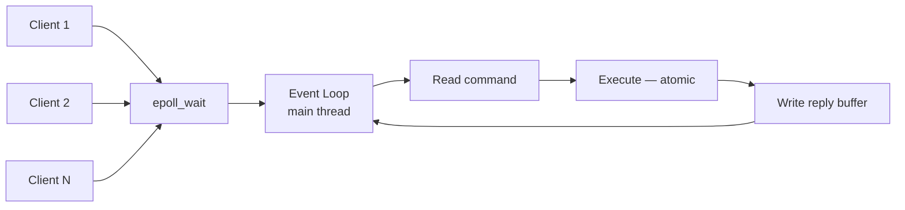
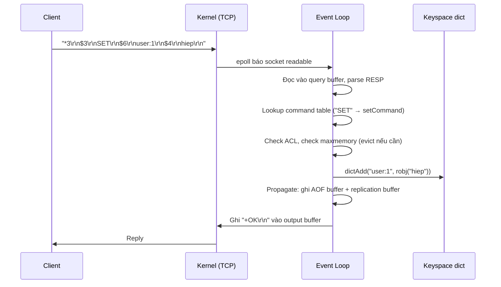

# Redis Overview

## Mục lục

- [Tổng quan](#tổng-quan)
- [Use Cases phổ biến](#use-cases-phổ-biến)
- [1. Kiến trúc bên trong](#1-kiến-trúc-bên-trong)
- [2. Event Loop & I/O Multiplexing](#2-event-loop--io-multiplexing)
- [3. Vòng đời một command](#3-vòng-đời-một-command)
- [4. Memory Model](#4-memory-model)
- [5. RESP Protocol](#5-resp-protocol)
- [6. Redis vs các hệ thống khác](#6-redis-vs-các-hệ-thống-khác)
- [Tài liệu tham khảo](#tài-liệu-tham-khảo)

---

## Tổng quan

Redis (**RE**mote **DI**ctionary **S**erver) là in-memory data structure store, dùng làm database, cache, message broker và streaming engine. Điểm khác biệt cốt lõi so với key-value store thông thường: **value không chỉ là string mà là các data structure thực thụ** (list, set, sorted set, hash, stream...) với các operation atomic trên server.

```
┌─────────────────────────────────────────────────────┐
│                    Redis Server                     │
│                                                     │
│  ┌───────────────┐   ┌──────────────────────────┐   │
│  │  Event Loop   │   │   Keyspace (dict)        │   │
│  │ (single main  │──▶│   key ──▶ robj           │   │
│  │    thread)    │   │   "user:1" ──▶ hash      │   │
│  └───────────────┘   │   "queue"  ──▶ list      │   │
│         ▲            │   "rank"   ──▶ zset      │   │
│         │            └──────────────────────────┘   │
│  ┌──────┴───────┐    ┌──────────────────────────┐   │
│  │ I/O threads  │    │ Background threads:      │   │
│  │ (read/write  │    │ - bio: fsync, lazy free  │   │
│  │  socket)     │    │ - fork: BGSAVE, rewrite  │   │
│  └──────────────┘    └──────────────────────────┘   │
└─────────────────────────────────────────────────────┘
```

> [!IMPORTANT]
> Redis thực thi command trên **một thread duy nhất**. Đây không phải điểm yếu mà là thiết kế chủ đích: không cần lock, mọi command đều atomic, và bottleneck thực tế thường là **memory bandwidth + network**, không phải CPU. Một instance Redis có thể xử lý 100K+ ops/sec.

**Đặc điểm chính:**

| Đặc điểm | Chi tiết |
|----------|---------|
| In-memory | Toàn bộ dataset nằm trong RAM → latency sub-millisecond |
| Single-threaded execution | Command được xử lý tuần tự, atomic tự nhiên, không race condition |
| Rich data structures | String, List, Set, Sorted Set, Hash, Stream, Bitmap, HyperLogLog, Geo |
| Persistence tùy chọn | RDB snapshot và/hoặc AOF log — xem [RDB](./rdb.md), [AOF](./aof.md) |
| Replication & HA | Master-replica, Sentinel, Cluster — xem [Replication](./replication.md) |
| Server-side scripting | Lua script chạy atomic — xem [Lua Scripting](./lua-scripting.md) |

---

## Use Cases phổ biến

| Use Case | Vì sao Redis phù hợp |
|----------|---------------------|
| **Cache** | Latency thấp, TTL per-key, eviction policies — xem [Caching Patterns](./caching-patterns.md) |
| **Session store** | TTL tự động expire session, tốc độ đọc/ghi cao — xem [Session Store](./session-store.md) |
| **Rate limiting** | INCR + EXPIRE atomic, Lua cho sliding window — xem [Rate Limiting](./rate-limiting.md) |
| **Leaderboard** | Sorted Set: thêm/xếp hạng O(log N) — xem [Leaderboard](./leaderboard-counting.md) |
| **Queue / job dispatch** | List với BLPOP blocking, Stream với consumer groups |
| **Distributed lock** | SET NX PX atomic — xem [Distributed Lock](./distributed-lock.md) |
| **Pub/Sub messaging** | Fire-and-forget broadcast — xem [Pub/Sub](./pub-sub.md) |
| **Real-time analytics** | HyperLogLog đếm unique, Bitmap tracking theo ngày |

---

## 1. Kiến trúc bên trong

### 1.1 Keyspace là một dict khổng lồ

Mỗi database (mặc định 16 db, chọn bằng `SELECT`) về bản chất là một **hash table** (`dict` trong source code):

```
redisDb
├── dict     : key → redisObject (dữ liệu chính)
└── expires  : key → expire timestamp (chỉ chứa key có TTL)
```

- `dict` dùng **incremental rehashing**: khi hash table cần resize, Redis không rehash toàn bộ một lần (sẽ block event loop với hàng triệu key) mà giữ **2 hash table song song** và di chuyển dần từng bucket mỗi khi có operation chạm vào dict, cộng thêm 1ms mỗi vòng `serverCron`.
- Vì vậy lookup key luôn là O(1) amortized kể cả khi đang rehash.

### 1.2 redisObject (robj)

Mọi value đều được wrap trong struct `redisObject`:

```c
typedef struct redisObject {
    unsigned type:4;      // STRING, LIST, SET, ZSET, HASH, STREAM
    unsigned encoding:4;  // cách lưu trữ thực tế bên dưới
    unsigned lru:24;      // LRU clock hoặc LFU counter (cho eviction)
    int refcount;
    void *ptr;            // trỏ tới data structure thực
} robj;
```

Điểm quan trọng: **`type` là API bên ngoài, `encoding` là cấu trúc thật bên trong**. Cùng một type có thể có nhiều encoding, Redis tự chuyển đổi khi dữ liệu lớn lên:

| Type | Encoding khi nhỏ | Encoding khi lớn |
|------|-----------------|------------------|
| string | `int`, `embstr` (≤44 bytes) | `raw` (SDS) |
| list | `listpack` | `quicklist` (linked list các listpack) |
| set | `intset`, `listpack` | `hashtable` |
| hash | `listpack` | `hashtable` |
| zset | `listpack` | `skiplist` + `dict` |

Kiểm tra bằng `OBJECT ENCODING key`. Encoding nhỏ tiết kiệm memory đáng kể (xem [Memory Management](./memory-management.md)).

### 1.3 SDS — Simple Dynamic String

Redis không dùng C string (`char*` null-terminated) mà dùng **SDS**:

```
+--------+-------+-----------------------+------+
| len    | alloc | buf[]                 | '\0' |
+--------+-------+-----------------------+------+
```

- `STRLEN` là O(1) (đọc `len`, không cần duyệt tìm `\0`)
- Binary-safe: value có thể chứa byte `\0` (ảnh, protobuf, JSON...)
- Pre-allocation: append nhiều lần không realloc mỗi lần

---

## 2. Event Loop & I/O Multiplexing

### 2.1 Vì sao single-threaded mà nhanh?

Redis dùng **I/O multiplexing** (epoll trên Linux, kqueue trên BSD/macOS): một thread duy nhất theo dõi hàng nghìn socket cùng lúc, chỉ xử lý socket nào sẵn sàng.



Lý do thiết kế này thắng multi-thread cho workload của Redis:

1. **Không lock** — mọi thao tác trên keyspace không cần mutex → không contention, không deadlock
2. **Không context switch** giữa các thread khi xử lý command
3. Command trên in-memory data cực nhanh (microseconds) → CPU hiếm khi là bottleneck; nếu cần scale CPU thì chạy nhiều instance / [Cluster](./cluster.md)

### 2.2 I/O Threads (Redis 6+)

Từ Redis 6, phần **đọc/ghi socket và parse protocol** có thể chạy đa luồng (`io-threads` config), nhưng **execute command vẫn luôn single-threaded**. Điều này giúp scale phần tốn CPU nhất (network I/O + serialization) mà vẫn giữ tính atomic.

```
io-threads 4          # dùng 4 thread cho socket write
io-threads-do-reads yes  # cho cả socket read
```

### 2.3 Background threads

Một số việc chậm được đẩy sang thread nền (bio — background I/O):

- `fsync` AOF (khi `appendfsync everysec`)
- **Lazy freeing**: `UNLINK` / `FLUSHALL ASYNC` — xóa key lớn ở thread nền thay vì block event loop như `DEL`
- Đóng file descriptor

Và **fork child process** cho công việc nặng: `BGSAVE` (RDB), AOF rewrite — tận dụng copy-on-write của OS (chi tiết trong [RDB Snapshots](./rdb.md)).

> [!TIP]
> Hệ quả thực tiễn của single-thread: **một command chậm block tất cả client**. `KEYS *`, `SMEMBERS` trên set 10 triệu phần tử, `DEL` một hash khổng lồ — đều gây latency spike toàn hệ thống. Xem [Slow Log & Latency](./slow-log-latency.md).

---

## 3. Vòng đời một command

Điều gì xảy ra khi client gửi `SET user:1 "hiep"`:



Các bước đáng chú ý:

1. **Parse**: command đến dưới dạng RESP (xem mục 5), được parse thành mảng argument
2. **Lookup**: tên command tra trong command table — O(1)
3. **Pre-checks**: ACL permission, memory limit (nếu vượt `maxmemory` → chạy eviction trước, xem [Eviction Policies](./eviction-policies.md))
4. **Execute**: gọi hàm command trực tiếp trên dict — không lock
5. **Propagate**: nếu command làm thay đổi dữ liệu → append vào AOF buffer và replication backlog
6. **Reply**: ghi vào output buffer của client, event loop flush khi socket writable

### Expire hoạt động thế nào?

Key có TTL bị xóa theo **2 cơ chế kết hợp**:

- **Lazy expiration**: mỗi lần truy cập key, Redis check timestamp trong `expires` dict — nếu hết hạn thì xóa và trả về nil
- **Active expiration**: `serverCron` (mặc định 10 lần/giây) lấy mẫu ngẫu nhiên 20 key trong `expires`, xóa key hết hạn; nếu >25% mẫu đã hết hạn thì lặp lại ngay

→ Hệ quả: key hết hạn **không bị xóa ngay lập tức** khỏi memory; memory chỉ được giải phóng dần. `TTL`/`PTTL` để kiểm tra thời gian còn lại.

---

## 4. Memory Model

- **Toàn bộ dataset phải vừa trong RAM.** Redis không tự spill xuống disk (khác Memcached extstore hay database truyền thống).
- Allocator mặc định là **jemalloc** — giảm fragmentation so với libc malloc.
- `maxmemory` + eviction policy quyết định hành vi khi đầy memory:

```bash
maxmemory 4gb
maxmemory-policy allkeys-lru   # hoặc volatile-lru, allkeys-lfu, noeviction...
```

- `INFO memory` cho biết `used_memory` (dữ liệu) vs `used_memory_rss` (OS cấp phát) — tỉ lệ `mem_fragmentation_ratio` > 1.5 là dấu hiệu fragmentation.

Chi tiết: [Memory Management](./memory-management.md), [Eviction Policies](./eviction-policies.md).

---

## 5. RESP Protocol

Redis Serialization Protocol — text-based, cực đơn giản để parse:

```
Client gửi:  SET user:1 hiep
Trên wire:   *3\r\n           ← array 3 phần tử
             $3\r\nSET\r\n    ← bulk string dài 3
             $6\r\nuser:1\r\n
             $4\r\nhiep\r\n

Server trả:  +OK\r\n          ← simple string
```

Các kiểu reply chính (RESP2):

| Prefix | Kiểu | Ví dụ |
|--------|------|-------|
| `+` | Simple string | `+OK\r\n` |
| `-` | Error | `-ERR unknown command\r\n` |
| `:` | Integer | `:42\r\n` |
| `$` | Bulk string | `$4\r\nhiep\r\n` (`$-1` = nil) |
| `*` | Array | `*2\r\n...` |

**RESP3** (Redis 6+, bật bằng `HELLO 3`) thêm map, set, double, big number và **push message** — nền tảng cho [Client-Side Caching](./client-side-caching.md).

Vì protocol đơn giản, việc gom nhiều command gửi một lần (pipelining) rất hiệu quả — xem [Pipelining & Batching](./pipelining-batching.md).

---

## 6. Redis vs các hệ thống khác

| Tiêu chí | Redis | Memcached | RDBMS (Postgres) |
|----------|-------|-----------|------------------|
| Data model | Rich structures | Chỉ string/blob | Relational, SQL |
| Threading | Single-thread exec + I/O threads | Multi-thread | Multi-process/thread |
| Persistence | RDB/AOF tùy chọn | Không | WAL, ACID đầy đủ |
| Replication | Built-in master-replica | Không (client-side) | Streaming replication |
| Atomic operations | Mọi command + Lua/MULTI | CAS đơn giản | Transaction đầy đủ |
| Use case chính | Cache + data structures + queue | Pure cache | Source of truth |

**Khi nào dùng Redis:** cần latency < 1ms, data structure operations (ranking, counting, queue), TTL/eviction tự nhiên, pub/sub nhẹ.

**Khi nào KHÔNG dùng Redis:** dataset lớn hơn RAM nhiều lần, cần query phức tạp (join, ad-hoc filter), cần durability tuyệt đối từng transaction (AOF `always` rất chậm), dữ liệu là source of truth duy nhất mà không có backup strategy.

---

## Tài liệu tham khảo

- [Redis Documentation](https://redis.io/docs/)
- [Redis internals — object encoding](https://redis.io/docs/latest/develop/reference/internals/)
- [RESP protocol spec](https://redis.io/docs/latest/develop/reference/protocol-spec/)
- [Strings](./strings.md) — bước tiếp theo: bắt đầu học data structures
