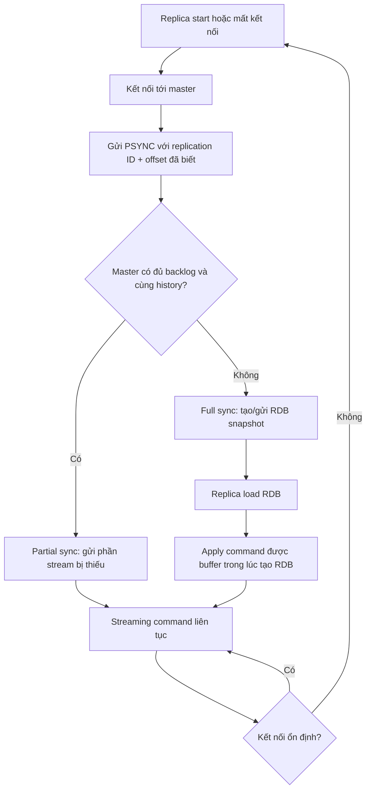
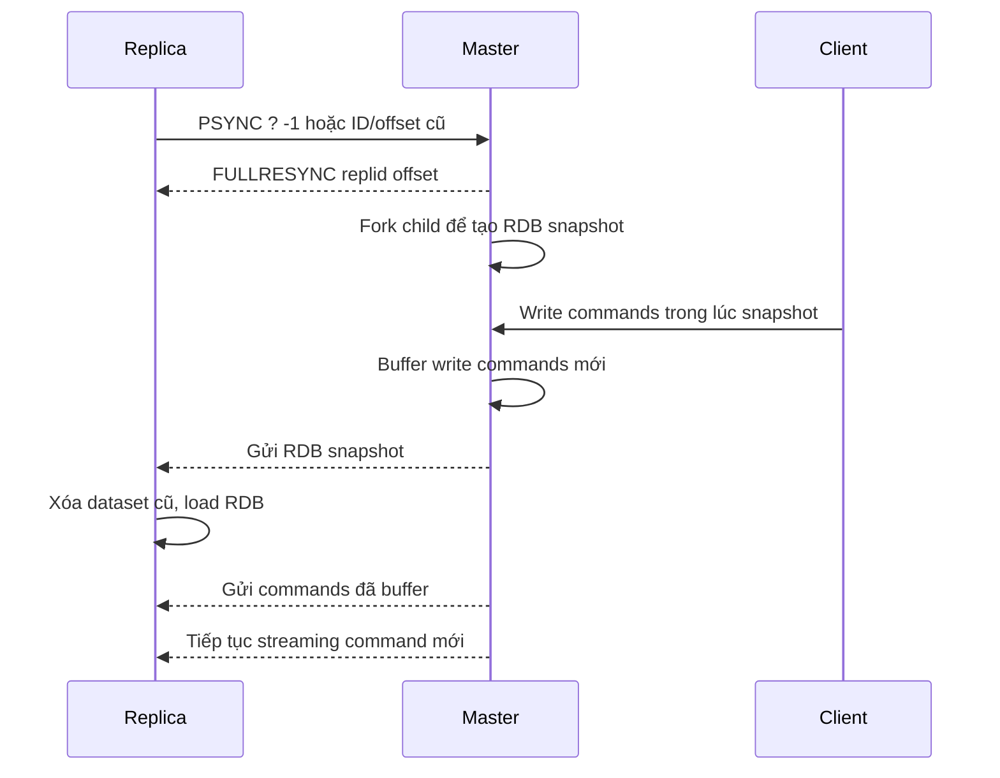
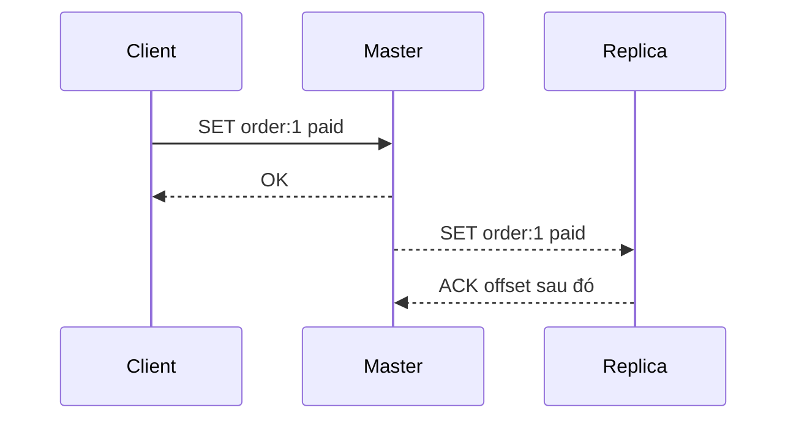
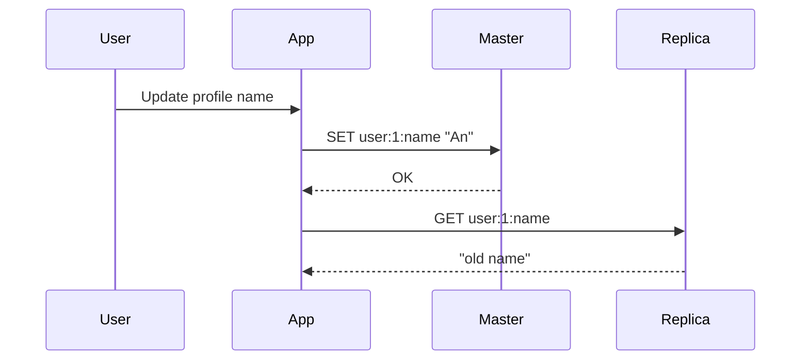

# Replication

## Mục lục

- [Tổng quan](#tổng-quan)
- [Replication giải quyết vấn đề gì?](#replication-giải-quyết-vấn-đề-gì)
- [Kiến trúc master-replica](#kiến-trúc-master-replica)
- [Luồng hoạt động tổng quát](#luồng-hoạt-động-tổng-quát)
- [Full synchronization: đồng bộ toàn bộ dữ liệu](#full-synchronization-đồng-bộ-toàn-bộ-dữ-liệu)
- [Partial synchronization: đồng bộ phần bị thiếu](#partial-synchronization-đồng-bộ-phần-bị-thiếu)
- [Replication ID, offset và backlog](#replication-id-offset-và-backlog)
- [Asynchronous replication và tính nhất quán](#asynchronous-replication-và-tính-nhất-quán)
- [WAIT: giảm rủi ro mất dữ liệu sau write](#wait-giảm-rủi-ro-mất-dữ-liệu-sau-write)
- [Read scaling với replica](#read-scaling-với-replica)
- [Failover: Replication không tự động HA](#failover-replication-không-tự-động-ha)
- [Replication và persistence](#replication-và-persistence)
- [Key expiry, eviction và maxmemory trên replica](#key-expiry-eviction-và-maxmemory-trên-replica)
- [Cascading replication](#cascading-replication)
- [Diskless replication](#diskless-replication)
- [Cấu hình replication](#cấu-hình-replication)
- [Quan sát và debug replication](#quan-sát-và-debug-replication)
- [Các lỗi thường gặp](#các-lỗi-thường-gặp)
- [Best practices](#best-practices)
- [Checklist production](#checklist-production)
- [So sánh nhanh](#so-sánh-nhanh)
- [Tài liệu liên quan](#tài-liệu-liên-quan)

---

## Tổng quan

**Replication** trong Redis là cơ chế tạo một hoặc nhiều bản sao dữ liệu từ một Redis instance chính sang các Redis instance phụ.

Trong tài liệu Redis hiện đại, mô hình này thường được gọi là **leader-follower** hoặc **master-replica**. Trong nhiều tài liệu cũ bạn vẫn thấy từ **master-slave**; ý nghĩa kỹ thuật tương tự, nhưng Redis hiện dùng thuật ngữ `master` và `replica` trong config/command.

Một topology đơn giản:

```text
                 write
Client ─────────────────────▶ Master
                              │
                              │ replication stream
                              ▼
                           Replica
                              ▲
Client ─────── read ──────────┘
```

Ý tưởng cốt lõi:

- Client ghi dữ liệu vào **master**.
- Master gửi một stream các command làm thay đổi dữ liệu sang **replica**.
- Replica apply lại các command đó để trở thành bản sao gần giống master nhất có thể.
- Replica thường phục vụ read-only traffic, backup, hoặc được promote thành master khi failover.

> [!IMPORTANT]
> Replication **không đồng nghĩa với high availability tự động**. Replication chỉ tạo bản sao. Tự động phát hiện lỗi, bầu master mới, cập nhật client routing là trách nhiệm của [Redis Sentinel](./sentinel.md) hoặc [Redis Cluster](./cluster.md), hoặc orchestration bên ngoài.

---

## Replication giải quyết vấn đề gì?

| Nhu cầu | Replication giúp như thế nào? | Lưu ý quan trọng |
|---------|-------------------------------|------------------|
| **Read scaling** | Chia read traffic sang nhiều replica | Dữ liệu trên replica có thể trễ so với master |
| **Data redundancy** | Có bản sao nếu master hỏng | Vẫn có thể mất write mới nhất vì replication async |
| **Failover foundation** | Sentinel/Cluster có node để promote | Basic replication không tự promote |
| **Backup ít ảnh hưởng master** | Cho replica chạy RDB/AOF/backup thay master | Cần đảm bảo replica bắt kịp trước khi backup |
| **Analytics/slow reads** | Đẩy truy vấn read nặng sang replica | Cẩn thận với command O(N) và độ stale |
| **Geo/local reads** | Đặt replica gần region đọc | Tăng replication lag nếu network xa |

Ví dụ thực tế:

```text
                 ┌──────────────────────┐
                 │  App write traffic   │
                 └──────────┬───────────┘
                            ▼
                      ┌──────────┐
                      │ Master   │
                      │ Redis A  │
                      └────┬─────┘
             ┌─────────────┼─────────────┐
             ▼             ▼             ▼
       ┌──────────┐  ┌──────────┐  ┌──────────┐
       │ Replica  │  │ Replica  │  │ Replica  │
       │ Redis B  │  │ Redis C  │  │ Redis D  │
       └────┬─────┘  └────┬─────┘  └────┬─────┘
            ▼             ▼             ▼
      read traffic   reporting job   backup job
```

---

## Kiến trúc master-replica

### Vai trò của master

Master là node nhận các write command chính:

- `SET`, `DEL`, `HSET`, `LPUSH`, `ZADD`, `XADD`, ...
- Expire/evict key và gửi thông tin thay đổi sang replica.
- Duy trì replication backlog để hỗ trợ partial sync.
- Theo dõi offset đã gửi và ACK từ replica.

### Vai trò của replica

Replica kết nối tới master và nhận replication stream.

Mặc định replica là **read-only**:

```conf
replica-read-only yes
```

Điều này giúp tránh accidental write vào replica. Nếu bật writable replica, dữ liệu local trên replica có thể khác master và có thể mất khi resync.

> [!WARNING]
> Không nên ghi dữ liệu business vào replica. Những write local trên replica không được coi là source of truth, không được propagate ngược về master, và có thể bị xóa khi replica full resync.

### Một master có nhiều replica

```text
          ┌──────────┐
          │ Master   │
          └────┬─────┘
               │
     ┌─────────┼─────────┐
     ▼         ▼         ▼
┌─────────┐ ┌─────────┐ ┌─────────┐
│Replica 1│ │Replica 2│ │Replica 3│
└─────────┘ └─────────┘ └─────────┘
```

Master phải gửi replication stream cho từng replica. Nếu số replica quá nhiều hoặc replica/network chậm, master tốn thêm memory cho output buffer và CPU/network để đẩy stream.

---

## Luồng hoạt động tổng quát

Redis replication có 3 cơ chế chính:

1. **Normal streaming**: khi master và replica kết nối ổn định, master liên tục gửi command stream sang replica.
2. **Partial resynchronization**: khi kết nối bị đứt ngắn, replica reconnect và xin phần stream bị thiếu.
3. **Full resynchronization**: khi partial sync không thể thực hiện, master gửi lại toàn bộ dataset.



Điểm cần nhớ:

- Replication stream dùng format gần với Redis protocol command.
- Master không chờ replica apply xong từng command trước khi trả lời client, nên latency thấp.
- Replica định kỳ ACK offset đã xử lý cho master.

---

## Full synchronization: đồng bộ toàn bộ dữ liệu

**Full synchronization** xảy ra khi replica không có dữ liệu phù hợp để tiếp tục từ offset cũ, ví dụ:

- Replica mới kết nối lần đầu.
- Replica disconnect quá lâu, backlog trên master không còn đủ phần bị thiếu.
- Master restart/promote làm thay đổi replication history.
- Replica có replication ID không còn được master nhận diện.

### Full sync diễn ra như thế nào?

Luồng chuẩn:



### Vì sao full sync nặng?

Full sync không chỉ là “copy file”. Nó có nhiều chi phí:

| Chi phí | Ảnh hưởng |
|---------|-----------|
| **Fork process** | Master fork child để tạo RDB; có thể gây latency spike nếu memory lớn |
| **Copy-on-write** | Trong lúc child tạo snapshot, write mới làm tăng memory tạm thời |
| **Network transfer** | Dataset lớn cần truyền nhiều GB qua network |
| **Replica load RDB** | Replica phải load dataset vào memory, có thể block trong một khoảng thời gian |
| **Buffer writes** | Master phải buffer commands phát sinh trong khi full sync đang chạy |

> [!IMPORTANT]
> Full sync của dataset lớn là sự kiện cần quan sát kỹ trong production. Nếu replica liên tục full resync, hệ thống có thể bị tăng latency, tăng memory, tăng network và thậm chí OOM.

### Một full sync phục vụ nhiều replica

Nếu nhiều replica cùng yêu cầu full sync gần nhau, master có thể dùng một background save để phục vụ nhiều replica. Tuy nhiên mỗi replica vẫn cần nhận dữ liệu qua network và load dataset riêng.

---

## Partial synchronization: đồng bộ phần bị thiếu

**Partial synchronization** là cơ chế giúp replica reconnect mà không cần nhận lại toàn bộ dataset.

Kịch bản:

```text
T0: Master offset = 1000, Replica đã nhận tới 1000
T1: Network đứt
T2: Master tiếp tục nhận writes, offset tăng tới 1800
T3: Replica reconnect, báo: tôi có replid X, offset 1000
T4: Nếu master còn giữ stream 1001..1800 trong backlog → gửi phần thiếu
```

Partial sync nhanh hơn nhiều vì chỉ truyền delta.

### Điều kiện để partial sync thành công

Partial sync thường thành công khi:

- Replica reconnect tới đúng master hoặc master mới vẫn nhớ old replication ID.
- Replication ID/history khớp.
- Replication backlog còn đủ dữ liệu từ offset replica bị thiếu.
- Replica không mất metadata cần thiết sau restart.

Nếu backlog không đủ, Redis phải full sync.

---

## Replication ID, offset và backlog

Đây là phần quan trọng nhất để hiểu Redis replication.

### Replication ID

Mỗi master có một **replication ID** (`master_replid`) đại diện cho một “lịch sử dữ liệu” của master.

Bạn có thể hình dung:

```text
Replication ID = tên của timeline dữ liệu
Offset         = vị trí trong timeline đó
```

Nếu hai node có cùng replication ID và cùng offset, Redis có thể coi chúng đang ở cùng một phiên bản dữ liệu.

Ví dụ:

```text
Node A: replid = abc, offset = 1000
Node B: replid = abc, offset = 1200
```

Node A thiếu đoạn command stream từ offset `1001` đến `1200`. Nếu master còn giữ đoạn này, A có thể partial sync để bắt kịp B.

### Replication offset

Replication offset tăng theo số byte của replication stream được master tạo ra.

Offset vẫn tăng ngay cả khi không có replica kết nối. Điều này quan trọng vì master luôn có một timeline logic của các thay đổi.

### Replication backlog

Replication backlog là một buffer vòng (circular buffer) trên master, lưu một phần replication stream gần nhất để phục vụ partial sync.

```text
Master replication stream offset:

... 900 1000 1100 1200 1300 1400 1500
              └──────── backlog ────────┘

Replica disconnect tại offset 1050
Replica reconnect khi master offset 1500
Nếu backlog còn từ <=1051 → partial sync OK
Nếu backlog chỉ còn từ 1200   → full sync
```

Config quan trọng:

```conf
repl-backlog-size 64mb
repl-backlog-ttl 3600
```

| Config | Ý nghĩa | Gợi ý |
|--------|---------|-------|
| `repl-backlog-size` | Kích thước backlog trên master | Tăng nếu write throughput cao hoặc network hay chập chờn |
| `repl-backlog-ttl` | Sau khi không còn replica, master giữ backlog bao lâu | Giữ đủ lâu để replica reconnect ngắn hạn |

### Ước lượng backlog-size

Công thức gần đúng:

```text
repl-backlog-size >= write_rate_bytes_per_second × expected_disconnect_seconds × safety_factor
```

Ví dụ:

- Write stream trung bình: `5 MB/s`
- Muốn chịu được disconnect: `60s`
- Safety factor: `2`

```text
5 MB/s × 60 × 2 = 600 MB
```

Khi đó `repl-backlog-size 600mb` hợp lý hơn default nhỏ.

> [!TIP]
> Nếu thấy replica hay `FULLRESYNC` sau network blip ngắn, hãy kiểm tra `repl-backlog-size`, write throughput và thời gian disconnect thực tế.

### Vì sao Redis có hai replication ID?

Khi một replica được promote thành master sau failover, nó tạo replication ID mới vì một timeline dữ liệu mới bắt đầu. Nhưng để các replica khác không phải full sync, node mới vẫn nhớ replication ID cũ dưới dạng secondary ID trong một khoảng offset an toàn.

Ý nghĩa:

```text
Trước failover:
Master A replid = OLD, offset = 10000
Replica B theo A tới offset 9900
Replica C theo A tới offset 9700

Sau failover:
B được promote thành master
B có replid mới = NEW
B vẫn nhớ replid cũ = OLD tới offset 9900

C kết nối B và nói: tôi có OLD offset 9700
B có thể gửi delta 9701..9900 nếu còn backlog
```

Nhờ vậy failover không luôn kéo theo full sync hàng loạt.

---

## Asynchronous replication và tính nhất quán

Redis replication mặc định là **asynchronous replication**.

Luồng write thông thường:



Master trả `OK` cho client trước khi replica chắc chắn đã apply command. Vì vậy:

- Latency write thấp.
- Throughput cao.
- Nhưng nếu master chết ngay sau khi trả `OK` và trước khi replica nhận command, write đó có thể mất khi failover.

### Replication lag

**Replication lag** là độ trễ giữa master và replica.

Lag có thể đến từ:

- Network chậm hoặc mất gói.
- Replica CPU bận, chạy command nặng.
- Replica đang load RDB/full sync.
- Output buffer trên master bị backlog.
- Disk/network contention nếu đang persistence/backup.

### Consistency model thực tế

| Hành vi | Có đảm bảo không? | Giải thích |
|---------|-------------------|------------|
| Read từ master thấy write vừa xong | Gần như có | Cùng node xử lý write/read |
| Read từ replica thấy write vừa xong | Không chắc | Replica có thể chưa nhận/apply |
| Write đã `OK` chắc chắn sống sau failover | Không chắc | Async replication có cửa sổ mất dữ liệu |
| Replica luôn giống master tuyệt đối từng microsecond | Không | Chỉ eventual consistency trong điều kiện bình thường |
| Dùng `WAIT` biến Redis thành strongly consistent DB | Không | `WAIT` giảm rủi ro nhưng không tạo CP system tuyệt đối |

> [!IMPORTANT]
> Nếu business flow yêu cầu read-your-writes, route read đó về master hoặc dùng cơ chế session stickiness/lag check. Không mặc định đọc ngay từ replica sau khi ghi.

---

## WAIT: giảm rủi ro mất dữ liệu sau write

Redis có command `WAIT` để client yêu cầu master đợi một số replica ACK đã nhận replication stream tới offset hiện tại.

Cú pháp:

```bash
WAIT <numreplicas> <timeout-milliseconds>
```

Ví dụ:

```bash
redis-cli SET payment:123 captured
redis-cli WAIT 1 1000
```

Ý nghĩa:

- Sau `SET`, client gọi `WAIT 1 1000`.
- Redis chờ tối đa `1000ms` để ít nhất `1` replica ACK đã nhận dữ liệu tới offset tương ứng.
- Kết quả trả về là số replica đã ACK.

Ví dụ response:

```bash
(integer) 1
```

### Khi nào dùng WAIT?

| Use case | Có nên dùng `WAIT`? | Lý do |
|----------|----------------------|-------|
| Cache thông thường | Thường không | Mất cache có thể rebuild |
| Session quan trọng | Có thể | Giảm xác suất mất session sau failover |
| Idempotency key | Nên cân nhắc | Mất key có thể gây duplicate processing |
| Payment/order state | Cẩn trọng | Redis có thể không phải source of truth chính |
| Rate limit counter | Tùy | Mất vài counter có thể chấp nhận hoặc không |

### WAIT không đảm bảo điều gì?

`WAIT` **không biến Redis thành hệ thống strongly consistent tuyệt đối**:

- Replica ACK nghĩa là đã nhận/apply stream tới offset đó, nhưng failover/persistence vẫn có edge cases.
- Nếu replica nhận write nhưng chưa persist xuống disk rồi mất điện, dữ liệu vẫn có thể mất tùy cấu hình persistence.
- Nếu orchestration failover không chọn replica mới nhất, write đã ACK trên replica khác vẫn có thể không xuất hiện trên master mới.

`WAIT` là **best-effort durability improvement**, không phải transaction commit protocol kiểu quorum database.

---

## Read scaling với replica

Replica thường được dùng để scale read:

```text
                 ┌───────────────┐
                 │ Load Balancer │
                 │ / Client lib  │
                 └───────┬───────┘
                         │ reads
           ┌─────────────┼─────────────┐
           ▼             ▼             ▼
      Replica A     Replica B     Replica C
```

### Loại read phù hợp với replica

| Read pattern | Phù hợp? | Lý do |
|--------------|----------|-------|
| Cache read có TTL | Rất phù hợp | Stale trong vài ms/s thường chấp nhận được |
| Product catalog | Phù hợp | Dữ liệu ít thay đổi, stale tolerance cao |
| Leaderboard realtime | Tùy | Có thể chấp nhận replica lag nhỏ |
| Session sau login vừa ghi | Cẩn thận | Có thể gặp read-after-write miss |
| Payment/order state vừa update | Không nên nếu cần chính xác ngay | Nên đọc master/source of truth |
| Admin reporting scan | Phù hợp nếu tách replica riêng | Tránh làm nặng master |

### Read-your-writes problem

Kịch bản lỗi phổ biến:



Cách xử lý:

1. **Read từ master sau write** trong cùng request/session ngắn.
2. **Client stickiness**: sau khi user ghi, route reads của user đó tới master trong N giây.
3. **Lag-aware routing**: chỉ đọc replica nếu lag dưới threshold.
4. **Use version/timestamp**: nếu replica trả version cũ, retry master.

### Không dùng replica để che giấu slow command bừa bãi

Đẩy `KEYS *`, `SMEMBERS` huge set, `LRANGE` list cực lớn sang replica có thể bảo vệ master, nhưng vẫn làm replica lag và mất giá trị failover.

Nên đọc thêm:

- [Slow Log & Latency](./slow-log-latency.md)
- [Benchmarking](./benchmarking.md)
- [Memory Management](./memory-management.md)

---

## Failover: Replication không tự động HA

Basic replication chỉ định nghĩa quan hệ master-replica. Nếu master chết:

- Replica không tự động thành master theo basic replication.
- Client không tự biết phải chuyển write sang node nào.
- Bạn cần thao tác thủ công hoặc dùng Sentinel/Cluster.

### Manual promotion

Trên replica, có thể chạy:

```bash
redis-cli REPLICAOF NO ONE
```

Replica sẽ trở thành master độc lập.

Sau đó các replica khác cần trỏ sang master mới:

```bash
redis-cli -h replica2 REPLICAOF <new-master-ip> 6379
```

### Vấn đề split-brain

Nếu master cũ chưa thật sự chết mà chỉ bị network partition, việc promote replica có thể tạo hai master cùng nhận write:

```text
Partition 1: Client A ─▶ Old Master
Partition 2: Client B ─▶ New Master
```

Khi network hồi phục, hai timeline dữ liệu khác nhau. Redis basic replication không tự merge conflict.

> [!WARNING]
> Đừng tự viết failover automation đơn giản kiểu “ping không được thì promote”. Failover cần quorum, fencing, client reconfiguration và quy tắc chọn replica mới nhất. Hãy dùng [Redis Sentinel](./sentinel.md) hoặc [Redis Cluster](./cluster.md) nếu cần HA tự động.

---

## Replication và persistence

Replication và persistence giải quyết hai lớp vấn đề khác nhau:

| Cơ chế | Mục tiêu | Nếu thiếu |
|--------|----------|-----------|
| Replication | Có bản sao online trên node khác | Node chết có thể mất availability/data mới |
| RDB/AOF persistence | Lưu dữ liệu xuống disk để restart | Process restart có thể mất toàn bộ dữ liệu in-memory |

Xem chi tiết:

- [RDB Snapshots](./rdb.md)
- [AOF](./aof.md)
- [Persistence Strategies](./persistence-strategies.md)

### Cảnh báo: master không persistence + auto restart

Đây là failure mode cực nguy hiểm:

```text
1. Master A tắt persistence, có dữ liệu trong memory.
2. Replica B và C đang replicate từ A.
3. A crash.
4. Supervisor/systemd tự restart A.
5. Vì không persistence, A restart với dataset rỗng.
6. B và C reconnect tới A và sync dataset rỗng.
7. Toàn bộ dữ liệu trên replica bị xóa theo master.
```

> [!IMPORTANT]
> Nếu dữ liệu quan trọng, master nên bật persistence. Nếu bắt buộc tắt persistence trên master vì latency, phải cực kỳ cẩn thận với auto restart và failover policy.

### Dùng replica để backup

Pattern phổ biến:

```text
Master: phục vụ traffic chính
Replica: bật RDB/AOF hoặc chạy backup job
```

Ưu điểm:

- Giảm impact fork/snapshot trên master.
- Có thể backup từ node riêng.

Lưu ý:

- Đảm bảo replica không lag quá cao trước khi backup.
- Backup từ replica có thể thiếu write mới nhất nếu replica lag.
- Nếu replica vừa full sync/load RDB, tránh lấy backup ngay.

---

## Key expiry, eviction và maxmemory trên replica

### Expiry do master điều khiển

Redis không dựa vào clock của replica để quyết định expire key theo cách độc lập hoàn toàn. Master là node quyết định key expired/evicted và gửi command như `DEL` sang replica.

Lý do: nếu master và replica tự expire theo clock riêng, clock lệch có thể làm dataset diverge.

Luồng:

```text
Master phát hiện key session:1 hết hạn
Master xóa key
Master gửi DEL session:1 sang replica
Replica apply DEL
```

Replica có thể có key đã “logically expired” nhưng chưa nhận `DEL`; khi đọc, Redis có cơ chế tránh trả dữ liệu đã quá TTL trong nhiều tình huống read.

### Eviction

Khi master áp dụng eviction do `maxmemory`, master gửi lệnh xóa tương ứng sang replica để giữ nhất quán.

### maxmemory trên replica

Mặc định replica thường bỏ qua `maxmemory` cho eviction dữ liệu dataset để tránh tự evict khác master:

```conf
replica-ignore-maxmemory yes
```

Điều này có nghĩa replica có thể dùng memory vượt ngưỡng `maxmemory` vì nó cố giữ dataset giống master.

> [!IMPORTANT]
> Replica cần đủ RAM cho dataset + replication buffers + overhead. Đừng nghĩ đặt `maxmemory` thấp trên replica là tự bảo vệ an toàn. Nếu replica OOM thật, nó có thể crash hoặc bị disconnect, kéo theo resync.

---

## Cascading replication

Redis cho phép replica replicate từ replica khác:

```text
Master A ──▶ Replica B ──▶ Replica C ──▶ Replica D
```

Mô hình này gọi là **cascading replication**.

### Khi nào dùng?

| Tình huống | Lợi ích |
|------------|---------|
| Master có quá nhiều replica | Giảm số connection trực tiếp tới master |
| Cross-region fan-out | Master chỉ gửi qua một replica trung gian |
| Tách traffic reporting/backup | Replica con phục vụ workload ít quan trọng |

### Trade-off

| Điểm đánh đổi | Giải thích |
|---------------|-----------|
| Tăng lag | Replica C phải chờ B nhận rồi propagate |
| Failure chain | B lỗi có thể ảnh hưởng C/D |
| Debug khó hơn | Cần nhìn nhiều hop offset/lag |
| Failover phức tạp | Phải hiểu node nào có dữ liệu mới nhất |

Từ Redis 4.0, sub-replica nhận cùng replication stream từ top-level master thông qua intermediate replica, giúp giữ consistency tốt hơn so với writable intermediate replica.

---

## Diskless replication

Mặc định full sync có thể tạo RDB file trên disk rồi gửi cho replica.

**Diskless replication** cho phép child process gửi RDB trực tiếp qua network tới replica, không cần ghi file trung gian xuống disk.

Config:

```conf
repl-diskless-sync yes
repl-diskless-sync-delay 5
```

| Config | Ý nghĩa |
|--------|---------|
| `repl-diskless-sync yes` | Bật diskless sync |
| `repl-diskless-sync-delay 5` | Đợi vài giây để gom thêm replica trước khi bắt đầu gửi RDB |

### Khi nào diskless sync hữu ích?

- Disk chậm hoặc EBS/network disk tạo bottleneck.
- Dataset lớn, full sync thường xuyên gây disk IO cao.
- Muốn tránh ghi RDB tạm trên master.

### Trade-off

- Phụ thuộc network ổn định trong lúc streaming RDB.
- Nếu replica đến trễ sau khi stream bắt đầu, có thể phải chờ lần sync khác.
- Vẫn có fork và copy-on-write cost.

---

## Cấu hình replication

### Setup nhanh bằng redis.conf

Master `redis.conf` tối thiểu:

```conf
port 6379
bind 0.0.0.0
protected-mode yes

# Nên bật persistence nếu dữ liệu quan trọng
appendonly yes
appendfsync everysec
```

Replica `redis.conf`:

```conf
port 6379
replicaof 10.0.0.10 6379
replica-read-only yes

# Nếu master yêu cầu auth
masterauth your-master-password

# Nếu dùng ACL user riêng để replica auth
# masteruser replica-user
# masterauth replica-password
```

Khởi động:

```bash
redis-server /path/to/master.conf
redis-server /path/to/replica.conf
```

### Setup runtime bằng command

Biến một Redis instance thành replica:

```bash
redis-cli -h 10.0.0.11 REPLICAOF 10.0.0.10 6379
```

Hủy replication và promote thành master:

```bash
redis-cli -h 10.0.0.11 REPLICAOF NO ONE
```

Kiểm tra role:

```bash
redis-cli -h 10.0.0.11 ROLE
```

### Cấu hình authentication

Nếu master có password/ACL, replica phải biết credential.

Redis config kiểu password đơn giản:

```conf
requirepass strong-password
```

Trên replica:

```conf
masterauth strong-password
```

Với ACL user:

```conf
masteruser replica-user
masterauth replica-password
```

Ví dụ ACL user cho replication cần quyền phù hợp. Trong thực tế, nên tham khảo Redis ACL docs/version đang dùng để cấp quyền tối thiểu chính xác.

### Cấu hình backlog

```conf
repl-backlog-size 256mb
repl-backlog-ttl 3600
```

Gợi ý:

- Workload write cao: tăng backlog.
- Network không ổn định: tăng backlog.
- Replica cross-region: tăng backlog.
- Muốn tránh full sync sau deploy/restart ngắn: tăng backlog và shutdown replica graceful.

### Cấu hình write safety: min replicas

Redis master có thể từ chối write nếu không có đủ replica “healthy” theo lag threshold:

```conf
min-replicas-to-write 1
min-replicas-max-lag 10
```

Ý nghĩa:

- Chỉ accept write nếu có ít nhất `1` replica.
- Replica đó phải có lag không quá `10` giây theo ACK/ping.

Nếu điều kiện không đạt, write trả lỗi.

> [!NOTE]
> Đây là cơ chế best-effort để giới hạn cửa sổ mất dữ liệu, không phải strong consistency. Nó không đảm bảo từng write đã được replica persist.

### Cấu hình replica announce khi dùng Docker/NAT

Trong Docker, Kubernetes, NAT hoặc port mapping, master/Sentinel có thể nhìn sai IP/port của replica. Dùng:

```conf
replica-announce-ip 10.0.0.11
replica-announce-port 6379
```

Điều này đặc biệt quan trọng khi [Redis Sentinel](./sentinel.md) dùng `INFO`/`ROLE` để discover topology.

### Docker Compose ví dụ tối giản

```yaml
services:
  redis-master:
    image: redis:7
    command: ["redis-server", "--appendonly", "yes"]
    ports:
      - "6379:6379"

  redis-replica:
    image: redis:7
    command:
      [
        "redis-server",
        "--replicaof", "redis-master", "6379",
        "--replica-read-only", "yes"
      ]
    depends_on:
      - redis-master
    ports:
      - "6380:6379"
```

Test:

```bash
redis-cli -p 6379 SET hello world
redis-cli -p 6380 GET hello
redis-cli -p 6380 SET x y
# (error) READONLY You can't write against a read only replica.
```

---

## Quan sát và debug replication

### INFO replication

Command quan trọng nhất:

```bash
redis-cli INFO replication
```

Trên master, bạn có thể thấy dạng:

```text
role:master
connected_slaves:2
slave0:ip=10.0.0.11,port=6379,state=online,offset=123456,lag=0
slave1:ip=10.0.0.12,port=6379,state=online,offset=123000,lag=1
master_replid:...
master_replid2:...
master_repl_offset:123456
second_repl_offset:-1
repl_backlog_active:1
repl_backlog_size:268435456
repl_backlog_first_byte_offset:100000
repl_backlog_histlen:23457
```

Trên replica:

```text
role:slave
master_host:10.0.0.10
master_port:6379
master_link_status:up
master_last_io_seconds_ago:0
master_sync_in_progress:0
slave_read_repl_offset:123456
slave_repl_offset:123456
slave_priority:100
slave_read_only:1
```

> [!NOTE]
> Một số output vẫn dùng từ `slave` vì lý do tương thích lịch sử. Concept hiện đại vẫn là replica.

### Metrics cần theo dõi

| Metric | Ý nghĩa | Cảnh báo khi |
|--------|---------|--------------|
| `master_link_status` | Replica còn kết nối master không | `down` |
| `master_last_io_seconds_ago` | Bao lâu chưa nhận IO từ master | Tăng liên tục |
| `master_sync_in_progress` | Replica đang full sync không | `1` kéo dài |
| `master_repl_offset` | Offset hiện tại của master | Dùng so với replica offset |
| Replica offset | Replica đã xử lý tới đâu | Chênh lệch lớn với master |
| `connected_slaves` | Số replica connected | Giảm bất thường |
| `repl_backlog_histlen` | Dữ liệu đang có trong backlog | Quá nhỏ so với disconnect window |
| `mem_clients_slaves` hoặc client output buffer | Buffer cho replica | Tăng cao do replica chậm |

### Tính replication lag theo offset

Lag bytes gần đúng:

```text
lag_bytes = master_repl_offset - replica_repl_offset
```

Nếu `lag_bytes` tăng liên tục:

- Replica không bắt kịp write rate.
- Network chậm.
- Replica đang bận command/persistence.
- Master output buffer bị nghẽn.

### ROLE

`ROLE` dễ parse hơn cho automation:

```bash
redis-cli ROLE
```

Master trả về role, offset và danh sách replica. Replica trả về master host/port, state và offset.

### Log cần chú ý

Các dấu hiệu trong log:

```text
Full resync requested by replica
Partial resynchronization accepted
Unable to partial resync with replica
MASTER <-> REPLICA sync started
MASTER <-> REPLICA sync: Finished with success
Connection with replica lost
```

Nếu log full resync xuất hiện liên tục, cần kiểm tra backlog, network, replica crash/OOM, timeout và `client-output-buffer-limit`.

### Output buffer replica

Master giữ output buffer cho mỗi replica. Replica chậm / network nghẽn → buffer phình → Redis **disconnect** replica → full resync:

```conf
# hard limit / soft limit / soft seconds — chỉnh theo write rate & RTT
client-output-buffer-limit replica 256mb 64mb 60
```

| Triệu chứng | Hướng xử lý |
|-------------|-------------|
| Replica disconnect lặp | Tăng buffer hoặc giảm write burst; kiểm tra replica CPU/disk |
| Full resync sau disconnect | Tăng `repl-backlog-size` để còn partial sync |
| Memory master tăng theo replica | Nhiều replica chậm = nhiều buffer; cân nhắc topology |

---

## Các lỗi thường gặp

### 1. Replica luôn full resync sau khi reconnect

Nguyên nhân thường gặp:

- `repl-backlog-size` quá nhỏ.
- Replica disconnect quá lâu.
- Master restart làm mất backlog/history.
- Replica restart không giữ được metadata để partial sync.
- Failover tạo timeline mới và old ID không còn phù hợp.

Cách xử lý:

- Tăng `repl-backlog-size`.
- Giảm thời gian deploy/restart replica.
- Kiểm tra network timeout.
- Bật persistence phù hợp để replica có metadata partial sync sau graceful restart.

### 2. Replica lag cao

Checklist:

```bash
redis-cli INFO replication
redis-cli INFO stats
redis-cli INFO commandstats
redis-cli SLOWLOG GET 20
redis-cli LATENCY LATEST
```

Nguyên nhân:

- Write throughput vượt khả năng network/replica.
- Replica chạy command nặng hoặc backup nặng.
- CPU throttling/container limit.
- Disk IO nếu AOF/RDB trên replica.
- Cross-region latency cao.

Cách xử lý:

- Tách replica read traffic và replica backup.
- Tăng resource cho replica.
- Hạn chế command O(N).
- Gần region hơn hoặc dùng topology khác.
- Monitor output buffer và network bandwidth.

### 3. Client đọc dữ liệu cũ từ replica

Đây không nhất thiết là lỗi Redis; đó là hệ quả của async replication.

Cách xử lý:

- Đọc master cho request cần read-your-writes.
- Dùng lag-aware routing.
- Dùng `WAIT` sau write quan trọng.
- Thiết kế app chịu được stale read.

### 4. Write bị lỗi `NOREPLICAS` hoặc tương tự

Nếu cấu hình:

```conf
min-replicas-to-write 1
min-replicas-max-lag 10
```

Khi không đủ replica healthy, master từ chối write.

Cách xử lý:

- Kiểm tra replica link.
- Kiểm tra lag.
- Đánh giá lại threshold có quá strict không.
- Không tắt bừa trong incident nếu dữ liệu quan trọng; hiểu trade-off trước.

### 5. Replica bị OOM

Nguyên nhân:

- Replica cần memory hơn master do buffer/fragmentation.
- Full sync/load RDB tạo memory pressure.
- Read traffic tạo client output buffer lớn.
- Backup/persistence overhead.

Cách xử lý:

- Cấp RAM replica >= master + buffer margin.
- Theo dõi memory fragmentation.
- Giới hạn slow clients.
- Tách workload nặng khỏi replica dùng cho HA.

### 6. Docker/Sentinel nhìn sai IP replica

Triệu chứng:

- Sentinel discover replica với IP container/private không route được.
- Failover xong client không connect được node mới.

Cách xử lý:

```conf
replica-announce-ip <reachable-ip-or-dns>
replica-announce-port <reachable-port>
```

---

## Best practices

### 1. Bật persistence nếu dữ liệu quan trọng

Replication không thay thế persistence. Nếu master restart rỗng và replica sync theo, bạn có thể mất toàn bộ dữ liệu.

Khuyến nghị thường gặp:

```conf
appendonly yes
appendfsync everysec
```

Kết hợp AOF/RDB theo nhu cầu durability và recovery time. Xem [Persistence Strategies](./persistence-strategies.md).

### 2. Dùng Sentinel/Cluster cho HA tự động

Nếu mục tiêu là availability:

- Dùng [Redis Sentinel](./sentinel.md) cho master-replica failover không sharding.
- Dùng [Redis Cluster](./cluster.md) khi cần sharding + HA.

Replication đơn thuần chỉ là nền tảng.

### 3. Thiết kế read path biết stale data

Không route toàn bộ read sang replica một cách mù quáng. Phân loại read:

```text
Critical/read-after-write  → master
Stale-tolerant/cache read  → replica
Heavy reporting            → dedicated replica
```

### 4. Tăng backlog theo write rate thực tế

Default backlog có thể không đủ cho production write-heavy workload.

Theo dõi:

- Full sync frequency.
- Disconnect duration.
- Write bytes/sec.
- `repl_backlog_histlen`.

### 5. Không để replica phục vụ workload làm ảnh hưởng HA

Nếu một replica được Sentinel dùng làm candidate failover, đừng dùng nó cho job reporting cực nặng hoặc backup nặng không kiểm soát.

Một mô hình tốt:

```text
Master
├── Replica HA 1      ít read, ưu tiên promote
├── Replica HA 2      ít read, ưu tiên promote
└── Replica analytics chạy reporting/backup, priority thấp
```

Có thể dùng `replica-priority` để ảnh hưởng lựa chọn failover trong Sentinel.

### 6. Theo dõi replication như SLO riêng

Alert tối thiểu:

- Replica disconnected.
- Replication lag vượt ngưỡng.
- Full sync xảy ra bất thường.
- Backlog không đủ cho disconnect window.
- Output buffer replica tăng cao.
- `min-replicas-to-write` khiến write bị reject.

### 7. Cẩn thận với cross-region replication

Cross-region replication thường có:

- Latency cao.
- Lag biến động.
- Network partition dễ hơn.
- Failover phức tạp hơn.

Không nên giả định cross-region replica luôn có dữ liệu mới nhất.

### 8. Tránh writable replica

Giữ:

```conf
replica-read-only yes
```

Nếu cần dữ liệu local tạm cho analytics, cân nhắc dùng Redis instance riêng, không nằm trong HA replication chain.

---

## Checklist production

### Trước khi bật replication

- [ ] Xác định mục tiêu: read scaling, HA foundation, backup hay DR.
- [ ] Xác định dữ liệu có cần durability không.
- [ ] Chọn persistence strategy cho master/replica.
- [ ] Tính RAM cho master và replica, gồm buffer overhead.
- [ ] Tính network bandwidth cho replication stream.
- [ ] Cấu hình auth/TLS/network security. Xem [Security](./security.md).
- [ ] Cấu hình `repl-backlog-size` theo write rate.
- [ ] Cấu hình monitoring/alerts.

### Khi vận hành

- [ ] Theo dõi `INFO replication`.
- [ ] Alert khi `master_link_status:down`.
- [ ] Alert replication lag theo offset/time.
- [ ] Kiểm tra full sync frequency.
- [ ] Kiểm tra memory và output buffer.
- [ ] Test failover định kỳ nếu dùng Sentinel/Cluster.
- [ ] Test restore backup định kỳ.

### Khi deploy/restart

- [ ] Restart replica từng node, không restart đồng loạt.
- [ ] Chờ replica bắt kịp trước khi restart node tiếp theo.
- [ ] Kiểm tra partial sync thay vì full sync nếu có thể.
- [ ] Không restart master không persistence một cách tự động nếu chưa hiểu rủi ro.

---

## So sánh nhanh

### Replication vs Sentinel vs Cluster

| Chủ đề | Replication | Sentinel | Cluster |
|--------|-------------|----------|---------|
| Tạo bản sao dữ liệu | Có | Dựa trên replication | Có, theo từng shard |
| Tự động failover | Không | Có | Có trong cluster topology |
| Sharding | Không | Không | Có hash slots |
| Read scaling | Có qua replica | Có qua replica | Có qua replica mỗi shard |
| Client cần topology-aware | Ít | Cần hỗ trợ Sentinel hoặc config cập nhật | Cần cluster-aware client |
| Độ phức tạp | Thấp | Trung bình | Cao hơn |

### Full sync vs partial sync

| Tiêu chí | Full sync | Partial sync |
|----------|-----------|--------------|
| Dữ liệu truyền | Toàn bộ dataset + buffered writes | Chỉ phần stream bị thiếu |
| Chi phí | Cao | Thấp |
| Khi xảy ra | Replica mới, backlog thiếu, history không khớp | Disconnect ngắn, backlog đủ |
| Ảnh hưởng master | Fork, COW, network, buffer | Nhẹ hơn nhiều |
| Mục tiêu tuning | Giảm tần suất | Tăng xác suất thành công |

### Async replication vs WAIT

| Tiêu chí | Async mặc định | Write + WAIT |
|----------|----------------|--------------|
| Latency | Thấp nhất | Cao hơn tùy replica/network |
| Durability sau failover | Best effort | Tốt hơn nhưng chưa tuyệt đối |
| Throughput | Cao | Có thể giảm nếu chờ nhiều replica |
| Phù hợp | Cache/read scaling | Write quan trọng hơn bình thường |

---

## Tài liệu liên quan

- [Redis Sentinel](./sentinel.md) - Tự động failover cho master-replica.
- [Redis Cluster](./cluster.md) - Sharding + replication theo hash slot.
- [RDB Snapshots](./rdb.md) - Snapshot và fork/copy-on-write.
- [AOF](./aof.md) - Append-only durability.
- [Persistence Strategies](./persistence-strategies.md) - Chọn RDB/AOF/hybrid.
- [Monitoring](./monitoring.md) - Metrics và alert Redis.
- [Security](./security.md) - AUTH, ACL, TLS, protected mode.
- [Slow Log & Latency](./slow-log-latency.md) - Debug latency spike và command chậm.
- [Redis official docs: Replication](https://redis.io/docs/latest/operate/oss_and_stack/management/replication/)
