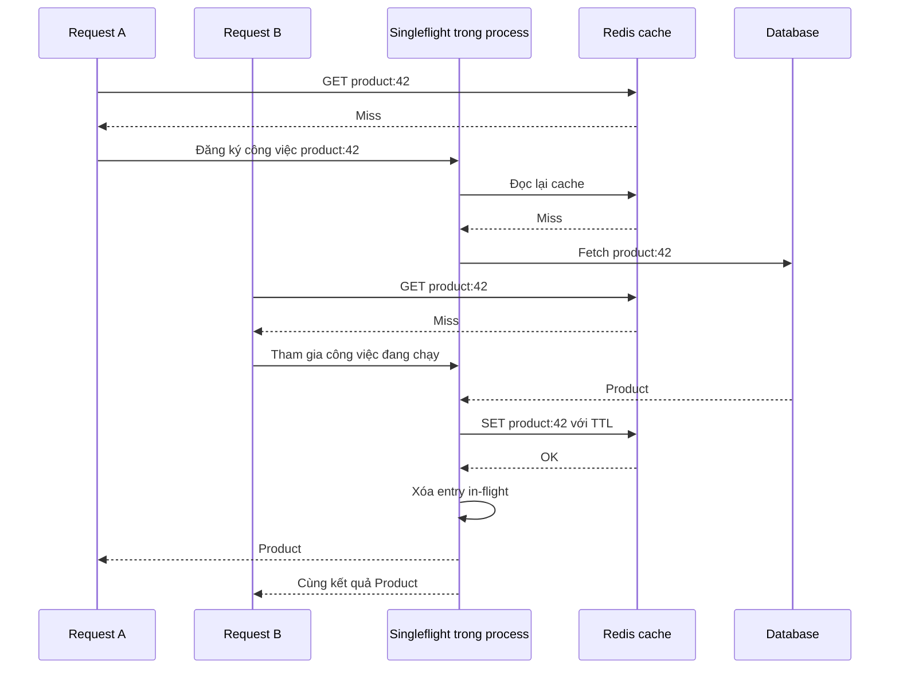

# Request Coalescing: giảm Cache Stampede từ một process đến toàn fleet

## Mục lục

- [1. Request Coalescing là gì](#1-request-coalescing-là-gì)
- [2. Vì sao cache miss biến thành stampede](#2-vì-sao-cache-miss-biến-thành-stampede)
- [3. Cơ chế leader và waiter](#3-cơ-chế-leader-và-waiter)
- [4. Phạm vi coalescing quyết định hiệu quả](#4-phạm-vi-coalescing-quyết-định-hiệu-quả)
- [5. Chọn key để chia sẻ kết quả an toàn](#5-chọn-key-để-chia-sẻ-kết-quả-an-toàn)
- [6. Triển khai trong process bằng Java](#6-triển-khai-trong-process-bằng-java)
- [7. Timeout và cancellation](#7-timeout-và-cancellation)
- [8. Coalescing toàn fleet bằng Redis](#8-coalescing-toàn-fleet-bằng-redis)
- [9. Hai mức TTL và phục vụ dữ liệu stale](#9-hai-mức-ttl-và-phục-vụ-dữ-liệu-stale)
- [10. Failure modes và giới hạn tải](#10-failure-modes-và-giới-hạn-tải)
- [11. So sánh các kỹ thuật chống stampede](#11-so-sánh-các-kỹ-thuật-chống-stampede)
- [12. Metrics và kiểm thử](#12-metrics-và-kiểm-thử)
- [13. Lộ trình áp dụng và checklist](#13-lộ-trình-áp-dụng-và-checklist)
- [14. Kết luận](#14-kết-luận)
- [Tài liệu liên quan và tham khảo](#tài-liệu-liên-quan-và-tham-khảo)

---

## 1. Request Coalescing là gì

Request Coalescing là cơ chế **gom những lời gọi đồng thời cho cùng một công việc đang xử lý**, để chúng dùng chung kết quả thay vì thực hiện công việc đó nhiều lần. Công việc đang chạy và chưa hoàn tất được gọi là **in-flight**.

Ví dụ, 100 request cùng cần dữ liệu sản phẩm `product:42` khi cache chưa có giá trị. Thay vì mỗi request tự query database, một lời gọi thực hiện fetch; những lời gọi còn lại chờ và nhận chung kết quả. Database hoặc API được gọi phía sau được gọi là **downstream**.

```text
Không coalescing: 100 cache miss cùng key → 100 downstream fetch
Có coalescing:    100 cache miss cùng key → 1 fetch chung + 99 caller chờ
```

Trường hợp một fetch là kết quả lý tưởng khi các request cùng key tham gia trong lúc công việc chung còn chạy và thuộc cùng phạm vi điều phối. Nếu mỗi process chỉ gom request của riêng nó, cả cụm server vẫn có thể tạo nhiều fetch cho cùng key.

| Khía cạnh | Câu hỏi cần giải quyết |
|---|---|
| Công việc tương đương | Những request nào được phép dùng chung kết quả? |
| Phạm vi điều phối | Gom trong một process hay trên toàn bộ cụm server? |
| Vòng đời công việc | Khi nào đăng ký, trả kết quả và dọn trạng thái in-flight? |
| Thời gian chờ | Downstream chậm hoặc treo thì caller được chờ bao lâu? |
| Khả năng phục hồi | Fetch lỗi, Redis lỗi hoặc process chết thì xử lý thế nào? |
| Độ mới dữ liệu | Có thể trả bản cache cũ trong khi làm mới không? |

**Coalescing không làm tăng năng lực xử lý của downstream.** Nó loại bỏ công việc trùng lặp để dành năng lực sẵn có cho những request thực sự cần xử lý. Vì vậy, cơ chế này vẫn phải đi cùng timeout và giới hạn tải.

## 2. Vì sao cache miss biến thành stampede

Giả sử `product:42` hết hạn. Database cần 200 ms để đọc và dựng lại dữ liệu sản phẩm. Trong 200 ms đó, 100 request cùng đọc key này.

Với cache-aside thông thường:

```text
100 request → GET product:42 → 100 cache miss
                              ↓
                         100 query DB
                              ↓
                         100 lần SET
```

Mỗi request đều thực hiện logic hợp lệ: không thấy cache thì đọc database. Nhưng toàn hệ thống đang tính lại cùng một kết quả nhiều lần. Đây là **cache stampede**: nhiều request cùng tái tạo dữ liệu cache, gây tải đột biến lên nguồn dữ liệu.

Nếu query chậm thêm do quá tải, khoảng thời gian cache còn trống dài hơn. Những request mới tiếp tục miss và tạo thêm query. Đây là vòng phản hồi làm sự cố nặng lên.

Với một key nóng, có thể ước lượng số request mới tới trong một lần refill:

```text
Số request tới trong cửa sổ refill ≈ λ_key × T_refill

λ_key = 500 request/giây
T_refill = 0,2 giây
→ khoảng 100 request tới trong lúc refill
```

Đây là ước lượng với lưu lượng tương đối đều, không phải giới hạn cứng. Nó chưa tính riêng request khởi phát và không mô tả đầy đủ queueing khi database đã quá tải.

**Cache hit ratio trung bình cao vẫn có thể che giấu stampede.** Hệ thống có thể hit 99% cả ngày nhưng làm database quá tải trong vài trăm mili giây lúc một key nóng hết hạn.

## 3. Cơ chế leader và waiter

**Leader** là lời gọi được chọn để thực hiện công việc chung. **Waiter** là lời gọi tham gia sau và đợi kết quả đó. Leader ở đây chỉ tồn tại cho một key trong một lần refill, không phải leader cố định của cả cluster.



Trong một process, cấu trúc thường dùng là:

```text
ConcurrentHashMap<String, CompletableFuture<Result>>

product:42 → CompletableFuture đang fetch sản phẩm 42
product:99 → CompletableFuture đang fetch sản phẩm 99
```

### Singleflight và cache làm hai việc khác nhau

Hãy coi hệ thống có hai nơi để kiểm tra:

- **Redis cache** trả lời: “Đã có dữ liệu sản phẩm 42 để dùng chưa?”
- **Map singleflight trong Java** trả lời: “Có ai đang lấy dữ liệu sản phẩm 42 chưa?”

**Singleflight** là tên thường dùng cho cơ chế “nếu đã có người đang làm thì cùng chờ người đó”. Nó không giữ kết quả lâu dài như cache.

Ví dụ A, B và C cùng cần sản phẩm 42:

| Thời điểm | Điều xảy ra |
|---|---|
| 0 ms | A thấy cache trống. A đăng ký vào map: “đang lấy sản phẩm 42”, rồi gọi DB. |
| 20 ms | B cũng thấy cache trống, nhưng map đã có công việc của A. B chờ kết quả đó, không gọi DB. |
| 200 ms | DB trả dữ liệu. Công việc của A ghi dữ liệu vào Redis, dọn đăng ký trong map và trả kết quả cho A, B. |
| 500 ms | C đến. Redis đã có dữ liệu nên C lấy ngay từ cache, không cần tham gia singleflight. |

**Nếu bỏ Redis cache khỏi ví dụ**, A và B vẫn có thể dùng chung một lần gọi DB. Nhưng khi C đến ở mốc 500 ms, công việc cũ đã kết thúc và đăng ký trong map đã bị xóa. C phải gọi DB lại.

Nói ngắn gọn: **singleflight giúp các request đến trong lúc đang fetch dùng chung công việc; cache giúp các request đến sau dùng lại dữ liệu đã fetch xong.**

### Vì sao đã cache miss rồi mà leader còn GET lần nữa

Vì kết quả “cache đang trống” chỉ đúng **ở thời điểm GET**, không có nghĩa cache vẫn trống khi request chuẩn bị gọi DB.

Ví dụ hai request A và B chạy trên hai thread Java:

| Bước | Request A | Request B |
|---|---|---|
| 1 | GET Redis → miss | Chưa bắt đầu |
| 2 | Tạm chưa được CPU chạy tiếp | GET Redis → miss, đăng ký làm leader |
| 3 | Vẫn chưa chạy tiếp | Đọc DB, ghi Redis rồi dọn đăng ký singleflight |
| 4 | Chạy tiếp; map không còn công việc của B nên A đăng ký làm leader mới | Đã hoàn tất |
| 5 | **GET Redis lần nữa → hit**, trả dữ liệu và không gọi DB | — |

Nếu bỏ bước 5, A sẽ gọi DB dựa trên kết quả miss ở bước 1, dù B đã điền dữ liệu vào cache ở bước 3.

Vì vậy, **trở thành leader chỉ có nghĩa là chưa có công việc chung để chờ; không có nghĩa cache chắc chắn vẫn trống**. Leader cần GET lại trước khi quyết định fetch.

### Vì sao phải thử ghi cache trước khi dọn đăng ký singleflight

Ở đây, “xóa entry” chỉ là **xóa đăng ký công việc khỏi map Java**, không phải xóa dữ liệu khỏi Redis.

Giả sử A vừa nhận dữ liệu từ DB nhưng chưa ghi Redis. Nếu A đã xóa đăng ký khỏi map lúc này, request B có thể thấy cả hai nơi đều trống:

```text
Redis: chưa có dữ liệu sản phẩm 42
Map:   không có ai đang lấy sản phẩm 42
→ B mở một công việc mới và gọi DB lần nữa.
```

Để tránh khoảng hở này, ví dụ Java trong tài liệu dùng thứ tự:

```text
1. Lấy dữ liệu từ DB.
2. Thử ghi dữ liệu vào Redis, với timeout tại Redis client.
3. Xóa đăng ký công việc khỏi map Java.
4. Hoàn tất CompletableFuture để các caller nhận kết quả.
```

Sau bước 3, request mới có thể mở nhóm mới, nhưng lần GET lại sẽ thấy dữ liệu đã ghi ở bước 2 và tránh gọi DB. Các caller cũ vẫn giữ future của nhóm cũ nên vẫn nhận được kết quả ở bước 4; xóa khỏi map không hủy future đó.

Nếu bước ghi Redis lỗi hoặc timeout, nhóm hiện tại vẫn có thể nhận dữ liệu DB theo chính sách của ví dụ. Tuy nhiên, request đến sau có thể phải fetch lại. **Coalescing không thay thế được cache bị lỗi; trường hợp này cần thêm giới hạn tải xuống DB.**

## 4. Phạm vi coalescing quyết định hiệu quả

Ở phần trước, map Java giúp một request biết rằng đã có request khác đang lấy cùng dữ liệu. **Nhưng điều đó chỉ có tác dụng nếu chúng cùng kiểm tra một map.** Đây chính là ý nghĩa của “phạm vi coalescing”: những request nào nhìn thấy và tham gia được cùng một công việc đang chạy?

### Một ứng dụng Java đang chạy

Giả sử bạn chạy một ứng dụng Spring Boot. 100 request cùng cần sản phẩm 42 khi Redis chưa có dữ liệu.

Nếu các request cùng dùng một đối tượng `SingleFlight`, chúng cùng kiểm tra map bên trong đối tượng đó:

```text
100 request cùng cần product:42
              ↓
     Một map Java dùng chung
              ↓
     1 công việc được đăng ký
              ↓
         1 lần gọi DB

Các request còn lại chờ kết quả của công việc đó.
```

Ứng dụng có thể dùng nhiều thread xử lý request. Điều này không ngăn coalescing: `ConcurrentHashMap` cho phép các thread truy cập an toàn vào **cùng một map**.

Ngược lại, nếu controller tạo `new SingleFlight(...)` cho từng request, mỗi request có map riêng. Request nào cũng thấy map của mình trống, nên request nào cũng có thể gọi DB.

**Trong Spring Boot, hãy dùng chung một bean chứa `SingleFlight`, không tạo lại nó cho mỗi request.**

### Một service Spring Boot chạy ba pod trên Kubernetes

Giả sử service `product-service` được deploy trên Kubernetes với `replicas: 3`, tạo ra ba pod: `product-service-a`, `product-service-b` và `product-service-c`. Trong ví dụ này, mỗi pod chạy một instance Spring Boot, tức một tiến trình Java có bộ nhớ riêng.

Cả ba pod chạy cùng code, kết nối đến cùng Redis và database. Nhưng mỗi pod có một đối tượng `SingleFlight` và một map riêng. Map trong pod A không tự đồng bộ sang pod B hoặc pod C.

Giả sử 100 request cùng cần sản phẩm 42 được phân phối vào ba pod. Cache đang trống và các lần fetch chồng thời gian với nhau:

```text
                         product-service (replicas: 3)
100 request cùng key ─┬→ Pod A: 34 request → map A → 1 query DB
                      ├→ Pod B: 33 request → map B → 1 query DB
                      └→ Pod C: 33 request → map C → 1 query DB

                                                Tổng: 3 query DB
```

Tại sao không còn một lần gọi DB như ví dụ trước?

1. Pod A nhìn map A, chưa có ai lấy sản phẩm 42 → pod A bắt đầu fetch.
2. Pod B nhìn map B, cũng chưa có ai lấy sản phẩm 42 → pod B bắt đầu fetch.
3. Pod C nhìn map C, cũng thấy trống → pod C bắt đầu fetch.

**Pod A đang fetch không có nghĩa pod B và pod C biết điều đó.** Vì vậy, mỗi pod vẫn có thể mở một công việc riêng cho cùng sản phẩm.

Cách gom request bên trong từng pod này gọi là **local coalescing**. Nó vẫn có ích: trong ví dụ trên, DB nhận 3 lần gọi thay vì 100 lần. Chỉ là nó chưa gom được giữa các pod.

### Dùng chung Redis rồi thì tại sao vẫn gọi DB ba lần

Vì trong thiết kế hiện tại, Redis chỉ lưu **dữ liệu đã lấy xong**, không lưu thông tin **ai đang lấy dữ liệu**.

Khi pod A chưa fetch xong và chưa ghi cache:

| Bên kiểm tra | Kết quả nhìn thấy |
|---|---|
| Pod A đọc Redis | Chưa có sản phẩm 42 |
| Pod B đọc Redis | Chưa có sản phẩm 42 |
| Pod C đọc Redis | Chưa có sản phẩm 42 |

Một lệnh `GET` trả miss không tự đăng ký quyền fetch cho người vừa gọi. Vì thế, **cùng dùng Redis để GET/SET cache chưa đủ để ngăn ba pod cùng gọi DB**.

### Muốn cả ba pod chỉ có một bên fetch thì làm gì

Cần thêm một nơi đăng ký công việc mà cả ba pod đều nhìn thấy. Ví dụ, dùng Redis lưu một quyền fetch có thời hạn, gọi là **lease**:

```text
Pod A → xin quyền fetch product:42 trên Redis → được cấp → gọi DB
Pod B → xin cùng quyền đó                    → không được → chờ cache
Pod C → xin cùng quyền đó                    → không được → chờ cache

Pod A lấy dữ liệu xong → ghi Redis cache
Pod B và pod C đọc lại cache → nhận dữ liệu, không cần gọi DB
```

Việc cấp quyền phải là thao tác atomic: khi các pod xin cùng lúc, chỉ một bên được cấp quyền trong thời gian lease còn hiệu lực. Phần 8 trình bày cách thực hiện bằng `SET ... NX PX`, cách chờ và xử lý khi bên đang fetch bị lỗi.

Cách phối hợp giữa tất cả các bản ứng dụng được gọi là **fleet-wide coalescing**; “fleet” ở đây chỉ toàn bộ các instance của service — trong ví dụ này là cả ba pod. Không có một `CompletableFuture` được chia sẻ xuyên JVM: các bên phối hợp qua Redis và đọc kết quả từ cache chung.

### Ghi nhớ bằng một bảng

Vẫn với 100 request cùng key, cache trống và các request chồng thời gian trong một lần refill:

| Cách triển khai | Số lần gọi DB có thể xảy ra trong ví dụ |
|---|---|
| Mỗi request tự fetch | 100 |
| Một pod, dùng chung một `SingleFlight` | 1 |
| Ba pod, mỗi pod có `SingleFlight` riêng | 3 |
| Ba pod, thêm điều phối chung qua Redis | Lý tưởng là 1 |

Các con số này minh họa một lần refill, không phải bảo đảm cho mọi tình huống lỗi. Nếu lease hết hạn khi fetch cũ chưa dừng hoặc fetch thất bại rồi được thử lại, DB có thể nhận thêm lời gọi.

Nếu scale từ 3 lên 10 pod, chỉ dùng local singleflight thì trong cùng một lần refill, DB có thể nhận tới 10 query cho một key nếu cả 10 pod đều nhận request khi cache còn trống. Các pod nằm trên cùng hay khác Kubernetes node không làm thay đổi điều này: bộ nhớ Java của chúng vẫn riêng biệt.

**Câu hỏi quyết định là: các request có cùng nhìn thấy đăng ký “đang lấy dữ liệu này” hay không? Cùng map thì gom được trong Java; khác JVM thì cần thêm cơ chế phối hợp chung.**

### Bài toán thực tế phù hợp

Fleet-wide coalescing phù hợp khi một resource được đọc nhiều, rebuild tốn kém và nhiều pod có thể cùng nhận request cho cùng key.

| Bài toán | Key minh họa | Công việc chỉ nên chạy một lần mỗi đợt miss |
|---|---|---|
| Trang sản phẩm đang viral | `product:123` | Đọc DB và dựng payload sản phẩm |
| Trang chủ hoặc landing page | `homepage:v1:vi` | Tổng hợp banner, CMS blocks và danh sách sản phẩm |
| API profile phổ biến | `user:987` | Đọc profile, follower count và badges |
| Dashboard thống kê | `dashboard:tenant:42:today` | Chạy aggregate query nặng |
| Báo cáo theo tenant | `report:tenant:42:month:2026-03` | Tạo snapshot hoặc truy vấn tổng hợp đắt tiền |
| Tỷ giá/dữ liệu external | `exchange-rate:USD-VND` | Gọi API có rate limit |
| Metadata SEO | `seo:product:123` | Dựng Open Graph, title từ nhiều nguồn |
| Feature/config dùng chung | `config:pricing-rules:v5` | Refresh từ database hoặc config service |

Các trường hợp này thường kết hợp tốt với stale-while-revalidate: waiter nhận bản cũ trong giới hạn cho phép, trong khi một leader refresh ở background.

Không dùng Redis lease ở đây làm cơ chế correctness chính cho thao tác có side effect hoặc cần nhất quán mạnh, như trừ tiền, tạo đơn hàng, cấp quota, quyết định tồn kho cuối cùng, hoặc chống gửi email/thanh toán trùng. Những bài toán đó cần idempotency key, unique constraint/database transaction, fencing token hoặc workflow durable.

## 5. Chọn key để chia sẻ kết quả an toàn

Gom theo `/products/42` có thể sai nếu cùng URL trả giá khác nhau theo tenant, tiền tệ hoặc quyền truy cập.

Một key có thể là:

```text
product:v3:tenant:acme:id:42:currency:VND:locale:vi-VN
```

| Thành phần | Khi nào cần? |
|---|---|
| Resource ID | Phân biệt đối tượng cần đọc |
| Tenant hoặc phạm vi quyền | Ngăn chia sẻ dữ liệu giữa các nhóm không được phép |
| Query parameters đã chuẩn hóa | Phân biệt filter, sort, pagination |
| Locale, currency | Khi chúng thay đổi kết quả |
| Schema version | Khi định dạng hoặc cách dựng dữ liệu thay đổi |

Nguyên tắc: **cùng coalescing key phải có thể dùng cùng kết quả**, kể cả kiểm soát truy cập. Thực hiện authentication/authorization phù hợp trước khi trả dữ liệu; key không thay thế kiểm tra quyền.

Không đưa request ID vào key vì mỗi request sẽ trở thành một nhóm riêng. Không đưa access token thô vào key vì dễ lộ bí mật qua logs hoặc công cụ vận hành.

Nếu mọi người dùng chia sẻ dữ liệu gốc nhưng có phần trình bày riêng, hãy coalesce bước fetch dữ liệu gốc, rồi xử lý phần cá nhân hóa sau đó.

Cơ chế này phù hợp nhất với read-only fetch. Không gom hai lệnh thanh toán chỉ vì payload giống nhau; chống trùng side effect cần [idempotency và thiết kế đồng bộ phù hợp](./distributed-lock.md).

## 6. Triển khai trong process bằng Java

Ví dụ dùng **Java 17+**, không cần thư viện ngoài. `CompletableFuture` biểu diễn kết quả sẽ có trong tương lai; `ConcurrentHashMap` lưu công việc chung và cho phép nhiều thread truy cập an toàn.

Đây là primitive minh họa, **chưa phải giải pháp production hoàn chỉnh**. Adapter downstream vẫn cần timeout; giới hạn waiter và active keys phải được bổ sung theo tải thực tế.

### SingleFlight an toàn giữa nhiều thread

Lưu class vào `SingleFlight.java`:

```java
import java.util.Objects;
import java.util.concurrent.CompletableFuture;
import java.util.concurrent.ConcurrentHashMap;
import java.util.concurrent.Executor;
import java.util.concurrent.RejectedExecutionException;
import java.util.function.Supplier;

public final class SingleFlight<T> {
    private final ConcurrentHashMap<String, CompletableFuture<T>> inFlight =
            new ConcurrentHashMap<>();
    private final Executor executor;

    public SingleFlight(Executor executor) {
        this.executor = Objects.requireNonNull(executor);
    }

    public CompletableFuture<T> execute(String key, Supplier<T> work) {
        Objects.requireNonNull(key);
        Objects.requireNonNull(work);

        CompletableFuture<T> shared = new CompletableFuture<>();
        CompletableFuture<T> existing = inFlight.putIfAbsent(key, shared);
        if (existing != null) {
            return existing.copy();
        }

        // Entry đã được đăng ký trước khi submit công việc.
        try {
            executor.execute(() -> {
                T value;
                try {
                    value = work.get();
                } catch (Throwable error) {
                    inFlight.remove(key, shared);
                    shared.completeExceptionally(error);
                    // Không nuốt lỗi nghiêm trọng của JVM.
                    if (error instanceof Error fatal) throw fatal;
                    return;
                }

                // Work đã kết thúc, gồm cả bước thử ghi cache.
                // Dọn trước complete để callback không giữ entry cũ.
                inFlight.remove(key, shared);
                shared.complete(value);
            });
        } catch (RejectedExecutionException rejected) {
            inFlight.remove(key, shared);
            shared.completeExceptionally(rejected);
        }

        // Mỗi caller nhận một future riêng, không được sửa shared future.
        return shared.copy();
    }
}
```

Những điểm cần chú ý:

- `putIfAbsent` chọn leader bằng một thao tác atomic. Không dùng `get` rồi `put` riêng rẽ: hai thread có thể cùng thấy miss và cùng trở thành leader.
- Chỉ thread đăng ký thành công mới submit công việc. Không đặt blocking I/O trong callback `computeIfAbsent`; giữ phần cập nhật map ngắn.
- `remove(key, shared)` chỉ xóa entry nếu nó vẫn trỏ tới đúng công việc đó.
- Thành công, lỗi từ `work` và executor từ chối đều dọn entry. Lỗi nghiêm trọng kiểu `Error` được thông báo cho waiter rồi ném lại.
- `copy()` tạo future riêng cho caller. Gọi `cancel`, `complete` hoặc `orTimeout` trên bản sao không làm thay đổi shared future và các caller khác.

Entry được xóa sau khi `work` đã kết thúc nhưng ngay trước khi phát kết quả cho waiter. Caller mới có thể mở nhóm tiếp theo trong khoảng rất ngắn đó; **không có hai lần `work` cùng chạy do khoảng hở này**, nhưng hai nhóm có thể đang ở giai đoạn bàn giao kết quả. Với cache-aside, lần đọc lại cache của nhóm mới giúp tránh query thừa khi cache đã được ghi.

Không thực hiện thao tác blocking nặng trong callback `thenApply`/`whenComplete`: callback có thể chạy trên thread hoàn tất future. Dùng executor phù hợp cho xử lý nặng sau fetch.

### Ghép với cache-aside

Lưu ví dụ sau vào `ProductReader.java`. Các interface là hợp đồng minh họa: `ProductCache` có thể được hiện thực bằng Spring Data Redis; `ProductRepository` bằng JDBC/JPA. Chúng đều là API blocking và phải có timeout tại adapter.

```java
import java.time.Duration;
import java.util.concurrent.CompletableFuture;
import java.util.concurrent.Executor;
import java.util.function.Consumer;

public final class ProductReader {
    public record Product(String id, String name) {}

    public interface ProductCache {
        Product get(String key); // null nghĩa là cache miss
        void set(String key, Product product, Duration ttl);
    }

    public interface ProductRepository {
        Product fetchProduct(String id);
    }

    private final ProductCache cache;
    private final ProductRepository repository;
    private final Consumer<RuntimeException> onCacheWriteError;
    private final SingleFlight<Product> flights;

    public ProductReader(
            ProductCache cache,
            ProductRepository repository,
            Executor refillExecutor,
            Consumer<RuntimeException> onCacheWriteError) {
        this.cache = cache;
        this.repository = repository;
        this.onCacheWriteError = onCacheWriteError;
        this.flights = new SingleFlight<>(refillExecutor);
    }

    public CompletableFuture<Product> getProduct(String id) {
        try {
            // Ví dụ chỉ cache dữ liệu công khai, không có biến thể tenant.
            String key = "product:v1:" + id;
            Product hit = cache.get(key);
            if (hit != null) return CompletableFuture.completedFuture(hit);

            return flights.execute(key, () -> {
                Product secondHit = cache.get(key);
                if (secondHit != null) return secondHit;

                Product product = repository.fetchProduct(id);
                try {
                    cache.set(key, product, Duration.ofSeconds(60));
                } catch (RuntimeException error) {
                    // Callback telemetry phải không throw.
                    onCacheWriteError.accept(error);
                }
                return product;
            });
        } catch (RuntimeException error) {
            return CompletableFuture.failedFuture(error);
        }
    }
}
```

Những lựa chọn cố ý trong ví dụ:

- Lần GET đầu chạy trên thread gọi `getProduct`; trả `CompletableFuture` **không biến toàn bộ method thành non-blocking**. Không gọi trực tiếp ví dụ blocking này trên event loop của Spring WebFlux.
- Cache đọc lỗi làm request thất bại, không tự động dồn traffic xuống DB.
- Cache ghi lỗi vẫn trả dữ liệu DB cho nhóm hiện tại. Nhóm sau có thể fetch lại nên cần giới hạn tải.
- DB lỗi được chia sẻ cho cả nhóm, rồi entry được dọn để cho phép thử lại sau.
- Repository phải trả `Product` hợp lệ hoặc ném lỗi. Nếu cần negative caching, dùng kiểu kết quả riêng phân biệt “không tìm thấy” với cache miss.
- Các caller nhận cùng object reference. Record chỉ bất biến nông; ví dụ dùng `String` nên không có collection mutable bên trong. Với payload có `List`/`Map`, tạo immutable copy hoặc defensive copy.

Không gọi đệ quy `flights.execute` cùng key rồi `join()` kết quả bên trong chính `work`: cách đó tạo vòng chờ không thể hoàn tất.

### Chọn executor và tích hợp Spring

Với blocking JDBC/Redis, dùng executor riêng có số thread và queue hữu hạn. Ví dụ sau là cấu hình minh họa, không phải capacity khuyến nghị:

```java
import java.util.concurrent.ArrayBlockingQueue;
import java.util.concurrent.ThreadPoolExecutor;
import java.util.concurrent.TimeUnit;

ThreadPoolExecutor refillExecutor = new ThreadPoolExecutor(
        16, 16,
        0L, TimeUnit.MILLISECONDS,
        new ArrayBlockingQueue<>(100),
        new ThreadPoolExecutor.AbortPolicy());
```

`AbortPolicy` ném `RejectedExecutionException` khi quá tải; primitive chuyển lỗi này đến các caller và dọn entry. Không dùng `DiscardPolicy` hoặc `DiscardOldestPolicy`: task bị bỏ im lặng có thể để future chờ mãi. `CallerRunsPolicy` có thể đẩy blocking I/O về request thread nên không phù hợp nếu cần cô lập tải rõ ràng.

Trong Spring Boot:

1. Đăng ký executor thành bean có lifecycle shutdown, ví dụ `@Bean(destroyMethod = "shutdown")`.
2. Đăng ký `ProductReader` thành singleton bean và inject các adapter. Không tạo reader hoặc `SingleFlight` mới trong mỗi controller call.
3. Đặt timeout Redis command, JDBC query và connection acquisition. Deadline của future không thay thế các timeout này.
4. Không giả định transaction, security context hay MDC của request thread tự truyền sang worker. Tạo transaction đọc trong service chạy ở worker; truyền ngữ cảnh cần thiết một cách tường minh.

Java 21 virtual threads giúp giảm chi phí thread khi blocking, nhưng không tăng số connection DB hoặc sức chịu tải của DB. Nếu đổi sang executor virtual-thread-per-task, vẫn phải có semaphore/admission control hữu hạn.

### Kiểm tra tối thiểu với nhiều thread

Test dưới đây không cần JUnit. Nó dùng 16 caller thread để đăng ký 100 lời gọi và giữ công việc bằng latch cho đến khi mọi caller đã tham gia. Cách này tránh test “concurrent” nhưng fetch đã xong trước khi caller sau đến.

Lưu vào `SingleFlightTest.java`:

```java
import java.util.ArrayList;
import java.util.List;
import java.util.concurrent.*;
import java.util.concurrent.atomic.AtomicInteger;

public final class SingleFlightTest {
    private static void check(boolean condition, String message) {
        if (!condition) throw new AssertionError(message);
    }

    private static void await(CountDownLatch latch) {
        try {
            if (!latch.await(5, TimeUnit.SECONDS)) {
                throw new AssertionError("Latch timeout");
            }
        } catch (InterruptedException error) {
            Thread.currentThread().interrupt();
            throw new RuntimeException(error);
        }
    }

    public static void main(String[] args) throws Exception {
        ExecutorService workers = Executors.newFixedThreadPool(2);
        ExecutorService callers = Executors.newFixedThreadPool(16);
        CountDownLatch release = new CountDownLatch(1);
        CountDownLatch failRelease = new CountDownLatch(1);
        try {
            SingleFlight<Integer> flights = new SingleFlight<>(workers);
            AtomicInteger calls = new AtomicInteger();
            List<Future<CompletableFuture<Integer>>> registrations =
                    new ArrayList<>();

            for (int i = 0; i < 100; i++) {
                registrations.add(callers.submit(() ->
                        flights.execute("same-key", () -> {
                            calls.incrementAndGet();
                            await(release);
                            return 42;
                        })));
            }

            List<CompletableFuture<Integer>> results = new ArrayList<>();
            for (Future<CompletableFuture<Integer>> registration : registrations) {
                results.add(registration.get(5, TimeUnit.SECONDS));
            }
            results.get(0).cancel(false); // Không hủy shared work.
            release.countDown();
            for (int i = 1; i < results.size(); i++) {
                check(results.get(i).get(5, TimeUnit.SECONDS) == 42,
                        "Wrong result");
            }
            check(calls.get() == 1, "Duplicate work");
            check(flights.execute("same-key", () -> 7)
                    .get(5, TimeUnit.SECONDS) == 7, "Entry not cleaned");

            AtomicInteger failures = new AtomicInteger();
            List<CompletableFuture<Integer>> failed = new ArrayList<>();
            for (int i = 0; i < 10; i++) {
                failed.add(flights.execute("failure-key", () -> {
                    failures.incrementAndGet();
                    await(failRelease);
                    throw new IllegalStateException("DB unavailable");
                }));
            }
            failRelease.countDown();
            for (CompletableFuture<Integer> result : failed) {
                try {
                    result.get(5, TimeUnit.SECONDS);
                    throw new AssertionError("Expected failure");
                } catch (ExecutionException expected) {
                    check(expected.getCause() instanceof IllegalStateException,
                            "Wrong failure");
                }
            }
            check(failures.get() == 1, "Duplicate failing work");
            check(flights.execute("failure-key", () -> 9)
                    .get(5, TimeUnit.SECONDS) == 9, "Failed entry retained");

            AtomicInteger submissions = new AtomicInteger();
            SingleFlight<Integer> rejecting = new SingleFlight<>(task -> {
                submissions.incrementAndGet();
                throw new RejectedExecutionException("Full");
            });
            for (int i = 0; i < 2; i++) {
                try {
                    rejecting.execute("key", () -> 1).get(5, TimeUnit.SECONDS);
                    throw new AssertionError("Expected rejection");
                } catch (ExecutionException expected) {
                    check(expected.getCause() instanceof RejectedExecutionException,
                            "Wrong rejection");
                }
            }
            check(submissions.get() == 2, "Rejected entry retained");
            System.out.println("SingleFlight tests passed");
        } finally {
            release.countDown();
            failRelease.countDown();
            callers.shutdownNow();
            workers.shutdownNow();
        }
    }
}
```

Chạy với JDK 17 trở lên:

```bash
javac --release 17 SingleFlight.java ProductReader.java SingleFlightTest.java
java SingleFlightTest
```

Test kiểm tra gom nhóm, cancellation riêng của caller, chia sẻ lỗi, cleanup và executor rejection. Đây là test primitive, chưa thay thế kiểm thử cache integration hoặc nhiều JVM.

## 7. Timeout và cancellation

Một leader treo có thể giữ hàng nghìn waiter. Giảm được query nhưng để đầy RAM, socket và request queue thì hệ thống vẫn thất bại.

Cần phân biệt ba loại thời hạn:

| Thời hạn | Phạm vi | Ví dụ minh họa |
|---|---|---|
| Request deadline | Tổng thời gian một caller được phép chờ | 800 ms tính từ khi request vào |
| Shared work deadline | Thời gian tối đa dành cho refill chung | 500 ms từ lúc bắt đầu refill |
| Lease TTL | Thời gian quyền leader có hiệu lực trong Redis | 1.000 ms từ lúc acquire |

Các số chỉ để minh họa. Ngân sách thực tế phải dựa trên SLO, latency downstream, cache round-trip và thời gian cleanup.

### Waiter hủy không đồng nghĩa hủy leader

Request A mở nhóm; 50 ms sau client A ngắt kết nối. Request B vẫn cần kết quả. Nếu vòng đời shared fetch bị buộc trực tiếp vào cancellation của A, cả nhóm có thể thất bại chỉ vì một client rời đi.

Nên tách:

- Context của công việc chung: có deadline riêng và cơ chế hủy downstream.
- Context của từng caller: chỉ quyết định caller đó còn chờ hay không.

Nếu tất cả caller rời đi, hệ thống có thể hủy fetch hoặc tiếp tục để warm cache. Cần chọn chính sách rõ ràng, không để công việc chạy vô hạn.

### Timeout không tự dừng query

`future.orTimeout(500, TimeUnit.MILLISECONDS)` làm chính future đó hoàn tất với lỗi timeout; nó không tự dừng JDBC query bên dưới. `CompletableFuture.cancel(true)` cũng không tự interrupt công việc đang chạy như nhiều người kỳ vọng.

Trong primitive ở trên, caller nhận `copy()` nên có thể áp dụng `orTimeout` lên bản sao mà không làm nhóm khác thất bại. Tuyệt đối không áp dụng deadline của một caller lên shared future nội bộ. `future.get(timeout, unit)` chỉ giới hạn lần chờ của thread gọi và không thay đổi trạng thái future.

`orTimeout` dùng khoảng thời gian tương đối từ lúc gọi. Hãy truyền ngân sách còn lại của request thay vì bắt đầu lại toàn bộ deadline sau mỗi bước; nó không bao phủ lần GET blocking đã chạy trước khi method trả future.

Nếu xóa entry ngay lúc timeout, request mới sẽ tạo query mới trong khi query cũ chưa dừng. Kết quả là nhiều fetch chồng lên nhau dù có singleflight.

Biện pháp cần đi cùng nhau:

1. Đặt timeout phía database hoặc HTTP client; truyền cancellation nếu driver hỗ trợ.
2. Giới hạn số downstream operation đang chạy, kể cả operation chưa xác nhận hủy xong.
3. Không cho kết quả đến muộn tùy tiện ghi cache nếu quyền publish đã hết.
4. Giới hạn thời gian chờ và số waiter; từ chối sớm khi hết ngân sách.

Nếu adapter không hỗ trợ hủy, cần chấp nhận trade-off: giữ flight đến khi công việc thật sự kết thúc sẽ chặn refill mới; bỏ flight sẽ có nguy cơ duplicate. **Không có wrapper `CompletableFuture` nào tự giải quyết được một dependency không chịu dừng.**

## 8. Coalescing toàn fleet bằng Redis

Một thiết kế phổ biến là dùng **lease**: quyền làm leader có thời hạn. Redis lưu lease để các process phối hợp; cache lưu kết quả để process khác đọc.

Ví dụ hai key:

```text
cache:{product:42}:v1
lease:{product:42}:v1
```

Phần `{product:42}` là hash tag, giúp hai key nằm cùng hash slot trong Redis Cluster khi Lua script cần truy cập cả hai.

Acquire bằng token ngẫu nhiên riêng cho mỗi lần thử:

```redis
SET lease:{product:42}:v1 unique-owner-token NX PX 1000
```

- `NX`: chỉ tạo nếu key chưa tồn tại.
- `PX 1000`: lease hết hạn sau 1.000 ms.
- Token dùng để kiểm tra ownership; **token ngẫu nhiên không phải fencing token tăng dần**.

### Luồng điều phối

```text
GET cache
  ├─ Hit → trả kết quả
  └─ Miss → tham gia local singleflight
               ↓
          GET cache lần nữa
               ↓ nếu vẫn miss
          Thử acquire Redis lease
            ├─ Thắng → GET cache lại → nếu vẫn miss thì fetch
            │                          → publish khi còn ownership
            │                          → trả kết quả
            └─ Thua → chờ ngắn có jitter → GET cache lại
                       ├─ Có dữ liệu → trả kết quả
                       ├─ Chưa có, còn deadline → thử tiếp
                       └─ Hết deadline → stale hợp lệ hoặc lỗi có kiểm soát
```

Local singleflight vẫn hữu ích: trong một process, chỉ một coordinator của key đi tranh lease và polling. Các waiter còn lại chờ `CompletableFuture` local.

Polling phải có **backoff** — giãn khoảng chờ khi thử lại — và **jitter** — thêm độ ngẫu nhiên để các process không thức dậy cùng lúc. Mỗi vòng kiểm tra deadline trước khi chạy thêm thao tác; mỗi thao tác Redis cũng cần timeout.

Không lấy được lock **không phải** lý do để gọi DB ngay. Làm như vậy sẽ quay lại stampede đúng lúc nhiều request đang tranh cùng key.

### Publish kết quả và release an toàn

Để tránh leader đã mất lease ghi đè kết quả của leader mới, có thể kiểm tra ownership và ghi cache trong cùng Lua script:

```lua
-- KEYS[1]: lease key
-- KEYS[2]: cache key, cùng hash slot với lease key
-- ARGV[1]: owner token
-- ARGV[2]: serialized cache value
-- ARGV[3]: cache TTL, số mili giây dương đã được validate
if redis.call('GET', KEYS[1]) ~= ARGV[1] then
  return 0
end

redis.call('SET', KEYS[2], ARGV[2], 'PX', ARGV[3])
redis.call('DEL', KEYS[1])
return 1
```

Script trả `0` nghĩa là không còn ownership. Bỏ quyền publish của kết quả cũ; đọc lại cache hoặc kết thúc theo deadline. Không thực hiện một lệnh `SET` không điều kiện sau đó.

Nếu fetch thất bại hoặc lần GET sau acquire đã thấy cache, chỉ release lease của chính mình:

```lua
if redis.call('GET', KEYS[1]) == ARGV[1] then
  return redis.call('DEL', KEYS[1])
end
return 0
```

Không dùng `DEL lease-key` vô điều kiện. Leader cũ có thể vô tình xóa lease của leader mới sau một lần pause dài.

Nếu publish bị timeout phía client, kết quả thực thi có thể chưa biết: Redis có thể đã ghi cache. Hãy đọc lại cache với ngân sách còn lại, không mặc định fetch lại ngay.

### Những gì Redis lease không bảo đảm

| Tình huống | Hệ quả |
|---|---|
| Leader crash | Waiter đợi đến khi có dữ liệu hoặc lease hết hạn rồi bầu lại |
| Fetch lâu hơn lease TTL | Leader mới có thể fetch khi leader cũ còn chạy |
| Redis failover mất bản ghi lease chưa replicate | Hai process có thể cùng nghĩ mình là leader |
| Cache bị eviction sau publish | Request tiếp theo lại miss |
| DB thay đổi trong khi refill | Có thể ghi snapshot cũ dù lease vẫn hợp lệ |

Lua kiểm tra token bảo vệ publish trên Redis primary đang xử lý lệnh theo ownership hiện tại. Nó không ngăn query cũ tiếp tục chạy và không giải quyết toàn bộ tính nhất quán khi failover.

Race với writer/invalidation cũng là bài toán riêng. Ví dụ leader đọc phiên bản 10, writer cập nhật phiên bản 11 rồi xóa cache, sau đó leader ghi lại phiên bản 10. Cần versioning hoặc giao thức invalidation thích hợp; lock chỉ giữa các reader không đủ.

**Mục tiêu ở đây là giảm duplicate read trong vận hành bình thường, không phải bảo đảm exactly-once.** Nếu công việc có side effect hoặc không chấp nhận đồng thời, đọc thêm [Distributed Lock](./distributed-lock.md) và thiết kế bảo vệ ở chính tài nguyên đích.

## 9. Hai mức TTL và phục vụ dữ liệu stale

Coalescing giảm tải nhưng khi cache trống, mọi waiter vẫn phải chờ downstream. Nếu được phép dùng dữ liệu cũ, ta có thể giảm cả thời gian chờ bằng hai mức TTL.

**Stale** là dữ liệu đã quá thời gian được coi là mới nhưng vẫn nằm trong khoảng được phép phục vụ.

Ví dụ từ thời điểm fetch thành công:

```text
Tuổi bản cache:  0 giây           30 giây                   300 giây
                ├─────────────────┼──────────────────────────┤
                │      Fresh      │          Stale           │ Hết hạn
                │   trả ngay      │ trả cũ + refresh chung   │ chờ/error
                                  ↑                          ↑
                               Soft TTL                   Hard TTL
```

Trong tài liệu này, soft TTL là 30 giây và hard TTL là **300 giây tính từ cùng thời điểm fetch**, không phải 30 + 300 giây. Cửa sổ stale dài 270 giây.

Payload minh họa:

```json
{
  "value": { "id": "42", "name": "Mechanical keyboard" },
  "fetchedAt": 1800000000000,
  "freshUntil": 1800000030000,
  "hardUntil": 1800000300000
}
```

Redis TTL nên tương ứng thời gian còn lại đến `hardUntil`. Không đặt Redis TTL bằng soft TTL: nếu Redis xóa dữ liệu ở giây 30 thì không còn bản stale để phục vụ.

| Trạng thái | Hành vi |
|---|---|
| Chưa qua `freshUntil` | Trả cache ngay |
| Đã qua `freshUntil`, chưa qua `hardUntil` | Trả stale; kích hoạt một refresh được coalesce |
| Qua `hardUntil` hoặc key không còn | Chờ refill có deadline hoặc trả lỗi theo policy |
| Refresh lỗi | Giữ bản cũ đến hard deadline; giãn nhịp thử lại |

Đây là **stale-while-revalidate**: trả bản cũ trong lúc làm mới. **Stale-if-error** là chính sách cho phép dùng bản cũ khi fetch lỗi; hai chính sách liên quan nhưng không đồng nghĩa.

### Khi downstream brownout

Downstream chậm hoặc lỗi một phần:

- Coalescing giảm số lần refresh trùng nhau.
- Stale serving giúp request không phải chờ mỗi lần refresh.
- Backoff và circuit breaker ngăn refresh thất bại liên tiếp. Circuit breaker tạm ngừng gọi dependency sau một ngưỡng lỗi.

Không tự động kéo dài `hardUntil` mỗi lần refresh lỗi. Nếu làm vậy, dữ liệu “tối đa cũ 5 phút” có thể bị phục vụ nhiều giờ.

Các process dùng timestamp tuyệt đối cần đồng hồ đủ đồng bộ cho ngân sách freshness. Eviction vẫn có thể xóa cache trước hard TTL, nên hai mức TTL không bảo đảm luôn có fallback.

Background refresh phải chạy trong vòng đời được runtime hỗ trợ. Với serverless, fire-and-forget sau khi trả response có thể bị dừng; dùng cơ chế background task của nền tảng hoặc queue phù hợp.

> [!WARNING]
> Không áp dụng stale serving tùy tiện cho quyền truy cập, số dư hoặc quyết định tồn kho lúc thanh toán. Business policy quyết định được phép cũ bao lâu; cache pattern không tự đưa ra câu trả lời đó.

## 10. Failure modes và giới hạn tải

Một query chung không có nghĩa chỉ tốn tài nguyên của một request. Các waiter vẫn giữ connection, request context và bộ nhớ.

| Failure mode | Dấu hiệu | Biện pháp |
|---|---|---|
| Leader treo | Số waiter tăng, thời gian chờ dài | Downstream timeout, request deadline, giới hạn waiter |
| Fetch lỗi nhanh liên tục | Nhiều nhóm thất bại nối tiếp cho cùng key | Backoff có jitter, circuit breaker, stale hợp lệ |
| Nhiều key khác nhau cùng miss | Ít duplicate nhưng DB vẫn quá tải | Giới hạn concurrency tổng, admission control |
| Redis outage | Không đọc được cache hoặc lease | Chọn fail-fast/stale; chỉ fallback DB trong ngân sách tải |
| Cache SET lỗi | Nhóm hiện tại thành công, nhóm sau lại fetch | Metrics ghi cache, giới hạn refill, xử lý Redis |
| Waiter đồng loạt tỉnh dậy | CPU/serialization/network spike | Giới hạn fan-out, giảm payload, tránh biến đổi nặng mỗi caller |
| Polling quá dày | Redis QPS tăng dù DB giảm tải | Local coalescing, polling có backoff và jitter |
| Key do người dùng tạo vô hạn | Map in-flight tăng nhanh | Validate input, giới hạn active keys và số request |

**Admission control** là quyết định chỉ nhận thêm công việc khi hệ thống còn ngân sách. Ví dụ, giới hạn 50 refill DB đồng thời và 200 waiter cho một key là những cấu hình minh họa, không phải giá trị mặc định nên sao chép.

Một semaphore tổng có thể giới hạn số refill khác key đang chạy. Hàng chờ của semaphore cũng phải có deadline và giới hạn kích thước, nếu không chỉ chuyển chỗ quá tải từ DB sang application.

Nếu 100 request cần 100 key khác nhau, coalescing gần như không giúp. Khi đó có thể cần batching, tối ưu query, rate limiting hoặc tăng capacity.

## 11. So sánh các kỹ thuật chống stampede

| Kỹ thuật | Giải quyết tốt nhất | Không tự giải quyết |
|---|---|---|
| Local singleflight | Duplicate cùng key trong một process | Duplicate giữa các process |
| Shared lease và shared result | Refill cùng key giữa nhiều process | Exactly-once, mọi race consistency |
| TTL jitter | Nhiều key hết hạn đồng thời | Một hot key vẫn có thể stampede |
| Soft/hard TTL | Độ trễ khi có bản stale hợp lệ | Cold miss, dữ liệu không được phép cũ |
| Refresh-ahead | Chủ động làm mới trước khi hết hạn | Refresh trùng nếu không phối hợp |
| Negative caching | Miss lặp cho đối tượng không tồn tại | Lỗi tạm thời không nên biến thành not-found |
| Rate limiting/concurrency limit | Bảo vệ dependency trước tải tổng | Chia sẻ kết quả cùng key |
| Batching | Gộp nhiều key vào một downstream call | Tự loại bỏ mọi duplicate đang chạy |

Một tổ hợp thực tế cho dữ liệu đọc nhiều, chấp nhận cũ trong khoảng ngắn:

```text
Cache-aside
  + local singleflight
  + fleet lease nếu duplicate xuyên process đáng kể
  + soft/hard TTL nếu nghiệp vụ cho phép
  + giới hạn concurrency và deadline
```

Không cần triển khai tất cả ngay từ đầu. Chọn kỹ thuật theo bottleneck đã đo được.

## 12. Metrics và kiểm thử

### Đo hiệu quả coalescing

| Metric gợi ý | Mục đích |
|---|---|
| `singleflight_groups_total` | Số công việc chung được mở |
| `singleflight_joined_total` | Số caller tham gia công việc có sẵn |
| `singleflight_active_keys` | Số key đang có công việc |
| `singleflight_waiters` | Số caller đang chờ |
| `singleflight_wait_duration_seconds` | Phân phối thời gian chờ, nhất là p95/p99 |
| `cache_refill_duration_seconds` | Thời gian fetch và publish |
| `cache_refill_total{outcome}` | Thành công, lỗi, timeout, mất lease |
| `cache_stale_served_total` | Tần suất phải trả dữ liệu stale |
| `cache_write_errors_total` | Phát hiện refill xong nhưng cache không có dữ liệu |
| `downstream_inflight` | Tải thực đang giữ ở dependency |

Định nghĩa hệ số gom tại một tầng:

```text
Coalescing factor = (số group + số caller joined) / số group

1 leader + 99 caller joined → factor = 100
Không có caller joined      → factor = 1
```

Đây là tỷ lệ caller trên công việc chung, **không tự động bằng tỷ lệ query DB đã giảm**: leader có thể đọc lại cache và không query, hoặc có retry downstream. Cần đo số fetch DB thực tế riêng.

Không gắn raw resource key, user ID hoặc tenant ID tùy ý làm label Prometheus. Số tổ hợp label có thể bùng nổ; dùng nhóm resource giới hạn và sampled logs để điều tra key cụ thể.

### Ma trận kiểm thử

| Kịch bản | Kỳ vọng |
|---|---|
| 100 caller cùng key, cùng helper, fetch chưa hoàn tất | Một lần work, mọi caller nhận kết quả |
| Hai key khác nhau | Hai công việc độc lập; không có global lock theo toàn bộ cache |
| Cùng key sau khi nhóm đã kết thúc | Tạo work mới nếu không có cache hit |
| Leader ném exception hoặc executor từ chối | Mọi waiter nhận lỗi; entry được dọn |
| Một waiter hết deadline | Caller đó dừng chờ; các caller khác không bị hủy theo |
| Downstream phớt lờ cancellation | Giới hạn concurrency vẫn bảo vệ dependency |
| Cache được ghi giữa miss đầu và lúc trở thành leader | Lần GET lại tránh query thừa |
| Cache SET lỗi | Hành vi trả kết quả đúng policy; có metric lỗi |
| Nhiều process, chỉ local coalescing | Quan sát được nhiều fetch cho cùng key |
| Nhiều process, lease khỏe và chưa hết hạn | Một leader publish, các process khác đọc kết quả |
| Leader pause lâu hơn lease | Leader cũ không publish khi token không còn khớp |
| Leader crash trước publish | Có thể bầu lại sau expiry, waiter không chờ vô hạn |
| Redis failover hoặc timeout acquire | Không giả định duy nhất một leader; không mở DB fallback vô hạn |
| Soft TTL hết, hard TTL còn | Trả stale nhanh, refresh không trùng trong phạm vi điều phối |
| Refresh lỗi kéo dài qua hard TTL | Không tiếp tục phục vụ stale ngoài policy |
| Khác tenant hoặc quyền | Không chia sẻ nhầm dữ liệu |

Trong load test, đồng bộ điểm phát request và dùng barrier giữ fetch đang chạy để bảo đảm các caller thật sự chồng thời gian. Chỉ gọi tuần tự 100 lần không kiểm tra được coalescing.

Nên kiểm thử cả **cold cache**, key bị eviction, một hot key và nhiều key cùng hết hạn. Đo đồng thời DB QPS, Redis QPS, latency và bộ nhớ application; DB giảm tải không đủ để kết luận cả hệ thống tốt hơn.

## 13. Lộ trình áp dụng và checklist

1. **Đo baseline:** xác định hot key, số fetch lặp và refill latency khi cache miss.
2. **Thêm local singleflight:** dùng singleton theo process và đọc cache lại bên trong leader.
3. **Bổ sung giới hạn:** deadline cho caller, timeout thật cho downstream, active-key/waiter/concurrency limits.
4. **Kiểm tra phạm vi:** nếu nhiều process vẫn gây duplicate đáng kể, thêm fleet coordination.
5. **Tách latency khỏi refill:** thêm soft/hard TTL cho dữ liệu được phép stale.
6. **Fault injection:** thử DB chậm, Redis lỗi, leader crash, lease expiry và failover.
7. **Rollout có kiểm soát:** canary và theo dõi tải dependency trước khi mở rộng.

Checklist trước production:

- [ ] Cùng key thực sự tương đương về dữ liệu và quyền truy cập.
- [ ] Helper được dùng chung trong process, không khởi tạo theo request.
- [ ] Đăng ký in-flight bằng thao tác atomic trước khi submit công việc vào executor.
- [ ] Leader đọc lại cache trước fetch.
- [ ] Thành công và thất bại đều dọn entry phù hợp.
- [ ] Waiter timeout không hủy công việc mà người khác còn cần.
- [ ] Downstream timeout không chỉ là `CompletableFuture.orTimeout` bỏ mặc query.
- [ ] Có giới hạn active keys, waiter và tổng downstream concurrency.
- [ ] Lease có token, expiry, safe release và ownership-checked publish.
- [ ] Redis outage không kích hoạt DB fallback không giới hạn.
- [ ] Có policy stale rõ ràng và không gia hạn tuổi dữ liệu sau refresh lỗi.
- [ ] Đã kiểm thử nhiều process và đo cả Redis QPS lẫn DB QPS.

Nếu cần rollback fleet coordination, có thể giữ local coalescing và concurrency limit. Không tắt đồng loạt mọi lớp bảo vệ trong khi DB đang yếu; rollback cũng có thể gây stampede.

## 14. Kết luận

Request Coalescing không làm một query chạy nhanh hơn. Nó giúp nhiều request **không phải chạy lại cùng query** trong cùng cửa sổ thời gian.

Ba điểm quan trọng nhất:

1. **Cùng key, cùng công việc đang chạy, cùng phạm vi điều phối** mới gom được với nhau.
2. **Một fetch thay cho 100 fetch vẫn cần deadline và giới hạn waiter.** Tải chờ không tự biến mất.
3. **Coalescing giảm duplicate; hai mức TTL giảm thời gian chờ khi dữ liệu cũ còn hợp lệ; concurrency limit bảo vệ capacity tổng.**

Một thiết kế tốt kết hợp những cơ chế này theo yêu cầu nghiệp vụ, thay vì coi “dùng Redis lock” là lời giải hoàn chỉnh cho cache stampede.

## Tài liệu liên quan và tham khảo

### Trong repository

- [Caching Patterns](./caching-patterns.md) — cache-aside, invalidation, consistency và các tình huống cache lỗi.
- [Distributed Lock](./distributed-lock.md) — lease expiry, ownership, fencing và giới hạn failover.
- [Keys, Naming & TTL](./keys-and-ttl.md) — thiết kế key và thời gian sống dữ liệu.
- [Eviction Policies](./eviction-policies.md) — vì sao cache có thể mất trước TTL.
- [Rate Limiting](./rate-limiting.md) — kiểm soát tải thay vì để dependency tự quá tải.
- [Monitoring](./monitoring.md) — quan sát Redis và xây dựng cảnh báo.

### Nguồn bên ngoài

- [Java CompletableFuture](https://docs.oracle.com/en/java/javase/17/docs/api/java.base/java/util/concurrent/CompletableFuture.html) — `copy`, `orTimeout`, cancellation và completion callbacks.
- [Java ConcurrentHashMap](https://docs.oracle.com/en/java/javase/17/docs/api/java.base/java/util/concurrent/ConcurrentHashMap.html) — `putIfAbsent` và conditional `remove`.
- [Java ThreadPoolExecutor](https://docs.oracle.com/en/java/javase/17/docs/api/java.base/java/util/concurrent/ThreadPoolExecutor.html) — queue, giới hạn worker và rejection policies.
- [Redis distributed locks](https://redis.io/docs/latest/develop/clients/patterns/distributed-locks/) — `SET NX PX`, token ownership, safe release và giới hạn khi failover.
