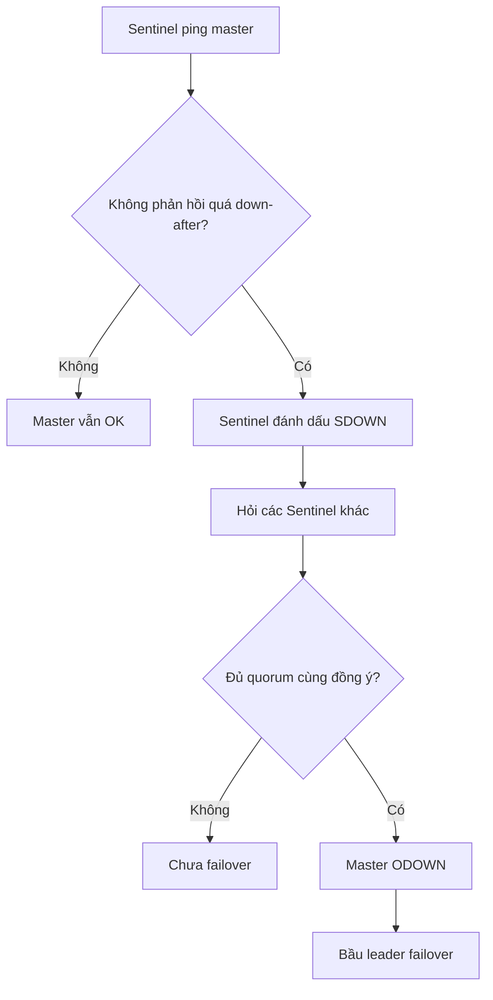
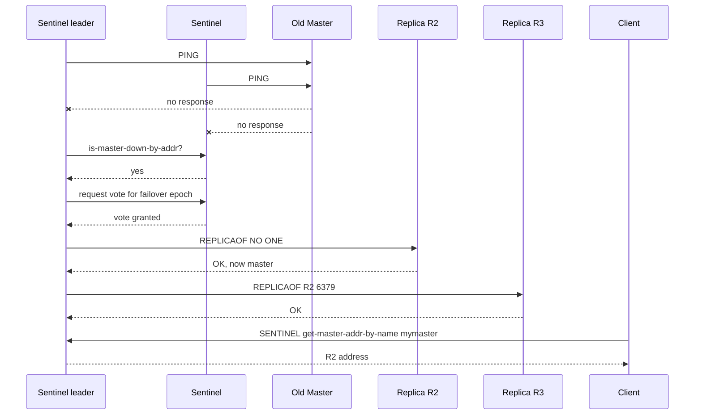
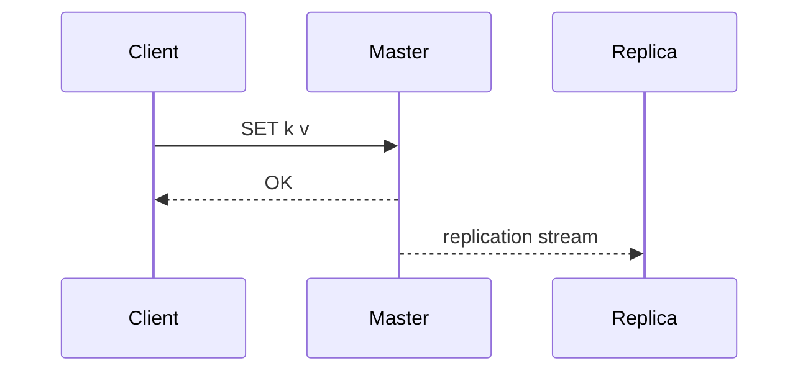

# Redis Sentinel

## Mục lục

- [Tổng quan](#tổng-quan)
- [Sentinel giải quyết vấn đề gì?](#sentinel-giải-quyết-vấn-đề-gì)
- [Sentinel không giải quyết vấn đề gì?](#sentinel-không-giải-quyết-vấn-đề-gì)
- [Kiến trúc tổng quát](#kiến-trúc-tổng-quát)
- [Các nhiệm vụ chính của Sentinel](#các-nhiệm-vụ-chính-của-sentinel)
- [Quorum, majority và vì sao cần ít nhất 3 Sentinel](#quorum-majority-và-vì-sao-cần-ít-nhất-3-sentinel)
- [Subjective down và objective down](#subjective-down-và-objective-down)
- [Luồng failover chi tiết](#luồng-failover-chi-tiết)
- [Cách Sentinel chọn replica để promote](#cách-sentinel-chọn-replica-để-promote)
- [Client discovery: ứng dụng tìm master như thế nào?](#client-discovery-ứng-dụng-tìm-master-như-thế-nào)
- [Cấu hình Sentinel](#cấu-hình-sentinel)
- [Triển khai topology production](#triển-khai-topology-production)
- [Consistency, data loss và split-brain](#consistency-data-loss-và-split-brain)
- [Sentinel với persistence và replication](#sentinel-với-persistence-và-replication)
- [Docker, Kubernetes, NAT và announce IP](#docker-kubernetes-nat-và-announce-ip)
- [Monitoring và vận hành](#monitoring-và-vận-hành)
- [Runbook sự cố thường gặp](#runbook-sự-cố-thường-gặp)
- [Best practices](#best-practices)
- [Checklist production](#checklist-production)
- [So sánh Sentinel, Replication và Cluster](#so-sánh-sentinel-replication-và-cluster)
- [Tài liệu liên quan](#tài-liệu-liên-quan)

---

## Tổng quan

**Redis Sentinel** là cơ chế high availability cho Redis **không dùng sharding**. Sentinel theo dõi một Redis master cùng các replica của nó, phát hiện master lỗi, tự động promote một replica thành master mới, reconfigure các replica còn lại, và cung cấp địa chỉ master hiện tại cho client.

Nói ngắn gọn:

```text
Replication tạo bản sao dữ liệu.
Sentinel tự động failover khi master lỗi.
Cluster sharding dữ liệu + HA theo từng shard.
```

Một mô hình Sentinel cơ bản:

```text
                 ┌──────────────────────┐
                 │      App Clients     │
                 │ Sentinel-aware client│
                 └──────────┬───────────┘
                            │ hỏi master hiện tại
                            ▼
            ┌────────────────────────────────┐
            │ Sentinel quorum: S1, S2, S3    │
            └──────────┬───────────┬─────────┘
                       │ monitor   │ coordinate
                       ▼           ▼
                 ┌──────────┐   ┌──────────┐
                 │ Master   │──▶│ Replica  │
                 │ Redis A  │   │ Redis B  │
                 └────┬─────┘   └──────────┘
                      │
                      ▼
                 ┌──────────┐
                 │ Replica  │
                 │ Redis C  │
                 └──────────┘
```

Khi master A chết, Sentinels đạt đồng thuận, chọn B hoặc C, promote thành master mới, rồi client lấy địa chỉ mới từ Sentinel.

> [!IMPORTANT]
> Sentinel không phải proxy. Client không gửi Redis command qua Sentinel. Client chỉ dùng Sentinel để **discover master/replica hiện tại**, sau đó connect trực tiếp tới Redis node.

---

## Sentinel giải quyết vấn đề gì?

| Vấn đề | Sentinel xử lý như thế nào? |
|--------|------------------------------|
| Master Redis chết | Tự động promote replica thành master mới |
| App không biết master mới ở đâu | Sentinel đóng vai trò configuration provider |
| False positive khi một node monitor đơn lẻ bị lỗi mạng | Nhiều Sentinel cùng vote để xác nhận lỗi |
| Replica cần trỏ sang master mới | Sentinel gửi `REPLICAOF` để reconfigure topology |
| Cần notification khi failover | Sentinel có event/notification script/pubsub |
| Cần quản lý nhiều master group | Một Sentinel set có thể monitor nhiều master name |

Ví dụ use case điển hình:

- Redis cache/session store cần tự phục hồi khi master lỗi.
- Một Redis primary + 2 replicas, không cần sharding.
- Hệ thống muốn failover tự động nhưng vẫn giữ mô hình một master nhận write.
- App dùng client library hỗ trợ Sentinel như Jedis/Lettuce/ioredis/redis-py/go-redis.

---

## Sentinel không giải quyết vấn đề gì?

Sentinel rất hay bị hiểu nhầm. Nó **không** làm các việc sau:

| Không làm | Giải thích |
|-----------|------------|
| **Không sharding** | Một master group vẫn chứa toàn bộ dataset |
| **Không tăng write throughput** | Write vẫn vào một master duy nhất |
| **Không strong consistency** | Redis replication vẫn async, vẫn có cửa sổ mất write |
| **Không merge conflict** | Nếu split-brain tạo hai master, Redis không tự merge dữ liệu |
| **Không thay client library** | Client phải biết cách nói chuyện với Sentinel |
| **Không backup dữ liệu** | Vẫn cần RDB/AOF/backup strategy |
| **Không proxy traffic** | Không gửi Redis command bình thường qua port Sentinel |

Nếu cần sharding và phân phối key tự động, đọc [Redis Cluster](./cluster.md). Nếu chỉ muốn hiểu bản sao dữ liệu hoạt động thế nào, đọc [Replication](./replication.md).

---

## Kiến trúc tổng quát

Một deployment production tối thiểu nên có:

- 1 Redis master.
- Ít nhất 2 Redis replica.
- Ít nhất 3 Sentinel process.
- Client library hỗ trợ Sentinel.

```text
Box 1                         Box 2                         Box 3
┌────────────────────┐        ┌────────────────────┐        ┌────────────────────┐
│ Redis Master M1    │        │ Redis Replica R2   │        │ Redis Replica R3   │
│ Sentinel S1        │        │ Sentinel S2        │        │ Sentinel S3        │
└─────────┬──────────┘        └─────────┬──────────┘        └─────────┬──────────┘
          │                             │                             │
          └────────────── gossip / vote / monitor ────────────────────┘
```

Sentinel process thường chạy trên cùng host với Redis node hoặc trên host app/client, miễn là:

- Các Sentinel có thể nói chuyện với nhau qua port `26379`.
- Sentinel có thể connect tới Redis master và replicas.
- Client có thể connect tới Sentinel và Redis master mới sau failover.

### Sentinel port

Mặc định Sentinel dùng TCP port:

```text
26379
```

Redis data node thường dùng:

```text
6379
```

Hai port này khác nhau. Đừng nhầm Sentinel port với Redis command port.

---

## Các nhiệm vụ chính của Sentinel

Sentinel có 4 nhiệm vụ lớn.

### 1. Monitoring

Sentinel định kỳ kiểm tra:

- Master có trả lời `PING` không.
- Replica có online không.
- Các Sentinel khác có online không.
- Replication state hiện tại là gì.

Sentinel không chỉ ping một node. Nó còn đọc thông tin topology bằng Redis command như `INFO`, từ đó auto-discover replica.

### 2. Notification

Sentinel có thể phát event khi:

- Master bị đánh dấu down.
- Replica mất kết nối.
- Failover bắt đầu/thành công/thất bại.
- Master mới được chọn.

Các event này có thể được client subscribe hoặc dùng script notification.

### 3. Automatic failover

Khi master được xác nhận lỗi bởi đủ Sentinel:

1. Một Sentinel được bầu làm leader cho failover.
2. Leader chọn replica phù hợp nhất.
3. Leader promote replica thành master.
4. Các replica còn lại được reconfigure để follow master mới.
5. Master cũ, nếu quay lại, bị reconfigure thành replica.

### 4. Configuration provider

Client hỏi Sentinel:

```text
Master hiện tại của service mymaster là IP/port nào?
```

Sentinel trả về master hiện tại. Sau failover, Sentinel trả master mới.

---

## Quorum, majority và vì sao cần ít nhất 3 Sentinel

Đây là phần quan trọng nhất để hiểu Sentinel.

### Quorum là gì?

Trong config:

```conf
sentinel monitor mymaster 10.0.0.10 6379 2
```

Số `2` cuối cùng là **quorum**.

Quorum là số Sentinel tối thiểu phải đồng ý rằng master đang down để master được đánh dấu **objective down**.

### Majority là gì?

**Majority** là đa số Sentinel trong toàn bộ Sentinel set.

| Tổng Sentinel | Majority |
|---------------|----------|
| 1 | 1 |
| 2 | 2 |
| 3 | 2 |
| 4 | 3 |
| 5 | 3 |
| 7 | 4 |

Failover không chỉ cần quorum. Để thực sự tiến hành failover, một Sentinel còn cần được majority authorize làm leader.

> [!IMPORTANT]
> Quorum dùng để xác nhận master down. Majority dùng để authorize failover và tránh nhiều Sentinel cùng failover lung tung.

### Vì sao không nên dùng 2 Sentinel?

Với 2 Sentinel, majority là 2. Nếu một Sentinel chết hoặc bị partition, Sentinel còn lại không đạt majority để failover.

```text
Box 1                    Box 2
┌──────────────┐         ┌──────────────┐
│ Master M1    │         │ Replica R1   │
│ Sentinel S1  │         │ Sentinel S2  │
└──────┬───────┘         └──────┬───────┘
       │                        │
       └──── network ───────────┘
```

Nếu Box 1 chết, S1 cũng chết. S2 còn sống nhưng chỉ có 1/2 vote, không đạt majority. Kết quả: không failover.

### Vì sao 3 Sentinel là tối thiểu production?

Với 3 Sentinel, majority là 2. Nếu một host chết, còn 2 Sentinel vẫn đạt majority.

```text
S1 chết, S2 + S3 còn sống → 2/3 → failover được
```

Khuyến nghị:

```text
3 Sentinel trên 3 failure domains độc lập
```

Ví dụ:

- 3 VM khác nhau.
- 3 physical hosts khác nhau.
- 3 Availability Zones nếu cloud hỗ trợ.

---

## Subjective down và objective down

Sentinel phân biệt hai trạng thái down.

### Subjective down: SDOWN

Một Sentinel riêng lẻ cho rằng master down vì không nhận được phản hồi hợp lệ trong khoảng `down-after-milliseconds`.

```conf
sentinel down-after-milliseconds mymaster 10000
```

Nếu Sentinel S1 ping master 10 giây không được, S1 đánh dấu master là **SDOWN** theo góc nhìn của S1.

Nhưng có thể chỉ S1 bị lỗi mạng.

### Objective down: ODOWN

Khi đủ Sentinel cùng đồng ý master down theo quorum, master được đánh dấu **ODOWN**.

```text
S1 thấy master down
S2 thấy master down
quorum = 2
⇒ master ODOWN
```

ODOWN mới là điều kiện để bắt đầu failover.



---

## Luồng failover chi tiết

Giả sử topology:

```text
M1: master
R2, R3: replicas
S1, S2, S3: sentinels
quorum = 2
```

### Bước 1: Monitoring bình thường

Sentinel định kỳ ping Redis nodes và trao đổi hello message với nhau.

```text
S1 ── PING ─▶ M1
S2 ── PING ─▶ M1
S3 ── PING ─▶ M1
```

### Bước 2: Master không phản hồi

M1 chết hoặc bị network partition. S1 và S2 không ping được M1 quá `down-after-milliseconds`.

```text
S1: M1 SDOWN
S2: M1 SDOWN
S3: có thể SDOWN hoặc chưa
```

### Bước 3: Đạt quorum → ODOWN

Nếu quorum = 2, S1 và S2 đủ để kết luận M1 ODOWN.

### Bước 4: Bầu Sentinel leader

Không phải Sentinel nào thấy ODOWN cũng tự promote. Sentinel cần xin vote để trở thành leader của failover epoch hiện tại.

Mục tiêu:

- Chỉ một Sentinel điều phối failover tại một thời điểm.
- Tránh hai Sentinel promote hai replica khác nhau.
- Gắn failover với một epoch/config version rõ ràng.

### Bước 5: Chọn replica tốt nhất

Leader đánh giá các replica:

- Replica có online không?
- Có bị disconnect khỏi master quá lâu không?
- Replication offset có mới không?
- `replica-priority` là bao nhiêu?
- Replica có đang phản hồi ổn định không?

### Bước 6: Promote replica

Leader gửi command tới replica được chọn:

```bash
REPLICAOF NO ONE
```

Replica đó trở thành master mới.

### Bước 7: Reconfigure replica còn lại

Leader gửi các replica khác follow master mới:

```bash
REPLICAOF <new-master-ip> <new-master-port>
```

### Bước 8: Cập nhật Sentinel state và client discovery

Sentinels update config. Client hỏi master mới sẽ nhận IP/port mới.

### Bước 9: Master cũ quay lại

Nếu M1 quay lại, Sentinel sẽ reconfigure nó thành replica của master mới.

```text
Trước failover:
M1 ─▶ R2, R3

Sau failover:
R2 promoted thành M2
R3 ─▶ M2
M1 nếu quay lại ─▶ M2
```



---

## Cách Sentinel chọn replica để promote

Không phải replica nào cũng phù hợp để promote.

Sentinel cố chọn replica “tốt nhất” theo nhiều tiêu chí.

### Các yếu tố chính

| Yếu tố | Ý nghĩa |
|--------|---------|
| `replica-priority` | Priority thấp hơn được ưu tiên hơn; `0` nghĩa là không promote |
| Replication offset | Replica có offset cao hơn thường mới dữ liệu hơn |
| Link với master cũ | Replica disconnect quá lâu có thể bị loại |
| Health/availability | Replica phải reachable và phản hồi tốt |
| Run ID | Dùng làm tie-breaker ổn định nếu các tiêu chí khác ngang nhau |

Config trên Redis replica:

```conf
replica-priority 100
```

Không cho replica được promote:

```conf
replica-priority 0
```

### Ví dụ chọn replica

```text
Replica R2: priority=100, offset=100000, online
Replica R3: priority=100, offset=99000, online
Replica R4: priority=0,   offset=101000, online
```

R4 có offset mới nhất nhưng priority = 0 nên không được promote. R2 thắng R3 vì offset cao hơn.

### Dùng priority cho topology

Ví dụ bạn có một replica local cùng AZ với master và một replica cross-region dùng DR/reporting:

```text
R2 local HA candidate: replica-priority 100
R3 cross-region/reporting: replica-priority 500
R4 backup-only: replica-priority 0
```

Sentinel sẽ ưu tiên R2 hơn R3 và không promote R4.

---

## Client discovery: ứng dụng tìm master như thế nào?

Sentinel-aware client thường cần config:

- Danh sách Sentinel endpoints.
- Tên master group, ví dụ `mymaster`.
- Redis auth/TLS nếu có.
- Sentinel auth/TLS nếu có.

Client không hard-code IP master. Thay vào đó:

```text
App → Sentinel: master của mymaster là ai?
Sentinel → App: 10.0.0.12:6379
App → Redis 10.0.0.12:6379: gửi command
```

Command Sentinel tương ứng:

```bash
redis-cli -p 26379 SENTINEL get-master-addr-by-name mymaster
```

Kết quả:

```text
1) "10.0.0.12"
2) "6379"
```

### Khi failover xảy ra

Client tốt sẽ:

1. Detect connection lỗi hoặc `READONLY`/role mismatch.
2. Hỏi lại Sentinel master hiện tại.
3. Reconnect sang master mới.
4. Retry command an toàn nếu command idempotent hoặc app có retry policy.

> [!IMPORTANT]
> Không phải mọi Redis client đều hỗ trợ Sentinel tốt như nhau. Trước production, phải test failover thật với client library bạn dùng.

### Read từ replica qua Sentinel

Sentinel cũng có command liệt kê replicas:

```bash
redis-cli -p 26379 SENTINEL replicas mymaster
```

Một số client hỗ trợ read preference:

- Read master only.
- Read replica preferred.
- Read nearest/latency-based.

Nhớ rằng read từ replica có thể stale. Xem [Replication](./replication.md).

---

## Cấu hình Sentinel

### File sentinel.conf tối thiểu

```conf
port 26379
bind 0.0.0.0
protected-mode yes

dir /var/lib/redis-sentinel

sentinel monitor mymaster 10.0.0.10 6379 2
sentinel down-after-milliseconds mymaster 10000
sentinel failover-timeout mymaster 60000
sentinel parallel-syncs mymaster 1
```

Chạy Sentinel:

```bash
redis-sentinel /etc/redis/sentinel.conf
```

Hoặc:

```bash
redis-server /etc/redis/sentinel.conf --sentinel
```

> [!IMPORTANT]
> Sentinel bắt buộc cần config file writable. Sentinel sẽ tự rewrite file này khi topology thay đổi. Đừng mount file read-only.

### `sentinel monitor`

```conf
sentinel monitor <master-name> <ip> <port> <quorum>
```

Ví dụ:

```conf
sentinel monitor mymaster 10.0.0.10 6379 2
```

| Tham số | Ý nghĩa |
|---------|--------|
| `mymaster` | Tên logic của master group |
| `10.0.0.10` | IP/DNS master ban đầu |
| `6379` | Redis port |
| `2` | Quorum để xác nhận ODOWN |

Sentinel tự discover replica qua `INFO replication`, nên không cần khai báo từng replica.

### `down-after-milliseconds`

```conf
sentinel down-after-milliseconds mymaster 10000
```

Nếu master không phản hồi hợp lệ trong 10 giây, Sentinel đánh dấu SDOWN.

Trade-off:

| Giá trị thấp | Giá trị cao |
|--------------|-------------|
| Failover nhanh hơn | Ít false positive hơn |
| Dễ failover do network jitter | Downtime phát hiện lỗi lâu hơn |

### `failover-timeout`

```conf
sentinel failover-timeout mymaster 60000
```

Dùng cho nhiều timeout liên quan failover, ví dụ thời gian failover được coi là hết hạn, retry failover, reconfigure replica.

Không nên đặt quá thấp nếu dataset lớn hoặc network chậm.

### `parallel-syncs`

```conf
sentinel parallel-syncs mymaster 1
```

Số replica được phép resync với master mới cùng lúc sau failover.

Nếu có nhiều replica và dataset lớn, để `1` giúp tránh tất cả replica cùng load RDB/full sync làm tăng tải master mới.

### Auth tới Redis nodes

Nếu Redis master/replica dùng password:

```conf
sentinel auth-pass mymaster strong-password
```

Nếu dùng ACL user:

```conf
sentinel auth-user mymaster sentinel-user
sentinel auth-pass mymaster sentinel-password
```

### Auth cho Sentinel itself

Sentinel cũng là Redis-compatible server ở port `26379`, có thể bật auth/ACL tùy version/config:

```conf
requirepass sentinel-password
```

Client khi connect Sentinel phải dùng credential tương ứng.

### Notification script và client reconfig script

Ví dụ:

```conf
sentinel notification-script mymaster /opt/redis/notify.sh
sentinel client-reconfig-script mymaster /opt/redis/reconfig.sh
```

Trong production hiện đại, thường dùng monitoring/log scraping hơn là script phức tạp, nhưng script vẫn hữu ích để integrate legacy automation.

---

## Triển khai topology production

### Topology 3 box cơ bản

```text
Box A                 Box B                 Box C
┌─────────────┐       ┌─────────────┐       ┌─────────────┐
│ Redis M1    │       │ Redis R2    │       │ Redis R3    │
│ Sentinel S1 │       │ Sentinel S2 │       │ Sentinel S3 │
└─────────────┘       └─────────────┘       └─────────────┘
```

Config:

```conf
sentinel monitor mymaster <M1-IP> 6379 2
```

Ưu điểm:

- Đơn giản.
- Một host chết vẫn còn 2 Sentinel.
- Có 2 replica candidate.

Nhược điểm:

- Nếu master bị partition cùng client nhưng mất liên lạc với majority Sentinel, cần cấu hình replication safety để giảm lost writes.

### Topology Sentinel trên app nodes

```text
Redis Box 1           Redis Box 2
┌─────────────┐       ┌─────────────┐
│ Master M1   │       │ Replica R1  │
└──────┬──────┘       └──────┬──────┘
       │                     │
       └──────────┬──────────┘
                  │
App Box A      App Box B      App Box C
┌────────┐     ┌────────┐     ┌────────┐
│ App    │     │ App    │     │ App    │
│ S1     │     │ S2     │     │ S3     │
└────────┘     └────────┘     └────────┘
```

Phù hợp khi chỉ có 2 Redis boxes nhưng có 3 app boxes.

Trade-off:

- Sentinel nhìn network giống app, có thể hợp lý.
- Nếu app layer bị partition khỏi Redis, failover behavior phụ thuộc topology.
- Cần vận hành Sentinel trên app host.

### Topology nhiều master group

Một Sentinel set có thể monitor nhiều Redis master group:

```conf
sentinel monitor cache-master 10.0.0.10 6379 2
sentinel monitor session-master 10.0.0.20 6379 2
sentinel monitor queue-master 10.0.0.30 6379 2
```

Cẩn thận:

- Một Sentinel process quá tải hoặc config phức tạp có thể ảnh hưởng nhiều group.
- Alert/runbook cần phân biệt master name rõ ràng.

---

## Consistency, data loss và split-brain

Sentinel dùng Redis replication bên dưới, mà replication mặc định là async. Vì vậy Sentinel không đảm bảo zero data loss.

### Cửa sổ mất write

Luồng write bình thường:



Nếu M trả `OK` rồi chết trước khi R nhận write, Sentinel có thể promote R và write đó mất.

### Split-brain minority partition

Kịch bản nguy hiểm:

```text
Partition A: Old Master M1 + Client C1
Partition B: Replica R2/R3 + Sentinel majority S2/S3
```

S2/S3 không thấy M1, promote R2 thành master mới. Nhưng C1 vẫn ghi vào M1 ở partition A. Khi partition hồi phục, M1 bị reconfigure thành replica của R2 và dữ liệu ghi vào M1 trong thời gian đó bị discard.

```text
C1 writes to old M1  ── mất sau khi M1 follow new master
C2 writes to new R2  ── được giữ theo topology mới
```

### Giảm rủi ro bằng min-replicas

Trên Redis master:

```conf
min-replicas-to-write 1
min-replicas-max-lag 10
```

Ý nghĩa: master chỉ accept write nếu có ít nhất 1 replica ACK gần đây trong vòng 10 giây.

Trong minority partition, old master mất replica ACK, sau tối đa khoảng 10 giây sẽ ngừng accept write. Điều này giới hạn cửa sổ lost writes.

Trade-off: nếu replica thật sự down, master cũng từ chối write dù master vẫn sống.

### Dùng WAIT cho write quan trọng

Client có thể dùng:

```bash
SET idempotency:abc 1 NX EX 86400
WAIT 1 1000
```

`WAIT` giảm xác suất mất write nhưng không tạo strong consistency tuyệt đối. Xem [Replication](./replication.md).

---

## Sentinel với persistence và replication

Sentinel chỉ điều phối failover. Dữ liệu an toàn hay không còn phụ thuộc persistence.

### Master không persistence + auto restart là nguy hiểm

Nếu master không bật RDB/AOF và process auto restart:

```text
1. Master crash.
2. systemd/docker restart master ngay.
3. Master quay lại với dataset rỗng.
4. Sentinel có thể chưa kịp failover.
5. Replicas sync dataset rỗng.
```

Đây là lỗi vận hành nghiêm trọng.

Khuyến nghị:

- Dữ liệu quan trọng: bật AOF hoặc RDB phù hợp.
- Nếu tắt persistence vì cache thuần: hiểu rõ blast radius.
- Không auto restart master không persistence nếu replica chứa dữ liệu cần giữ.

### Replica được promote cần persistence không?

Nên có. Sau khi replica thành master, nó trở thành source of truth mới. Nếu node đó crash mà không persistence, dữ liệu sau failover có thể mất.

Cấu hình thường gặp:

```conf
appendonly yes
appendfsync everysec
```

---

## Docker, Kubernetes, NAT và announce IP

Sentinel tự discover topology dựa trên địa chỉ Redis/Sentinel announce với nhau. NAT/port mapping có thể làm sai địa chỉ.

### Vấn đề thường gặp

Trong Docker bridge network:

- Redis container nghĩ nó ở `172.x.x.x:6379`.
- Host expose port `6380:6379`.
- Sentinel hoặc client nhận địa chỉ container không route được từ bên ngoài.

Kết quả:

- Sentinel không connect được Sentinel khác.
- Client nhận master IP không dùng được.
- Replica được discover với port sai.

### Redis replica announce

Trong Redis replica config:

```conf
replica-announce-ip 10.0.0.11
replica-announce-port 6379
```

### Sentinel announce

Trong Sentinel config:

```conf
sentinel announce-ip 10.0.0.21
sentinel announce-port 26379
```

### Kubernetes lưu ý

Trong Kubernetes, production Sentinel cần thiết kế kỹ:

- Dùng stable network identity nếu có thể, ví dụ StatefulSet.
- Đảm bảo Sentinel config writable/persistent.
- Đảm bảo client nhận endpoint route được.
- Test failover khi pod restart/reschedule.
- Cẩn thận với Service load balancer che mất identity node.

> [!WARNING]
> Sentinel + NAT/port remapping là nguồn lỗi phổ biến. Nếu dùng container, đừng chỉ test “container ping được nhau”; hãy test failover và client reconnect từ đúng network của app.

---

## Monitoring và vận hành

### Command Sentinel quan trọng

Liệt kê master được monitor:

```bash
redis-cli -p 26379 SENTINEL masters
```

Xem master cụ thể:

```bash
redis-cli -p 26379 SENTINEL master mymaster
```

Lấy master hiện tại:

```bash
redis-cli -p 26379 SENTINEL get-master-addr-by-name mymaster
```

Liệt kê replicas:

```bash
redis-cli -p 26379 SENTINEL replicas mymaster
```

Liệt kê sentinels khác:

```bash
redis-cli -p 26379 SENTINEL sentinels mymaster
```

Kiểm tra quorum:

```bash
redis-cli -p 26379 SENTINEL ckquorum mymaster
```

Failover thủ công:

```bash
redis-cli -p 26379 SENTINEL failover mymaster
```

### Event Pub/Sub

Có thể subscribe event Sentinel:

```bash
redis-cli -p 26379 PSUBSCRIBE '*'
```

Event đáng chú ý:

| Event | Ý nghĩa |
|-------|---------|
| `+sdown` | Một instance bị đánh dấu subjective down |
| `-sdown` | Hết subjective down |
| `+odown` | Master objective down |
| `-odown` | Hết objective down |
| `+new-epoch` | Epoch failover mới |
| `+try-failover` | Sentinel thử failover |
| `+elected-leader` | Sentinel được bầu leader |
| `+promoted-slave` | Replica được promote |
| `+switch-master` | Master address đã đổi |
| `+failover-end` | Failover kết thúc |

### Metrics cần alert

| Metric/tín hiệu | Alert khi |
|-----------------|-----------|
| Số Sentinel reachable | < majority |
| `SENTINEL ckquorum` | Không đạt quorum/majority |
| Master SDOWN/ODOWN | Xuất hiện |
| Failover count | Tăng bất thường |
| Replication lag | Vượt threshold |
| Replica count healthy | Thấp hơn yêu cầu |
| Client reconnect/fail command | Spike sau failover |
| Redis rejected writes | Do `min-replicas-to-write` |

### Log patterns

Theo dõi log Sentinel:

```text
+sdown master mymaster ...
+odown master mymaster ...
+new-epoch ...
+try-failover master mymaster ...
+elected-leader master mymaster ...
+selected-slave ...
+promoted-slave ...
+switch-master mymaster old-ip old-port new-ip new-port
+failover-end master mymaster ...
```

---

## Runbook sự cố thường gặp

### 1. Master chết nhưng Sentinel không failover

Kiểm tra:

```bash
redis-cli -p 26379 SENTINEL ckquorum mymaster
redis-cli -p 26379 SENTINEL master mymaster
redis-cli -p 26379 SENTINEL sentinels mymaster
redis-cli -p 26379 SENTINEL replicas mymaster
```

Nguyên nhân thường gặp:

- Không đủ majority Sentinel reachable.
- Quorum đặt quá cao.
- Sentinel không nói chuyện được với nhau do firewall port 26379.
- Không có replica hợp lệ để promote.
- Replica priority = 0 hết.
- Auth sai, Sentinel không điều khiển được Redis nodes.

### 2. Failover xảy ra nhưng app vẫn ghi vào master cũ

Nguyên nhân:

- Client không hỗ trợ Sentinel hoặc config sai.
- App hard-code Redis master IP.
- Connection pool không refresh sau failover.
- DNS/cache/LB trỏ sai.

Cách xử lý:

- Dùng Sentinel-aware client.
- Test failover trong staging.
- Đặt retry/reconnect policy rõ ràng.
- Khi nhận `READONLY`, client nên rediscover master.

### 3. Failover liên tục/flapping

Nguyên nhân:

- `down-after-milliseconds` quá thấp.
- Network jitter giữa Sentinel và Redis.
- Redis latency spike do fork/AOF/slow command.
- CPU throttling/container overload.

Cách xử lý:

- Tăng `down-after-milliseconds` hợp lý.
- Kiểm tra Redis latency: `LATENCY LATEST`, `SLOWLOG GET`.
- Kiểm tra network packet loss.
- Kiểm tra persistence/fork time.

### 4. Replica được chọn không như mong muốn

Kiểm tra:

```bash
redis-cli -h <replica> INFO replication
redis-cli -h <replica> CONFIG GET replica-priority
```

Cách xử lý:

- Set `replica-priority` theo ý đồ.
- Đảm bảo replica quan trọng có lag thấp.
- Không cho backup-only replica promote bằng `replica-priority 0`.

### 5. Sentinel trả IP không connect được

Nguyên nhân thường gặp:

- Docker/NAT/port mapping.
- Redis announce IP sai.
- Sentinel announce IP sai.
- Client ở network khác Sentinel.

Cách xử lý:

```conf
replica-announce-ip <reachable-ip>
replica-announce-port <reachable-port>
sentinel announce-ip <reachable-ip>
sentinel announce-port 26379
```

### 6. Config Sentinel bị mất sau restart

Sentinel rewrite config file. Nếu file không persistent hoặc read-only, state có thể mất hoặc Sentinel không start.

Cách xử lý:

- Mount volume writable cho `sentinel.conf`/dir.
- Không generate lại config trắng mỗi lần container restart.
- Backup config nếu cần.

---

## Best practices

### 1. Luôn dùng ít nhất 3 Sentinel

Không dùng 1 hoặc 2 Sentinel cho production HA.

```text
3 Sentinel, 3 failure domains, quorum = 2
```

### 2. Client phải Sentinel-aware

Failover server-side không đủ. App phải biết rediscover master mới.

Trước production, test:

- Kill master process.
- Network partition master.
- Restart Sentinel.
- Restart replica.
- Verify app tự reconnect và không hard-code old master.

### 3. Bật persistence nếu dữ liệu cần giữ

Replication + Sentinel không thay thế AOF/RDB.

```conf
appendonly yes
appendfsync everysec
```

### 4. Dùng `min-replicas-to-write` để giới hạn lost writes

Trên master:

```conf
min-replicas-to-write 1
min-replicas-max-lag 10
```

Chọn giá trị theo SLA availability vs durability.

### 5. Đặt `parallel-syncs` thấp cho dataset lớn

```conf
sentinel parallel-syncs mymaster 1
```

Tránh tất cả replica cùng resync gây tải lên master mới.

### 6. Tách replica HA và replica workload nặng

Nếu một replica chạy backup/reporting rất nặng, cân nhắc:

```conf
replica-priority 0
```

Để nó không được promote.

### 7. Quan sát failover như một quy trình thường kỳ

Failover không nên là sự kiện lần đầu xảy ra lúc 3 giờ sáng.

Nên định kỳ chạy:

```bash
redis-cli -p 26379 SENTINEL failover mymaster
```

Trong môi trường staging hoặc production có kế hoạch.

### 8. Cẩn thận với container/network abstraction

Không deploy Sentinel trong NAT phức tạp nếu chưa hiểu announce IP/port và client routing.

---

## Checklist production

### Thiết kế

- [ ] Có ít nhất 3 Sentinel.
- [ ] Sentinel nằm trên failure domains độc lập.
- [ ] Có ít nhất 2 replica nếu cần HA tốt hơn.
- [ ] Quorum thường là 2 với 3 Sentinel.
- [ ] Client library hỗ trợ Sentinel.
- [ ] Có strategy cho stale reads nếu đọc replica.

### Config Redis

- [ ] `replicaof` đúng.
- [ ] `replica-read-only yes`.
- [ ] Persistence phù hợp (`appendonly yes` hoặc RDB strategy).
- [ ] `min-replicas-to-write` cân nhắc cho dữ liệu quan trọng.
- [ ] `replica-priority` đặt theo ý đồ failover.
- [ ] Auth/ACL/TLS đầy đủ.

### Config Sentinel

- [ ] `sentinel monitor` đúng IP/port route được.
- [ ] `down-after-milliseconds` không quá thấp.
- [ ] `failover-timeout` đủ cho môi trường.
- [ ] `parallel-syncs` phù hợp dataset.
- [ ] `sentinel.conf` writable và persistent.
- [ ] `announce-ip/port` nếu dùng NAT/container.

### Test

- [ ] Kill master → failover thành công.
- [ ] App reconnect master mới.
- [ ] Old master quay lại thành replica.
- [ ] Kill một Sentinel → vẫn đạt majority.
- [ ] Kill một replica → monitoring alert đúng.
- [ ] Network partition scenario được hiểu rõ.
- [ ] Backup/restore được test.

---

## So sánh Sentinel, Replication và Cluster

| Tiêu chí | Replication | Sentinel | Cluster |
|----------|-------------|----------|---------|
| Mục tiêu chính | Tạo bản sao | HA/failover cho non-sharded Redis | Sharding + HA |
| Tự động failover | Không | Có | Có |
| Sharding | Không | Không | Có, 16384 hash slots |
| Write scaling | Không | Không | Có theo số master shards |
| Read scaling | Có qua replicas | Có qua replicas | Có qua replicas mỗi shard |
| Client complexity | Thấp | Trung bình, Sentinel-aware | Cao hơn, cluster-aware |
| Strong consistency | Không | Không | Không |
| Dùng khi | Cần replica/read/backup | Cần HA cho một dataset | Dataset/write lớn cần chia shard |

---

## Tài liệu liên quan

- [Replication](./replication.md) - Nền tảng master-replica, offset, backlog, async replication.
- [Redis Cluster](./cluster.md) - Sharding với hash slots và HA theo shard.
- [Persistence Strategies](./persistence-strategies.md) - Chọn RDB/AOF/hybrid.
- [AOF](./aof.md) - Append-only persistence.
- [RDB Snapshots](./rdb.md) - Snapshot, fork, copy-on-write.
- [Monitoring](./monitoring.md) - Metrics và alerts.
- [Security](./security.md) - AUTH, ACL, TLS, protected mode.
- [Redis official docs: Sentinel](https://redis.io/docs/latest/operate/oss_and_stack/management/sentinel/)
