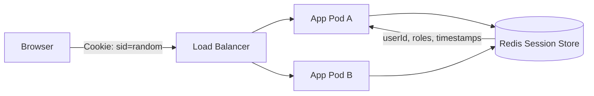
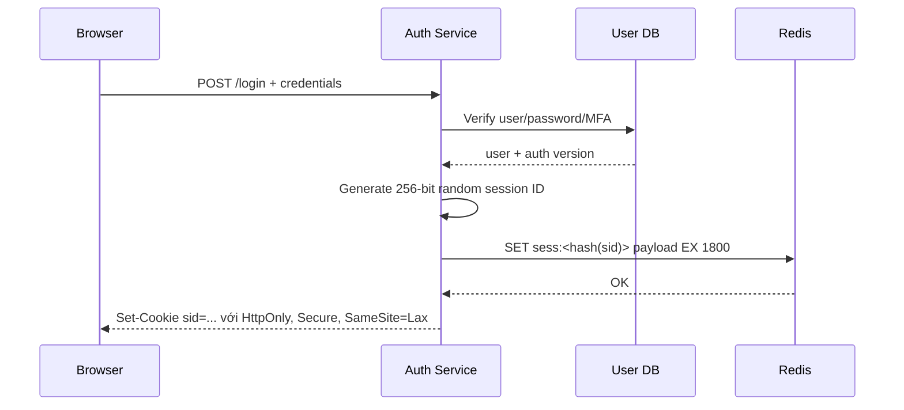
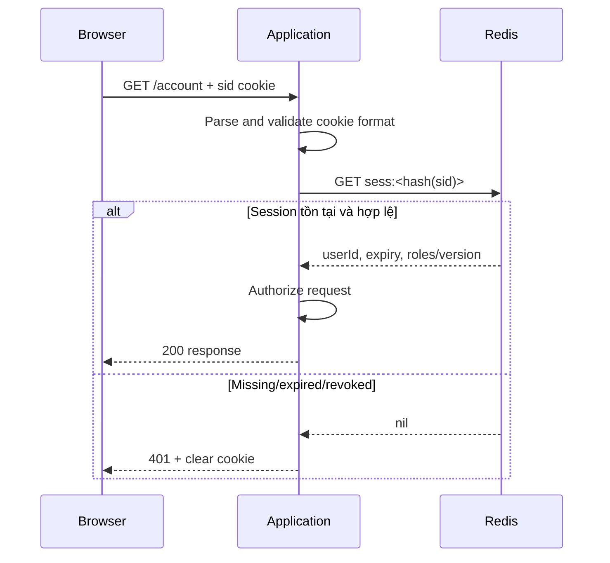
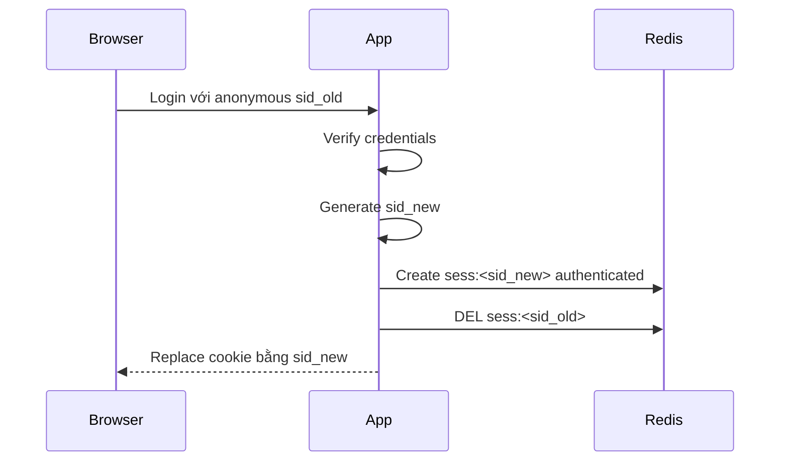

# Session Store

## Mục lục

- [1. Vấn đề: HTTP stateless nhưng đăng nhập có trạng thái](#1-vấn-đề-http-stateless-nhưng-đăng-nhập-có-trạng-thái)
- [2. Session hoạt động như thế nào](#2-session-hoạt-động-như-thế-nào)
- [3. Server-side session với Redis](#3-server-side-session-với-redis)
- [4. Data model: String, Hash và index phụ](#4-data-model-string-hash-và-index-phụ)
- [5. TTL: idle timeout, absolute timeout và refresh](#5-ttl-idle-timeout-absolute-timeout-và-refresh)
- [6. Login, session rotation và chống fixation](#6-login-session-rotation-và-chống-fixation)
- [7. Logout, revoke và đăng xuất mọi thiết bị](#7-logout-revoke-và-đăng-xuất-mọi-thiết-bị)
- [8. Concurrency và cập nhật session atomic](#8-concurrency-và-cập-nhật-session-atomic)
- [9. Serialization và schema evolution](#9-serialization-và-schema-evolution)
- [10. Spring Session với Redis](#10-spring-session-với-redis)
- [11. Security end-to-end](#11-security-end-to-end)
- [12. High availability, persistence và failover](#12-high-availability-persistence-và-failover)
- [13. Redis Cluster và multi-region](#13-redis-cluster-và-multi-region)
- [14. Capacity planning và observability](#14-capacity-planning-và-observability)
- [15. Failure modes và runbook](#15-failure-modes-và-runbook)
- [16. Session, JWT và database](#16-session-jwt-và-database)
- [17. Anti-patterns và checklist production](#17-anti-patterns-và-checklist-production)
- [18. Tóm tắt](#18-tóm-tắt)
- [Tài liệu tham khảo](#tài-liệu-tham-khảo)

---

## 1. Vấn đề: HTTP stateless nhưng đăng nhập có trạng thái

HTTP request không tự nhớ request trước. Sau khi user đăng nhập, server cần biết request tiếp theo thuộc user nào, đã xác thực lúc nào, có MFA hay không và session còn hợp lệ không.

Nếu session nằm trong memory của từng application instance:

```text
Login qua Pod A → session chỉ ở RAM Pod A
Request sau vào Pod B → Pod B không biết session → user bị logout
Pod A restart → toàn bộ session trên Pod A biến mất
```

Sticky session giảm một phần vấn đề nhưng làm cân bằng tải và deploy khó hơn. Redis tạo một shared session store có TTL, tốc độ thấp và atomic operations:



> [!IMPORTANT]
> Cookie chỉ nên chứa **session ID ngẫu nhiên**, không chứa password hay toàn bộ session. Redis giữ state phía server; application dùng session ID để lookup.

---

## 2. Session hoạt động như thế nào

### 2.1. Login flow



### 2.2. Authenticated request flow



Tách hai khái niệm:

- **Authentication**: session chứng minh request thuộc principal nào.
- **Authorization**: principal có được phép làm hành động cụ thể không.

Không nên nhét mọi permission động vào session rồi tin vô hạn; role/permission thay đổi cần cơ chế version/revalidation.

---

## 3. Server-side session với Redis

Một session tối thiểu:

```json
{
  "userId": "u_4821",
  "createdAt": 1783400000,
  "lastSeenAt": 1783400120,
  "absoluteExpiresAt": 1783428800,
  "authLevel": "mfa",
  "authVersion": 7,
  "csrfSecret": "random",
  "schema": 2
}
```

Key không nên chứa raw session ID nếu log/monitoring có thể lộ key. Có thể lưu hash:

```text
Cookie: sid = 32 random bytes, base64url
Redis key: sess:v2:<SHA-256(sid)>
```

Hash không thay thế entropy; session ID vẫn phải sinh bằng CSPRNG. Không dùng user ID, timestamp, UUID dễ đoán hoặc token tuần tự làm session ID.

### 3.1. Session là state critical, không phải cache thông thường

Mất cache sản phẩm chỉ làm cache miss; mất session đăng xuất hàng loạt user. Vì vậy:

- Không đặt session chung instance có `allkeys-lru` nếu eviction là bình thường.
- Cân nhắc `noeviction`, memory headroom, replication và persistence.
- Theo dõi `evicted_keys`; session bị evict tương đương revoke ngẫu nhiên.
- Định nghĩa rõ fail-open hay fail-closed khi Redis lỗi. Auth thường **fail-closed**.

---

## 4. Data model: String, Hash và index phụ

### 4.1. JSON String

```bash
SET sess:v2:ab12... '{"userId":"u_4821","schema":2,...}' EX 1800
GET sess:v2:ab12...
```

Ưu điểm: một round trip, snapshot nguyên khối, dễ mã hóa/compress. Nhược điểm: sửa một field phải đọc-ghi cả payload hoặc dùng script.

### 4.2. Redis Hash

```bash
HSET sess:v2:ab12... userId u_4821 createdAt 1783400000 authLevel mfa schema 2
EXPIRE sess:v2:ab12... 1800
HGETALL sess:v2:ab12...
```

Ưu điểm: update field atomic bằng `HSET`, counter bằng `HINCRBY`. Nhược điểm: cần đảm bảo đặt TTL; `HSET` không tự refresh TTL. TTL truyền thống ở cấp toàn key, không phải từng field; kiểm tra tính năng theo phiên bản Redis nếu định dùng field expiration mới.

### 4.3. Tránh lỗi “tạo session nhưng quên TTL”

Với String, `SET ... EX` là một command. Với Hash, `HSET` rồi `EXPIRE` là hai command; process có thể chết ở giữa. Dùng transaction hoặc Lua:

```bash
MULTI
HSET sess:v2:abc userId u_1 createdAt 1783400000
EXPIRE sess:v2:abc 1800
EXEC
```

### 4.4. Index user → sessions

Để “logout all devices”, cần biết session nào thuộc user:

```bash
SADD user-sessions:{u_4821} ab12... cd34...
EXPIRE user-sessions:{u_4821} 2592000
```

Hoặc Sorted Set với score là expiry timestamp để dọn member cũ:

```bash
ZADD user-sessions:{u_4821} 1783428800 ab12...
ZRANGEBYSCORE user-sessions:{u_4821} -inf 1783400000
```

Index phụ có thể lệch nếu dual write thất bại. Thiết kế operation idempotent và cleanup lazy. Trong Cluster, hash tag `{u_4821}` chỉ gom các key có cùng tag; session key muốn cùng slot cũng phải chứa tag, nhưng điều đó làm lộ user relation trong key và phân bố kém nếu một user có cực nhiều session. Không cần multi-key atomic thì không ép cùng slot.

---

## 5. TTL: idle timeout, absolute timeout và refresh

### 5.1. Hai deadline khác nhau

- **Idle timeout**: logout nếu không hoạt động trong 30 phút.
- **Absolute timeout**: dù hoạt động liên tục, session phải login lại sau 8 giờ/30 ngày.

Chỉ gọi `EXPIRE 1800` mỗi request tạo sliding TTL vô hạn. Để enforce absolute deadline:

```text
new_ttl = min(idle_timeout, absolute_expires_at - now)
Nếu new_ttl <= 0 → delete session và từ chối
```

### 5.2. Atomic validate + refresh

Lua tránh race giữa đọc session và gia hạn TTL:

```lua
-- KEYS[1] session key
-- ARGV[1] now epoch seconds
-- ARGV[2] idle timeout seconds
local raw = redis.call('GET', KEYS[1])
if not raw then return {0, false} end

local s = cjson.decode(raw)
local remaining = tonumber(s.absoluteExpiresAt) - tonumber(ARGV[1])
if remaining <= 0 then
  redis.call('DEL', KEYS[1])
  return {0, false}
end

local ttl = math.min(tonumber(ARGV[2]), remaining)
redis.call('EXPIRE', KEYS[1], ttl)
return {1, raw, ttl}
```

Script phải ngắn; JSON decode/encode payload lớn trên Redis event loop sẽ tăng latency. Hash có thể đọc deadline rồi `EXPIRE` trong script mà không decode JSON.

### 5.3. Không refresh trên mọi request

Refresh mỗi asset/API call tạo write amplification, AOF/replication traffic và thay đổi expiration liên tục. Có thể refresh khi TTL còn dưới ngưỡng:

```text
idle timeout = 30 phút
chỉ refresh nếu TTL < 20 phút
```

Điều này giới hạn write nhưng session có thể hết sớm hơn tối đa refresh interval; chọn threshold theo UX.

### 5.4. Cookie expiry và Redis TTL

Cookie `Max-Age`/`Expires` và Redis TTL nên nhất quán, nhưng Redis là quyết định cuối cùng. Cookie còn mà Redis key hết hạn → 401 và clear cookie. Cookie mất mà Redis key còn → orphan session tự hết TTL.

---

## 6. Login, session rotation và chống fixation

**Session fixation** xảy ra khi attacker biết/chọn session ID trước lúc victim login, rồi session đó được nâng thành authenticated session. Cách phòng vệ: luôn rotate ID sau login và sau thay đổi privilege.



Các thời điểm nên rotate:

- Login thành công.
- Hoàn tất MFA/nâng auth level.
- Reset password hoặc thao tác nhạy cảm.
- Chuyển tenant/impersonation mode.

Không “đổi tên key” mà vẫn dùng entropy cũ. Tạo token mới bằng CSPRNG, copy state cần thiết, xóa token cũ. Nếu hai bước không atomic vì khác slot, session cũ phải bị revoke qua version/short TTL và operation cần xử lý partial failure.

---

## 7. Logout, revoke và đăng xuất mọi thiết bị

### 7.1. Logout một thiết bị

```text
1. Validate cookie format.
2. DEL/UNLINK session key.
3. Remove session ID khỏi user-session index (best effort).
4. Set-Cookie với Max-Age=0.
5. Response idempotent kể cả key đã hết hạn.
```

### 7.2. Logout all bằng xóa từng session

Đọc index user → session IDs, pipeline `UNLINK`, xóa index. Phù hợp số thiết bị nhỏ. Cần pagination nếu index lớn; không đưa hàng trăm nghìn key vào một Lua script.

### 7.3. Auth version: revoke O(1)

Lưu `authVersion` trong user record và session. Khi password reset/security incident:

```text
user.authVersion: 8
session.authVersion: 7 → reject
```

Để tránh query DB mỗi request, cache current version ngắn hạn hoặc đưa version vào một Redis key riêng. Đây là trade-off: revoke nhanh đến mức nào phụ thuộc refresh/version lookup.

### 7.4. Event invalidation

Nhiều service có local auth cache cần nhận revoke event. Pub/Sub nhanh nhưng subscriber offline có thể bỏ lỡ; TTL ngắn làm safety net, hoặc dùng [Streams](./streams.md) cho durable revocation workflow. Xem [Pub/Sub](./pub-sub.md).

---

## 8. Concurrency và cập nhật session atomic

Hai request song song cùng đọc JSON, sửa field khác nhau rồi `SET` có thể lost update:

```text
A đọc cartCount=1, locale=vi
B đọc cartCount=1, locale=vi
A ghi cartCount=2, locale=vi
B ghi cartCount=1, locale=en  ← mất update của A
```

Giải pháp:

| Cách | Khi dùng |
|------|----------|
| Hash + `HSET` field riêng | Field độc lập |
| `HINCRBY` | Counter |
| Lua | Validate + update + TTL atomically |
| `WATCH`/`MULTI` retry | Optimistic concurrency, conflict thấp |
| Không lưu state thay đổi nhanh trong session | Cart/business data có store riêng |

Session nên chứa identity/auth context nhỏ, không trở thành “database cho mọi state của user”. Shopping cart, workflow và profile có lifecycle khác nên có model riêng.

Ví dụ Lua compare version:

```lua
-- KEYS[1] hash session; ARGV: expectedVersion, newLocale, ttl
local v = redis.call('HGET', KEYS[1], 'version')
if not v then return {err='NOT_FOUND'} end
if tonumber(v) ~= tonumber(ARGV[1]) then return {err='CONFLICT'} end
redis.call('HSET', KEYS[1], 'locale', ARGV[2], 'version', tonumber(v) + 1)
redis.call('EXPIRE', KEYS[1], tonumber(ARGV[3]))
return tonumber(v) + 1
```

---

## 9. Serialization và schema evolution

### 9.1. Chọn format

| Format | Ưu điểm | Nhược điểm |
|--------|---------|------------|
| JSON | Dễ debug, đa ngôn ngữ | Lớn, parse CPU, type lỏng |
| MessagePack/CBOR | Gọn hơn JSON | Tooling/debug khó hơn |
| Protobuf | Schema/type rõ, compact | Migration/schema registry cần kỷ luật |
| Java native serialization | Tiện ban đầu | Coupling class, rủi ro bảo mật, khó cross-language |

Không deserialize object từ nguồn không tin cậy bằng cơ chế có thể khởi tạo class tùy ý. Với Java/Spring, ưu tiên JSON serializer có allow-list/type mapping rõ, không dùng JDK serialization mù quáng.

### 9.2. Version payload

- Có field `schema`.
- Reader mới chấp nhận N và N-1 nếu rolling deploy.
- Writer ghi schema mới.
- Nếu payload không đọc được: xóa session và yêu cầu login lại, đồng thời metric/alert; không loop 500.
- Thay namespace (`sess:v3:`) khi format không tương thích hoàn toàn.

### 9.3. Không lưu dữ liệu nhạy cảm thừa

Không lưu password, raw access token, full payment data. Nếu session có PII, cần TLS, ACL, backup protection, access logging và retention đúng TTL. Redis memory không phải vùng “không cần bảo mật”.

---

## 10. Spring Session với Redis

Spring Session thay `HttpSession` container-local bằng Redis-backed session. Dependency thường dùng:

```xml
<dependency>
  <groupId>org.springframework.boot</groupId>
  <artifactId>spring-session-data-redis</artifactId>
</dependency>
```

Cấu hình minh họa:

```yaml
spring:
  session:
    store-type: redis
    timeout: 30m
    redis:
      namespace: app:session
  data:
    redis:
      host: redis.internal
      port: 6379
      ssl:
        enabled: true
      timeout: 1s
```

Code:

```java
@Configuration
@EnableRedisHttpSession(maxInactiveIntervalInSeconds = 1800)
public class SessionConfig {
}
```

Spring Session thường lưu metadata và attributes trong Redis Hash, quản lý expiration/index để tìm session theo principal tùy cấu hình. Tên key cụ thể phụ thuộc version/namespace; đừng viết job xóa dựa trên key nội bộ nếu chưa kiểm tra version.

### 10.1. Những gì cần kiểm tra, không chỉ “thêm dependency”

1. Serializer của `RedisTemplate`/session attributes.
2. Class evolution qua rolling deployment.
3. Cookie `Secure`, `HttpOnly`, `SameSite`, domain/path.
4. Timeout client Redis và behavior khi store unavailable.
5. Principal-name index nếu dùng `FindByIndexNameSessionRepository`.
6. Keyspace event/expiration behavior theo version Spring Session.
7. Test restart pod, Redis failover và session concurrency.

> [!WARNING]
> Đừng đặt entity JPA lớn/lazy proxy vào `HttpSession`. Payload sẽ phình, serialization dễ lỗi và session trở thành snapshot stale của database. Chỉ lưu ID và auth context nhỏ.

---

## 11. Security end-to-end

### 11.1. Cookie

Ví dụ header:

```http
Set-Cookie: __Host-sid=<random>; Path=/; HttpOnly; Secure; SameSite=Lax; Max-Age=1800
```

- `HttpOnly`: JavaScript không đọc được, giảm hậu quả XSS token theft.
- `Secure`: chỉ gửi qua HTTPS.
- `SameSite`: giảm CSRF, nhưng chọn `Lax/Strict/None` theo flow SSO; `None` yêu cầu `Secure`.
- Prefix `__Host-`: yêu cầu `Secure`, `Path=/`, không có `Domain`, giảm cookie injection giữa subdomain.

Cookie protection không thay thế CSRF token cho mọi kiến trúc. XSS vẫn có thể thực hiện request trong browser dù không đọc cookie.

### 11.2. Session ID

- Tối thiểu 128 bit entropy; 256 bit là lựa chọn phổ biến.
- CSPRNG, base64url/hex.
- Không log raw token, không đưa vào URL/query string.
- So sánh token/hash phù hợp, rate limit endpoint auth.

### 11.3. Redis

- Private network/firewall; không expose Internet.
- TLS in transit.
- ACL user chỉ được phép command/key prefix cần thiết.
- Không dùng `KEYS`, `FLUSHALL`, admin command cho app identity.
- Secret rotation và audit.
- Xem [Security](./security.md).

### 11.4. Privilege changes

Admin promotion, password reset, account disable phải revoke/rotate session. Session không nên giữ role cũ 30 ngày chỉ vì TTL còn dài. Dùng auth version, short-lived authorization cache hoặc central policy check.

---

## 12. High availability, persistence và failover

Redis replication thường asynchronous. Flow nguy hiểm:

```text
T1 primary tạo session, trả login success
T2 session chưa replicate
T3 primary chết
T4 replica được promote, không có session
→ user bị logout
```

Đây thường là availability/UX issue, nhưng phải định lượng. Lựa chọn:

| Strategy | Tác dụng | Giới hạn |
|----------|----------|----------|
| Replica + Sentinel/managed failover | Giảm downtime | Có thể mất write chưa replicate |
| AOF | Phục hồi process/storage | Không loại replication lag |
| `WAIT` sau tạo session | Chờ N replica acknowledge | Tăng latency; không đảm bảo persistence tuyệt đối |
| Re-authentication | Fail-safe | UX kém khi failover |

Đọc [Replication](./replication.md), [Redis Sentinel](./sentinel.md), [Persistence Strategies](./persistence-strategies.md).

Không nên fail-open (“Redis lỗi thì cho request qua”) với endpoint cần authentication. Có thể dùng short-lived local copy để chịu network blip, nhưng revoke latency và threat model phải được chấp nhận rõ.

---

## 13. Redis Cluster và multi-region

### 13.1. Cluster

Session lookup là single-key nên scale tốt trên Cluster. Multi-key logout-all/index operations có thể gặp `CROSSSLOT`. Các lựa chọn:

- Pipeline command theo từng slot/node.
- Hash tag để co-locate per-user keys.
- Dùng auth version thay xóa hàng loạt.
- Duy trì index ở database/durable store.

Không dùng một hash tag chung `{sessions}` cho mọi session; nó dồn toàn bộ key vào một slot, phá sharding.

### 13.2. Multi-region

Active-active session phức tạp vì concurrent update, replication latency và data residency. Pattern đơn giản hơn:

- Home region cho user/session, route bằng global load balancer.
- Region-local session, login lại khi failover.
- Token ngắn hạn tự chứa + central revoke/version nếu yêu cầu phù hợp.

Nếu replicate session xuyên vùng, phải quyết định conflict resolution cho `lastSeen`, revoke và absolute expiry. Đồng hồ lệch ảnh hưởng deadline; dùng server-side epoch và NTP monitoring.

---

## 14. Capacity planning và observability

### 14.1. Ước lượng

```text
concurrent sessions = DAU × sessions/user × tỷ lệ còn active
memory = sessions × footprint đo thực tế + indexes + headroom
ops/s ≈ authenticated requests × (lookup + tỷ lệ refresh write)
```

Ví dụ 2 triệu concurrent sessions, footprint trung bình đo bằng `MEMORY USAGE` là 1 KB, index thêm 300 B:

```text
2.000.000 × 1,3 KB ≈ 2,6 GB
```

Cần cộng fragmentation, replication buffer, persistence fork/COW và 30–50% headroom tùy workload. Đừng capacity theo JSON byte length בלבד.

### 14.2. Metrics

| Nhóm | Metrics |
|------|---------|
| Auth | login success/failure, session lookup hit/miss, revoke count |
| Latency | session GET p50/p95/p99, refresh/write latency |
| Redis | memory, evictions, expirations, ops/s, connections, replication lag |
| Quality | unexpected session miss, decode error, schema version |
| Security | fixation/invalid token attempts, authVersion mismatch, suspicious session fan-out |

Session miss có hai loại: hết hạn bình thường và mất bất thường. Gắn reason ở application nếu có thể; tăng đột biến sau failover/deploy phải alert.

---

## 15. Failure modes và runbook

| Triệu chứng | Nguyên nhân khả dĩ | Xử lý |
|-------------|--------------------|-------|
| User logout hàng loạt | Eviction, failover mất write, flush nhầm, serializer deploy | Kiểm tra `evicted_keys`, failover timeline, deploy; rollback serializer |
| Redis memory tăng liên tục | Key quên TTL, index orphan, session payload phình | Sample `TTL`, `MEMORY USAGE`; fix atomic create + cleanup |
| Latency tăng theo traffic | Refresh TTL mọi request, hot user/index, connection pool | Refresh theo threshold, pipeline, inspect hot keys |
| Session đọc lỗi sau deploy | Schema/class không tương thích | Tolerant reader, dual-version, rollback |
| Logout all không hết | Index lệch/consumer lag/local cache | Auth version, durable revoke, giảm local TTL |
| `CROSSSLOT` | Multi-key session/index khác slot | Pipeline theo slot hoặc redesign |

Runbook sự cố Redis:

1. Xác định outage hoàn toàn hay latency/partial shard.
2. Auth endpoint fail-closed; trả 503/401 theo policy nhất quán, không bypass security.
3. Ngăn retry storm bằng circuit breaker và retry budget.
4. Kiểm tra memory, evictions, replication/failover, connection saturation.
5. Sau phục hồi theo dõi login surge vì user đồng loạt re-authenticate.
6. Postmortem số session mất, security impact và UX impact.

---

## 16. Session, JWT và database

| Tiêu chí | Redis server-side session | JWT self-contained | Database session |
|----------|---------------------------|--------------------|------------------|
| Lookup mỗi request | Redis | Không bắt buộc | DB/cache |
| Revoke ngay | Dễ bằng `DEL`/version | Khó nếu token dài hạn | Dễ |
| Payload client thấy | Chỉ opaque ID | Claims có thể decode | Opaque ID |
| Scale | Redis Cluster | Rất tốt cho verify | DB phụ thuộc index/cache |
| Failure dependency | Redis | Key distribution/clock | Database |
| State update | Dễ | Phải phát token mới | Dễ |

JWT không mặc nhiên an toàn hay “stateless hoàn toàn”: vẫn cần key rotation, revoke, refresh token và account status. Một kiến trúc phổ biến là access token rất ngắn + refresh session server-side. Chọn dựa trên revoke latency, multi-region, threat model và vận hành, không theo xu hướng.

---

## 17. Anti-patterns và checklist production

### 17.1. Anti-patterns

1. Session ID là user ID hoặc token có thể đoán.
2. Cookie thiếu `HttpOnly`/`Secure`, session ID nằm trong URL.
3. Chỉ sliding TTL, không absolute timeout.
4. `HSET` session rồi quên `EXPIRE`.
5. Lưu object graph lớn/JPA entity trong session.
6. Dùng Java native deserialization không kiểm soát.
7. Chia sẻ Redis cache có eviction với session critical.
8. Fail-open khi Redis auth store lỗi.
9. Logout chỉ xóa cookie, không revoke server-side session.
10. Role thay đổi nhưng session cũ vẫn dùng mãi.
11. Refresh TTL mỗi request gây write amplification.
12. Log raw session token trong access log/tracing.

### 17.2. Checklist

- [ ] Session ID có đủ entropy và rotate sau login/MFA.
- [ ] Cookie flags và CSRF strategy đã review.
- [ ] Idle + absolute timeout được enforce.
- [ ] Mọi session key chắc chắn có TTL.
- [ ] Logout một/all devices và password reset revoke đúng.
- [ ] Serialization có schema version và rolling-deploy test.
- [ ] Redis dùng TLS, ACL, private network.
- [ ] Eviction/persistence/replication phù hợp session SLO.
- [ ] Cluster multi-key behavior đã test.
- [ ] Không lưu dữ liệu nghiệp vụ lớn/nhạy cảm thừa.
- [ ] Load test lookup + refresh + login surge.
- [ ] Chaos test restart app, failover Redis, network timeout.

---

## 18. Tóm tắt

Một Redis session store tốt không chỉ là `SET sid value EX 1800`. Nó là một protocol có lifecycle:

```text
login → random ID → create với TTL → validate mỗi request
      → refresh có giới hạn → rotate khi privilege đổi
      → revoke khi logout/security event → expire/cleanup
```

Ba nguyên tắc:

1. **Session là security state**, không đối xử như cache có thể evict tùy ý.
2. **Enforce cả idle và absolute deadline**, cập nhật atomically khi cần.
3. **Thiết kế revoke, serializer migration và failover trước production**, vì đây là nơi lỗi gây logout hàng loạt hoặc lỗ hổng quyền truy cập.

---

## Tài liệu tham khảo

- [Spring Session Data Redis](https://docs.spring.io/spring-session/reference/configuration/redis.html)
- [OWASP Session Management Cheat Sheet](https://cheatsheetseries.owasp.org/cheatsheets/Session_Management_Cheat_Sheet.html)
- [Redis command: EXPIRE](https://redis.io/docs/latest/commands/expire/)
- [Redis Security](https://redis.io/docs/latest/operate/oss_and_stack/management/security/)
- [Keys, Naming & TTL](./keys-and-ttl.md)
- [Security](./security.md)
- [Persistence Strategies](./persistence-strategies.md)
