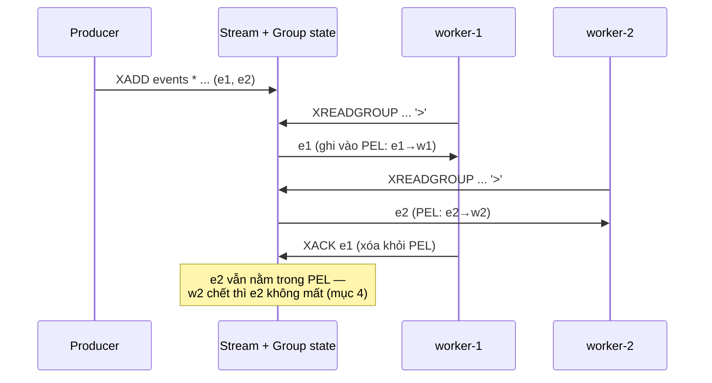

# Streams

## Mục lục

- [Tổng quan](#tổng-quan)
- [Use Cases phổ biến](#use-cases-phổ-biến)
- [1. Bên trong: radix tree + listpack, entry ID](#1-bên-trong-radix-tree--listpack-entry-id)
- [2. Ghi và đọc cơ bản — XADD, XRANGE, XREAD](#2-ghi-và-đọc-cơ-bản--xadd-xrange-xread)
- [3. Consumer Groups hoạt động thế nào](#3-consumer-groups-hoạt-động-thế-nào)
- [4. PEL, XACK và recovery — at-least-once](#4-pel-xack-và-recovery--at-least-once)
- [5. Quản lý kích thước stream](#5-quản-lý-kích-thước-stream)
- [6. So sánh: Stream vs Pub/Sub vs List vs Kafka](#6-so-sánh-stream-vs-pubsub-vs-list-vs-kafka)
- [7. Best Practices](#7-best-practices)
- [Tài liệu tham khảo](#tài-liệu-tham-khảo)

---

## Tổng quan

Stream là **append-only log**: mỗi entry có ID tăng dần và body dạng field-value. Đây là câu trả lời của Redis cho bài toán event streaming — thứ mà [List](./lists.md) (pop là mất) và [Pub/Sub](./pub-sub.md) (miss là mất) đều không giải quyết trọn:

```
events (stream)
┌──────────────────┬──────────────────┬──────────────────┐
│ 1783400000000-0  │ 1783400000123-0  │ 1783400000123-1  │ ◀── XADD (append)
│ type=order id=1  │ type=pay id=1    │ type=ship id=1   │
└──────────────────┴──────────────────┴──────────────────┘
   ▲ đọc lại từ bất kỳ ID nào (XRANGE / XREAD)
   ▲ nhiều consumer group, mỗi group nhận đủ mọi entry
```

Ba đặc tính cốt lõi: **persistent** (entry nằm lại sau khi đọc), **replayable** (đọc lại theo ID), **consumer groups** (chia việc + ack/retry có sẵn).

---

## Use Cases phổ biến

| Use Case | Vì sao Stream |
|----------|--------------|
| **Event sourcing / activity log** | Append-only, ID = thứ tự thời gian, replay được |
| **Job queue cần độ tin cậy** | Consumer group + XACK + XAUTOCLAIM (retry job chết) |
| **Fan-out một event cho nhiều service** | Mỗi service một group — nhận độc lập |
| **IoT / metrics ingestion** | XADD rẻ, MAXLEN giữ kích thước, đọc theo khoảng thời gian |
| **Change data capture nội bộ** | Producer ghi 1 nơi, N consumer đọc theo tiến độ riêng |

---

## 1. Bên trong: radix tree + listpack, entry ID

### 1.1 Entry ID — vì sao có 2 phần

```
1783400000123-1
└────┬───────┘ └┬┘
 ms timestamp   sequence (phân biệt các entry cùng ms)
```

- `XADD key *` → server tự sinh ID = thời gian hiện tại; nếu cùng ms thì tăng sequence → **ID luôn tăng nghiêm ngặt**, kể cả clock lùi (server dùng max(now, last_id))
- ID là **vị trí** trong log: đọc "từ đâu" chỉ là so sánh ID → mọi range query đều O(log N)
- Tự đặt ID được (`XADD key 5-1 ...`) nhưng phải lớn hơn ID cuối — hữu ích khi migrate dữ liệu có timestamp riêng

### 1.2 Cấu trúc lưu trữ

Stream = **radix tree (rax)** mà mỗi node lá trỏ tới một **listpack chứa nhiều entry liên tiếp**:

```
rax (key = ID đầu của mỗi block)
├─ "1783400000000" ──▶ listpack [~100 entry nén delta]
├─ "1783400000123" ──▶ listpack [...]
└─ "1783400000456" ──▶ listpack [...]
```

- Tìm entry theo ID: đi xuống radix tree O(log N) → scan listpack nhỏ
- Entry trong cùng listpack lưu **delta** so với master entry đầu block (ID và cả tên field nếu giống nhau) → event cùng schema (thường vậy) tốn rất ít byte
- Append vào listpack cuối → XADD O(1) amortized

Điểm khác biệt căn bản với List: đọc **không phá hủy** — entry nằm nguyên, mỗi consumer tự giữ "con trỏ" của mình (last_delivered_id).

---

## 2. Ghi và đọc cơ bản — XADD, XRANGE, XREAD

```bash
XADD events '*' type order id 1001 amount 250      # → "1783400000000-0"

XLEN events                                        # số entry
XRANGE events - +                                  # tất cả (-/+ = min/max ID)
XRANGE events 1783400000000 1783499999999 COUNT 10 # theo khoảng thời gian
XREVRANGE events + - COUNT 5                       # 5 entry mới nhất
```

`XREAD` — đọc "những gì mới hơn ID tôi đã thấy", có blocking:

```bash
XREAD COUNT 100 STREAMS events 1783400000000-0    # entry SAU ID này
XREAD BLOCK 5000 STREAMS events $                 # $ = chỉ entry mới từ giờ trở đi
```

Cơ chế block giống BLPOP (xem [Lists](./lists.md)): server ghi nhớ client đang chờ, XADD đến thì đánh thức — event loop không dừng. Khác Pub/Sub ở chỗ: **nếu client chết rồi kết nối lại, đọc tiếp từ ID cuối đã xử lý → không mất event** (client phải tự lưu ID này — hoặc dùng consumer group để server lưu hộ, mục 3).

---

## 3. Consumer Groups hoạt động thế nào

Bài toán: 1 stream, N worker **chia nhau** xử lý (không phải mỗi worker nhận đủ). Consumer group là bộ ba trạng thái mà server quản lý:

```
group "payment-workers" trên stream "events"
├── last_delivered_id : 1783400000123-0   ← con trỏ chung của group
├── consumers         : {w1, w2, w3}
└── PEL (Pending Entries List)            ← entry đã giao nhưng CHƯA ack
      ├── 1783400000100-0 → w1, delivered=1, since 5s
      └── 1783400000123-0 → w2, delivered=2, since 90s
```

```bash
XGROUP CREATE events payment-workers 0        # 0 = xử lý từ đầu; $ = chỉ entry mới

# Worker loop:
XREADGROUP GROUP payment-workers w1 COUNT 10 BLOCK 5000 STREAMS events '>'
# ... xử lý ...
XACK events payment-workers 1783400000150-0
```

Cơ chế phân phối:

1. `>` nghĩa là "entry chưa từng giao cho ai trong group" — server lấy từ `last_delivered_id` trở đi, giao cho consumer đang gọi và **tiến con trỏ chung** → hai worker không bao giờ nhận trùng entry mới
2. Entry vừa giao được ghi vào **PEL** kèm tên consumer, thời điểm giao, số lần giao
3. `XACK` xóa entry khỏi PEL — "tôi xử lý xong, đừng giao lại"
4. Nhiều group trên cùng stream **độc lập hoàn toàn** — mỗi group một con trỏ, một PEL riêng → fan-out: analytics-group và billing-group đều nhận đủ mọi event



---

## 4. PEL, XACK và recovery — at-least-once

Worker chết giữa chừng (đã nhận, chưa XACK) → entry kẹt trong PEL. Ba công cụ xử lý:

```bash
# 1. Nhìn thấy vấn đề
XPENDING events payment-workers                    # tóm tắt: bao nhiêu entry pending, của ai
XPENDING events payment-workers - + 10 w2          # chi tiết: ID, idle time, delivery count

# 2. Đòi lại entry kẹt quá lâu (janitor tự chạy định kỳ)
XAUTOCLAIM events payment-workers w1 60000 0
#          └─ w1 nhận về mọi entry idle > 60s, delivery count +1

# 3. Đọc lại PEL của chính mình sau khi restart
XREADGROUP GROUP payment-workers w1 STREAMS events 0
#   ID = 0 (không phải >) → trả entry trong PEL của w1 thay vì entry mới
```

Các hệ quả thiết kế phải nắm:

- **At-least-once**: entry có thể được xử lý ≥ 1 lần (worker xử lý xong nhưng chết trước XACK → claim lại → xử lý lần 2). Worker **bắt buộc idempotent**
- **Poison message**: entry fail mãi có `delivery count` tăng dần — quá ngưỡng thì XACK + đẩy sang stream dead-letter thay vì retry vô hạn
- **Consumer name là danh tính bền**: worker restart phải dùng **cùng tên** để nhận lại PEL của mình; tên mới = PEL cũ thành mồ côi (chờ XAUTOCLAIM)
- Muốn at-most-once? XACK ngay khi nhận (trước khi xử lý) — đổi độ tin cậy lấy không-trùng

---

## 5. Quản lý kích thước stream

Stream không tự xóa entry đã ack — log giữ mọi thứ đến khi bạn cắt:

```bash
XADD events MAXLEN '~' 1000000 '*' type order ...  # cắt ngay khi ghi
XTRIM events MAXLEN '~' 1000000                    # hoặc cắt định kỳ
XTRIM events MINID 1783300000000                   # cắt theo tuổi (giữ từ ID này)
```

Dấu `~` (approximate) quan trọng: cho phép server chỉ cắt khi **cả node listpack** rỗng phần đầu — O(1) thay vì phải tách listpack để cắt chính xác từng entry. Sai số vài chục entry, đổi lấy hiệu năng — production hầu như luôn dùng `~`.

> [!IMPORTANT]
> `XDEL` chỉ đánh dấu entry là xóa (tombstone) chứ không chắc thu hồi memory ngay (block chỉ giải phóng khi mọi entry trong đó bị xóa). Kiểm soát memory bằng MAXLEN/MINID, không phải XDEL từng cái.

---

## 6. So sánh: Stream vs Pub/Sub vs List vs Kafka

| Tiêu chí | Stream | [Pub/Sub](./pub-sub.md) | [List](./lists.md) | Kafka |
|----------|--------|--------------------------|---------------------|-------|
| Message tồn tại sau đọc | Có | Không | Không (pop là mất) | Có |
| Consumer offline rồi quay lại | Đọc tiếp từ ID cũ | Mất hết | — | Đọc tiếp từ offset |
| Chia việc N worker | Consumer group | Không | BRPOP (thô) | Consumer group + partition |
| Ack / retry / DLQ | XACK, XAUTOCLAIM | Không | Tự chế LMOVE | Có |
| Replay lịch sử | XRANGE theo ID | Không | Không | Theo offset |
| Ordering | Toàn stream | Theo publish | Toàn list | Chỉ trong partition |
| Scale ghi | 1 node/key (shard bằng nhiều stream/[Cluster](./cluster.md)) | — | — | Partition ngang hàng |
| Vận hành | Có sẵn trong Redis | Có sẵn | Có sẵn | Cụm riêng (nặng) |

**Chọn nhanh:** đã có Redis + khối lượng vừa (đến hàng trăm nghìn msg/s) + cần ack/replay → Stream. Chỉ cần notify realtime, mất không sao → Pub/Sub. Queue tối giản một-nhận-một → List. Log tập trung đa hệ thống, retention dài hạn hàng TB → Kafka.

---

## 7. Best Practices

- **Luôn XADD với `MAXLEN ~`** — stream không cắt là memory leak có tổ chức
- **Worker idempotent + janitor XAUTOCLAIM định kỳ** — đây là 2 mảnh bắt buộc của reliable processing, thiếu 1 là mất hoặc kẹt message
- **Theo dõi `XPENDING` và delivery count** — pending tăng đều = có worker chết hoặc poison message; đặt ngưỡng chuyển dead-letter
- **Consumer name cố định theo instance** (hostname, pod name) — không random mỗi lần start
- **Entry nhỏ, cùng schema** — hưởng delta compression trong listpack; body lớn để key riêng, entry chỉ chứa reference
- **Đặt `XGROUP CREATE ... MKSTREAM`** để tạo group trên stream chưa tồn tại (khỏi race producer-consumer lúc deploy)
- Cần thứ tự toàn cục thì 1 stream; cần scale ghi thì nhiều stream (shard theo entity id) — trong [Cluster](./cluster.md), 1 stream = 1 slot = 1 node

---

## Tài liệu tham khảo

- [Redis Streams intro](https://redis.io/docs/latest/develop/data-types/streams/)
- [XADD / XREADGROUP / XAUTOCLAIM command docs](https://redis.io/docs/latest/commands/xadd/)
- [Pub/Sub](./pub-sub.md) — khi chỉ cần realtime broadcast
- [Bitmaps & HyperLogLog](./bitmaps-hyperloglog.md) — data structure tiếp theo
