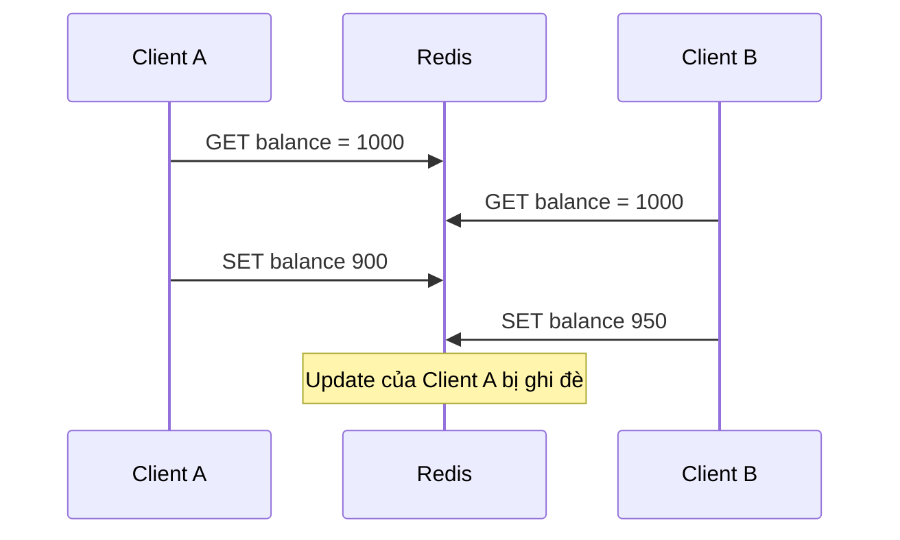
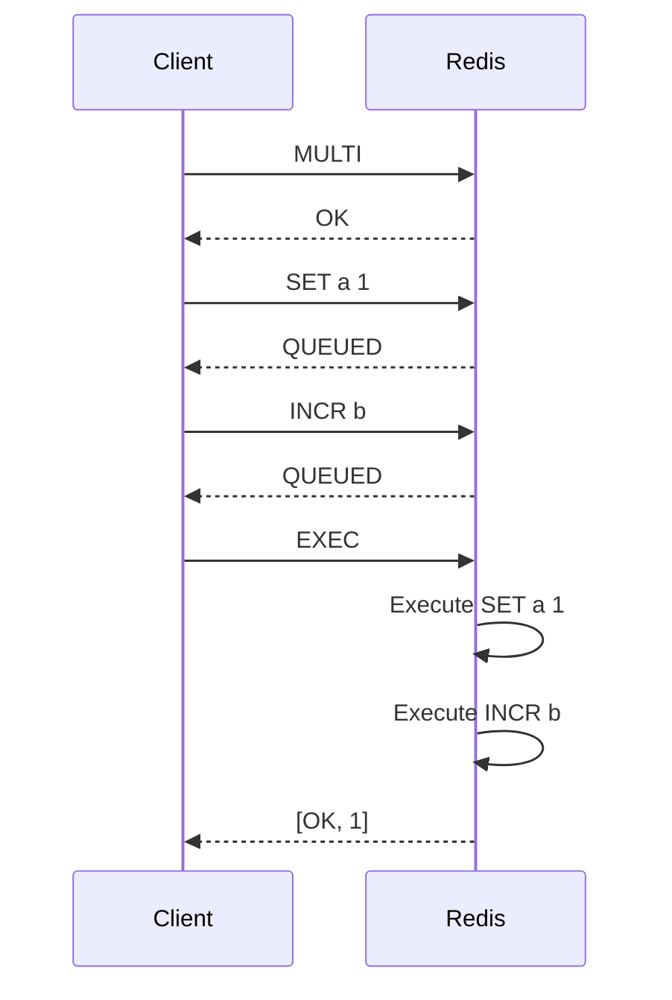
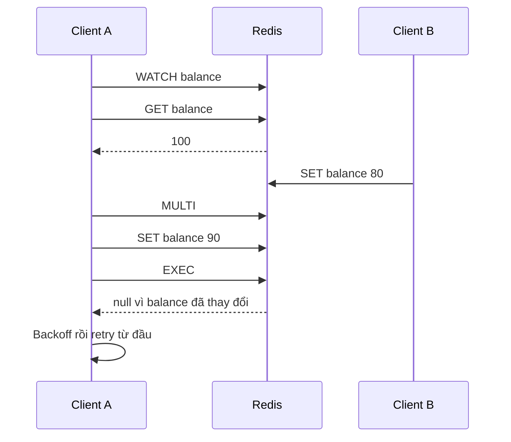

# Transactions

## Mục lục

- [1. Vấn đề: nhiều command riêng lẻ tạo race condition](#1-vấn-đề-nhiều-command-riêng-lẻ-tạo-race-condition)
- [2. Redis transaction thực sự đảm bảo điều gì](#2-redis-transaction-thực-sự-đảm-bảo-điều-gì)
- [3. MULTI, EXEC, DISCARD và connection state](#3-multi-exec-discard-và-connection-state)
- [4. Bên trong EXEC: queue trước, thực thi tuần tự sau](#4-bên-trong-exec-queue-trước-thực-thi-tuần-tự-sau)
- [5. Error semantics và sự thật không có rollback](#5-error-semantics-và-sự-thật-không-có-rollback)
- [6. WATCH: optimistic locking và compare-and-set](#6-watch-optimistic-locking-và-compare-and-set)
- [7. Viết retry loop đúng cách](#7-viết-retry-loop-đúng-cách)
- [8. WATCH bị invalidated bởi những thay đổi nào](#8-watch-bị-invalidated-bởi-những-thay-đổi-nào)
- [9. Transaction, pipeline và Lua khác nhau thế nào](#9-transaction-pipeline-và-lua-khác-nhau-thế-nào)
- [10. Redis 8.4 conditional SET và DELEX](#10-redis-84-conditional-set-và-delex)
- [11. Redis Cluster và CROSSSLOT](#11-redis-cluster-và-crossslot)
- [12. Replication, AOF, failover và durability](#12-replication-aof-failover-và-durability)
- [13. Pattern thực tế](#13-pattern-thực-tế)
- [14. Client implementation và connection pooling](#14-client-implementation-và-connection-pooling)
- [15. Performance, contention và observability](#15-performance-contention-và-observability)
- [16. Failure modes và testing](#16-failure-modes-và-testing)
- [17. Anti-patterns và checklist production](#17-anti-patterns-và-checklist-production)
- [18. Tóm tắt decision table](#18-tóm-tắt-decision-table)
- [Tài liệu tham khảo](#tài-liệu-tham-khảo)

---

## 1. Vấn đề: nhiều command riêng lẻ tạo race condition

Giả sử ứng dụng chuyển 100 điểm từ account A sang B bằng bốn command:

```text
GET balance:A
GET balance:B
SET balance:A <A - 100>
SET balance:B <B + 100>
```

Hai request chạy đồng thời có thể cùng đọc balance cũ rồi ghi đè lẫn nhau. Một client khác cũng có thể quan sát trạng thái giữa hai lệnh `SET`: A đã bị trừ nhưng B chưa được cộng.



Redis transaction gom một nhóm command để chúng được thực thi tuần tự, không có command của client khác xen vào giữa. Tuy nhiên transaction Redis **không giống transaction SQL**: không có isolation level tùy chọn, không có rollback khi một command runtime lỗi, không bao phủ database khác và không tự kiểm tra business invariant.

> [!IMPORTANT]
> Từ “transaction” trong Redis chủ yếu có nghĩa: **queue một batch command rồi thực thi chúng như một đoạn không bị client khác chen ngang**. Đừng tự suy ra đầy đủ ACID như PostgreSQL.

---

## 2. Redis transaction thực sự đảm bảo điều gì

Redis cung cấp hai guarantee cốt lõi:

1. Các command đã queue được thực thi **tuần tự và liền nhau** khi `EXEC` chạy; request của client khác không xen vào giữa.
2. Nếu connection mất **trước khi Redis nhận `EXEC`**, không command đã queue nào chạy. Nếu Redis đã nhận và thực thi `EXEC`, các command có thể đã chạy dù client không nhận được response.

```text
MULTI → queue commands → EXEC
                         │
                         ├─ Redis chưa nhận EXEC, connection chết → không chạy
                         └─ Redis nhận EXEC, response thất lạc → kết quả không rõ với client
```

### 2.1. Những gì không được đảm bảo

| Kỳ vọng sai | Thực tế |
|-------------|---------|
| Một command lỗi thì rollback cả batch | Không; command khác vẫn tiếp tục nếu lỗi runtime |
| Có thể đọc kết quả command đã queue để quyết định command tiếp | Chỉ nhận `QUEUED`; dùng `WATCH` + đọc trước hoặc Lua |
| Transaction Redis và SQL commit atomically | Không có distributed atomic commit |
| Failover không bao giờ mất transaction vừa ghi | Replication thường asynchronous |
| `MULTI` tự chống lost update | Không nếu không dùng atomic command, `WATCH` hoặc Lua |
| Transaction chạy song song trên nhiều shard | Không; Cluster yêu cầu keys cùng slot |

### 2.2. Atomic execution không đồng nghĩa durable commit

Atomicity mô tả visibility/execution trong Redis. Durability phụ thuộc AOF/RDB, fsync, replication và failover. Một transaction có thể atomic nhưng vẫn mất sau crash nếu persistence policy cho phép một cửa sổ mất dữ liệu.

---

## 3. MULTI, EXEC, DISCARD và connection state

### 3.1. Flow cơ bản

```bash
MULTI
# OK

INCR account:A
# QUEUED

INCR account:B
# QUEUED

EXEC
# 1) (integer) 1
# 2) (integer) 1
```

`EXEC` trả array response theo đúng thứ tự command đã queue. Client library thường map thành array result/error.

### 3.2. DISCARD

```bash
SET counter 10
MULTI
INCR counter
DISCARD
GET counter
# "10"
```

`DISCARD` bỏ queue và thoát transaction mode; không command queued nào chạy. Nó không rollback command đã chạy trước `MULTI`.

### 3.3. Transaction state gắn với connection

Sau `MULTI`, **connection cụ thể đó** ở transaction mode. Vì vậy:

- Không mượn connection từ pool cho `MULTI`, trả pool, rồi lấy connection khác cho `EXEC`.
- Không cho hai request dùng chung connection transaction đồng thời.
- Luôn `DISCARD`/close connection khi code path lỗi trước `EXEC`.
- Connection bị close sẽ bỏ queued commands và trạng thái `WATCH`.

```text
Sai với pool
request → connection A: MULTI
request → connection B: SET ...   ← chạy ngay, không được queue
request → connection C: EXEC      ← ERR EXEC without MULTI
```

Hầu hết client cung cấp transaction object hoặc callback giữ dedicated connection. Dùng API đó thay vì tự ghép command trên generic pool.

---

## 4. Bên trong EXEC: queue trước, thực thi tuần tự sau

Trong giai đoạn queue, Redis kiểm tra command có hợp lệ về syntax/arity và lưu command + arguments. Redis chưa thực thi data operation.



Trong thời gian các command của `EXEC` được chạy, event loop không phục vụ command từ client khác. Điều này tạo atomic visibility nhưng cũng nghĩa một transaction rất lớn gây latency spike cho toàn shard.

### 4.1. Không thể dùng kết quả queued command trong cùng transaction ở client

```bash
MULTI
GET stock
# QUEUED, không phải stock value
# Client không thể quyết định có DECR hay không dựa trên QUEUED
EXEC
```

Các cách đúng:

- Dùng command atomic sẵn có.
- `WATCH` key, đọc trước `MULTI`, tính ở client, rồi retry nếu conflict.
- Lua/Redis Function để đọc và branch server-side atomically.

### 4.2. MULTI không cần cho command đã atomic

`INCR`, `HINCRBY`, `ZINCRBY`, conditional `SET NX`, `ZPOPMIN` vốn đã atomic. Bọc một command trong `MULTI/EXEC` không tăng correctness mà thêm round trip/state.

---

## 5. Error semantics và sự thật không có rollback

Có hai loại lỗi rất khác nhau.

### 5.1. Queue-time error

Syntax/arity sai hoặc điều kiện nghiêm trọng khi queue:

```bash
MULTI
SET a 1
INCR a b c
# ERR wrong number of arguments
EXEC
# EXECABORT Transaction discarded because of previous errors
```

Trên Redis hiện đại, lỗi queue đánh dấu transaction hỏng; `EXEC` từ chối toàn batch.

### 5.2. Runtime error trong EXEC

Command syntax đúng nhưng data type sai chỉ lộ ra lúc chạy:

```bash
SET a hello
MULTI
SET b 1
LPOP a
INCR b
EXEC
# 1) OK
# 2) WRONGTYPE ...
# 3) (integer) 2
```

`SET b` và `INCR b` vẫn chạy. Redis không rollback chúng và không dừng ở `LPOP` lỗi.

### 5.3. Vì sao không rollback

Redis ưu tiên model data structure đơn giản và performance. Rollback cần giữ undo log/snapshot cho mọi command, làm tăng memory và complexity. Redis kỳ vọng application biết type/schema keys và validation trước.

### 5.4. Thiết kế để runtime error không phá invariant

- Key namespace/type cố định; không dùng cùng key lúc là String, lúc là List.
- Validate arguments ngoài transaction.
- Dùng Lua để check precondition trước mọi write; chú ý script cũng không rollback write đã thực hiện trước runtime error, nên validation phải đặt trước mutations.
- Dùng staging/versioned key nếu operation lớn cần publish sau khi hoàn tất.
- Kiểm tra từng phần tử response `EXEC`, không chỉ “EXEC không throw”.

> [!WARNING]
> Lua atomic về interleaving nhưng cũng không phải rollback engine. Một script đã write rồi gặp runtime error có thể để lại write trước đó. Hãy validate type/input trước write.

---

## 6. WATCH: optimistic locking và compare-and-set

`WATCH` theo dõi version logic của một hoặc nhiều key. Nếu key bị thay đổi từ sau `WATCH` đến trước `EXEC`, transaction abort và `EXEC` trả null/nil.

### 6.1. Flow



CLI:

```bash
WATCH balance:user:42
GET balance:user:42
# "100"
MULTI
SET balance:user:42 90
EXEC
# nil nếu có conflict
```

### 6.2. Optimistic chứ không khóa key

Client khác vẫn đọc/ghi watched key bình thường. `WATCH` chỉ làm `EXEC` của watcher thất bại. Nó phù hợp khi conflict hiếm; khi hot key conflict cao, retry storm làm throughput giảm.

### 6.3. WATCH nhiều key

```bash
WATCH account:A account:B
# đọc cả hai
MULTI
SET account:A ...
SET account:B ...
EXEC
```

Bất kỳ watched key nào thay đổi đều abort toàn transaction. `WATCH` có thể gọi nhiều lần trên cùng connection; danh sách được cộng dồn đến `EXEC`, `DISCARD`, `UNWATCH` hoặc disconnect.

### 6.4. UNWATCH

Nếu đọc state rồi quyết định không update:

```bash
WATCH inventory:sku7
GET inventory:sku7
UNWATCH
```

`EXEC` và `DISCARD` cũng xóa watch state. Đừng để connection trong pool vẫn watch key từ request trước.

---

## 7. Viết retry loop đúng cách

Pseudo-code TypeScript:

```typescript
async function reserveStock(sku: string, quantity: number) {
  const key = `inventory:${sku}`;
  const maxAttempts = 5;

  return redis.executeIsolated(async (client) => {
    for (let attempt = 0; attempt < maxAttempts; attempt++) {
      await client.watch(key);

      try {
        const raw = await client.get(key);
        const stock = Number(raw ?? 0);
        if (stock < quantity) {
          await client.unwatch();
          return { reserved: false, reason: 'OUT_OF_STOCK' };
        }

        const result = await client
          .multi()
          .set(key, String(stock - quantity))
          .exec();

        if (result !== null) return { reserved: true };
      } finally {
        // Client library thường unwatch sau EXEC; gọi rõ khi exception.
        await client.unwatch().catch(() => undefined);
      }

      const cap = Math.min(100, 5 * 2 ** attempt);
      await sleep(Math.random() * cap);
    }

    throw new Error('OPTIMISTIC_LOCK_CONFLICT');
  });
}
```

### 7.1. Quy tắc retry

- Mỗi retry phải chạy lại `WATCH` và mọi read/computation.
- Có max attempts/deadline.
- Exponential backoff + jitter.
- Operation/side effect bên ngoài chưa được chạy trước khi `EXEC` thành công.
- Phân biệt conflict (`EXEC` null) với network error hoặc runtime error.
- Đo conflict rate; retry không phải vô hạn.

### 7.2. Response timeout sau EXEC

Nếu client gửi `EXEC`, Redis chạy thành công nhưng response mất, client không biết transaction đã commit chưa. Retry toàn operation có thể duplicate side effect logic.

Giải pháp:

- Idempotency key/result record trong cùng atomic operation.
- Đọc lại state/version để xác định outcome.
- Không retry blind command non-idempotent như `INCR` sau ambiguous timeout.

---

## 8. WATCH bị invalidated bởi những thay đổi nào

Watched key bị dirty khi bị modification bởi:

- Client khác.
- Chính connection watcher thực hiện write ngoài queued transaction.
- Key expire thực sự hoặc bị eviction trên Redis hiện đại.
- Rename/delete/restore và command khác làm thay đổi key.

Đọc key không invalidates watch. Command đã queue sau `MULTI` chưa chạy nên không tự abort watch trước `EXEC`.

### 8.1. ABA problem

```text
WATCH key khi value=A
client khác SET key B
client khác SET key A
EXEC vẫn abort vì key đã bị modify, dù value cuối lại là A
```

Điều này tốt cho optimistic concurrency: Redis theo modification, không chỉ so value cuối.

### 8.2. Expiration race

TTL có thể đạt 0 giữa read và `EXEC`; expiration được phát hiện lazy/active. Trên Redis hiện đại, key expire làm watched transaction abort. Tuy vậy business code vẫn phải xử lý missing value mỗi retry.

### 8.3. WATCH state và pool

Watch gắn connection, không gắn logical request. Nếu cancellation xảy ra, close/destroy connection hoặc `UNWATCH` chắc chắn trước khi trả pool. Đây là nguồn bug khó thấy trong async code.

---

## 9. Transaction, pipeline và Lua khác nhau thế nào

| Cơ chế | Giảm RTT | Không interleave | Có conditional logic | Retry conflict | Cluster |
|--------|----------|-----------------|----------------------|----------------|---------|
| Pipeline | Có | Không | Client-side sau response | Không tự có | Có, client split theo node |
| `MULTI/EXEC` | Có thể pipeline queue + EXEC | Có trong execution | Không dựa trên result queued | Không nếu không WATCH | Same slot cho multi-key |
| `WATCH` + transaction | Nhiều RTT | Có nếu commit | Logic ở client | Có | Same slot |
| Lua/Function | Có | Có | Có server-side | Không conflict retry do chạy atomic | Same slot/default restrictions |
| Atomic command | Tốt nhất | Có | Theo options command | Không | Single key thường dễ |

### 9.1. Pipeline không phải transaction

```text
Pipeline của A: SET x, SET y
Redis có thể xử lý: A.SET x → B.GET x → A.SET y
```

Pipeline tối ưu network, không guarantee isolation giữa commands.

### 9.2. Khi Lua tốt hơn WATCH

Bài toán “đọc stock, nếu đủ thì trừ và ghi reservation” có thể gói Lua một round trip, không retry conflict. Lua thường nhanh và rõ hơn nếu logic nhỏ, keys cùng slot, execution bounded. Xem [Lua Scripting](./lua-scripting.md).

### 9.3. Khi WATCH tốt hơn Lua

- Cần computation/client library phức tạp không nên chạy trên Redis event loop.
- Conflict hiếm.
- Logic đọc nhiều nhưng write nhỏ và bounded.
- Team muốn giữ business code trong application.

---

## 10. Redis 8.4 conditional SET và DELEX

Redis 8.4 bổ sung conditional compare options cho String keys và compare-delete, giúp một số CAS không cần `WATCH`/Lua. Kiểm tra chính xác syntax trên phiên bản server/client đang chạy.

Khái niệm:

```text
SET key newValue IFEQ expectedValue
DELEX key IFEQ expectedValue
```

Các options được tài liệu Redis 8.4 mô tả gồm so sánh equality/inequality theo value hoặc digest (`IFEQ`, `IFNE`, `IFDEQ`, `IFDNE`). Chúng hữu ích khi:

- Chỉ cần compare một String key.
- Muốn một command, không retry window giữa `WATCH` và `EXEC`.
- Safe release/conditional state transition đơn giản.

Không áp dụng nếu production vẫn Redis 7/8.0, nếu cần update nhiều data type/key, hoặc cần complex branch. Luôn feature-detect/version gate khi library chưa hỗ trợ options mới.

> [!NOTE]
> Tài liệu này ưu tiên pattern tương thích rộng bằng `WATCH`/Lua; section Redis 8.4 là lựa chọn mới, không nên copy vào hệ thống cũ mà không kiểm tra `INFO server` và command docs.

---

## 11. Redis Cluster và CROSSSLOT

Redis Cluster chỉ thực thi transaction nhiều key nếu mọi key cùng hash slot:

```bash
MULTI
SET user:42:profile ...
SET user:42:settings ...
EXEC
# Có thể CROSSSLOT nếu hai key hash khác slot
```

Dùng hash tag có chủ đích:

```text
user:{42}:profile
user:{42}:settings
```

Phần trong `{}` quyết định slot, nên cả hai co-locate.

### 11.1. Trade-off hash tag

- Cho phép multi-key transaction/Lua.
- Nhưng mọi dữ liệu của một hot aggregate dồn một shard.
- Tag quá rộng như `{all-users}` phá sharding hoàn toàn.
- Chỉ co-locate keys có invariant thật sự cần atomic.

### 11.2. Reshard và redirect

Client cluster-aware xử lý `MOVED`/`ASK`. Transaction connection phải đến đúng node; generic pipeline split nhiều node không thể tạo một atomic transaction xuyên shard. Khi topology đổi giữa commands, client library phải retry an toàn; ambiguous `EXEC` vẫn cần idempotency.

### 11.3. Cross-shard workflow

Nếu invariant trải nhiều shard/service:

- Redesign aggregate boundary.
- Durable event + Saga/compensation.
- Database transaction ở source of truth.
- Không giả atomic bằng hai Redis transaction riêng.

---

## 12. Replication, AOF, failover và durability

### 12.1. AOF

Redis ghi effects của transaction vào AOF theo cách giữ batch liền nhau; tài liệu chính thức mô tả dùng một `write(2)` syscall. Nếu crash làm AOF có partial transaction, Redis phát hiện khi restart và có thể yêu cầu `redis-check-aof` truncate phần lỗi.

Điều này không nghĩa mỗi transaction đã fsync trước response. Với `appendfsync everysec`, vẫn có cửa sổ mất dữ liệu khoảng chính sách fsync khi máy chết.

### 12.2. Replication

Transaction effects được propagate theo thứ tự đến replicas, nhưng replication mặc định asynchronous:

```text
primary EXEC thành công → response client
primary chết trước khi replica nhận transaction
replica promote → transaction có thể mất
```

`WAIT` có thể chờ replica acknowledge sau write nhưng tăng latency và không biến Redis thành distributed transaction consensus tuyệt đối. Xem [Replication](./replication.md) và [Persistence Strategies](./persistence-strategies.md).

### 12.3. Read replica

Không đọc replica ngay sau transaction và kỳ vọng read-your-write nếu replication lag. Đọc primary hoặc thiết kế version/session consistency.

### 12.4. Transaction không bao phủ external side effect

```text
MULTI/EXEC ghi Redis thành công
→ gọi payment API thất bại
```

Redis không rollback vì external API. Dùng outbox/state machine/idempotency, không giữ “transaction Redis” mở trong lúc network call; commands chỉ queue và external call không nằm trong atomic boundary.

---

## 13. Pattern thực tế

### 13.1. Atomically set object và index

```bash
MULTI
HSET user:{42}:profile name Alice status active
SADD user:{42}:roles editor
EXPIRE user:{42}:profile 3600
EXEC
```

Cùng slot nhờ `{42}`. Kiểm tra từng result. Nếu `SADD` gặp wrong type, HSET vẫn chạy; schema key phải được kiểm soát.

### 13.2. Conditional inventory bằng WATCH

Phù hợp conflict thấp. Với hot SKU, Lua conditional decrement tốt hơn retry contention. Còn nếu inventory là correctness-critical source ở SQL, dùng atomic SQL condition thay Redis projection.

### 13.3. Reliable queue move

Đừng tự `LPOP source` rồi `LPUSH processing` trong transaction nếu command atomic `LMOVE`/`BLMOVE` đã có. Ưu tiên command chuyên dụng.

### 13.4. Publish sau state update

```bash
MULTI
SET state:{42} ready
PUBLISH state-events '{"id":42,"state":"ready"}'
EXEC
```

`PUBLISH` chạy liền với state update về interleaving, nhưng Pub/Sub message không durable; subscriber offline mất event. Nếu cần reliable event, `XADD` Stream trong transaction cùng slot hoặc durable outbox. `XADD` và state key khác slot trong Cluster cần co-location hoặc kiến trúc khác.

### 13.5. Idempotency record

Lua thường phù hợp hơn `WATCH`:

```text
nếu result:<requestId> tồn tại → trả result cũ
ngược lại apply mutation + lưu result với TTL
```

Toàn bộ check + mutation + result atomically, chống ambiguous client retry tốt hơn.

---

## 14. Client implementation và connection pooling

### 14.1. Node.js minh họa

```typescript
const tx = client.multi();
tx.hSet('user:{42}:profile', { name: 'Alice', status: 'active' });
tx.sAdd('user:{42}:roles', 'editor');
tx.expire('user:{42}:profile', 3600);

const replies = await tx.exec();
if (replies === null) throw new Error('WATCH_CONFLICT');
```

API error shape khác theo client; có client throw khi một element lỗi, có client trả error element. Test library version thật.

### 14.2. Spring Data Redis

`RedisTemplate` transaction support cần cấu hình/connection binding đúng. Nếu gọi read trong transaction, kết quả có thể chỉ có sau `EXEC`; framework đôi khi route read ra connection khác tùy transaction support. Integration test thay vì suy luận giống JDBC.

Pseudo-code:

```java
List<Object> results = redisTemplate.execute(new SessionCallback<>() {
    public List<Object> execute(RedisOperations operations) {
        operations.multi();
        operations.opsForValue().set("a", "1");
        operations.opsForValue().increment("b");
        return operations.exec();
    }
});
```

### 14.3. Cancellation

Nếu request timeout/cancel sau `MULTI` nhưng trước `EXEC`, `DISCARD` hoặc destroy connection. Nếu cancel sau gửi `EXEC`, outcome ambiguous; không tự động replay non-idempotent transaction.

---

## 15. Performance, contention và observability

### 15.1. Cost

- N command vẫn có tổng CPU complexity của N command.
- Queue giữ arguments trong memory đến `EXEC`/`DISCARD`.
- Execution batch dài block event loop khỏi client khác.
- `WATCH` thêm round trips và retry work.
- Pipeline `MULTI + commands + EXEC` có thể giảm RTT nhưng client API phải giữ semantics.

Không queue hàng trăm nghìn command. Batch có giới hạn, dùng bulk command (`MSET`, variadic `HSET`, `ZADD`) hoặc data import strategy.

### 15.2. Metrics application

| Metric | Ý nghĩa |
|--------|---------|
| transaction latency | End-to-end từ MULTI/WATCH đến EXEC |
| EXEC runtime/result errors | Schema/data bugs |
| WATCH abort rate | Contention |
| retry attempts/exhausted | Hot keys và user impact |
| ambiguous outcomes | Network/failover problem |
| batch command count/bytes | Big transaction risk |

Redis không cung cấp một dashboard đầy đủ “transactions per second” cho business flow; instrument client span với key namespace đã redact.

### 15.3. Khi abort rate cao

- Chuyển read-modify-write sang atomic command/Lua.
- Partition hot aggregate/counter.
- Queue operations theo aggregate.
- Giảm thời gian giữa `WATCH` và `EXEC`; không làm network/CPU dài ở giữa.
- Backoff + jitter.

---

## 16. Failure modes và testing

| Failure | Điều gì xảy ra | Cần làm |
|---------|----------------|---------|
| Disconnect trước EXEC | Queue không chạy | Retry từ đầu an toàn nếu chưa side effect |
| Disconnect sau gửi EXEC | Outcome không rõ | Idempotency/read-back |
| Queue syntax error | EXECABORT | Fix code, discard connection state |
| Runtime wrong type | Command khác vẫn chạy | Schema validation, inspect replies |
| WATCH conflict | EXEC null | Retry bounded |
| Primary failover sau EXEC | Có thể mất write chưa replicate | Durability policy/reconcile |
| Client cancel giữa transaction | Connection có thể còn state | DISCARD/destroy |
| CROSSSLOT | Transaction không chạy | Co-locate/redesign |

### 16.1. Test matrix

- Hai client cùng update watched key.
- 100/1.000 concurrent contenders và retry exhaustion.
- Expire/evict watched key.
- Wrong-type command ở đầu/giữa/cuối batch.
- Disconnect trước và ngay sau `EXEC`.
- Redis failover sau commit.
- Cluster reshard và `MOVED`.
- Pool cancellation/connection reuse.
- AOF restart nếu transaction dùng cho state durable.

Kiểm tra invariant cuối, không chỉ response code.

---

## 17. Anti-patterns và checklist production

### 17.1. Anti-patterns

1. Coi Redis transaction có rollback.
2. Không inspect từng response `EXEC`.
3. Dùng pipeline như transaction.
4. `WATCH` nhưng retry không đọc lại state.
5. Retry vô hạn trên hot key.
6. External API call giữa `WATCH` và `EXEC`.
7. Trả transaction connection đang dirty về pool.
8. Queue batch khổng lồ làm block server.
9. Multi-key transaction khác slot trong Cluster.
10. Dùng `MULTI` cho một command vốn atomic.
11. Retry blind sau response timeout của `INCR`/non-idempotent writes.
12. Tin atomicity đồng nghĩa persistence/failover durability.

### 17.2. Checklist

- [ ] Invariant và atomic boundary được mô tả rõ.
- [ ] Đã tìm command atomic built-in trước khi dùng transaction.
- [ ] Runtime error không thể để state nửa đúng nguy hiểm.
- [ ] `WATCH` retry bounded, backoff và re-read.
- [ ] Connection được pin và cleanup đúng.
- [ ] Cluster slot design đã kiểm tra.
- [ ] Ambiguous `EXEC` có idempotency/reconciliation.
- [ ] Persistence/replication đáp ứng durability requirement.
- [ ] Batch size/latency được giới hạn.
- [ ] Metrics abort/error/retry tồn tại.
- [ ] Chaos test disconnect/failover.
- [ ] Không hứa rollback hoặc cross-system atomicity.

---

## 18. Tóm tắt decision table

| Nhu cầu | Primitive ưu tiên |
|---------|-------------------|
| Tăng counter | `INCR`/`HINCRBY` |
| Set nếu chưa tồn tại | `SET NX` |
| Nhiều writes liền nhau, không cần branch | `MULTI/EXEC` |
| Read-modify-write, conflict thấp | `WATCH` + retry |
| Conditional logic nhỏ, hot path | Lua/Redis Function |
| CAS String trên Redis 8.4+ | Conditional `SET`/`DELEX` nếu phù hợp |
| Multi-shard/cross-service workflow | Saga/outbox/source transaction |

Ba nguyên tắc:

1. **`EXEC` cô lập execution, không rollback runtime errors**.
2. **`WATCH` là optimistic CAS, không khóa key**; conflict phải retry có giới hạn.
3. **Atomic, durable và exactly-once là ba thuộc tính khác nhau**; Redis transaction chỉ giải quyết một phần.

---

## Tài liệu tham khảo

- [Redis Transactions](https://redis.io/docs/latest/develop/using-commands/transactions/)
- [MULTI](https://redis.io/docs/latest/commands/multi/)
- [EXEC](https://redis.io/docs/latest/commands/exec/)
- [WATCH](https://redis.io/docs/latest/commands/watch/)
- [Lua Scripting](./lua-scripting.md)
- [Pipelining & Batching](./pipelining-batching.md)
- [Redis Cluster](./cluster.md)
